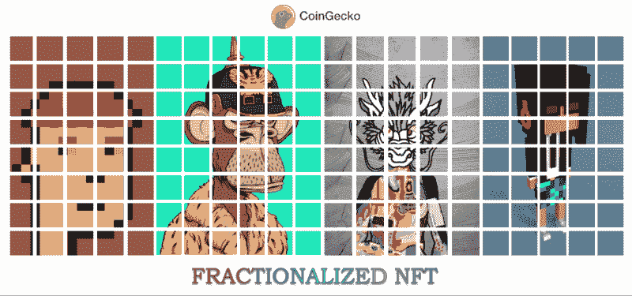
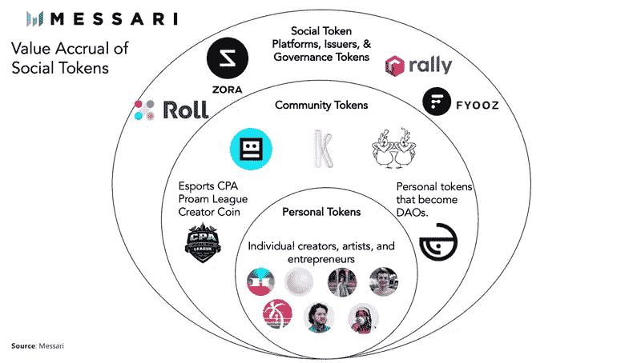
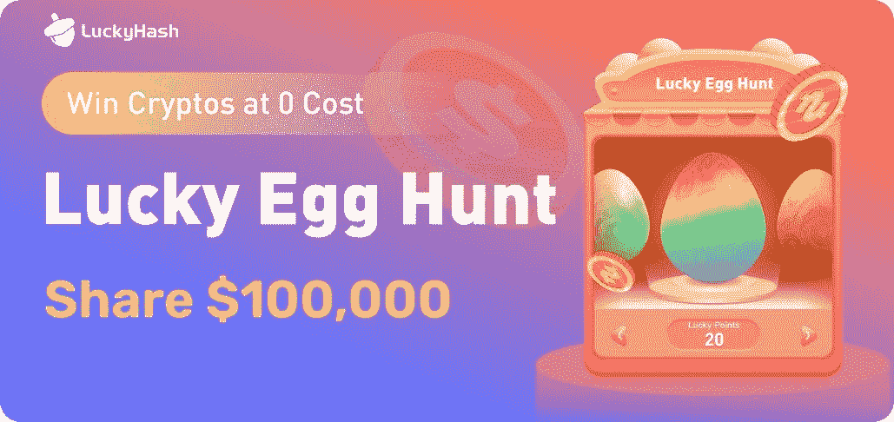
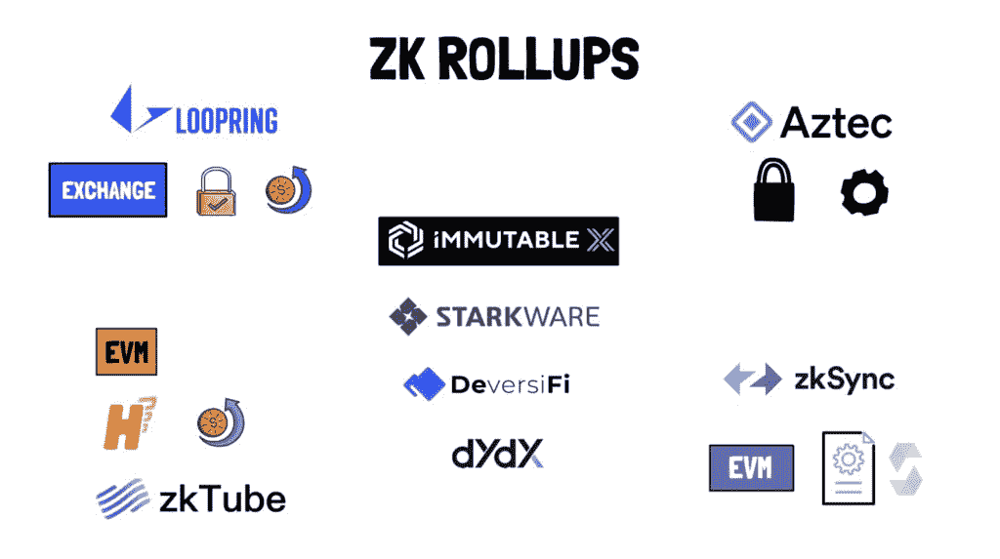
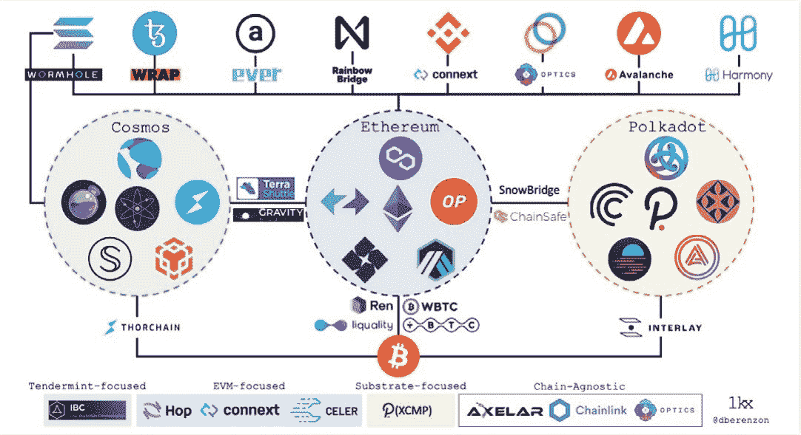
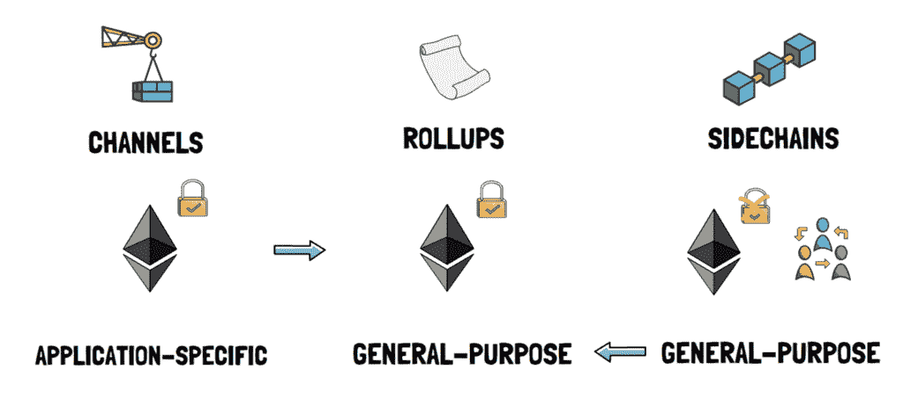
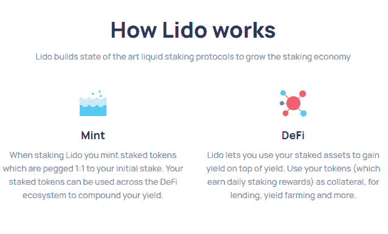

# 2022 年投资密码/区块链行业的 8 种新方式

> 原文：<https://medium.com/coinmonks/8-new-ways-to-invest-in-the-crypto-blockchain-industry-in-2022-86a590e66835?source=collection_archive---------41----------------------->

在加密中，时间至关重要。早期进入一个新兴行业是你有朝一日暴富的最佳机会。以下是我认为在未来几年将显著增长的潜在叙事列表。

# **01。NFT 细分化**

如果 100 万人可以拥有蒙娜丽莎会怎样？有了实物，这是不可能的。然而，NFTs 可以分成成千上万的作品，这为更多的投资者打开了艺术行业的大门&为用户消除了高进入成本的障碍。

# **02。社交代币**

有影响力的人需要更好的方式来赚钱&与粉丝互动。创作者受到平台的束缚&被迫将利润让给中介。有了社交令牌，创作者可以将社区令牌化&奖励他们自己和他们的粉丝。

# 03.空投

空投是围绕项目引导社区的有效方式。一些 crypto airdrops 要求参与者为他们的账户充值，而其他人则提供免费获得 crypto 的机会。LuckyHash 是积极的空投玩家之一，每月提供免费密码。以目前正在进行的[幸运蛋搜寻](https://m.luckyhash.com/crackingegg?utm_source=english&utm_medium=official)活动为例，参与者可以在单个加密蛋中免费获得**高达 0.01 BTC** 。

# **04。ZK 校样**

Vitalik 表示，ZK 汇总将长期处理绝大多数的 Eth 交易。这些技术允许 L2 连锁店立即向以太坊 L1 确认其状态，并实现隐私保证和大规模采用。

# **05。桥梁**

如今，顶级区块链拥有数万亿美元的资产。然而，这些生态系统仍然是分裂的。随着这些生态系统的不断增长，对可扩展、分散、广泛集成的协议的需求将变得更加明显，这种协议可以在区块链范围内移动价值和数据。

# 06.汇总

随着以太坊的汇总中心路线图，汇总将在切换到 PoS 后发挥越来越重要的作用。合并到 PoS 将使其成为最安全和分散的共识层，而数据分片和汇总将实现高达 100k 的 TPS。

# 07.位置 MEV

ETH 2.0 中的交易订购流程将与当前的 PoW 以太坊相同。这意味着 MEV 机会仍将存在于 ETH2.0 中，唯一的区别是验证者，而不是矿工负责交易订购过程。

# 08.液体打桩

ETH 转向 PoS 将会改变游戏规则。但是，它有局限性。用户需要入股 32 ETH &他们的资金将被锁定。有了像 Lido 这样的协议，用户可以存入 ETH &获得一个可以自由交易的他们股份的象征性表示。

如果你喜欢我的故事，请留下免费的掌声！

> 加入 Coinmonks [电报频道](https://t.me/coincodecap)和 [Youtube 频道](https://www.youtube.com/c/coinmonks/videos)了解加密交易和投资

# 另外，阅读

*   [我的密码交易经历](/coinmonks/my-experience-with-crypto-copy-trading-d6feb2ce3ac5) | [《比特币基地评论》](/coinmonks/coinbase-review-6ef4e0f56064)
*   [CoinFLEX 评论](https://coincodecap.com/coinflex-review) | [AEX 交易所评论](https://coincodecap.com/aex-exchange-review) | [UPbit 评论](https://coincodecap.com/upbit-review)
*   [AscendEx 保证金交易](https://coincodecap.com/ascendex-margin-trading) | [Bitfinex 赌注](https://coincodecap.com/bitfinex-staking) | [bitFlyer 审核](https://coincodecap.com/bitflyer-review)
*   [麻雀交换评论](https://coincodecap.com/sparrow-exchange-review) | [纳什交换评论](https://coincodecap.com/nash-exchange-review)
*   [支持卡审核](https://coincodecap.com/uphold-card-review) | [信任钱包 vs 元掩码](https://coincodecap.com/trust-wallet-vs-metamask)