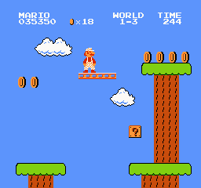
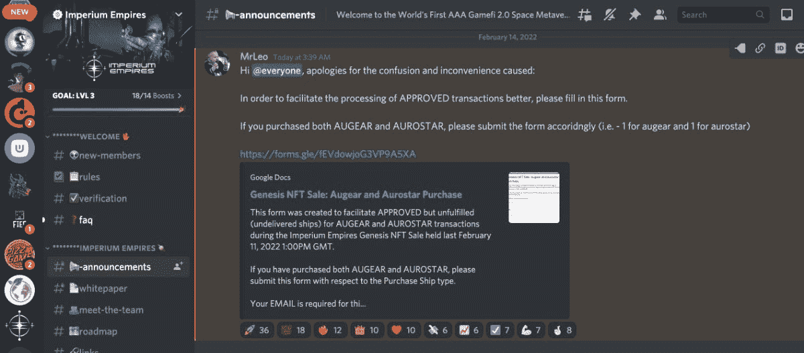
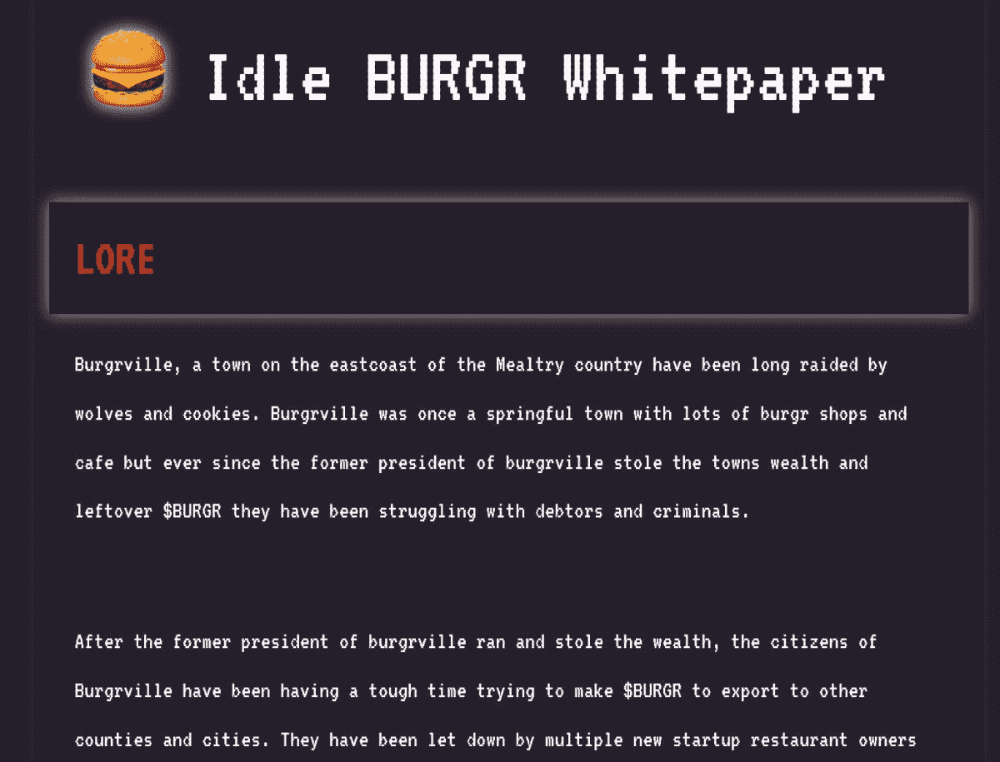
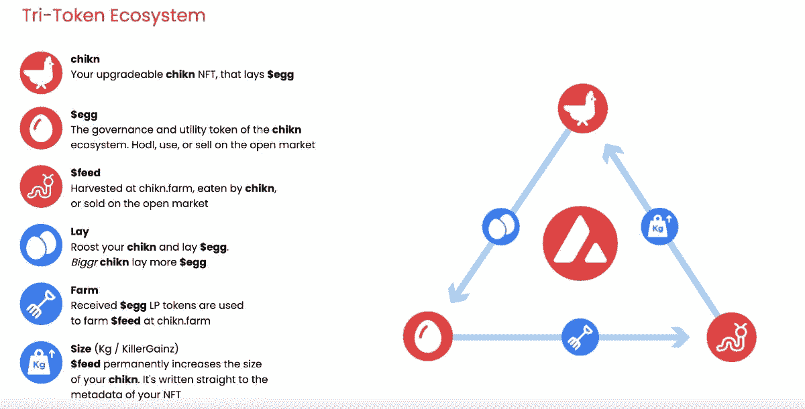
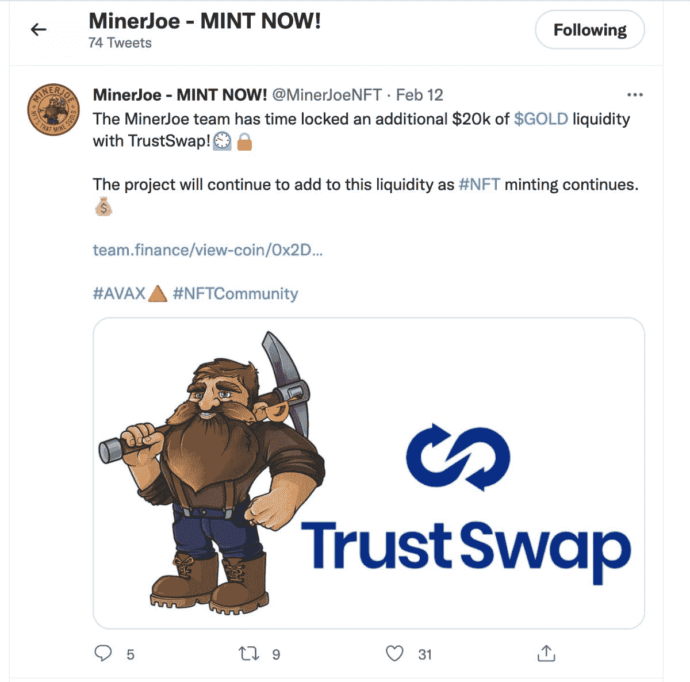
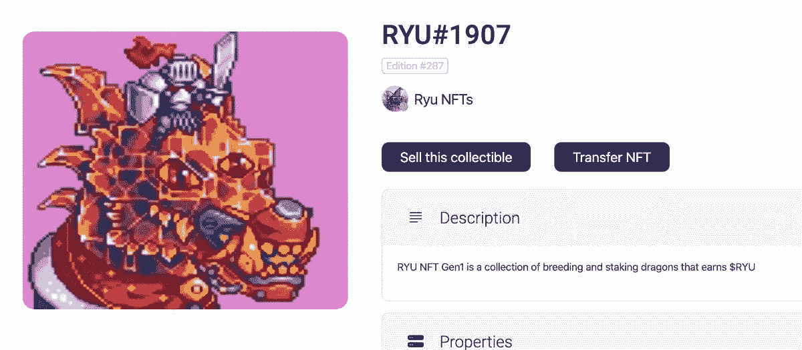

# 购买 NFT 前我回答的 8 个问题

> 原文：<https://medium.com/coinmonks/8-questions-i-answer-before-buying-an-nft-3838cb6197ae?source=collection_archive---------4----------------------->

# 1.这个项目是在雪崩区块链吗？

我坚持一个区块链:雪崩。他们链条上的交易又快又便宜。他们有最好的游戏项目。这是一个相对较新的区块链，但它可以处理比以太坊更多的事务(6500/秒对 15/秒)。

我不能强调它有多便宜。如果我在雪崩交易中支付超过 1 美元，我会很生气。以太坊交易通常花费超过 100 美元。

我喜欢他们的团队。他们在生态系统的新项目上投入了大量资金。他们甚至对我们的项目非常有帮助。

只选择一个区块链进行投资，会让这个领域的生活变得轻松许多。

什么是区块链？

区块链基本上是一系列由可公开验证的交易支持的交易确认。交易系列越长(即分类账越长)，区块链就越安全和有价值。

> **区块链=系列交易**

# 2.这个项目是一个有赌注奖励的游戏吗？

在一个区块链上只投资一种类型的项目可以减少 95%的噪音。在加密领域有成千上万的项目。你必须有某种选择机制。

我坚持玩提供赌注奖励的赚取密码游戏。我们来分析一下这到底是什么意思。

**什么是玩即赚游戏？**

P2E(即玩即赚)游戏就像它们听起来的那样:你通过玩它们来赚钱。它们是这样工作的:

*   你买了一辆 NFT
*   你“押”住了 NFT(稍后会有更多内容)
*   你下注 NFT 可以获得游戏的本币奖励

然后，你可以将这些货币兑换成美元，或者再投资到游戏中，赚取更多的游戏内货币。

什么是 NFT？

在这个空间中，NFT 是一个存在于区块链上的游戏角色。不像视频游戏中的角色，它只是存在于盒式磁带或光盘上的一系列代码。一个 NFT 人物背后是区块链上的一系列交易。这意味着你可以交易它，出售它，或者把它换成真钱。

这样想一想:

还记得超级马里奥吗？

想象一下，如果任天堂允许你购买一个定制的、可玩的、穿着钻石工装裤的超级马里奥角色。其他玩家可能有绿色马里奥，或外星人马里奥，或其他一些愚蠢的定制马里奥。但是你的有钻石工装裤。

现在想象一下，你在游戏中赢得的每一枚硬币都可以换成美元。

现在想象一下，你可以用钻石工装裤来卖你的超级马里奥角色，赚真钱。

粗略地说，这有点像在 P2E 游戏中使用 NFT。

**什么是跑马圈地？**

下注基本上意味着*存款*。想象一下，你把自己定制的钻石工装裤马里奥放进了游戏中的一个数字银行。

通过下注机制，游戏通过给你游戏内代币来奖励你的存款，代币累积的时间越长。

不是每个游戏都提供这种奖励。我只喜欢这样的项目，因为它提供了一些非常有利可图的被动收入。

# 3.社区活跃吗？

这些雪崩游戏项目的社区分布在两个地方:

推特和不和。

Twitter 远没有不和重要。Twitter 是官方项目团队发布更新、发布迷因、制造炒作等的地方。

不和谐是狗屎下去的地方，因为那是社区控制的地方。

**什么是不和谐？**

Discord 是一个信息应用程序，你可以为每个项目创建一个单独的空间。

如果一个不和谐正在消亡，这个项目也正在消亡。

你也可以看到团队如何与人互动。他们如何回答问题。*如果*他们回答问题。他们对打嗝的反应。等等。

*这是帝国帝国的***团队回应他们在一次发射中犯下的巨大错误。他们在整个过程中都很活跃，交流着他们的不和谐。一个巨大的优势。**

*我想看到至少 1000 人不和谐。最好更多。但是小而活跃比大而有毒更有价值。*

# *4.团队是否 doxxed？*

*这不是必须的，但是我希望至少知道团队是一群存在于现实世界中的人。*

***DOX xed 是什么意思？***

*doxxed 是另一种说法，表示某人已经暴露了他们的真实身份(例如，他们不是一个匿名的在线实体)。*

*许多加密开发团队喜欢对他们的身份保密。有助于安全。这也很有帮助，因为我们大多数人都在业余时间创作项目。例如，我们团队中的大多数人不希望他们的雇主知道他们在元宇宙有这种副业，最终会让他们丢掉现在的工作。*

*说到这里，我理解为什么团队不希望自己的身份被人知道。但是他们应该向社区透露一些自己的事情。不和谐或网站上的简历是一个开始。*

*另一种方法是托管 Twitter 空间。*

*Twitter 空间是 Twitter 上的音频聊天室。很多团队用这些来更新他们的游戏。*

*他们很有用，因为即使一个团队想保持匿名，我仍然可以感觉到他们，因为我可以听到他们的声音，他们是如何说话的，等等。*

*如果我不了解这个团队，我可能还会投资。但他们必须通过积极化解分歧来弥补很多不足。*

# *5.他们有白皮书吗？*

*许多高质量的项目在没有路线图或白皮书的情况下启动。这对他们来说太好了。我不感兴趣。*

***什么是白皮书？***

*白皮书是一个展示项目细节的文档:游戏机制、未来计划和令牌组学(稍后会详细介绍)。*

*路线图(白皮书的一部分)是游戏的预定计划。*

*一些项目的白皮书中有大量的拼写和语法错误。有些显然是从另一种语言翻译成英语的。*

*没问题。这是一个全球性的社区。并非每一份草率的白皮书都来自一个骗局项目。**但是** —*

*我见过的每一个骗局项目都有一个草率的(或不存在的)白皮书。*

*阅读 Idle BURGR 白皮书中的一句话，告诉我你对这是一个骗局感到震惊:*

**

*除了语法错误，当我阅读白皮书时，我寻找的是经过深思熟虑的词汇学。*

***记号经济学是什么意思？***

*意思是我想知道这个项目是怎么用他们的原生令牌奖励玩家的。*

*我喜欢有 2 个令牌的项目。结构通常是这样的:*

*   *我买了一辆 NFT。*
*   *我在这场比赛中押了 NFT 的赌注。*
*   *我获得了 1 号游戏币作为下注 NFT 的奖励。*
*   *我押 1 号游戏币。*
*   *我得到游戏令牌#2 作为下注令牌#1 的奖励。*

*通常情况下，你可以使用任何和所有的代币来购买游戏中的升级。*

*这里有一个这种结构的例子，来自一个叫做 [Chikn](https://chikn.farm/) 的项目:*

**

*我喜欢这种结构，因为如果你在一个真正成功的游戏中早期介入，你可以想象你的回报有多快。*

# *6.他们有锁定的流动性吗？*

*这个有点复杂。我还是 100%不明白。可能 75%。但这是我得到的—*

*锁定流动性是对诈骗的对冲。基本上，开发团队会说，“嘿，我们不会卖掉所有的硬币，然后离开你们——这个项目会一直持续下去。”*

*诈骗项目(或众所周知的拉地毯，因为当你参与时，你会被拉下地毯)通常是这样运作的:*

*   *开发团队大肆宣传他们的游戏。*
*   *他们在游戏发布前发行他们的本地硬币。*
*   *他们为自己保留了大量硬币。*
*   *硬币价格上涨。*
*   *他们出售所有硬币。*
*   *从不启动游戏。*
*   *他们赚了很多钱。*
*   *其他人都输光了钱。*

*许多团队为了证明他们的项目不是地毯拉做的是锁定他们的流动性。意思是他们会这样做:*

*   *他们在 NFT 有一次拍卖(叫做造币厂)。*
*   *他们用造币厂的收益来支持他们即将发行的硬币。*
*   *他们发行了这枚硬币，它由 NFT 销售所得的一定比例的美元支持。*
*   *他们将硬币锁在一种叫做“时间锁定智能合约”的东西里(基本上意味着在某段时间(通常是 3 个月)结束之前，任何人都不能接触硬币)。*
*   *该项目提供由锁定流动性支持的硬币奖励，这意味着它总是由人们对硬币的信心以外的东西支持——在这个例子中，是美元。*

*然后，团队可以通过与他们的社区共享智能合同地址来证明他们锁定了这种流动性，以便进行验证。*

**

*这个项目， [*【矿工乔】*](https://minerjoe.com/) *，非常擅长与他们的社区分享他们的流动资金。**

# *7.我喜欢艺术吗？*

*这个问题完全是主观的:我到底喜不喜欢这种艺术？*

*地毯拉几乎总是有狗屎艺术。*

*有时候合法的项目有狗屎艺术。*

*这既不完美也不合理。只是自己的喜好。*

*如果这张单子上的其他东西都符合我的要求，我才不在乎艺术品是什么样子。*

*比如这个 [RYU](https://ryunft.com/) 龙的性格看起来很傻。但我喜欢这个游戏的象征性和赌注奖励，所以我仍然投资。*

**

# *8.我能参加造币厂吗？*

*这是巨大的。这是这一切中最重要的因素之一。*

*参与造币厂(或最初的 NFT 销售)是我在这个领域赚钱的第一方式。*

*在一个成功的项目中成为第一批购买 NFT 角色的人就像是在印钞。你可以在二级市场上转售获利，也可以下注获得回报。*

*一些项目将有一个造币厂，然后提供赌注奖励。不感兴趣。*

*我想在 Mint 买一把 NFT(或 10 把),然后在几天或几周内下注。*

*但要做到这一点，你必须有一个快速扣扳机的手指。*

*我不得不不止一次把我的笔记本电脑带到瑜伽课上，这样我就可以从课上跳出来，在 Mint 买一个 NFT。*

*我以前也曾在早上 6 点起床去参加造币厂。*

*这是一整件事。*

*但这就是我如何在 P2E 加密游戏领域获得成功的。*

*如果我对前面的 8 个问题都回答是，并且通过了嗅觉测试，我就会投资。*

***这不是理财建议。***

*   ***
    如果你喜欢这个，在媒体和推特上关注我: [TheGregLarson](https://twitter.com/TheGregLarson)*

> *加入 Coinmonks [电报频道](https://t.me/coincodecap)和 [Youtube 频道](https://www.youtube.com/c/coinmonks/videos)了解加密交易和投资*

# *另外，阅读*

*   *[印度加密交易所](/coinmonks/bitcoin-exchange-in-india-7f1fe79715c9) | [比特币储蓄账户](/coinmonks/bitcoin-savings-account-e65b13f92451)*
*   *[OKEx vs KuCoin](https://coincodecap.com/okex-kucoin) | [摄氏替代度](https://coincodecap.com/celsius-alternatives) | [如何购买 VeChain](https://coincodecap.com/buy-vechain)*
*   *[币安期货交易](https://coincodecap.com/binance-futures-trading)|[3 commas vs Mudrex vs eToro](https://coincodecap.com/mudrex-3commas-etoro)*
*   *[如何购买 Monero](https://coincodecap.com/buy-monero) | [IDEX 评论](https://coincodecap.com/idex-review) | [BitKan 交易机器人](https://coincodecap.com/bitkan-trading-bot)*
*   *[CoinDCX 评论](/coinmonks/coindcx-review-8444db3621a2) | [加密保证金交易交易所](https://coincodecap.com/crypto-margin-trading-exchanges)*
*   *[红狗赌场评论](https://coincodecap.com/red-dog-casino-review) | [Swyftx 评论](https://coincodecap.com/swyftx-review) | [CoinGate 评论](https://coincodecap.com/coingate-review)*
*   *[Bookmap 评论](https://coincodecap.com/bookmap-review-2021-best-trading-software) | [美国 5 大最佳加密交易所](https://coincodecap.com/crypto-exchange-usa)*
*   *[如何在 FTX 交易所交易期货](https://coincodecap.com/ftx-futures-trading) | [OKEx vs 币安](https://coincodecap.com/okex-vs-binance)*
*   *[CoinLoan 审核](https://coincodecap.com/coinloan-review) | [YouHodler 审核](/coinmonks/youhodler-4-easy-ways-to-make-money-98969b9689f2) | [BlockFi 审核](https://coincodecap.com/blockfi-review)*
*   *[XT.COM 评论](https://coincodecap.com/profittradingapp-for-binance)币安评论 |*