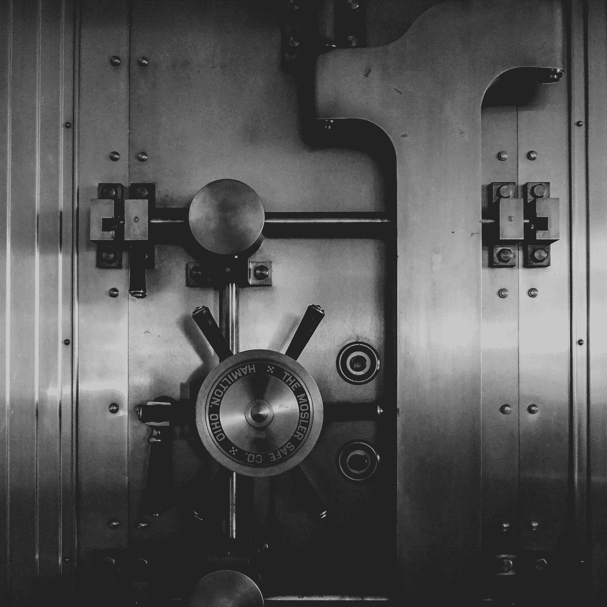

# 安全存放密码的 8 个快速技巧

> 原文：<https://medium.com/coinmonks/8-quick-tips-to-safely-store-your-crypto-ad2db6754e68?source=collection_archive---------53----------------------->

Photo by [Jason Dent](https://unsplash.com/@jdent?utm_source=medium&utm_medium=referral) on [Unsplash](https://unsplash.com?utm_source=medium&utm_medium=referral)

我刚刚在 Twitter 上，在那里我关注了一些处理加密货币和 NFT 的人。然后我收到了一条推送通知，消息是:

> 我的电脑被黑了，我所有的资产和文件都被卖掉了，并被送到了另一个地址。

这就是我写这篇文章的原因，因为保证你的种子短语的安全很重要。

# 1.不要给任何人看！

我希望不言而喻，你永远不应该把你的私人钥匙给任何人看。

# 2.不要把你的话储存成数字！

为了避免类似这位 Twitter 用户的事情发生，不要截图或在笔记中保存您的话。我说保存它不是这个意思！否则，如果你被黑了或者手机被偷了，罪犯就能拿到你所有的钱，而这正是我们想要阻止的。

# 3.把你的话写在几张纸上！

用经典的方式把你的话写在一张纸上，然后把它藏在你的房子或公寓里。在几张纸上写字也是有用的，这样在发生火灾时至少能救一张纸。

# 4.得到一个偷钱包！

为了安全起见，你可以订购一个偷钱包，把你的话放在里面，这样它们在发生火灾时受到保护，几乎可以幸免于任何事情。比如 [Bitbox](https://shiftcrypto.ch/steelwallet/) 或者 [Billfodl](https://privacypros.io/products/multishard/) 。

# 5.拿个冷钱包！

如果你想有某种储蓄账户，买一个硬件钱包，像 [Trezor](https://trezor.io/) 、 [Bitbox](https://shiftcrypto.ch/bitbox02/?ref=eHpu4OD2Tc) 或 [Ledger](https://www.ledger.com/) 。然而，保管好你的私人钥匙和保管好所有其他钱包一样重要！如果你买一个冷钱包，只从官方网站订购，不要从亚马逊或其他地方订购。

# 6.将您的密码存储在多个钱包中！

你可以有多少个钱包是没有限制的。为了确保你不会在黑客攻击或类似事件中失去所有硬币，将你的资产分散在几个钱包中是个好主意。

# 7.使用安全的互联网

请确保您的设备是最新的，并配备了防火墙，同时建议有一个非常强大的防病毒程序来覆盖所有可能的攻击点。

# 8.不要被钓鱼，只使用官方链接！

[CoinMarketCap](https://coinmarketcap.com/) 是加密货币的维基百科，用吧。不要上钓鱼网站的当，只使用 CoinMarketCap 的当前和官方链接。钓鱼网站是由骗子创建的互联网网站，它们通常有不同的结尾或两个字母混在一起。始终确保你在正确的网站上！

**我希望这篇短文能帮到你，并可能让你的资产更安全！**

不想错过更多关于比特币的有用提示和技巧吗？然后，请务必关注我并订阅我的电子邮件简讯。

**你可能也会感兴趣:**

 [## 6 个最常见的比特币误解

### 因此，我想澄清六个最常见的比特币误解，并向你解释…

medium.com](/coinmonks/the-6-most-common-bitcoin-misconceptions-94266ce78646) 

> 加入 Coinmonks [电报频道](https://t.me/coincodecap)和 [Youtube 频道](https://www.youtube.com/c/coinmonks/videos)了解加密交易和投资

# 另外，阅读

*   [3 商业评论](/coinmonks/3commas-review-an-excellent-crypto-trading-bot-2020-1313a58bec92) | [Pionex 评论](https://coincodecap.com/pionex-review-exchange-with-crypto-trading-bot) | [Coinrule 评论](/coinmonks/coinrule-review-2021-a-beginner-friendly-crypto-trading-bot-daf0504848ba)
*   [莱杰 vs Ngrave](/coinmonks/ledger-vs-ngrave-zero-7e40f0c1d694) | [莱杰 nano s vs x](/coinmonks/ledger-nano-s-vs-x-battery-hardware-price-storage-59a6663fe3b0) | [币安评论](/coinmonks/binance-review-ee10d3bf3b6e)
*   [Bybit Exchange 审查](/coinmonks/bybit-exchange-review-dbd570019b71) | [Bityard 审查](https://coincodecap.com/bityard-reivew) | [Jet-Bot 审查](https://coincodecap.com/jet-bot-review)
*   [3 commas vs crypto hopper](/coinmonks/3commas-vs-pionex-vs-cryptohopper-best-crypto-bot-6a98d2baa203)|[赚取加密利息](/coinmonks/earn-crypto-interest-b10b810fdda3)
*   最好的比特币[硬件钱包](/coinmonks/hardware-wallets-dfa1211730c6) | [BitBox02 回顾](/coinmonks/bitbox02-review-your-swiss-bitcoin-hardware-wallet-c36c88fff29)