# 我喜欢用蛋糕 DeFi 的 8 个理由！

> 原文：<https://medium.com/coinmonks/8-reasons-why-i-love-using-cake-defi-f6547b9dfc4c?source=collection_archive---------6----------------------->

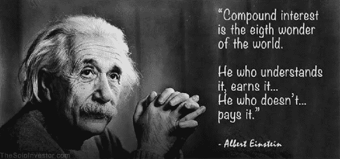

阿尔伯特·爱因斯坦曾说过一句名言:复利是世界第八大奇迹。事实上，复利是任何稳健投资策略的重要组成部分 Cake DeFi 是其中一个强大的竞争者！

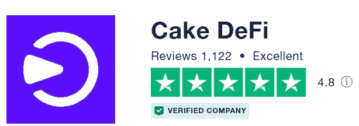

Cake DeFi scores an excellent rating on Trustpilot — and it is not without solid reasons!

[**蛋糕 DeFi**](https://cakedefi.com/?ref=677920) 是一个一站式的加密货币投资平台，在你的闲置数字资产上产生被动现金流，比如 DFI(DeFi Chain——DeFi Chain 网络的原生令牌)、BTC、ETH、USDT、USDC、LTC、DOGE、BCH 等等。它是一家总部位于新加坡的特许数字资产管理公司，其开发背后有一个雄心勃勃的透明团队。两年前，我通过社交媒体上的一则广告认识了 Cake DeFi 此后，一个简短的研究说服了我加入这个平台。两年后，我很高兴做出了踏上被动收入之旅的决定——我唯一的遗憾是没有早点加入！请继续阅读，了解我为什么会爱上蛋糕 DeFi！

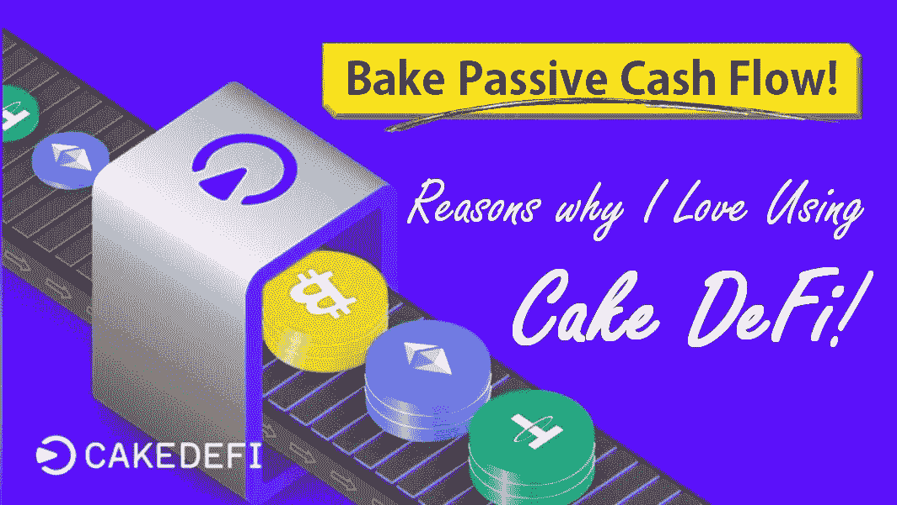

# #1 投资变得简单省事

Cake DeFi 是一个强大的投资平台的典范，它提供了多样化的选择，但对不熟悉的人来说并不过分强大。例如，在 DFI 下注，不费吹灰之力就能获得诱人的回报。(DFI 是 DeFiChain 网络的本土标志——点击阅读更多关于 DFI 的内容)

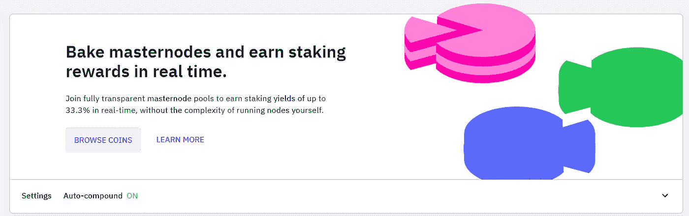

建立和维护 masternodes 以入股 DFI 的复杂技术流程被简化为一个优雅的过程，就像分配要投入赌注的 DFI 硬币数量一样简单，有一个有吸引力的 APY(范围在 30-40%左右)，每天支付两次，产生的复利随着时间的推移显著增加。硬币可以在任何时候被解冻，而不会受到任何惩罚——这与传统的银行定期存款大相径庭。

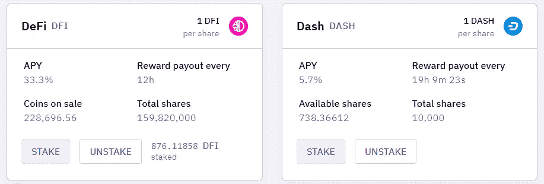

# #2 诱人的收益率

事实上，如果某件事好得令人难以置信，它很可能是真的；毕竟，加密货币市场充斥着[骗局和陷阱，需要小心](/coinmonks/how-to-avoid-cryptocurrency-scams-from-my-pov-57aa57671ac2)。Cake DeFi 是数字资产行业中为数不多的具有稳固地位的宝石之一，它在各种加密货币上提供的收益率与其声誉一样惊人。

根据市场情况，面包师可以选择投资于各种产品，如赌注、流动性挖掘和高达 100% APYs 的贷款服务！要了解更多关于在 Cake DeFi 上产生被动现金流的信息，请点击这里查看我之前的文章[。](/coinmonks/how-to-earn-passive-income-with-cake-defi-a-tutorial-64abe4a01bec)

# #3 大多数奖励是在 DFI 支付的

除了贷款服务，Cake DeFi 主要在 DFI 支付报酬(每天一次)。DFI 是 DeFiChain network 的本地标志，该网络是一个区块链，致力于快速、智能和透明的分散式金融服务，人人都可获得。DFI 币已经出现了爆炸性的增长，事实上大多数时候表现相对优于比特币！

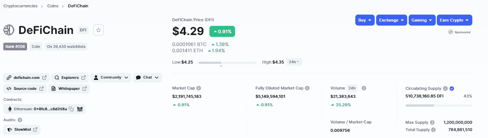

Image taken from coinmarketcap

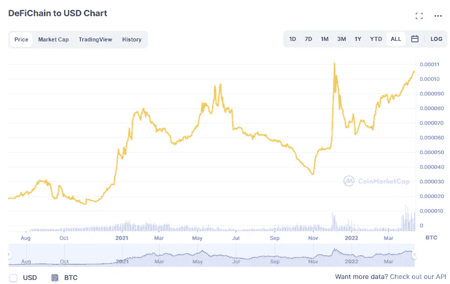

DFI’s performance relative to BTC. Image taken from coinmarketcap

有什么比收集一项具有如此高增长潜力的资产，并随着时间的推移不断增值更甜蜜的呢？蛋糕 DeFi 正是这样做的！DFI 可以在 Kucoin 和 Bittrex 这样的平台上交易。想了解更多关于 DFI 和 DeFi 连锁网络的信息，请点击这里查看我以前的文章。

Introduction to DeFiChain and its many potentials, some of which are harnessed on Cake DeFi.

# #4 在最好的股票市场和加密货币中二次探底的能力

由于 DeFiChain 的创新，利用两个世界的最佳熟悉投资于传统股票市场的高收益的流动性挖掘！分散资产代表了一种革命性的方式，可以轻松投资于谷歌、特斯拉和苹果等大型科技公司；贵金属，如金或银；甚至像 SPDR 标准普尔 500 ETF 信托、景顺 QQQ 信托系列 1、方舟创新 ETF 等 ETF。虽然本地的 [DeFiChain](https://defichain.com/) 钱包也是一种选择，但 Cake DeFi 提供了一种方便、高收益的分散资产投资解决方案，年回报率高达 100%！在我之前的文章[中阅读更多关于分散资产的内容。](https://cybery.medium.com/invest-in-tesla-google-apple-easily-with-decentralized-assets-cdfe4e58330b)

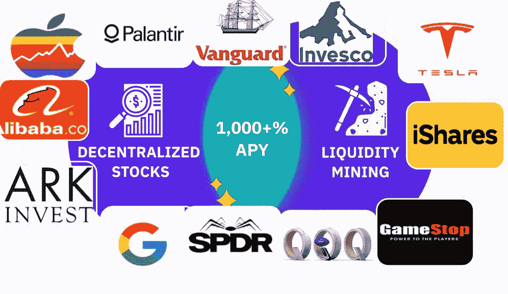

Examples of decentralized assets available

# #5 简洁优雅的界面

Cake DeFi 最近修改了其仪表板，以非常直观的图形方式显示资产持有情况，从而轻松概述按类型和获得的回报进行的资产分配。

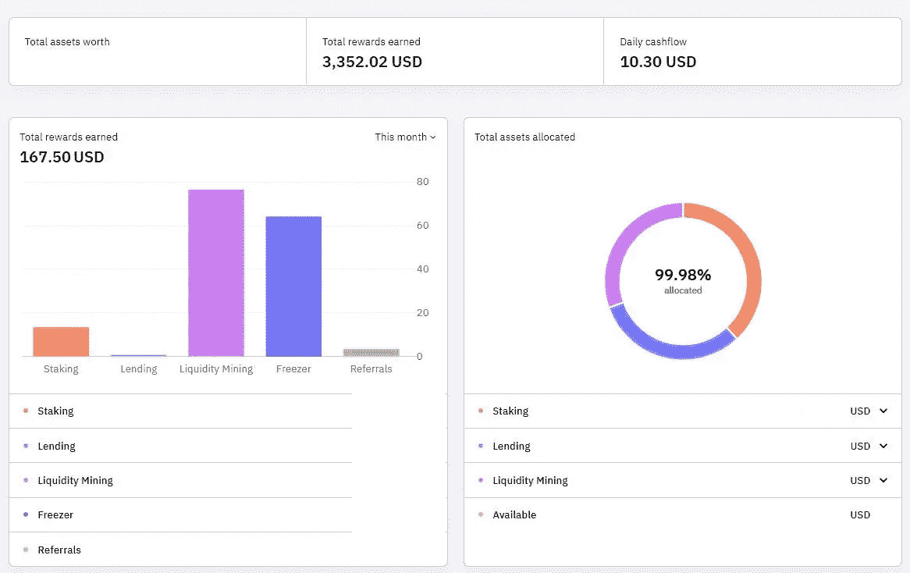

仪表板作为一个受欢迎的提醒，我的蛋糕投资组合的规模实际上在过去的两年里翻了一番，这得益于复利和我账户中基础资产本身的增长！现在这是一些非常美味的现金流，你不同意吗？

# #6 一个专注而透明的团队

Cake 由 Julian Hosp 博士和 U-Zyn Chua 领导的热情团队经营，他们是来自不同背景和行业的创新者。

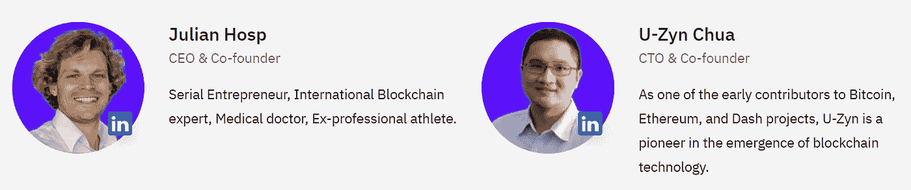

由于透明度是 Cake DeFi 的核心价值，他们定期发布季度透明度报告，概述他们在一年中特定季度的成就和反思，最新的总结在他们的[博客帖子](https://blog.cakedefi.com/road-to-unicorn/)中。深入的细节可以在这里找到[。](https://docs.google.com/document/d/1ibi_G1QEOai3rS-s3lZNKRlwvo8ZAeQNpeR2qC9Eqmk/edit?usp=sharing)

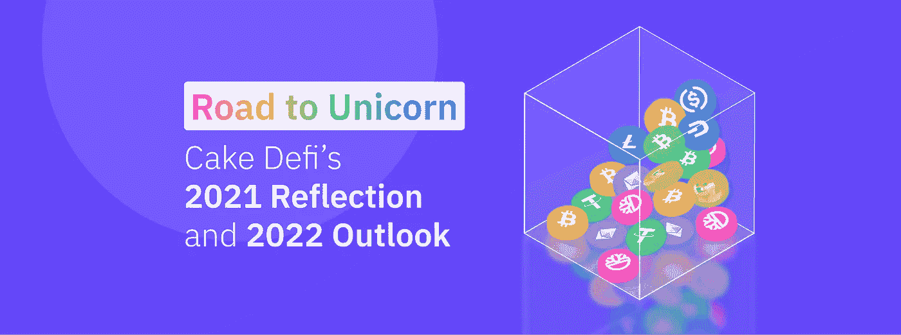

最近，Cake DeFi 推出了 [Cake DeFi Ventures](https://blog.cakedefi.com/cakedefiventures/) ，这是其 1 亿美元的风险投资部门，致力于加速科技公司的增长，重点投资 Web3、游戏和金融科技初创公司。

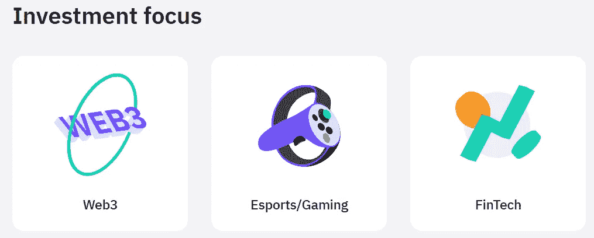

该团队确实热衷于将 Cake DeFi 推向更高的高度，其清晰的短期和长期愿景如下所述(摘自 Cake DeFi 博客)。

> 短期(即将到来的季度):
> 
> Cake DeFi 将完成分散贷款的整合，首先专注于移动业务，并为其他 DeFi 生态系统做好准备。我们将使我们的客户和客户资产翻倍。我们保持现金流为正，并将完成 2019 年和 2020 年的 PCAOB 审计。
> 
> 中期(今年):
> 
> Cake DeFi 将为几个专注于 DeFi 的区块链生态系统提供机器人咨询功能。我们将客户群扩大了 20 倍，并为他们提供了从加密货币获取现金流的便捷途径。我们希望我们的客户资产翻 10 倍，这可能会使 Cake DeFi 在这一点上价值至少 100 亿美元。
> 
> 长期(这十年):
> 
> Cake DeFi 计划成为世界领先的 DeFi 和新兴替代资产投资平台，不仅让世界各地的人们能够以简单、安全的方式重新掌控自己的财务。客户将能够添加任何形式的资产，并根据他们选择的参数，一种算法将自动投资，再投资和多样化他们的投资组合。到这个时候，系统将得到充分优化，这样我们的客户就可以“只投资”，而不必担心买什么、怎么买，或者什么时候卖。

在这样一个有远见的团队的带领下，无论是在不久的将来还是在遥远的将来，事情都变得越来越好了！

# #7 出色的客户支持

Cake DeFi 提供出色的客户服务；他们的官方支持可以在蛋糕定义网站[这里](https://support.cakedefi.com/hc/en-us/requests/new)上找到，或者方便地在他们的电报频道[这里](https://t.me/CakeDeFi_EN)上找到，在那里一个充满活力的团队(他们似乎从不睡觉)随时准备解决任何提出的问题。(附:小心 telegram 上的假蛋糕 DeFi 组，或冒充“管理员”向你提供帮助的骗子——Telegram 上的诈骗可能相当猖獗！在我之前的文章[中可以读到更多关于这个的内容](/coinmonks/how-to-avoid-cryptocurrency-scams-from-my-pov-57aa57671ac2)

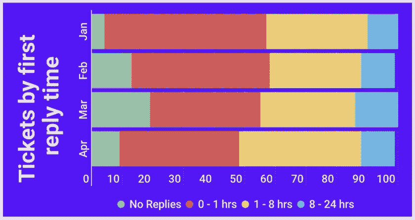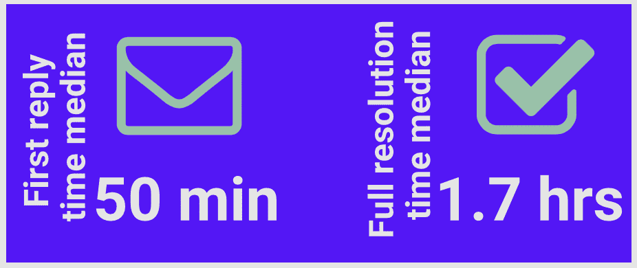

# #8 广泛的社会宣传

Cake DeFi 经营着一个可爱且信息丰富的[博客](https://blog.cakedefi.com/)，上面有许多与加密货币相关的启发性文章，以及关于 Cake DeFi 烘焙现金流的文章。他们在社交媒体上也非常活跃，比如 Twitter、脸书、Reddit 和 YouTube。他们也有一个活跃的电报社区，由一群友好的管理员管理，他们非常乐于助人。(向 Fabio、Daniel、Zachary、Pho、Steven、Jess 和其他许多优秀的团队成员致敬！)

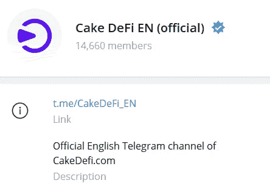

# 最后的想法

作为加密货币的早期适应者，我在我的投资旅程中经历了相当多的起伏。然而，我可以自信地说，两年后，Cake DeFi 确实是我做过的最好的投资决定之一，无论市场如何发展，它始终为我带来可靠的被动现金流——事实上，这是一种最好的 HODL 形式！

[**Cake DeFi**](https://cakedefi.com/?ref=677920)**最近推出了一项寻找复活节彩蛋的促销活动，新用户注册后将在 DFI 获得 40 美元的奖金，在通过 KYC 验证后，他们的第一笔合格存款为 50 美元。如果你以前就对踏上这一旅程感兴趣，现在是最好的时机！ [**今天报名**](https://cakedefi.com/?ref=677920) **开始烘焙被动现金流！****

***更新:寻找复活节彩蛋已经结束；然而，您仍然可以通过我的会员链接获得 30 美元的注册奖金+10 美元的学习&收入+当您注册* [*这里*](https://cakedefi.com/?ref=677920) *时的独家额外奖金！***

**想了解更多关于蛋糕定义的信息，请查看我之前的文章:**

** [## 用蛋糕 DeFi 赚取美味的被动现金流！

### 沃伦·巴菲特曾经说过‘如果你在睡觉的时候没有找到赚钱的方法，你会一直工作到死。“的确……

medium.com](/coinmonks/earn-delicious-passive-cash-flow-with-cake-defi-f01fce47e4c6)  [## 如何赚取蛋糕 DeFi 被动收入:教程

### 沃伦·巴菲特曾经说过“如果你在睡觉的时候没有找到赚钱的方法，你会一直工作到死。”这是…

medium.com](/coinmonks/how-to-earn-passive-income-with-cake-defi-a-tutorial-64abe4a01bec)  [## 用分散的资产轻松投资特斯拉、谷歌和苹果！

### 概述

cybery.medium.com](https://cybery.medium.com/invest-in-tesla-google-apple-easily-with-decentralized-assets-cdfe4e58330b)  [## DFI，一枚被低估的硬币？

### 经过几天的绿色交易后，加密货币市场今天正在经历一些修正，也许…

medium.com](/coinmonks/dfi-an-underrated-coin-7effca02ed3f) 

*本文使用的部分图片和资料摘自蛋糕 DeFi 网站和博客。*

*一如既往，这不是财务建议！而只是我投资过的，觉得值得分享的投资平台。在投资前做好自己的研究，不要存你输不起的钱。下面有什么问题可以随时问我。*

*如果你喜欢这篇文章，* [*关注&订阅*](/@cybery) *！*

查看以下值得信赖的平台！

*🎁*[*honey gain*](https://r.honeygain.me/CYBER577DD)*一款被动收入 app，从你未使用的互联网带宽中赚钱。* [*免费获得 5 美元*](https://r.honeygain.me/CYBER577DD) *，无需投资。*

*🎁* [*蛋糕 Defi*](https://cakedefi.com/?ref=677920) *一站式投资平台，以高达 200%的年利率烘焙被动现金流！* [*在 DFI 用 50 美元存款获得 30 美元*](https://cakedefi.com/?ref=677920) *。*

*🎁* [*Nexo*](https://nexo.io/ref/hce5cfdt5o?src=web-link) *世界上最先进、受监管的数字资产机构，在 200 多个司法管辖区提供 40 多种法定货币的即时加密贷款、每日资产收益、兑换和服务。* [*用 100 美元存款获得 25 美元*](https://nexo.io/ref/hce5cfdt5o?src=web-link) *。*

*🎁* [*摄氏度*](https://celsiusnetwork.app.link/174094633e) *一个金融科技平台，提供带息储蓄账户、借贷，以及用数字和法定资产进行支付。* [*在 BTC 获得 50 美元*](https://celsiusnetwork.app.link/174094633e) *与 400 美元存款。*

*🎁*[*Hodlnaut*](https://www.hodlnaut.com/join/RTbHxuJMX)*一个稳健的新加坡加密借贷平台，成立于 2019 年，从你闲置的加密货币中产生被动现金流。* [*获得 30 美元*](https://www.hodlnaut.com/join/RTbHxuJMX) *在 USDC 拥有 1000 美元存款。*

*🎁*[*BlockFi*](https://blockfi.com/?ref=a16e37fd)*一种加密货币兑换和钱包。* [*用 100 美元存款获得 10 美元*](https://blockfi.com/?ref=a16e37fd) *。*

*🎁* [*库币*](https://www.kucoin.com/land/register/r/rJH29LZ) *最大的加密货币交易所之一。*

*🎁* [*火币*](https://www.huobi.com/en-us/topic/double-invite/register/?invite_code=5t5jb) *最大的加密货币交易所之一。*

*🎁*[*MEXC*](https://m.mexc.com/auth/signup?inviteCode=1NAJC)*最大的加密货币交易所之一。*

*🎁*[*Crypto.com*](https://read.cash/@TraderFX/10-tips-to-maximize-earnings-on-honeygain-an-effortless-free-passive-income-app-68535728#bad-link)*一款基于新加坡的加密货币兑换 app。* [*获得 25 美元*](https://crypto.com/app/fcbsjmf5pb) *在 CRO 赌一张红宝石牌。*

*针对马来西亚投资者*

*🎁***获得 6 个月免费投资！**

**🎁Wahed code 'KENLIE1' RM10 注册奖金**

**🎁Capbay P2P 代码' 8879c6' RM100 注册奖金**

**与我连接* [*媒介*](https://cybery.medium.com/)*|*[*read . cash*](https://read.cash/r/TraderFX)*|*[*Youtube*](https://www.youtube.com/c/SmartInvestingChannel)*|*[*推特*](https://twitter.com/cybertraderfx)|[*Linktree*](https://linktr.ee/trader.fx)*

> *加入 Coinmonks [电报频道](https://t.me/coincodecap)和 [Youtube 频道](https://www.youtube.com/c/coinmonks/videos)了解加密交易和投资*

# *另外，阅读*

* [## CakeDeFi 评论:赚取每日加密回报 2022 年

### CakeDeFi 在加密货币领域越来越受欢迎。它使任何人都可以下注他们的加密货币，并开始…

coincodecap.com](https://coincodecap.com/cakedefi-review) 

*   [Capital.com 评论](https://coincodecap.com/capital-com-review) | [香港的加密借贷平台](https://coincodecap.com/crypto-lending-hong-kong)
*   [如何在 Uniswap 上交换加密？](https://coincodecap.com/swap-crypto-on-uniswap) | [A-Ads 评论](https://coincodecap.com/a-ads-review)
*   [WazirX vs CoinDCX vs bit bns](/coinmonks/wazirx-vs-coindcx-vs-bitbns-149f4f19a2f1)|[block fi vs coin loan vs Nexo](/coinmonks/blockfi-vs-coinloan-vs-nexo-cb624635230d)
*   [本地比特币审核](/coinmonks/localbitcoins-review-6cc001c6ed56) | [加密货币储蓄账户](https://coincodecap.com/cryptocurrency-savings-accounts)
*   [什么是保证金交易](https://coincodecap.com/margin-trading) | [美元成本平均法](https://coincodecap.com/dca)***