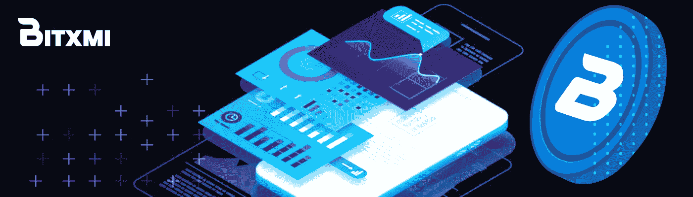
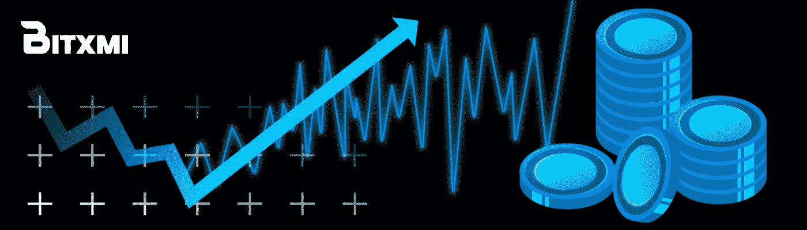
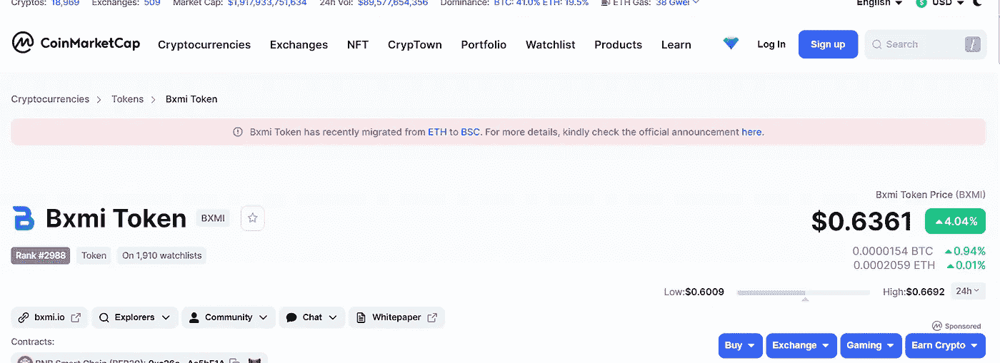
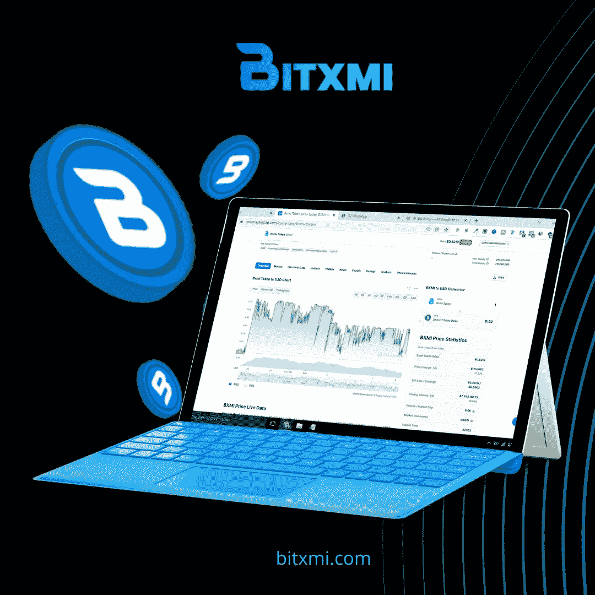

# 需要用 Bitxmi 交易所交易的 8 个理由。

> 原文：<https://medium.com/coinmonks/8-reasons-you-need-to-trade-with-bitxmi-exchange-c4bff2ab3096?source=collection_archive---------58----------------------->

Source:

随着近年来全球金融市场波动性和流动性的增加，许多人现在正在寻找传统金融和交易模式的替代品。随着数字货币的爆发，投资者已经看到加密货币与更传统的资产类别竞争。

作为一个估值超过 300 万亿美元的全球行业，交易所仍有很大的空间超越行业规范，为其用户提供服务。

> **参见:** [**加密货币是如何工作的？加密货币初学者指南。**](/@bitxmiblog/how-do-cryptocurrencies-work-beginners-guide-to-cryptocurrencies-b1915189fd4f)

# 关于 Bitxmi

Source:[https://news.bxmi.io/](https://news.bxmi.io/)

Bitxmi 是一家总部位于新加坡的公司，在新加坡上市，完全受新加坡金融管理局(MAS)监管。随着集中式交易所的增加，Bitmxi 计划脱颖而出，成为集中式加密平台的领先交易所。Bitxmi 的主要目标是通过对加密交易的理解、简化和安全访问，建立对加密经济学的认识，并弥合不确定性的差距。更多信息请访问 [**网站。**](https://bxmi.io/)

比特币的交易需要高度变化的安全性、隐私性和安全性。用户总是在寻找一个能让他们高速转移资产的数字市场。他们寻找一个对加密货币交换高度安全的交换平台。在这种情况下，在线平台充当加密货币买家和卖家之间的纽带。

这有助于他们在没有任何黑客攻击的情况下交换加密货币。

我们 Bitxmi 是一个交易平台，为寻求兑换加密货币的人提供所需的安全性。我们向全世界提供最快的数字资产交易；我们的高级算法帮助用户进行高速资产转移。我们交易大约 40 对著名货币，如比特币、莱特币、瑞波币、币安币等。

我们目前拥有 35000 多名会员，每月有 600 多名新会员加入。我们是世界上发展最快的交易平台之一。去年有超过一百万人访问了 Bitxmi。如果你正在寻找一个可靠的交易平台，那么这里有一些坚实的理由选择 Bitxmi 来买卖你的加密货币。

**Bitxmi 的独特卖点(USP)**

Source: [https://bxmi.io/](https://bxmi.io/)

Bitxmi 是世界上最高效的交易平台。在 Bitxmi，所有的订单一到，我们就执行。Bitxmi 还因向用户提供返点而出名。我们为平台上的大批量加密货币交易提供回扣。

用户可以安全地交易大量的加密货币。我们的论坛也适合加密货币鲸鱼进行大规模的加密货币交易。Bitxmi 向其用户提供冷钱包存储；因此，用户可以安全地存储大量的加密货币。

1.  **验证交易者的新交易限额**

Bitxmi 为其用户提供最惊人的交易。通过验证的用户每天最多可以交易 99 BTC。这是任何交易平台提供的最大交易限额；新用户每天最多可以交易 3 BTC。Bitxmi 是认证交易者最高效的交易平台。交易员还可以确保他们在 Bitxmi 交易所的资金是有保险的。所使用的高级算法有助于确保所有平台用户的安全。

**2。为资金存储提供冷钱包**

Bitxmi 还向加密货币的买家和卖家提供冷钱包。买家可以安全地存储他们从任何卖家那里购买的所有数字货币。冷钱包是有保险的。它帮助用户保护他们的资金免受黑客攻击。购买者可以很容易地在兑换点存储他们所有的资金。

**3。快速高效的订单匹配系统**

Bitxmi 拥有最快的订单匹配系统。在 Bitxmi，我们非常快速地执行所有订单。我们立即将买家和卖家的订单结合起来完成交易。我们的订单是透明的。用户可以很容易地访问它。买家可以尽快把他们的数字货币放进他们冰冷的钱包。

**4。为平稳交易而设计的 API 协议**

Bitxmi 是唯一使用 API 协议构建平台的交换平台。这有助于我们轻松地将买家和卖家联系起来。应用程序编程接口有助于用户顺利进行交易。我们平台中使用的 API 简化了界面，允许用户更快地管理交易。

**5。多语言支持**

全世界的人都可以访问 Bitxmi。我们 Bitxmi 为用户提供多语言支持；它允许所有不同的交易者没有任何麻烦地交易。我们支持英语、中文、印地语、法语、韩语、俄语、日语、阿拉伯语等语言。

**6。投保资金**

在 Bitxmi，所有的基金都有保险。我们使用先进的算法来保护您的资金免受任何黑客的攻击。我们向用户提供冷钱包。他们可以把所有的加密货币安全地放在我们冰冷的钱包里。

**7。24×7 客户支持**

Bitxmi 为所有交易者提供 24×7 的客户支持。交易者可以随时联系我们。我们是解决任何纠纷的最快平台。在 Bitxmi，我们可以在 30 分钟内解决争议。我们始终专注于最佳用户体验。

**8。给交易者的宝贵建议**

如今，数字资产是最具创新性的投资形式。它涉及到价格波动。我们 Bitxmi 为交易者提供有价值的建议。我们帮助他们做出关于交易这些不稳定资产的最佳投资决策。

**BXMI 在**[**Coinmarketcap**](https://coinmarketcap.com/)上市

Source: [https://news.bxmi.io/](https://news.bxmi.io/)

我们引以为豪的另一个原因是我们在 Coincarketcap 上的上市。CMC 是一个关于加密货币汇率、市值和加密货币交易所的独立和可信的信息来源。世界上存在的几乎所有加密货币(建立在区块链上并具有开源代码)都在 Coinmarketcap 服务上呈现。

Coinmarketcap 不与团队和开发者合作。只有 CMC 工作人员选择的经过验证的交换才会添加到此处。我们很高兴地通知您，Bitxi 已于 2020 年 5 月加入 CMC。点击此处查看 Bitxmi 详情:**coin market cap**[**Bxmi Token price today，BXMI to USD live，market cap and chart | coin market cap**](https://coinmarketcap.com/currencies/bxmi-token/)

**团队**

BitXmi 由德里大学的校友 Sanjay Jain 于 2018 年创立。该公司于 2018 年开始运营和注册。这家总部位于新加坡的公司目前在全球主要城市设有代表处，包括澳大利亚和英国。

Bitxmi 在伦敦有一个办公室，在迪拜有三个办公室，营销人员有 25 人，都在迪拜。我们的 IT 团队来自新加坡和东京，我们最安全的 AWS 服务器在日本。我们也有来自印度的内容作者和来自菲律宾和乌克兰的图形专家作为公司的团队成员。目前，计划在新西兰和萨尔瓦多开设办事处。

**为什么建造 Bitxmi**

Source: [https://news.bxmi.io/](https://news.bxmi.io/)

创建 Bitxmi 的主要动机是贾恩希望传播加密经济学的知识，并通过让加密交易更容易理解、更简单、更安全来减少消费者的不确定性。因为 Bitxmi 如此关心它的用户；它不仅仅是另一个加密货币交易平台。根据创始人 San Jay 的说法，使用 Bitxmi 进行加密交易是安全、值得信赖的。

此外，为了最大限度地降低成本和加密货币的广泛选择，Bitxmi 提供了各种各样的交易选项。Bitxmi 为初学者提供了一个简单的加密交易平台。您可以使用交易所以低廉的交易费轻松地购买、出售和交易适销的硬币。比特币、莱特币和 Ripple 是目前交易所交易的几种硬币。

使用 Bitxmi 很容易，因为它的界面简单，允许您一次性或定期购买加密。这种便利几乎不需要任何成本。该交易所支持广泛的订单类型，包括限价订单、市价订单和限价止损订单，这些订单应该可以满足大多数加密交易者的需求，以及场外交易(OTC)。

**菲亚特支持的交易**

Bitxmi 让客户能够利用信用卡和支付卡，用“法定现金”合法购买数字形式的货币(加密货币)。Bitxmi 是供用户交易的最安全的全球数字资产交易所之一。此外，该交易所使用高端安全系统，包括 cold wallet 存储、若干服务器和密钥管理选项。

最先进的软件保护 Bitxmi 的用户免受 ChainUp 的攻击，其可靠性受到 200 多家加密货币交易所的信任。

**BXMI (Bitxmi 的原生令牌)**

BXMI 令牌支持 Bitxmi。BXMI 令牌运行在以太坊的 ERC-20 网络上，并为 BitXmi 网络上的每个协议提供支持。该令牌的操作非常方便其用户，具有几个好处，可以帮助寻求在加密货币市场蓬勃发展的投资者。

总供应量 210，000，000 BXMI 代币，流通供应量 70，000，000，硬币储备潜力很大。

Bitxmi 已在国际知名交易所 Cointiger 和 Coinpayments、Coinsbit、Coinmarketcap、Uniswap、coingecko、Cryptowerk 和 dex tools 成功上市其 BXMI 实用程序令牌。

BXMI 令牌是一种实用令牌，它允许第一批贡献者有机会分享 Bitxmi exchange 的收入。在 BitXmi 交易所使用时，BXMI 还将提供交易费折扣。该团队目前正在让更多的交易所和支付网关采用 BXMI 作为支付模式，以推动其采用。

Bitxmi 已经披露了其未来的扩张计划，包括一个初始交易所发行(IEO)平台和套利选项，以增强其现货、保证金、合约和场外交易解决方案，由 BXMI 令牌提供支持。Bitxmi 有着扩大业务的宏伟目标。由于可以随时随地访问第三方审计和报告以及行为感知技术，交易安全可靠。

**Bitxmi NFT 市场**

Bitxmi 还推出了一个新的 NFT 市场平台，任何人都可以通过铸造 NFT 出售他们的创意、黄金或钻石，交易费用为零。交易所还将推出 BXMI 代币的赌注工具，允许用户通过赌注代币赚取高达 18%的 PA。

**即将到来的创新**

Bitxmi 套利平台目前正在筹备中，该平台将允许用户在接收价格变化警报的同时，监控几个交易所的选定加密货币对的价格。他们可以通过套利机器人，利用这些自动化策略在不同的交易所进行交易。

许多其他优势等待着 Bitxmi 的客户，包括在 P2P 平台发布时降低交易费用。Bitxmi 的长期目标是不仅提供兑换服务，还教育人们如何交易和投资加密货币。

BXMI 提供了一个独特的机会加入一个新的加密交易社区，无论你是新手还是有经验的交易者。当被问及对 Bitxmi 的未来有何看法时，创始人桑杰表示，该交易所正在努力成为最大的支付网关，人们可以在那里免费获得加密支付。

> 加入 Coinmonks [电报频道](https://t.me/coincodecap)和 [Youtube 频道](https://www.youtube.com/c/coinmonks/videos)了解加密交易和投资

# 另外，阅读

*   [最佳密码交换平台](https://coincodecap.com/best-crypto-swap-platforms) | [最佳密码交易所](https://coincodecap.com/crypto-exchange)
*   [购买比特币印度](/coinmonks/buy-bitcoin-in-india-feb50ddfef94) | [Pionex 评论](/coinmonks/pionex-review-exchange-with-crypto-trading-bot-1e459d0191ea) | [加密交易机器人](/coinmonks/crypto-trading-bot-c2ffce8acb2a)
*   [n rave ZERO Review](/coinmonks/ngrave-zero-review-c465cf8307fc)|[phe MEX Review](/coinmonks/phemex-review-4cfba0b49e28)|[PrimeXBT Review](/coinmonks/primexbt-review-88e0815be858)
*   最佳[区块链分析](https://bitquery.io/blog/best-blockchain-analysis-tools-and-software)工具| [赚比特币](/coinmonks/earn-bitcoin-6e8bd3c592d9)
*   [Cloudbet 赌场评论](https://coincodecap.com/cloudbet-casino-review) | [点火赌场评论](https://coincodecap.com/ignition-casino-review)
*   [加密套利](/coinmonks/crypto-arbitrage-guide-how-to-make-money-as-a-beginner-62bfe5c868f6)指南| [如何做空比特币](/coinmonks/how-to-short-bitcoin-568a2d0b4ae5)
*   [如何在加拿大购买加密货币？](https://coincodecap.com/how-to-buy-cryptocurrency-in-canada)