# 在熊市中生存的 8 个策略

> 原文：<https://medium.com/coinmonks/8-strategies-to-survive-the-bear-market-57653b66155c?source=collection_archive---------9----------------------->

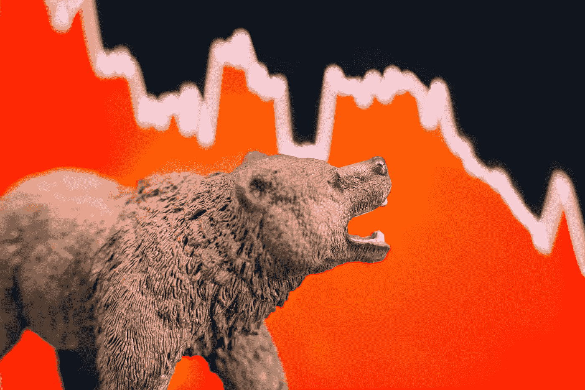

Image taken from The Montley Fool

不管你喜不喜欢，熊市正在全力向我们袭来——所有主流加密货币和股票都在自由落体，底部还没有出现。比特币恐惧&贪婪指数现在指向极度恐惧，反映了普通大众情绪动荡的状态。

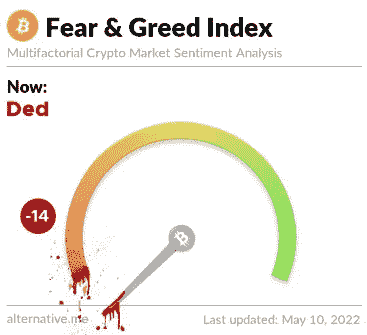

虽然熊市自然会带来这种心烦意乱和不确定性，但它也可能为精明的投资者提供一个赚钱的机会。虽然我不敢自称是金融大师，但从我个人的角度来看，以下策略有助于在这段艰难时期缓冲我的投资组合。

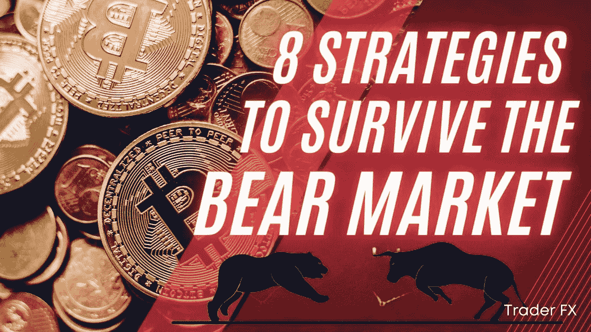

# 1.买蘸酱！

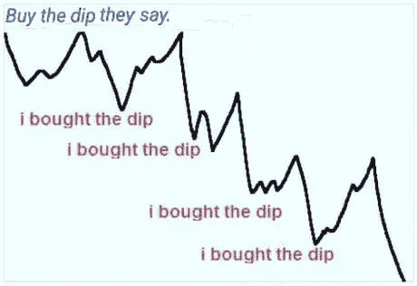

我 ndeed，**择时入市难**；因此有了平均成本的概念，指的是不管市场如何，定期分配一定数量的资金来购买一项资产。但在这个熊市期间，也许更好的方法是买入下跌——但你永远不会知道“真正”的下跌是什么时候，因为当价格瞬间飙升时(牛市陷阱)，价格可能会在你刚刚为自己做了一次好的买入而拍手称赞后不久进一步下跌。因此，你可以**将你的投资分散到小的交易中，在红色的日子少量买入，在绿色的日子卖出**——也许是 DCA 的修改版本，而不是在传统的 DCA 策略中在每周/每月的固定日子盲目买入资产。

# 2.交易机器人

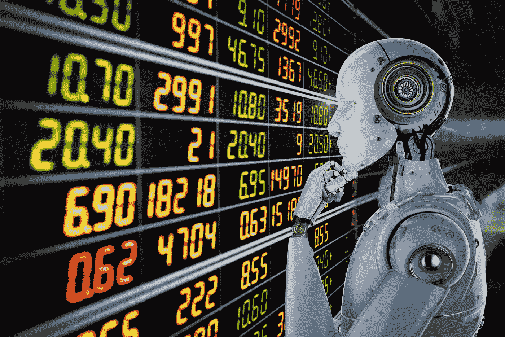

Image taken from Torex

交易机器人可以自动完成相当单调的低买高卖过程，让投资者可以通过自动驾驶系统赚取利润，而不是盯着图表几个小时来确定合适的进场点。因此，一个适当配置的交易机器人可以充当波动杀手，因为它可以通过市场波动产生的网格利润缓冲资产价值的贬值。为了更好地说明这一点，看看我下面的 [Kucoin](https://www.kucoin.com/r/af/rJH29LZ) 中的 DFI 现货网格 Bot 一个类似的概念普遍适用于所有加密货币，不管使用的是什么令牌，在我的例子中是 DFI。(DFI 是 DeFiChain 的原生令牌，defi chain 是比特币的一个分支，具有许多创新功能，我对其进行了大量投资。DFI 甚至在大多数时候都超过了 BTC，对比特币的汇率达到了最近的历史新高！在我之前的文章[中阅读更多关于 DFI 的内容。)](/coinmonks/dfi-an-underrated-coin-7effca02ed3f)

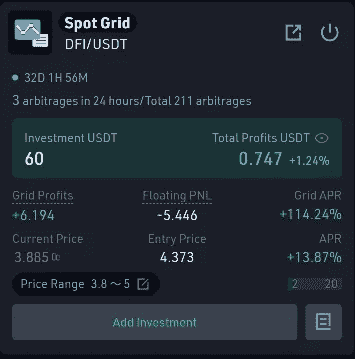

My Kucoin Spot Grid Bot Running on DFI

不久前，当市场相对更环保时，我启动了这个机器人，初始投资为 60 美元，以 4.37 美元(入门价格)的价格购买了 DFI。凭借不断低买高卖，自 32 天前开始运营以来，它已经产生了 6.19 美元 USDT(电网利润)的利润，电网 APR 高达 114%，值得称赞。给定 DFI 目前的价格为 3.885，如果我在 32 天前简单地购买了 DFI 并被动持有，我将因硬币贬值而损失 5.44 美元 USDT(浮动 PNL)。然而，交易机器人产生的 6.19 美元的网格利润抵消了价值上的贬值，实际上产生了 0.74 美元的总利润！事实上，这并不是一个令人震惊的数字，这不是因为这些天我们周围的市场情绪都很悲观；但它有效地缓冲了资产价格下跌给我带来的未实现损失。

在我试验过的许多交易机器人中，我最喜欢的是 [Kucoin](https://www.kucoin.com/r/af/rJH29LZ) 和 [Pionex](https://www.pionex.com/en-US/sign/ref/mWhH4v29) 。想了解更多关于 Kucoin 交易机器人及其策略的信息，请点击这里查看我之前的文章。

# 3.在五月卖掉，然后离开

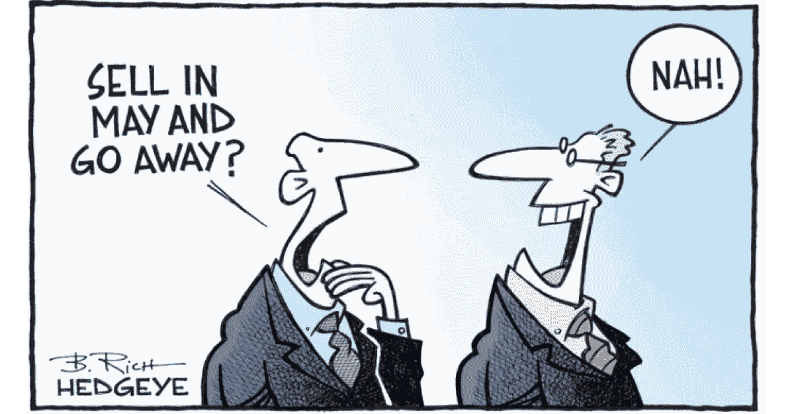

Image taken from NS Partners

“Sll in May and go away”是一句众所周知的金融格言，基于股票在 5 月至 10 月的六个月期间的历史表现不佳。然而，这一概念遇到了某种程度的争议，因为近年来，由于外部因素对金融市场的影响越来越大，这种模式可能不再适用。但如果历史真的重演(事实上，市场目前绝不是在 5 月份下跌！)，这可能是一个好主意，出售你的一些资产，然后以更低的价格买回。技术分析的基本知识可能会有所帮助——点击这里查看一个简单的图形摘要[。](/coinmonks/the-art-of-reading-trading-charts-a-graphical-summary-9b2671c01492)

# 4.贸易期货

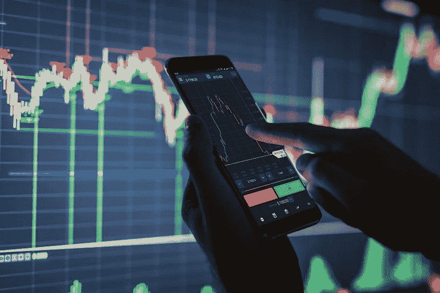

Image taken from Nairametrics

期货交易是一种难以置信的伟大和快速的方式，可以让你的投资组合成功或失败，这就是 T2。杠杆是指使用借入的资金来增加您的交易头寸，使其超出您的现金可获得的数额——在期货交易的背景下，杠杆越高，您在您的头寸上获得的收益/损失就越多，但如果市场与您的押注相反，您的头寸被清算的范围就越窄。在这个熊市中可以采用的策略是**建立期货空头头寸**——但是请注意，除非市场非常单边，否则它通常会在短期内小幅反弹，如果你的杠杆太高，可能会触发清算。换句话说，从中长期来看，市场可能确实会走向下跌，但价格的短暂飙升可能会导致短期合约的平仓。因此，如果你必须交易期货，一定要非常谨慎——使用低杠杆(这样你在平仓前有很大的利润空间),定期获利。

# 5.购买杠杆代币

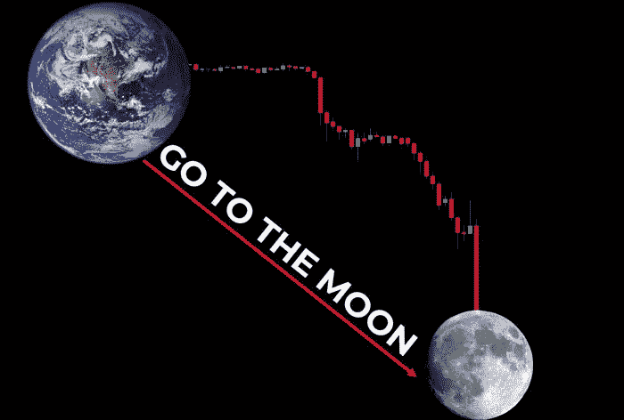

L 可以在 [Kucoin](https://www.kucoin.com/r/af/rJH29LZ) 、 [Huobi](https://www.huobi.com/en-us/topic/double-invite/register/?invite_code=5t5jb) 、币安等主要加密货币交易平台上交易的永续代币，提供了加密货币价格的杠杆敞口，没有期货交易固有的平仓风险。以下面这张令人心碎的比特币看跌图为例。

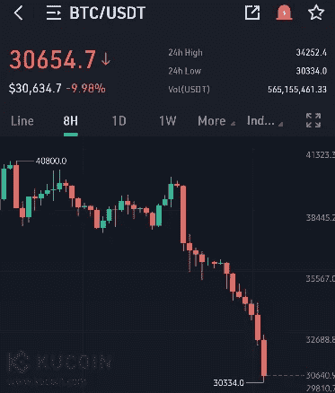

把这张图倒过来，真的可以“到达月球”不是很棒吗？

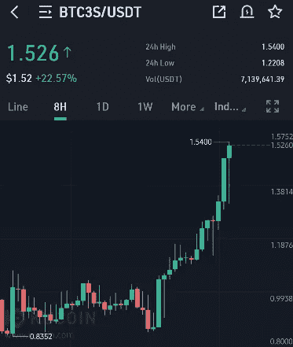

这正是杠杆代币的作用——事实上，一个 **BTC3S 代币不仅会随着比特币价格的下跌而升值，而且鉴于 3 倍的杠杆作用，还会使这一价格波动增加 3 倍**。交易杠杆代币的主要优势在于，你可以用放大的利润做多/做空市场，减去交易期货的平仓风险。但是，请注意，这些代币提供的杠杆低于期货合约，并且这些代币没有任何内在价值，因为它们只是跟踪感兴趣的资产的价格变动，因此一定要积极参与代币交易，而不是被动地 HODL 太长时间！杠杆代币还会重新平衡以维持目标杠杆，尤其是在高波动时期——如果它赚钱，这些利润将被再投资；如果亏损，它将出售部分头寸——因此交易杠杆代币并非没有风险和缺点。

# 6.在 HODL 期间赚取现金流

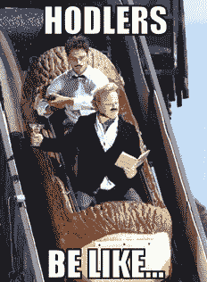

比起被动地将你的资金放在钱包里，更好的办法是将它们存放在**集中金融(CeFi)/分散金融(DeFi)平台上，这些平台能为你的数字资产提供诱人的收益**。如果你是这个平台的新手，当你这么做的时候，赚取一些有吸引力的注册奖金！

**一些著名的 CeFi** **产品**包括:

*   [**Nexo**](https://nexo.io/ref/hce5cfdt5o?src=android-link) :一家大型数字资产机构，在 200 多个司法管辖区提供 40 多种法定货币的即时加密贷款、每日资产收益、交换服务。HODL 你的资产在 Nexo 赚取高达 17%的年利率，每天支付。**在这里注册******当你存入并持有至少 100 美元的支持资产一个月，就可以赚取 25 美元的比特币**！**
*   **[**Cake DeFi**](https://cakedefi.com/?ref=677920) :一家总部位于新加坡的 CeFi，其名称部分来源于 DeFiChain 网络，其大部分服务都基于该网络，提供最优秀的流动性挖掘、赌注、借贷服务，APYs 高达 100%！**注册** [**此处**](https://cakedefi.com/?ref=677920) **赢取 40 美元奖金+10 美元学习&赢取**50 美元投资 1 批贷款/流动性采矿股票冻结 1 个月/赌注股票冻结 1 个月。此外，如果你能在 22/5/22 的比特币披萨日猜对比特币的价格，就有可能赢得 5500 美元的比特币！要了解更多信息，请查看下面我以前关于蛋糕定义的文章。**

** [## 如何赢得价值 5500 美元比特币的一年免费披萨！

### 在 2022 年 5 月 22 日猜对比特币的价格，就有机会赢得 5500 美元的比特币，直接支付给你的蛋糕…

medium.com](/coinmonks/how-to-win-a-years-supply-of-free-pizza-worth-5500-of-bitcoins-eefadd50d1ef)  [## 我喜欢用蛋糕 DeFi 的 8 个理由！

### Cake DeFi 是一个加密货币投资平台，从您的数字资产中产生被动收入。立即注册…

medium.com](/coinmonks/8-reasons-why-i-love-using-cake-defi-f6547b9dfc4c) 

*   [**Youhodler**](https://track.youhodler.com/click?pid=899&offer_id=2&sub1=Blog) :一个总部位于欧盟和瑞士的品牌金融科技平台，专注于加密支持的菲亚特贷款、加密和稳定币贷款、加密/菲亚特和加密/加密转换，以及高收益加密储蓄账户(加密奖励&赌注)，提供高达 13.07%的 APY 年利率！**报名** [**这里**](https://track.youhodler.com/click?pid=899&offer_id=2&sub1=Blog) **。**

有关这些高收益加密货币 CeFi 平台的更多信息，请查看下面我以前的文章。

 [## Stablecoins 的顶级高收益加密货币储蓄账户，拥有最佳注册奖金…

### 了解为稳定存款提供最佳利率的顶级高收益加密货币储蓄账户，以及…

medium.com](/coinmonks/the-top-high-yield-cryptocurrency-savings-account-for-stablecoins-with-the-best-signup-bonuses-11e297e7f7e1) 

**一些值得注意的 DeFi 产品**包括:

*   **大象币**:大象币及其稳定币箱背后的 DeFi 协议——一种稳定币，75%由 BUSD 支持，25%由大象币支持。主干可以进入踩踏永续债券，产生 672%的丰厚 APY！在我之前的文章[中阅读更多关于大象金钱的内容。](/coinmonks/how-to-earn-672-apy-on-a-stablecoin-an-introduction-to-elephant-money-d2c55bc379c5)

# 7.赚一个被动的收入与一个侧面的骗局！

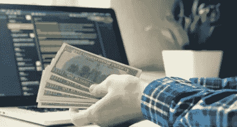

在我们的日常生活中，有许多未被充分利用的资源可以被利用来**产生一个小而稳定的被动收入流**。在我年轻的时候，我曾经尝试利用太阳能发电——鉴于我的项目规模小，而且需要昂贵、笨重的设备，这是不可持续的！随着高速宽带互联网已经渗透到现代文明的几乎每一个方面，我们的互联网带宽往往不会超过我们的日常需求——这些过剩的资源实际上可以货币化赚钱！在市场上为数不多的几个著名竞争者中，我最喜欢的是 [**Honeygain**](https://r.honeygain.me/CYBER577DD) ，这是一个几乎可以在任何移动或桌面设备上运行的免费应用程序，**通过安全地共享你的多余互联网带宽**来传输对寻求提高广告排名、比较价格和防止广告欺诈等的企业至关重要的公开可用网络数据，从而为你赚取被动现金流；所有这些都不会损害您的[数据安全性](https://www.honeygain.com/security/)！要了解更多关于如何利用你的互联网连接赚钱的信息，请点击这里查看我之前的文章！

# 8.投资贵金属

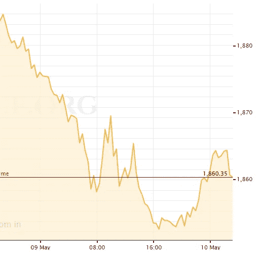

Image taken from goldprice.org

银和金等贵金属长期以来被誉为投资者的避风港，尽管它们的价格在最近的经济动荡中遭受了相当大的打击。将你投资组合的一部分投资于贵金属可能是个好主意，因为贵金属的价值经受住了时间的考验。随着技术的进步，**数字黄金**正迅速成为购买和投资虚拟黄金的首选方式，而无需实际持有黄金。**加密货币**将这场革命推向了一个新的高度，推出了如下精彩产品:

*   **与黄金价值挂钩的代币，如 PAX Gold** ，每种代币都由一根 400 盎司伦敦商品交割金条支撑，储存在 Brink 的金库中，由 Paxos 信托公司保管。存在于以太坊 ERC20 区块链上的 PAX Gold 本质上具有与黄金捆绑在一起的价值，就像 USD Tether 的价值与 USD 的价值捆绑在一起一样。PAX Gold 可以在币安、比特币基地、北海巨妖等主要加密货币交易所交易；一个值得注意的平台是 [**Nexo**](https://nexo.io/ref/hce5cfdt5o?src=android-link) **，在这个平台上可以购买、交易和持有 PAX Gold，以赚取高达 8%的年利率，每月免费提款**——这个功能在昂贵的以太坊网络上很受欢迎！

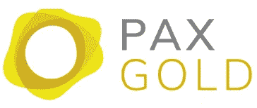

*   [**分散资产**](/coinmonks/invest-in-tesla-google-apple-easily-with-decentralized-assets-cdfe4e58330b) :分散资产代表了一种革命性的投资方式，**结合了加密货币流动性挖掘的高收益和投资传统股票市场的熟悉性这两个方面的优势**。这些分散的资产被称为 dToken，它们存在于 DeFiChain 网络上，本质上是有价值资产的数字反映，例如主要股票、ETF 和贵金属，其价格由相应的 dToken 跟踪。

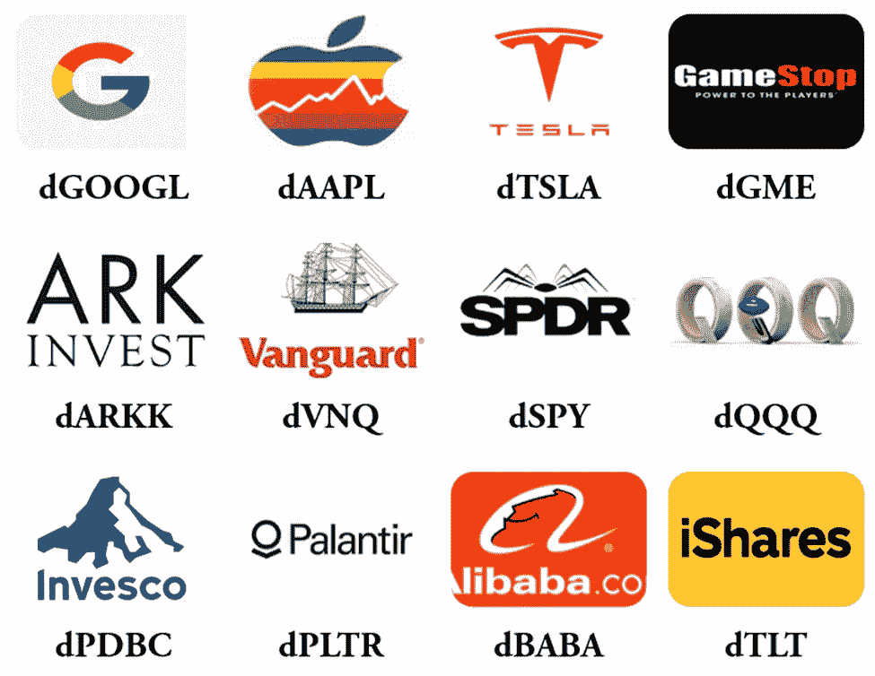

Examples of decentralized assets

**贵金属的现货包括 dGold 和 dSilver** ，它们可以与 dUSD(区块链 DeFiChain 的美元稳定货币)组合成**流动性采矿池，以赚取高达 100%的诱人年利率**(这可以根据市场情况而波动)！换句话说，由于 DeFiChain 的创新，除了利用感兴趣的基础资产的价格波动，被动现金流还可以从流动性挖掘回报中产生。分散的资产可以通过 [DeFiChain 钱包](https://defichain.com/)购买，或者更容易地在 CeFi 上购买，如 [Cake DeFi](https://cakedefi.com/?ref=677920) ，这简化了过程。在我之前的文章[中阅读更多关于分散资产的内容。](/coinmonks/invest-in-tesla-google-apple-easily-with-decentralized-assets-cdfe4e58330b)

# 乌云背后的一线希望

Image taken from TM Forum Inform

我知道，鉴于如今金融市场是一片红色的海洋，我们面临着艰难的时刻。当你在动荡的市场中周旋时，**一定要保持头脑冷静，确保用理性的头脑投资，不要被情绪所左右！由于个人投资者的风险偏好会有所不同，根据你自己的情况定制你的投资策略——购买、出售或持有的决定权完全在你；没有人有预知未来的水晶球。一如既往，**绝不投资任何你输不起的钱**；即使在最糟糕的情况下，你在熊市中损失了大量的财富，也不要忘记生活中其他真正重要的小事，比如家人和亲密的朋友！我上面介绍的策略仅仅是我的观点——欢迎分享你的想法和反馈！亲爱的投资者朋友们，请注意安全！**

*本文也提交给 Vocal 发表。*

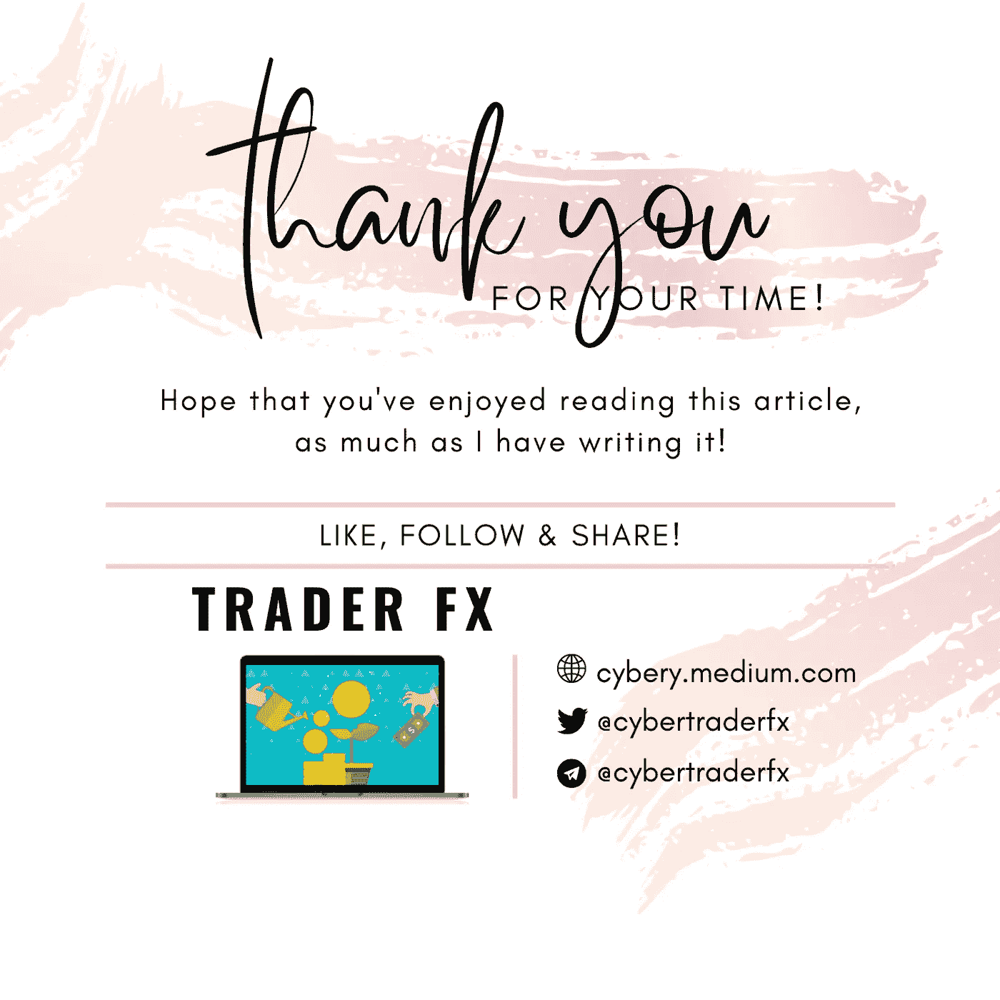

*一如既往，这不是财务建议！而只是我投资过的，觉得值得分享的投资平台。在投资前做好自己的研究，不要存你输不起的钱。下面有什么问题可以随时问我。*

*如果你喜欢这篇文章，* [*关注&订阅*](/@cybery) *！*

*查看以下值得信赖的平台！*

*🎁*[*honey gain*](https://r.honeygain.me/CYBER577DD)*一款被动收入应用，从你未使用的互联网带宽中赚钱。* [*免费获得 5 美元*](https://r.honeygain.me/CYBER577DD) *，无需投资。*

*🎁* [*蛋糕 Defi*](https://cakedefi.com/?ref=677920) *一站式投资平台，以高达 100%的年利率烘焙被动现金流！* [*在 DFI 用 50 美元存款获得 50 美元奖金*](https://cakedefi.com/?ref=677920) *。*

*🎁* [*Nexo*](https://nexo.io/ref/hce5cfdt5o?src=web-link) *一家先进的受监管数字资产机构，提供即时加密贷款，资产年利率高达 36%，是一家交易所，在 200 多个司法管辖区提供 40 多种法定货币的服务。* [*用 100 美元存款获得 25 美元*](https://nexo.io/ref/hce5cfdt5o?src=web-link) 奖金*。*

*🎁*[*Hodlnaut*](https://www.hodlnaut.com/join/RTbHxuJMX)*一个强大的加密借贷平台，从你闲置的加密货币中产生被动现金流，年利率高达 9.4%。* [*在 USDC 用 1000 美元存款获得 30 美元*](https://www.hodlnaut.com/join/RTbHxuJMX) *奖金，或用 1500 美元存款获得 50 美元。*

*🎁*[*Kucoin*](https://www.kucoin.com/r/af/rJH29LZ)*一个庞大的加密货币交易所，提供有趣的产品，如赌注、自由交易机器人和比特币云挖掘服务。*

*🎁* [*火币*](https://www.huobi.com/en-us/topic/double-invite/register/?invite_code=5t5jb) *一个提供多样化产品、免费空投和交易机器人的加密货币交易所。*

*🎁*[*MEXC*](https://www.mexc.com/en-US/register?inviteCode=mexc-1NAJC)*一个持有 MX 代币的加密货币交易所，有着有趣的列表和频繁的空投。*

*🎁*[*Crypto.com*](https://read.cash/@TraderFX/10-tips-to-maximize-earnings-on-honeygain-an-effortless-free-passive-income-app-68535728#bad-link)*一家位于新加坡的加密货币交易所。* [*得到 25 美元*](https://crypto.com/app/fcbsjmf5pb) *在 CRO 赌赢一张红宝石牌。*

*🎁*[*Pionex*](https://www.pionex.com/en-US/sign/ref/mWhH4v29)*一个免费的多功能套利交易机器人，自动化低买高卖的过程，24/7。*

***针对马来西亚投资者***

*🎁* [*Luno*](https://www.luno.com/invite/EDXG2X) *在 BTC 用 100 令吉购买 BTC 获得 25 令吉的奖励！*

*🎁*[*Stashaway*](https://www.stashaway.my/referrals/kenleel9jx)*获得 6 个月免费投资！*

*🎁Wahed code 'KENLIE1' RM10 注册奖金*

*🎁Capbay P2P 代码' 8879c6' RM100 注册奖金*

*🎁* [*亦然*](https://download.versa.com.my/1bAf/referral?deep_link_value=QF218MMB) *用 100 令吉存款获得 10 令吉奖金！*

*🎁*[*KDI*](https://app.digitalinvesting.com.my/registration/signup?referral_code=103433)*用 250 令吉存款获得 10 令吉奖金！*

*[***中***](https://cybery.medium.com/)***|***[***read . cash***](https://read.cash/r/TraderFX)***|***[***Youtube***](https://www.youtube.com/c/SmartInvestingChannel)***|****

> *加入 Coinmonks [电报频道](https://t.me/coincodecap)和 [Youtube 频道](https://www.youtube.com/c/coinmonks/videos)了解加密交易和投资*

# *另外，阅读*

*   *[无聊猿游艇俱乐部(BAYC)回顾](https://coincodecap.com/bored-ape-yacht-club-bayc-review) | [拜比特 vs 比特币基地](https://coincodecap.com/bybit-vs-coinbase)*
*   *[5 款最佳加密交易终端](https://coincodecap.com/crypto-trading-terminals) | [最佳 DeFi 应用](https://coincodecap.com/best-defi-apps)*
*   *[比特币基地 vs 瓦济克斯](https://coincodecap.com/coinbase-vs-wazirx) | [比特鲁点评](https://coincodecap.com/bitrue-review) | [波洛涅克斯 vs 比特鲁](https://coincodecap.com/poloniex-vs-bittrex)*
*   *[德国最佳加密交易所](https://coincodecap.com/crypto-exchanges-in-germany) | [Arbitrum:第二层解决方案](https://coincodecap.com/arbitrum)*
*   *[币安交易机器人](/coinmonks/binance-trading-bots-d0d57bb62c4c) | [OKEx 评论](/coinmonks/okex-review-6b369304110f) | [Atani 评论](https://coincodecap.com/atani-review)***