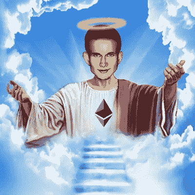

# 关于 Vitalik Buterin &以太坊你不知道的 8 件事！

> 原文：<https://medium.com/coinmonks/8-things-you-didnt-know-about-vitalik-buterin-ethereum-234fa6172da9?source=collection_archive---------4----------------------->

Do you know Vitalik Buterin is known as “V God” in China?

这里要特别感谢 Bee Lee 女士，她为这篇文章的创作做出了重要的贡献。尽情享受吧！

# 1.维塔利克·布特林是以太坊唯一的创始人吗？

维塔利克·布特林是**最初在 2013 年 11 月**发表** [**白皮书**](https://ethereum.org/en/whitepaper/) 解释他的[以太坊](https://ethereum.org/en/)概念的人** …