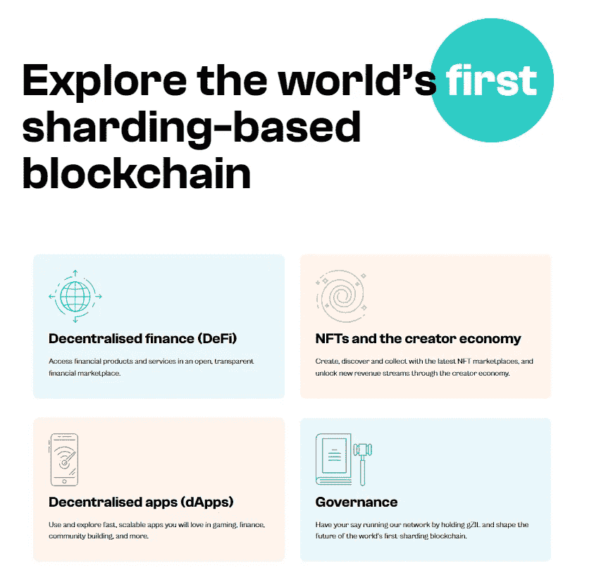

# 关于 Zilliqa (ZIL)你需要知道的 8 件事

> 原文：<https://medium.com/coinmonks/8-things-you-need-to-know-about-zilliqa-zil-2c851768dd04?source=collection_archive---------3----------------------->

## 节点类型、分片机制、共识模型、激励机制、智能合同等等！

Zilliqa (ZIL)是与比特币和以太坊竞争的第 1 层区块链。Zilliqa 网络使用分片机制来增强网络的可扩展性和分散性。