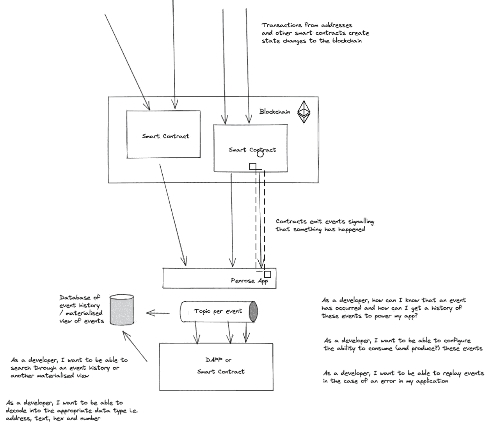
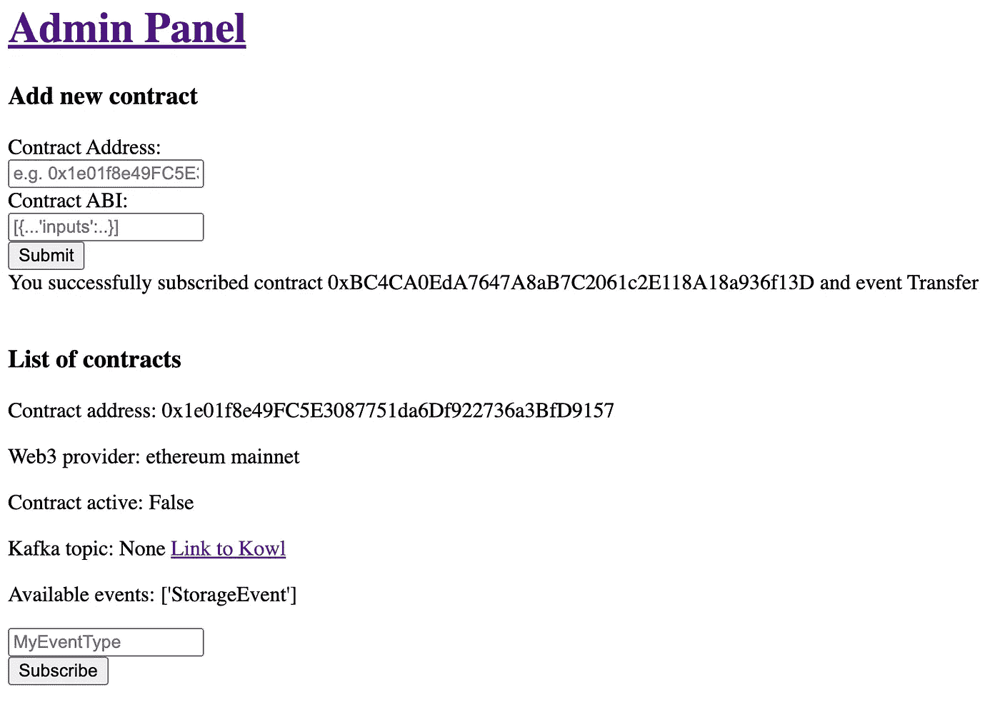
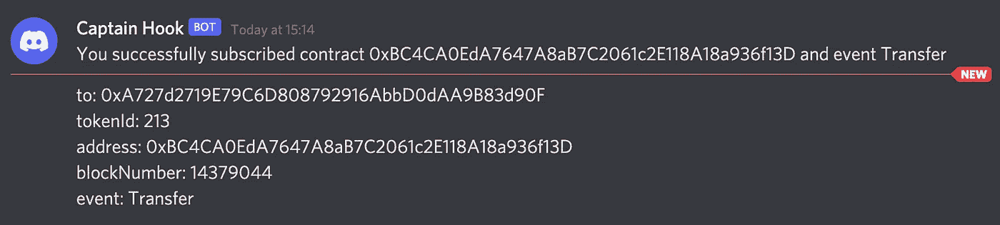

# 80/20 #4 —为以太坊上的 BAYC 交易构建通知应用程序

> 原文：<https://medium.com/coinmonks/80-20-4-building-a-notification-app-for-bayc-transactions-on-ethereum-3dccea3ea17d?source=collection_archive---------33----------------------->

目标

*   我们写的上一篇博客无法创建一个彩票应用程序，因为最初的设计需要 smart 令牌的购买者的完整历史，而这不容易从合同中获得。这个项目试图在 Kafka 中创建一个事务事件的存储来解决这个普遍的问题
*   创建一个可以用来解决这个问题的平台，即可以连接到任何智能契约，订阅并存储 kafka 主题中发出的事件，然后可以按照客户要求的任何方式消费这些事件
*   为了证明这个概念，我们选择使用平台来消费 BAYC 事务事件，将它们存储在 Kafka 中，然后将这些事件发布到 Discord 频道

技术

*   烧瓶创建管理应用程序来管理我们订阅的合同
*   Infura 连接到以太坊区块链以访问发出的事件
*   卡夫卡对事件的存储
*   Kowl 用户界面查看已存储在 Kafka 中的事件
*   将事件发布到 Discord 频道的 Discord API

价值主张

*   支持可访问的事件历史，以支持许多实时的基于事件的智能合同使用情形
*   消费者可以灵活选择消费方式，例如发布到数据库进行基于产品的查询，发布到分析平台进行分析查询，或者直接消费事件，例如我们的 BAYC 用例
*   如果下游出现任何问题，他们可以重放事件

Github 链接，包含设置 Penrose 应用程序的说明—[https://github.com/olwflynn/penrose-app](https://github.com/olwflynn/penrose-app)

收到无聊猿游艇俱乐部转会通知的不和谐频道—【https://discord.gg/sfj2KjqS 

# 观看演示——让区块链的储物状态更简单

【https://www.loom.com/share/43192ad617774e39acb91063396f6c6a 

用户订阅新合同事件的旅程

*   在管理界面中添加合同地址(和 ABI，可选)和事件名称。这将把合同事件添加到平台，但它将是不活动的，即不监听事件
*   点击订阅按钮，开始收听定义的事件
*   然后可以在 Kowl UI 中查看为所选智能合约成功存储的事件。这些可以通过相关的卡夫卡主题获得。

# 观看演示—订阅 BAYC NFT 通知

[https://www.loom.com/share/175a956f051a4cc0b62b2a39d86ca1c0](https://www.loom.com/share/175a956f051a4cc0b62b2a39d86ca1c0)

> *加入 Coinmonks* [*电报频道*](https://t.me/coincodecap) *和* [*Youtube 频道*](https://www.youtube.com/c/coinmonks/videos) *了解加密交易和投资*

# 另外，阅读

*   [3 商业评论](/coinmonks/3commas-review-an-excellent-crypto-trading-bot-2020-1313a58bec92) | [Pionex 评论](https://coincodecap.com/pionex-review-exchange-with-crypto-trading-bot) | [Coinrule 评论](/coinmonks/coinrule-review-2021-a-beginner-friendly-crypto-trading-bot-daf0504848ba)
*   [莱杰 vs n 格拉夫](/coinmonks/ledger-vs-ngrave-zero-7e40f0c1d694) | [莱杰纳诺 s vs x](/coinmonks/ledger-nano-s-vs-x-battery-hardware-price-storage-59a6663fe3b0) | [币安评论](/coinmonks/binance-review-ee10d3bf3b6e)
*   [Bybit Exchange 审查](/coinmonks/bybit-exchange-review-dbd570019b71) | [Bityard 审查](https://coincodecap.com/bityard-reivew) | [Jet-Bot 审查](https://coincodecap.com/jet-bot-review)
*   [3 commas vs crypto hopper](/coinmonks/3commas-vs-pionex-vs-cryptohopper-best-crypto-bot-6a98d2baa203)|[赚取加密利息](/coinmonks/earn-crypto-interest-b10b810fdda3)
*   最好的比特币[硬件钱包](/coinmonks/hardware-wallets-dfa1211730c6) | [BitBox02 回顾](/coinmonks/bitbox02-review-your-swiss-bitcoin-hardware-wallet-c36c88fff29)
*   [BlockFi vs Celsius](/coinmonks/blockfi-vs-celsius-vs-hodlnaut-8a1cc8c26630)|[Hodlnaut 点评](/coinmonks/hodlnaut-review-best-way-to-hodl-is-to-earn-interest-on-your-bitcoin-6658a8c19edf) | [KuCoin 点评](https://coincodecap.com/kucoin-review)