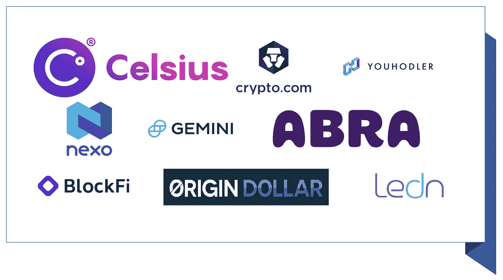

# 在稳定的股票上赚取 5%到 20% APY 的 9 个简单方法

> 原文：<https://medium.com/coinmonks/9-easy-ways-to-earn-5-to-20-apy-on-stablecoins-48cacf2fb2b3?source=collection_archive---------0----------------------->

## 我将介绍 9 个交易所、加密借贷平台和 DeFi 协议，通过它们你可以让你的钱为你工作。

稳定货币的价格(几乎)是固定的，并与一些法定货币(如美元)挂钩。因此，持有稳定债券的风险不如持有其他加密债券的风险大