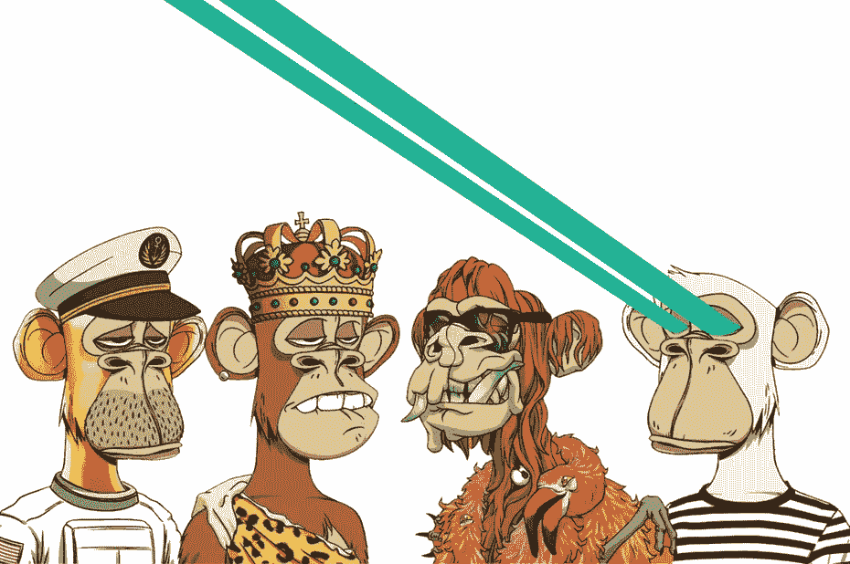

# 推广 NFT 系列的 9 种有效付费方式

> 原文：<https://medium.com/coinmonks/9-effective-paid-ways-to-promote-your-nft-collection-2bef3c74f106?source=collection_archive---------0----------------------->

**9 Effective Paid ways to Promote your NFT Collection**

在开始之前，我们需要了解，你为什么要开始宣传你的 NFT 系列？我们可以假设艺术家制作 NFT 有三个主要原因:赚钱，跟随最新潮流，吸引更多人参与他们的作品。没有一个成功的促销计划，无论他们多么有技巧，他们都将一事无成。

**那么，我们来了解一下为什么要推广 NFT 艺术:**

*   通过宣传你的技能，你得到了更多人的参与。听起来很明显，不是吗？然而，一些艺术家，尤其是没有营销团队的新手，只是铸造他们的作品，并在这一点上停下来，这是错误的。我们需要知道，销售和营销现在是齐头并进的。所以，如果你的目标是赚钱，推广是至关重要的。
*   相信我，当你竭尽所能想得到认可时，你就会得到认可。推广将有助于你的收获和个人品牌。
*   通过推广你在 NFT 的业务，你不仅吸引了买家的注意，也吸引了将来合作的其他艺术家的注意。

# 以下是推广你的 NFT 项目的最佳付费方式

# 1.社交媒体账户

在 Instagram 和 Twitter 上，各种 NFT 社区为 NFT 艺术品提供了一些推广选择。谈到 Instagram，他们会写一篇文章描述发布的所有细节，在 Insta Stories 上分享，甚至邀请一位艺术家参加 Insta Live。公平地说，我不知道费用是多少，但它不便宜。

# 2.影响者

当提到提高知名度时，给有影响力的人付费是首先想到的营销方式。几个有影响力的人有一个庞大的粉丝群，他们信任他们的建议并关注他们的观点。一个有影响力的人几乎肯定会要求以加密或其他类型的货币支付，或者以 NFT 艺术的形式奖励

如果你不知道任何知名音乐人愿意免费推广你的 NFT 滴剂，那么你可以采用这种营销方法。

# 3.订购一篇关于你企业的公关文章

写一篇关于你的 NFT 项目的文章，并在最流行的相关媒体上分享，这是一个聪明的主意。另外，你可以提供各种类型的媒体合作，比如对你的采访。通常是付费选项。但是，您可以利用 Medium 创建一个博客帖子，其中包含有关您的下落的所有数据。

我是一个为大多数加密博客做贡献的作家，我帮助创作者通过张贴他们的滴和通过时事通讯发送他们来推广他们的 NFT 项目。你需要做的就是 [**关注/订阅我的博客**](/@s.hanz) ，然后把你的业务、日期、背后的故事、赠品……等等的每一个可能的细节发给我。让我免费帮你，以后再谢我。

# 推广 NFT 系列的其他技巧

我将为您提供更多的建议，除了最有效的技术，以促进您的 NFT 收藏品。当你将它们付诸实践时，你的 NFT 系列将会在数百个系列中脱颖而出。

# 4.创建一个单独的网页

你可以在你的网站上为你的 NFT 作品集创建一个特别的网页。包括对所有艺术品的描述，以及买家如何、何时、何地获得这些艺术品的信息。

# 🌟[创建一个币安帐户，在 USDT 赢取 100 美元奖金](https://www.binance.com/en/activity/referral/offers/claim?ref=CPA_00M6XWFUN3)🌟

**🌟** [**Create a Binance account and get 100$ Bonus in USDT**](https://www.binance.com/en/activity/referral/offers/claim?ref=CPA_00M6XWFUN3)**🌟**

# 🌟我有一个伟大的奖金给你:100 美元在币安注册后🌟

[**一旦您通过此链接**](https://www.binance.com/en/activity/referral/offers/claim?ref=CPA_00M6XWFUN3) 创建了您的币安，存款超过 50 美元，然后在到期前兑换您的 100 USDT 优惠券。

# 5.成为收藏家

从艺术家那里收集 NFT 的艺术品是让你的名字出现在 NFT 社区的一个很好的方法。如果你买了某人的 NFT 艺术品，然后在社交媒体上发布，注明艺术家，他可能会在 Insta Stories 上分享。这将扩大你的受众，增加潜在收藏者的数量是你的一个战略举措，也是对你即将到来的 NFT 发布会的一点贡献。

# 6.建立协作

为了创作 NFT 系列，数字艺术家与歌手、时尚企业、明星和动画工作室合作。他们合作的主要原因是在其他专家的帮助下提高他们的艺术水平。第二个原因是他们交换观众，互相帮助扩大粉丝群。当我们谈到第一次合作时，这不是钱的问题，但肯定是认可的问题。

你可以和其他创作者取得联系，向他们提供你的帮助。如果你没有收到回应，不要放弃。被注意到只是时间问题。

# 7.赠品

在 NFT 商界，安排下一个系列的免费赠品是一个很好的做法。你可以为 NFT 艺术收藏品或实物艺术制作赠品。艺术家总是根据以下方案制作赠品:人们必须在社交媒体上关注艺术家，在评论区标记他们的朋友，最后分享帖子。

这是一个关于你的 NFT 艺术的额外宣传，一个真正的机会来满足你的追随者，也让更多的人知道。

# 8.加入电报和不和

在 Telegram and Discord 网站上，有各种各样的聊天室，创作者可以在那里见面、交谈、分享他们的 NFT 收藏。只是不要每分钟都提到你的 NFT 来破坏讨论！参与辩论，友善待人，尽最大努力确保团队成员认可你和你的方法。

# 9.提前宣传

我已经提到过，每天都有大量的非功能性测试被发布，所以你有可能会迷失在其中。至少在发行前两周，试着激起人们对你的 NFT 收藏品的兴趣。你可以从一个试探开始，然后逐渐揭示下落的细节。

# 3 位创作 NFT 艺术的推荐艺术家:

[**1。Rafcreative 是一个疯狂的艺术家**](https://go.fiverr.com/visit/?bta=182994&brand=fiverrcpa&utm_campaign=freewaystopromote&landingPage=https%3A%2F%2Fwww.fiverr.com%2Frafcreative%2Fdraw-custom-character-for-nft-collection%3F) 提供了只花几美元就能得到自己的 NFT 收藏的可能性，这使他在竞争中脱颖而出。他提供了 20 个详细的物品附件及其源文件。

[**Rafcreative’s work**](https://go.fiverr.com/visit/?bta=182994&brand=fiverrhybrid&utm_campaign=freewaystopromote&landingPage=https%3A%2F%2Fwww.fiverr.com%2Frafcreative%2Fdraw-custom-character-for-nft-collection%3F)

**2。** [**达米安 3d5 是 NFT 顶级艺人**](https://go.fiverr.com/visit/?bta=182994&brand=fiverrcpa&utm_campaign=friday110222&landingPage=https%3A%2F%2Fwww.fiverr.com%2Fdamian3d5%2Fdo-unique-nft-art-collection-with-100-1k-10k-attributes%3F) ，与 **ESET** “互联网软件&服务”和 **Sabaton** 等大牌合作。他提供 100，1K 和 10K NFT 的收藏。

[**Damian3d5’s work**](https://go.fiverr.com/visit/?bta=182994&brand=fiverrhybrid&utm_campaign=friday110222&landingPage=https%3A%2F%2Fwww.fiverr.com%2Fdamian3d5%2Fdo-unique-nft-art-collection-with-100-1k-10k-attributes%3F)

[**3。Valiantgraphic 是一位才华横溢的数字艺术家**](https://www.fiverr.com/valiantgraphic/draw-a-head-turner-dog-art-in-our-popular-signature-style?) ，他绘制和生成 nft 艺术收藏，并有几个像 Etsy 平台**这样的客户。你也可以考虑这个选择。**

[**Valiantgraphic’s work**](https://go.fiverr.com/visit/?bta=182994&brand=fiverrhybrid&utm_campaign=freewaystopromote&landingPage=https%3A%2F%2Fwww.fiverr.com%2Fvaliantgraphic%2Fdraw-a-head-turner-dog-art-in-our-popular-signature-style%3F)

# 结论

NFT 还是比较新鲜的，你可以利用自由职业者平台找人(专业人士)辅助你。[**我** **推荐这个聚集了最有经验的 NFT 艺人的平台**](http://www.fiverr.com/s2/3bd189b6e3) ，这样你就可以专注于营销，而不用担心那些技术上的东西了。

有了这份 NFT 指南来推广你的不可替代代币，你的 NFT 之旅一定会成功。尝试几种营销方式，然后选择适合你的方式并付诸实施。让尽可能多的收藏者接触到你的 NFT 收藏，不断改进你的营销策略，不要害怕在推广上花钱。

请 [**关注并订阅**](/@s.hanz) ，务必分享我的作品作为激励姿态。点击这里查看我所有的文章:【https://medium.com/@s.hanz】T5

# 更多文章:

[**2022 年推广 NFT 项目的 7 种免费方式**](/coinmonks/7-free-ways-to-promote-nft-projects-in-2022-ccefc7f249e7)

[**2022 年 7 款最佳赌注硬币**](/@s.hanz/7-best-staking-coins-in-2022-70dbc31adcae)

[**2022 年元宇宙最佳 5 个好项目加密币—清单 1**](/@s.hanz/best-5-metaverse-crypto-coins-with-good-projects-in-2022-list-1-687fedbe668e)

[***2022 年元宇宙最好的 5 个加密币好项目—榜单二***](/@s.hanz/best-5-metaverse-crypto-coins-with-good-projects-in-2022-list-2-15af2f8f01d9)

[**2022 年如何用比特币赚钱**](/@s.hanz/how-to-make-money-with-bitcoin-in-2022-ef8a276bc1b0)

[**需要钱的时候要做的事情快——新招**](/@s.hanz/things-to-do-when-i-need-money-fast-new-tricks-2b68ad24406b)

> 加入 Coinmonks [电报频道](https://t.me/coincodecap)和 [Youtube 频道](https://www.youtube.com/c/coinmonks/videos)了解加密交易和投资

## 另外，阅读

*   [Bookmap 评论](https://coincodecap.com/bookmap-review-2021-best-trading-software) | [美国 5 大最佳加密交易所](https://coincodecap.com/crypto-exchange-usa)
*   最佳加密[硬件钱包](/coinmonks/hardware-wallets-dfa1211730c6) | [Bitbns 评论](/coinmonks/bitbns-review-38256a07e161)
*   [新加坡十大最佳加密交易所](https://coincodecap.com/crypto-exchange-in-singapore) | [购买 AXS](https://coincodecap.com/buy-axs-token)
*   [红狗赌场评论](https://coincodecap.com/red-dog-casino-review) | [Swyftx 评论](https://coincodecap.com/swyftx-review) | [造币厂评论](https://coincodecap.com/coingate-review)
*   [投资印度的最佳密码](https://coincodecap.com/best-crypto-to-invest-in-india-in-2021)|[WazirX P2P](https://coincodecap.com/wazirx-p2p)|[Hi Dollar Review](https://coincodecap.com/hi-dollar-review)
*   [加拿大最佳加密交易机器人](https://coincodecap.com/5-best-crypto-trading-bots-in-canada) | [库币评论](https://coincodecap.com/kucoin-review)
*   [Capital.com 评论](https://coincodecap.com/capital-com-review) | [香港的加密借贷平台](https://coincodecap.com/crypto-lending-hong-kong)
*   [支持卡审核](https://coincodecap.com/uphold-card-review) | [信任钱包 vs MetaMask](https://coincodecap.com/trust-wallet-vs-metamask)
*   [赢取注册奖金——10 大最佳加密平台](https://coincodecap.com/earn-sign-up-bonus)