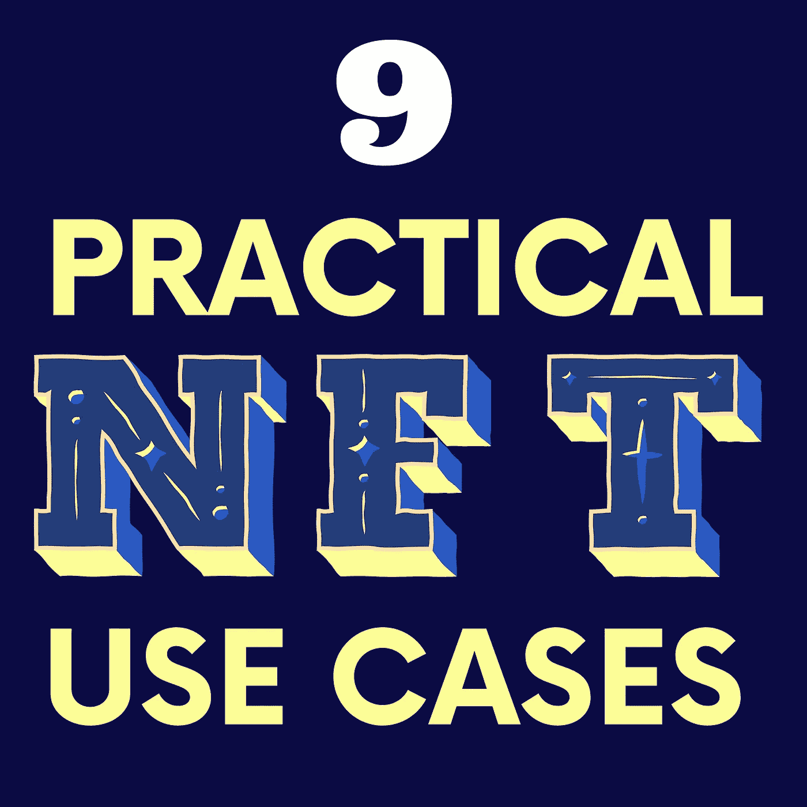

# 9 个实际的 NFTs 用例

> 原文：<https://medium.com/coinmonks/9-practical-nfts-use-cases-3501b9d95d77?source=collection_archive---------15----------------------->

Design on canva.com

NFT 已经成为互联网上的话题和区块链的一个广阔的生态系统。在投资之前，了解它的几种使用方式是很重要的。大多数人认为 NFT 只能用于数字艺术品。有不同的方式可以使用它，如保持您的医疗记录和身份安全。本文将讨论 9 个实用的 [NFT](/coinmonks/what-is-nft-and-how-you-can-make-money-from-nft-bf008d800b84?source=friends_link&sk=6d736e340a2b85f8a6908ddf1cf7eaa9) 用例，它们是:

*   真实世界的资产
*   医疗记录和身份
*   NFT 博彩
*   学历证书
*   迪菲 NFT
*   供应链
*   投票
*   NFT 艺术品
*   NFT 音乐

**实用#1:真实世界的资产。**

NFT 用于证明对现实世界资产的所有权，例如房地产。您可以通过将地契转移到区块链并转换到 NFT 来出售区块链的房地产。任何人买下这个 NFT，都可以获得关于房子建造时间、位置以及在购买之前谁住在房子里的信息。房地产 NFT 应用程序仍在开发中，但有希望在未来实现。

我们可以在珠宝等商品上使用 NFT。拥有一件特定珠宝的 NFT 将使转售变得容易。任何没有 NFT 的人都无法确认其真实性，也很难说服买家他们是合法的所有者。更多真实世界资产 NFT 的应用将很快生效。

**实用#2:病历和身份验证。**

NFT·莱杰可以保护医疗记录免受任何外部攻击。这是通过成千上万的节点在世界范围内保证账本的安全而实现的。NFT 区块链可以确保记录的准确性，并防止恶意操纵。

NFT 应用程序改善了医疗保健专业人员。一个实际的例子是 NFT 出生证明。他们可以给任何分娩的孩子颁发 NFT。这使他们可以在区块链上终生使用他们的身份。我们可以使用 NFT 验证应用程序来验证这个 NFT。

**实用#3:游戏 NFTs。**

NFT 与博彩业发展良好。它为游戏开发商创造了一种创收方式。游戏中的物品可以在区块链上为其他玩家交易。如果玩家拥有游戏中的角色或物品，他们会被鼓励继续玩游戏。

游戏中的买卖更加安全，因为所有交易都在区块链上进行。这为游戏行业带来了更多的机会，例如购买武器和其他由使用者测试的物品。这些游戏中的物品被用来在区块链上与其他玩家进行游戏以获得奖励。许多流行的游戏行业都在实现这一点，例如 Axies infinity 和战斗宠物。

实用#4:学历证书。

NFT 可以代表学历。出勤证明、课程注册、获得的学位和其他重要的学校信息可以安全地保存在区块链上，不会被更改或被侵入。每个完成的课程都可以获得一个令牌，获得的学位可以通过智能合同进行验证。

学术领域的 NFT 应用程序正在开发中，但将付诸实施。发放纸质证书将不再有效。NFT 学术代币可以传递给其他个人，以显示课程的完整性。

**实用#5:德菲 DeFi。**

NFT 用于 [DeFi 生态系统，](/coinmonks/beginner-guide-to-decentralized-finance-defi-30f9c6cb510d?source=friends_link&sk=230b3825f5ceb6456828bd157082752c)例如流动性池。一些流动性平台提供 NFT 作为开启流动性池下一阶段的门票。像 BakerySwap 这样的平台提供 NFT 作为赌注奖励。通过赌注他们的代币烘焙，你将获得一个 NFT 组合，提供可变的赌注力量。这种组合在二级市场上出售或用于赌注。游戏化、NFT、[和 DeFi】的应用为 NFT 创造了一个有趣的用例。](/coinmonks/beginner-guide-to-decentralized-finance-defi-30f9c6cb510d?source=friends_link&sk=230b3825f5ceb6456828bd157082752c)

**实用#6:供应链。**

我们可以通过时间戳 NFT 来确认货物的真实性。进口的货物可以从生产国追踪，货物的移动直到交付。这个过程可以保护人们免受假冒食品和药品的供应。这也防止了一些行业谎报他们的产品是在哪里生产的。

**实用#7:投票**

NFT 的应用程序可用于投票。选民总是被要求携带身份证号码和居留证件到投票中心。许多没有这些证件的人可能不会投票。 [NFT](/coinmonks/what-is-nft-and-how-you-can-make-money-from-nft-bf008d800b84?source=friends_link&sk=6d736e340a2b85f8a6908ddf1cf7eaa9) 可以作为这个问题的解决方案。所有这些文件都可以数字化，制成 NFT。这将使每个人都有机会投票，也防止选举中的欺诈行为。

**实用#8:艺术品 NFT**

NFT 帮助解决了数字化复制某些东西的问题，并帮助证明艺术品的所有权。任何人都可以复制图像，但不能证明其所有权。一个例子是艺术家 Park，他创造了一系列看起来相似的 NFT，并以它们的名字区分，如廉价、昂贵和未售出。Park 根据标题赋予每件作品独特的价值。这让我们知道是什么让数字艺术在区块链独一无二，证明每件作品所有权的能力。

**实用#9:音乐 NFT**

就像艺术和视频一样，音频也可以依附于 NFT，可以在区块链上市。这种音乐 NFT 仍处于婴儿阶段，其成为有效的能力取决于采用它的大型流平台。音乐厂牌的支持也能让它发挥作用。

> *加入 Coinmonks* [*电报频道*](https://t.me/coincodecap) *和* [*Youtube 频道*](https://www.youtube.com/c/coinmonks/videos) *了解加密交易和投资*

# 另外，阅读

*   [有哪些交易信号？](https://coincodecap.com/trading-signal) | [Bitstamp vs 比特币基地](https://coincodecap.com/bitstamp-coinbase) | [买索拉纳](https://coincodecap.com/buy-solana)
*   [ProfitFarmers 回顾](https://coincodecap.com/profitfarmers-review) | [如何使用 Cornix Trading Bot](https://coincodecap.com/cornix-trading-bot)
*   [十大最佳加密货币博客](https://coincodecap.com/best-cryptocurrency-blogs) | [YouHodler 评论](https://coincodecap.com/youhodler-review)
*   [my constant Review](https://coincodecap.com/myconstant-review)|[8 款最佳摇摆交易机器人](https://coincodecap.com/best-swing-trading-bots)
*   [MXC 交易所评论](/coinmonks/mxc-exchange-review-3af0ec1cba8c) | [Pionex vs 币安](https://coincodecap.com/pionex-vs-binance) | [Pionex 套利机器人](https://coincodecap.com/pionex-arbitrage-bot)