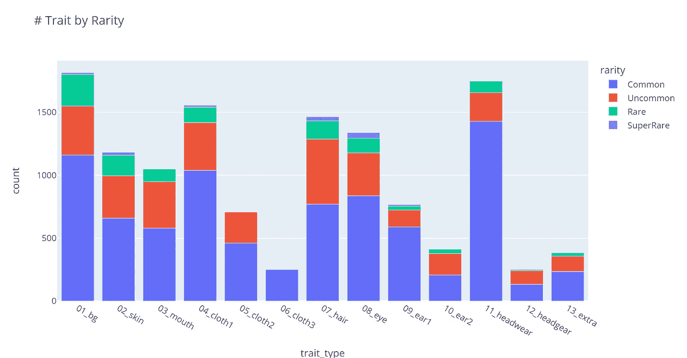

# 90 年代档案贸易经济学报告:第一卷(2 月 22 日)

> 原文：<https://medium.com/coinmonks/90s-archives-traitonomics-report-vol-1-feb-22-618272ec071e?source=collection_archive---------52----------------------->

T raitonomics Report:了解性状供求特征的报告。

*免责声明:本报告仅供参考，并非金融/投资建议。*

这是 2022 年的第一份报告，旨在让每个人了解 90 年代的档案经济学。这张快照拍摄于 2022 年 2 月 19 日。

**特质稀有度**

我们为所有的特征设计了特征。稀有程度有 5 个等级:普通，不普通，稀有，超级稀有，秘密。如果任何特性达到最大供应，该特性将从研究中心移除，并且不会再被放入死牢。

Trait Rarity

**概述**

目前，在 471 个持有者拥有的 [OpenSea](https://opensea.io/collection/90sarchives) 上有 822 个死账。有 273 种特征可供选择。到目前为止，我们已经向所有死鱼空投了 12，912 个特征。平均来说，每只死狗拥有大约 16 个特征。最常见的特征是背景、头饰和头发，这些特征组合起来最多约 5k。

**按特征类型分类的最常见特征**

虽然研究中心没有圣诞帽，但它是最常见的特征，因为它已经作为圣诞礼物空投给所有早期支持者。泡泡糖(嘴)和电子人(皮肤)是研究中心所有成员选择的最常见的特征。

**稀有度分布分析**

在 273 个特征中，下面是每个特征类型的稀有程度分布。由于背景竞争，背景特质的数量最高。对于 3 层的衣服，没有一个被归类为稀有和超稀有，因为，只有很少的组合允许成员穿 3 层的衣服。

下面是空投给所有死鱼的 12，912 个特征的稀有度分布。分布主要由我们的丢弃算法控制。目前，特征的分布是均匀的，这表明我们的算法执行得相当好！

我们还附上了一个 excel 文件，其中包括性状名称，性状类型和稀有度，供进一步分析。

 [## 加载 Google 工作表

### 在 Google Sheets 中打开“trait_data_19feb22.xlsx”。这可能需要一些时间。

docs.google.com](https://docs.google.com/spreadsheets/d/1tKQEd0sKmhpjYM-3ATK8w_3ZzA6nzETT/edit?usp=sharing&ouid=102974149414743432830&rtpof=true&sd=true) 

所有特征的信息都可能发生变化。我们将每个月向每个人发布消息！

**关于 90 年代档案**

90 年代档案是第一个动态的 PFP NFTs 项目，允许您设计自己的 90 年代时尚的死穴(NFTs)。所有的特质都会随着时间而改变！你永远不会成为一个无聊的死家伙！简而言之，我们让每个人设计自己的服装。

在这里给你的死鬼穿上衣服:[https://90sarchives.com/researchcenter](https://90sarchives.com/researchcenter)

我们相信创意是属于每个人的！

**官方渠道**

网址:[https://90sarchives.com/](https://90sarchives.com/)
不和:[https://discord.gg/90sarchives](https://discord.gg/90sarchives)
推特:[https://twitter.com/the90sArchives](https://twitter.com/the90sArchives)
IG:[https://www.instagram.com/90sarchivesnft/](https://www.instagram.com/90sarchivesnft/)
OPENSEA:[https://opensea.io/collection/90sarchives](https://opensea.io/collection/90sarchives)
FB:[https://www.facebook.com/90sArchives](https://www.facebook.com/90sArchives)
中:[https://medium.com/@90sarchivesproject](/@90sarchivesproject)
智能合约:0x dead 47 fef 9745 e 32 CDE 7326d 6 f 4c 31 fcb 3 FDA 8

> 加入 Coinmonks [电报频道](https://t.me/coincodecap)和 [Youtube 频道](https://www.youtube.com/c/coinmonks/videos)了解加密交易和投资

# 另外，阅读

*   [比特币基地僵尸程序](/coinmonks/coinbase-bots-ac6359e897f3) | [AscendEX 审查](/coinmonks/ascendex-review-53e829cf75fa) | [OKEx 交易僵尸程序](/coinmonks/okex-trading-bots-234920f61e60)
*   [如何在印度购买比特币？](/coinmonks/buy-bitcoin-in-india-feb50ddfef94) | [WazirX 评论](/coinmonks/wazirx-review-5c811b074f5b)
*   [隐料斗替代品](/coinmonks/cryptohopper-alternatives-d67287b16d27) | [HitBTC 审查](/coinmonks/hitbtc-review-c5143c5d53c2)
*   [CBET 评论](https://coincodecap.com/cbet-casino-review) | [库科恩 vs 比特币基地](https://coincodecap.com/kucoin-vs-coinbase)
*   [Fold App 审核](https://coincodecap.com/fold-app-review) | [Kucoin 交易机器人](/coinmonks/kucoin-trading-bot-automate-your-trades-8cf0ca2138e0) | [Probit 审核](https://coincodecap.com/probit-review)
*   [如何匿名购买比特币](https://coincodecap.com/buy-bitcoin-anonymously) | [比特币现金钱包](https://coincodecap.com/bitcoin-cash-wallets)
*   [币安 vs FTX](https://coincodecap.com/binance-vs-ftx) | [最佳(SOL)索拉纳钱包](https://coincodecap.com/solana-wallets)
*   [比诺莫评论](https://coincodecap.com/binomo-review) | [斯多葛派 vs 3Commas vs TradeSanta](https://coincodecap.com/stoic-vs-3commas-vs-tradesanta)
*   [Capital.com 评论](https://coincodecap.com/capital-com-review) | [香港的加密借贷平台](https://coincodecap.com/crypto-lending-hong-kong)