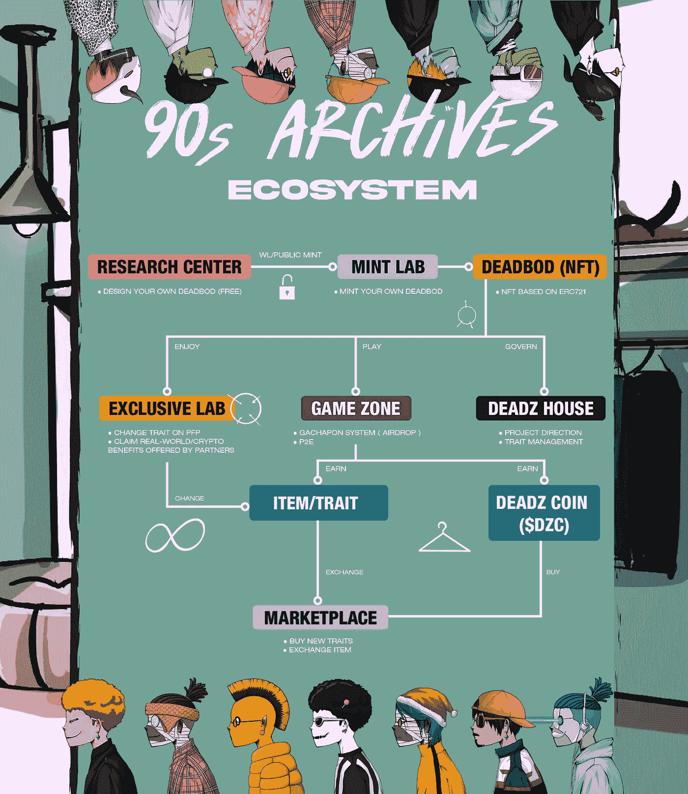

# 90 年代档案更新

> 原文：<https://medium.com/coinmonks/90s-archives-update-f33f14cec38c?source=collection_archive---------17----------------------->

**当前展望**

目前，我们的 WL 造币厂和公开销售按计划暂时关闭。我们想感谢您成为我们的忠实会员。我们很高兴向您介绍第一个可定制的动态 NFT，即所谓的死栓。

现在，我们在 [OpenSea](https://opensea.io/collection/90sarchives) 上有超过 800 个死账，由超过 460 个持有人拥有。这仅仅是 90 年代档案的开始。WL 造币厂的死货至少有 16 个特征，公共造币厂的死货至少有 15 个特征。因此，总共有超过 12，000 个特征被丢弃到所有的死区中。我们正致力于对 traitonomics(性状+经济学)的深入分析，以更好地对所有性状的稀有性进行分类。我们将在两周内发布 trait 报告，这样每个人都可以更好地了解 traitonomics。

> 我们还致力于下一个 WL 和公共造币厂。更多信息将很快公布。

**我们的使命**

我们的最终目标是创造一个可以作为艺术和投资的 NFT。作为一种艺术，我们的 NFT 可以代表人们的风格，用 NFT 作为我们概念中密码世界的侧面图

> 你可以设计自己的 NFT，表达自己，发表自己的观点。

因此，我们的死区可以完美地服务于其作为 Profile Picture (PFP)的目的，我们的[研究中心](https://90sarchives.com/researchcenter)提供了数万亿个死区组合。

然而，毫无疑问，密码世界的另一个重要目标是积累财富。当你铸造或投资一个死债券，你可以期待它的价值增长。这就是我们引入核心功能“可收集特征”的原因。我们推出了[专属实验室](https://90sarchives.com/exclusivelab)，在这里你可以收集越来越多的性状，让你的 NFT 更有价值。无论是在现实世界还是在秘密世界，特殊的特质都能给你带来额外的好处。我们承诺继续开发我们的产品/系统，并为所有 Deadz 公民带来越来越多的真实世界和加密世界的创新用例。

我们相信我们正在做的将是未来的 NFTs:“可定制和动态的 NFTs”。你将有机会获得无尽的定制。更重要的是，死区的值可以相应增加。

> 每个人都是艺术家、投资者、收藏家和 mooooon！！！。

为了让你一窥 90 年代档案馆的未来，我们为 Deadz 公民设计了如下所示的整个生态系统。

90s Archives Ecosystem

死卡是一种通行证/会员资格，可用于获得所有福利。

*   **专属实验室:**你可以更改你的死穴的特征，并且可以申请所有由合作伙伴提供的与死穴和特征相关的利益。
*   **游戏专区:** Gachapon 会帮我们管理日常点滴。所有死账日后都可能会参与 P2E。
*   **德兹之家:**项目方向将由所有德兹公民管理。以后所有性状都是全员管理。这包括添加/删除/编辑特征。

更多细节将在下面的文章中解释。

请作为死党加入我们的死党！

**关于 90 年代档案**

90 年代档案是第一个动态的 PFP NFTs 项目，允许您设计自己的 90 年代时尚的死穴(NFTs)。所有的特质都会随着时间而改变！你永远不会成为一个无聊的死家伙！简而言之，我们让每个人设计自己的服装。

在这里给你的死鬼穿上衣服:[https://90sarchives.com/researchcenter](https://90sarchives.com/researchcenter)

我们相信创意是属于每个人的！

**官方渠道**

网址:[https://90sarchives.com/](https://90sarchives.com/)
不和:[https://discord.gg/90sarchives](https://discord.gg/90sarchives)
推特:[https://twitter.com/the90sArchives](https://twitter.com/the90sArchives)
IG:[https://www.instagram.com/90sarchivesnft/](https://www.instagram.com/90sarchivesnft/)
OPENSEA:[https://opensea.io/collection/90sarchives](https://opensea.io/collection/90sarchives)
FB:[https://www.facebook.com/90sArchives](https://www.facebook.com/90sArchives)
中:[https://medium.com/@90sarchivesproject](/@90sarchivesproject)
智能合约:0x dead 47 fef 9745 e 32 CDE 7326d 6 f 4c 31 FCS

> 加入 Coinmonks [电报频道](https://t.me/coincodecap)和 [Youtube 频道](https://www.youtube.com/c/coinmonks/videos)了解加密交易和投资

# 另外，阅读

*   [本地比特币审核](/coinmonks/localbitcoins-review-6cc001c6ed56) | [加密货币储蓄账户](https://coincodecap.com/cryptocurrency-savings-accounts)
*   [什么是保证金交易](https://coincodecap.com/margin-trading) | [美元成本平均法](https://coincodecap.com/dca)
*   [维护卡审核](https://coincodecap.com/uphold-card-review) | [信任钱包 vs MetaMask](https://coincodecap.com/trust-wallet-vs-metamask)
*   [Exness 点评](https://coincodecap.com/exness-review)|[moon xbt Vs bit get Vs Bingbon](https://coincodecap.com/bingbon-vs-bitget-vs-moonxbt)
*   [如何开始通过加密贷款赚取被动收入](https://coincodecap.com/passive-income-crypto-lending)
*   [BigONE 交易所评论](/coinmonks/bigone-exchange-review-64705d85a1d4) | [电网交易机器人](https://coincodecap.com/grid-trading)
*   [氹欞侊贸易评论](https://coincodecap.com/anny-trade-review) | [CoinSpot 评论](https://coincodecap.com/coinspot-review)
*   [新加坡十大最佳加密交易所](https://coincodecap.com/crypto-exchange-in-singapore) | [购买 AXS](https://coincodecap.com/buy-axs-token)