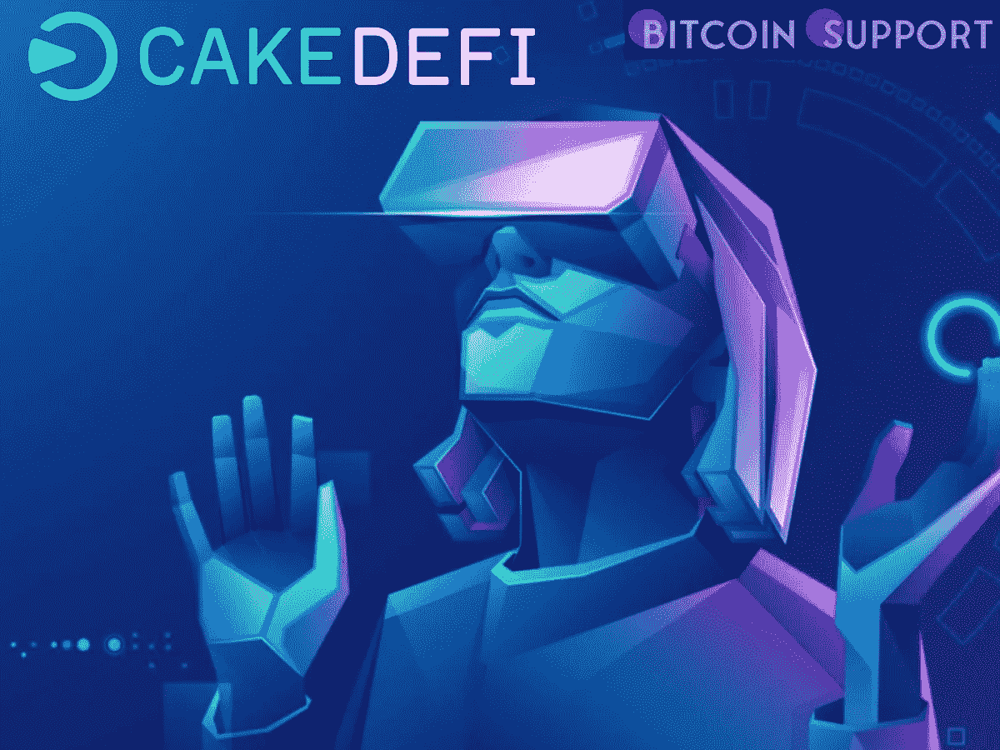

# Cake DeFi 已经为 web3、游戏和金融科技活动设立了一个 1 亿美元的风险投资部门

> 原文：<https://medium.com/coinmonks/a-100-million-venture-arm-for-web3-gaming-and-fintech-activities-has-been-launched-by-cake-defi-7f9c003f5738?source=collection_archive---------67----------------------->

**Visit our website:-** [**https://bitcoinsupports.com/**](https://bitcoinsupports.com/)

Cake DeFi Ventures 将投资于在 Web3、元宇宙、NFT、游戏、电子竞技和金融科技领域运营的加密业务，这些业务是公司核心业务的补充。总部位于新加坡的分散金融(DeFi)服务提供商 Cake DeFi 宣布成立一家投资 1 亿美元的公司，专注于 Web3、游戏、不可伪造代币(NFT)和其他加密活动。

Cake DeFi Ventures (CDV)，该公司新成立的 1 亿美元风险部门，将投资于补充公司核心业务的加密业务。根据 Cake DeFi 的说法，风险投资业务“将专注于投资横跨 Web3、元宇宙、下一代技术空间、游戏、电子竞技和金融科技的技术公司。”

Cake DeFi 的主要服务包括加密货币流动性挖掘、赌注和借贷——所有这些都旨在最大化现有加密资产的回报。除了从 CDV 获得融资，公告称:

“投资组合公司可以获得全球区块链生态系统中各种各样的蛋糕产品、关系、用户、资源和经验。”Cake DeFi 联合创始人兼首席技术官 U-Zyn Chua 表示，投资早期加密货币公司“将使我们能够加强我们的 Web3 能力。”除了敦促合适的企业与 CDV 分享他们的项目细节，该公司还向其他风险投资公司和对共同投资或战略合作感兴趣的投资者敞开了大门。

根据四大会计公司毕马威(KPMG)的一项新分析，新加坡的加密相关投资去年增长了 10 倍，从 2020 年的 1.1 亿美元增至 2021 年的 14.8 亿美元。

加密投资的大幅增长主要是政府鼓励资本市场发展的结果。值得注意的是，新加坡政府设计了特殊目的收购公司(SPACs)上市结构，允许快速增长的公司和独角兽公司上市。

此外，政府今年采取了重大措施来监管投机性数字资产。

**访问我们的网站:-**[**https://bitcoinsupports.com/**](https://bitcoinsupports.com/)

**免责声明:以上为作者观点，不应视为投资建议。读者应该自己做研究。**