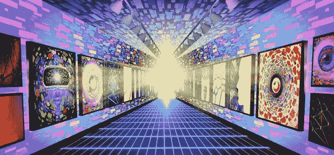

# 一个有 2000 年历史的组织现在有了一个 NFT 画廊。

> 原文：<https://medium.com/coinmonks/a-2-000-year-old-organisation-has-an-nft-gallery-now-561bafbc5373?source=collection_archive---------65----------------------->

Everyone can enjoy the Vatican now, thanks to Web3.0.

甚至梵蒂冈也有 NFT 画廊。

人们过去常说 NFT 是一种时尚。

它将在下午茶时间之前被埋葬。

它没有价值，对更大的加密生态系统毫无意义。

仅用最近的事件，让我向你展示 NFT 是如何，或好或坏，渗透到主流并解决一些棘手的问题。

PoolTogether 发起了一项 NFT，为他们的法律战筹集资金。

显然，某个重要人物对该公司提起了集体诉讼，声称其类似于非法彩票。

这清楚地表明了一家 web3.0 初创公司如何利用 NFT 销售，轻松地从社区筹集资金用于法律费用。

另一个与 NFT 相关的消息，虽然不太正面。

OpenSea 的前产品负责人 Nate Chastain 因涉嫌抢先经营 NFTs 而被 FBI 逮捕。

从本质上说，他有内幕消息，知道哪些 NFT 将在 OpenSea 上市，并提前购买了它们。

自然地，当 NFTs 在 OpenSea 的 100 万用户中上线时，价格通常会上涨，这让查斯坦获得了可观的利润。

我对他唯一的问题是，他从所有的交易中赚了少得可怜的 19 Eth。

做更大的梦，我的朋友。

如今，每个人都投身于 NFTs。

口袋妖怪 Go 背后的公司 Niantic 正在发布 AR 现实宠物刺激器 Peridot。

他们计划将 NFTs 整合到游戏中。

《快乐时光》的主唱法瑞尔·威廉姆斯推出了一个名为 GODA(数字资产画廊)的新 NFT 平台。

普拉达放弃了时间胶囊 NFT 系列。

Mirror.xyz 推出了 NFTs，允许作者将他们写的文章作为 NFTs 单独出售。

OpenSea 现在有了海港，允许人们用 NFT 进行易货贸易。

Yeezus，甚至 Kanye 也对 NFTs 感兴趣，因为人们发现他在元宇宙为他的 Yeezus 品牌申请了 17 个商标。

想要 NFTs 的另一个用例吗？

如何将所有著名的历史艺术品、博物馆和遗迹数字化，并让全人类都可以使用它们？

你的祈祷应验了。

梵蒂冈正在这么做。

Would you visit Vatican City in the Metaverse?

梵蒂冈 NFT 画廊的主席菲利普·拉雷神父说，他和他的团队很兴奋，迫不及待地想与 Sensorium 合作，因为他们期待探索新的途径来展示梵蒂冈的历史、艺术和奇迹，并找到使它们民主化的方法，这样来自世界各地的人们就可以真正体验它们，而不是把它们局限在一个地方。

任何人，无论他们的财富或他们住在哪里，都可以在自己舒适的家中体验梵蒂冈所提供的奇迹。"

是的，听起来不错。

尤其是在有人装扮成一位坐在轮椅上的女士，在卢浮宫向价值连城的蒙娜丽莎画像扔了一整块蛋糕之后。

他抗议气候变化，并试图攻击这幅创作于 1507 年的作品。

有更好、更安全的方式来表达你对气候变化的不屑。

同样，这也许是我们需要 NFT 艺术的原因

数字，缥缈，永远生活在区块链，没有白痴，所有人都可以访问。

Pope Francis might the coolest Pope imho.

当然，也可能有令人讨厌的黑客试图窃取和钓鱼您的 NFTs，所以要格外小心。

如果你认为麦当娜非常原始，非常露骨的 NFTs，呃，那有点过了。

在 NFTs 上听到所有这些新闻后，有什么收获？

如果连梵蒂冈都能接受新兴、时尚、新颖的技术，你当然也可以。

不要害怕。

我们现在能得到一些 NFT 祈祷和祝福吗？

-

梵蒂冈要建一个 NFT 画廊，这很酷吗？

-

#创业#商业#创业#成长#成功#社交媒体# eth # btc #数字#梵蒂冈#祈祷# nft # nftart #蒙娜丽莎#普拉达

> 加入 Coinmonks [电报频道](https://t.me/coincodecap)和 [Youtube 频道](https://www.youtube.com/c/coinmonks/videos)了解加密交易和投资

# 另外，阅读

*   [密码交易机器人](/coinmonks/crypto-trading-bot-c2ffce8acb2a)|[15 大 P2E NFT 游戏](https://coincodecap.com/p2e-nft-games)
*   [币安期货交易](https://coincodecap.com/binance-futures-trading)|[3 commas vs Mudrex vs eToro](https://coincodecap.com/mudrex-3commas-etoro)
*   [如何购买 Monero](https://coincodecap.com/buy-monero) | [IDEX 评论](https://coincodecap.com/idex-review) | [BitKan 交易机器人](https://coincodecap.com/bitkan-trading-bot)
*   [尤霍德勒 vs 考尼洛 vs 霍德诺特](/coinmonks/youhodler-vs-coinloan-vs-hodlnaut-b1050acde55a) | [Cryptohopper vs 哈斯博特](https://coincodecap.com/cryptohopper-vs-haasbot)
*   [顶级付费加密货币和区块链课程](https://coincodecap.com/blockchain-courses)
*   [MXC 交易所评论](/coinmonks/mxc-exchange-review-3af0ec1cba8c) | [Pionex vs 币安](https://coincodecap.com/pionex-vs-binance) | [Pionex 套利机器人](https://coincodecap.com/pionex-arbitrage-bot)