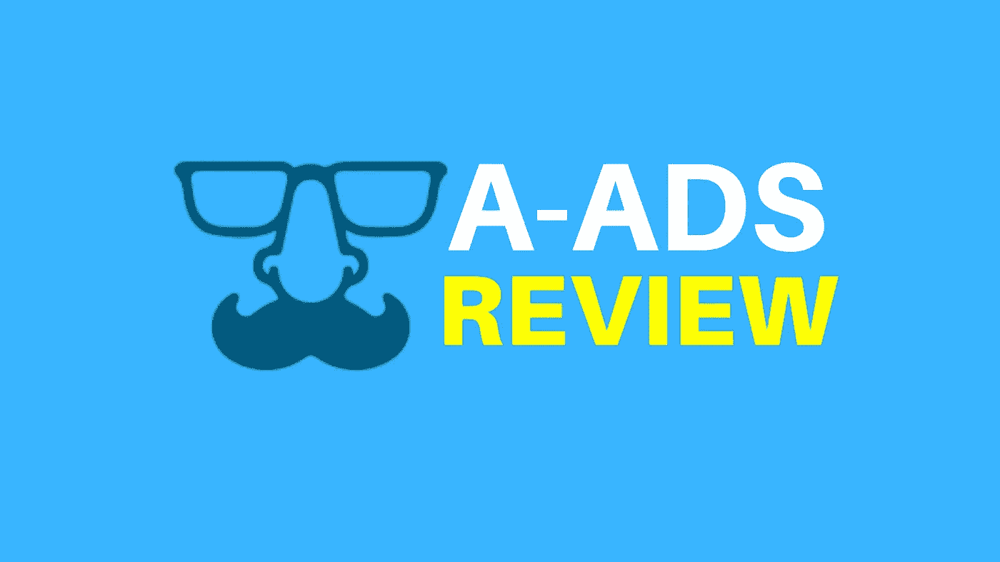
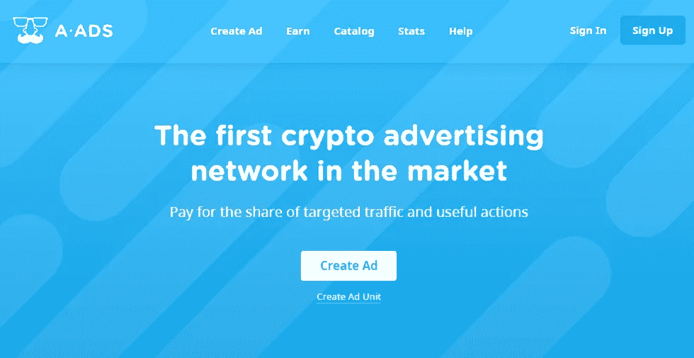

# 2022 年美国存托凭证是你收入的 10 倍

> 原文：<https://medium.com/coinmonks/a-ads-10x-your-earnings-in-2022-9ba7cefd42a1?source=collection_archive---------14----------------------->

## 比特币广告网络

# A-ADS 比特币广告网

A-ADS 广告:这将解释 A-ADS 比特币广告网络如何帮助广告商在加密流量上推广他们的产品。A-ADS(以前的匿名广告)是互联网上最古老的比特币广告网络之一。这是自 2011 年以来运营的第一个加密货币广告网络，为其广告商提供高质量的加密流量。他们接受来自世界各地的出版商，并不对想要加入其广告网络的出版商提出任何严格的要求。A-ADS 的主要支付模式是每日预算(即每日费用或 CPD)。这意味着他们的系统不是基于固定的 CPM，这使他们区别于其他广告网络。你也可以在 CPM 和 CPA 投标上工作。

A-ADS.com 是广告网络 Coinzilla 和 Cointraffic 的绝佳替代品。在这篇文章中，我将回顾 A-ADS 网络的主要优点和缺点，这样你就能明白为什么它是一个好的选择。这是发展最快的加密广告网络之一。根据他们的统计，他们每天收到超过 7000 万次展示和 6 万次点击。这里有一个给广告商和出版商的分步指南，告诉他们如何加入 A-ADS 网络并从中获利。

该网络声称不存储任何出版商或广告商的个人信息，这就是为什么它被称为匿名广告网络。

[加入 A-ADS 网络！](https://a-ads.com/?partner=1945956)

以下是关于 A-ADS 网络的事实，以及 2020 年和 2021 年的详细回顾。
CPD(每日费用)、CPM bids 和 CPC 是可用的支付方案。
广告形式:横幅广告。
已接受广告:禁止枪支、毒品或 CP。
全天候提供实时支持。
是的，可以进行实时聊天。
接受的网站:任何类型的网站。
全球流量。
顶级 geo 包括美国、巴西、印度、俄罗斯、印度尼西亚、越南、泰国和中国。
推荐奖金:联盟广告客户预算的 10%(或 A-ADS 费用的 12%)；支付方式:比特币。
付款频率:每日，自动。
最低发行商支付:1 Satoshi 到 Faucethub.io 或 0.001 比特币直接到比特币地址；
广告主最低保证金不限；
开始广告活动所需的最低金额没有限制。
接受的支付方式包括比特币、Ripple、Qtum、Tether、NEO、比特币黄金、以太坊经典、Tron、Verge、BitTorrent、GameCredits、DigiByte、Komodo、Zcoin、Ravencoin、比特币现金、Dash、Dogecoin、以太坊、Litecoin、Zcash、BitcoinDiamond、Horizen、PIVX、Stratis 和 Vertcoin。

[加入 A-ADS 网络！](https://a-ads.com/?partner=1945956)

A-Ads.com 允许其出版商通过展示广告和赚取比特币来赚钱。他们拥有来自世界各地的广告商，这些广告商一直在寻找新的广告网站。如果你的网站获得了一定的有机流量，你可以通过这个神奇的广告网络来赚钱。广告商可以在 A-ADS 目录的数千个网站上推广他们的产品。他们通常按日预算付费，这意味着他们每天支付一定的金额，并获得一定比例的定向流量。CPM 投标可用于那些喜欢固定的 CPM。还有 CPA，所以 A-ADS 的广告主可以在他们的发布商的网站上做广告，只有拿到结果才付费。
A-ADS 仅提供横幅广告。这包括没有弹出，视频预卷，或俯卧撑。A-ADS 团队认为，广告不应该让互联网用户感到厌烦，他们倡导道德广告，让互联网成为一个更好的地方。
与 A-ADS 合作让人放心，因为他们不会欺骗或窥探。自 2011 年以来，他们一直保持着完美的商业信誉。出版商总是按时得到报酬。如果有任何技术问题是他们的错，他们几乎肯定会退款。
我说他们不监视是因为他们不会向用户询问任何个人信息。这意味着如果你愿意，你可以完全匿名地与他们合作，甚至不需要提供电子邮件地址！如果你创建匿名活动或广告单元，你将不必处理繁琐的验证或长问卷。
此外，A-ADS 并不跟踪发布网站的访问者。他们需要知道的唯一信息是他们的 IP 地址。

[加入 A-ADS 网络！](https://a-ads.com/?partner=1945956)

A-ADS 通过改善他们的业务和增加他们的销售来帮助广告商。您可以创建一个广告活动，它会将您的广告发送给适当的受众。如果您遇到任何问题，只需联系他们的帮助台，他们会一步一步地指导您完成整个过程，以达到最佳效果。也可以点播 Skype 聊天。A-ADS 为你提供了大量加密货币流量。这意味着你的提议将会被数以百万计的秘密访客看到。你可以使用地理定位来获取世界上任何地方的流量。你可以按类别选择网站，或者从出版商目录中选择任何一组网站，只在那里做广告。
营销活动可在 3 至 5 分钟内启动。这个过程非常快速和简单。如果您有任何问题，只需联系他们的帮助台，您将立即获得帮助。如果您提出要求，他们可以为您创建和管理您的活动。
可以用比特币、Ripple、Qtum、Tether、NEO、比特币黄金、以太坊经典、Tron、Verge、BitTorrent、GameCredits、DigiByte、Komodo、Zcoin、Ravencoin、比特币现金、Dash、Dogecoin、以太坊、Litecoin、Zcash、bitcoindial、Horizen、PIVX、Stratis、Vertcoin 支付。
另一个奇妙的功能是你的广告活动的估算数字:在你调整你的广告活动后，你将会有一个更精确的印象和点击量的预测。

[加入广告联盟！](https://a-ads.com/?partner=1945956)

# 广告商优势:

以下是 A-Ads 为其广告客户提供的一些优势。活动创建非常快速和简单。
2。所有活动都比其他广告网络更快获得批准。
3。流量通常比其他网络便宜。
4。来自数千个网站的大量流量；
5。拥有 100%加密用户的各种加密网站；
6。全球流量排名前几位的地区包括:巴西、美国、印度、俄罗斯、印度尼西亚、中国、泰国和欧洲。
7。地理定位是一种选择。
8。您可以选择任何您想要的发布网站，例如，按类别，或者 9 您可以选择您需要的特定网站。
9。您可以为您的活动设置最大 CPM，并排除过于昂贵的流量。
10。你可以一周七天、一天 24 小时从他们的服务台获得帮助。还可以使用 Skype 和 Telegram 聊天。

A-ADS 是最古老的加密广告网络之一，它因是网站赚钱的有效方式而闻名。即使你是一个小出版商，他们也会为你提供奇妙的货币化选择，从你的网站上赚取比特币。它也是小出版商最有效的广告网络之一。以下是这个网络的一些奇妙特征以及你应该加入它的理由。被证明的公平
2。付款准时
3。匿名
4。小型出版商的理想选择；
5。站点加入网络不需要批准。
6。创建广告单元的过程非常简单快捷。
7。非侵入性广告，静态横幅，不太可能激怒你的网站访问者；
8。重量轻的横幅(没有 js 的普通 iframes)
9。先进的仪表板，实时跟踪您的印象，点击和收入。

[成为 A-ADS 网络！合作伙伴](https://a-ads.com/?partner=1945956)

# A-ADS 货币化方法:

A.Ads 提供四种不同类型的广告选项和优惠。
CPD 代表每日成本。
CPM 投标是每英里有固定成本的股份。
CPA 代表每次行动的成本。
分支机构计划。

A-ADS 有一个联盟计划，允许你邀请新的广告客户，并获得 A-ADS 活动费用的一部分(通常为活动支出的 10%)。这是一个通过邀请其他广告商加入 A-ADS 广告网络来赚取额外收入的好方法。联盟计划是通过推荐他人赚取额外收入的最佳方式。您也可以通过邀请他人加入 Payoneer 联盟计划、Leadpages 联盟计划和许多其他最佳联盟计划来赚钱。

*原载于*[*https://www.metaverse-india.com*](https://www.metaverse-india.com/Home/Blog/15-a-ads-10x-your-earnings-in-2022)*。*

> 加入 Coinmonks [电报频道](https://t.me/coincodecap)和 [Youtube 频道](https://www.youtube.com/c/coinmonks/videos)了解加密交易和投资

# 另外，阅读

*   [八大加密附属计划](https://coincodecap.com/crypto-affiliate-programs) | [eToro vs 比特币基地](https://coincodecap.com/etoro-vs-coinbase)
*   [最佳以太坊钱包](https://coincodecap.com/best-ethereum-wallets) | [电报上的加密货币机器人](https://coincodecap.com/telegram-crypto-bots)
*   [交易杠杆代币的最佳交易所](https://coincodecap.com/leveraged-token-exchanges) | [购买弗洛基](https://coincodecap.com/buy-floki-inu-token)
*   [3 commas vs Pionex vs Cryptohopper](https://coincodecap.com/3commas-vs-pionex-vs-cryptohopper)|[Bingbon Review](https://coincodecap.com/bingbon-review)
*   [加密复制交易平台](/coinmonks/top-10-crypto-copy-trading-platforms-for-beginners-d0c37c7d698c) | [如何在 WazirX 上购买比特币](/coinmonks/buy-bitcoin-on-wazirx-2d12b7989af1)