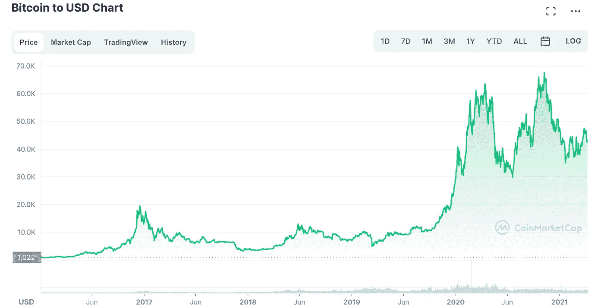

# 初学者的加密常见问题

> 原文：<https://medium.com/coinmonks/a-beginners-crypto-faq-c36a51ae6d62?source=collection_archive---------12----------------------->

“秘密”空间是不受控制的，但最近争议一直在升温。而且理由很充分。从[武断地将 crypto 称为 Web3](/api3/why-web3-what-is-it-good-for-6ed1c4036220) 到[采用比特币的国家](https://www.npr.org/2022/03/27/1086851329/el-salvadors-leader-wants-to-go-in-even-bigger-on-bitcoin)到 [NFT 精神错乱](https://theweek.com/culture/arts/1008539/the-nft-craze-has-stopped-being-funny)到 [nocoiners &怀疑论者](https://www.vice.com/en/article/epxky7/what-is-nocoiner-c)到[黑客和骗局](https://techcrunch.com/2022/04/04/q1-crypto-losses-spike-695-on-year-following-massive-hacks/)，初学者几乎不可能理解，更不用说相信他们读到的任何关于 crypto 的东西。

Bitcoin price in US Dollars — Jan 2017 to April 2022

当你被关于加密的截然相反的主张轰炸的时候，这里是我穿过 BS 和提供一个实际的基础的微弱的尝试。

[什么是货币？](#acf9)
[什么是加密货币？](#acd8)
[什么是加密令牌？](#f782)
[什么是不可替代令牌(NFT)？](#c4f8)
[什么是智能合约？](#dfbd)
[web 3 是什么？](#943c)
[什么是加密钱包？](#fffb)
[什么是密码交换机？](#41d0)
[该不该投资 Crypto？](#5363)
[加密令牌可以直接复制粘贴吗？加密令牌有什么“真实”的东西做后盾吗？](#52da)
[加密令牌只是“人为”的稀缺吗？Crypto 会保护我的交易隐私吗？](#8e2a)
[Crypto 是一个即将破灭的泡沫吗？](#6deb)
[区块链使用了多少力量？如果停电了，我的密码会丢失吗？](#660f)
[为什么有这么多 Crypto Hacks？](#2f24)
[为什么 Crypto 里有那么多骗局？](#e167)
[Crypto 有什么好东西吗？](#a706)

## 什么是货币？

*货币是商品和服务的交换媒介。简而言之，它是货币，以纸币或硬币的形式，通常由政府发行，并被普遍接受为一种支付方式。货币是现代世界的主要交换媒介，早已取代物物交换成为商品和服务交易的手段。【*[*Investopedia*](https://www.investopedia.com/terms/c/currency.asp)*】*

这似乎是显而易见的，但在定义[加密货币](#acd8)之前有必要说明一下。

## 什么是加密货币？

加密货币是一种数字货币或虚拟货币，通过加密技术进行保护，因此几乎不可能被伪造或重复消费。许多加密货币都是基于区块链技术的分散式网络——由不同的计算机网络执行的分布式账本。【[*Investopedia*](https://www.investopedia.com/terms/c/cryptocurrency.asp)*】*

Investopedia 对“加密货币”的定义很好地描述了人们通常如何使用该术语，但却导致了很多混乱！它说“许多加密货币”，这意味着许多加密货币存在。

**但是符合一种货币** **的** [**定义的加密货币并不是“很多”。事实上很少。**](#acf9)

您知道有多少种“加密货币”是按面值被普遍接受的商品和服务支付方式？这很主观，但我认为比特币(BTC)、以太坊(ETH)和一些稳定的货币(USDC、USDT 等)都是可行的。即使是这些也是有限的，因为它们被商品和服务所接受。

例如，比特币作为一种支付方式早已确立。你可以在 [SpendMeNot](https://spendmenot.com/blog/who-accepts-bitcoin/) 、 [ICOHolder](https://icoholder.com/blog/places-accept-bitcoin/) 、[99 比特币](https://99bitcoins.com/bitcoin/who-accepts/)、 [Cointelegraph](https://cointelegraph.com/bitcoin-for-beginners/what-can-you-buy-with-bitcoin-a-beginners-guide-to-spending-your-btc) 和[更多网站](https://search.brave.com/search?q=where+to+spend+bitcoin)上找到接受比特币的商家名单。在比特币是法定货币的萨尔瓦多，我轻松地用比特币购买了食物、饮料、礼物和其他商品。我甚至用手机给 Chivo 的 ATM 机发送比特币，从里面取出了现金(美元)。很难说比特币没有被普遍接受为一种支付方式。

当人们谈论投资加密货币时，他们通常根本不是在谈论 [**货币**](#acf9) **。他们只是在说** [**令牌**](#f782) **。**

这是一个重要的区别，因为作为一种普遍接受的支付方式意味着代币作为一种货币有可持续的需求。仅仅被用作交换媒介本身就是一种有价值的服务。

## 什么是加密令牌？

*加密令牌(crypto token)一词是指一种特殊的虚拟货币令牌或加密货币的命名方式。这些代币代表驻留在它们自己的区块链上的可替换和可交易的资产或公用事业。【*[*Investopedia*](https://www.investopedia.com/terms/c/crypto-token.asp)*】*

就像上面的[加密货币](#acd8)定义一样，这个“代币”的定义是混乱的来源，在我看来部分是错误的。如果我们坚持货币的定义，那么大多数加密代币都不是货币。如果代币不是货币，我们就不应该称它为“特殊虚拟货币”！

**加密令牌是用** [**公钥加密**](https://www.twilio.com/blog/what-is-public-key-cryptography) **实现的任何可交易资产。在今天的上下文中，我们通常可以假设令牌是可替换的，并且在区块链上。**

术语“加密令牌”比术语“加密货币”更宽泛。加密货币是代币。加密令牌的外观和行为类似于加密货币，但如果它们不是一个规模庞大、多样化的生态系统中普遍接受的支付方法(例如比特币)，那么它们就不是一种货币。

加密令牌可能只对特定用途有用，例如对有价值的应用程序必不可少，或者授予管理项目的权限。这些被称为[实用令牌](https://www.fool.com/investing/2021/11/16/utility-tokens-vs-security-tokens-whats-the-differ/)。加密令牌(有数千个)比加密货币(很少)多得多。任何人都可以创建新的加密令牌。

这是一个重要的区别，因为代币的价值是由其有用性(需求)和稀缺性(供给)决定的。如果它不具备作为货币或公用代币的价值，那么它可能就没有任何价值。一些非货币代币具有合法用途和足够有限的供应量，因此具有价值。其他的可能是我们所谓的庞氏骗局。

## 什么是不可替换令牌(NFT)？

*不可替代令牌(NFT)是区块链上的加密资产，具有相互区分的唯一识别码和元数据。与加密货币不同，它们不能等价交易或交换。这与加密货币等可替代代币不同，加密货币彼此相同，因此可以作为商业交易的媒介。【***】**

*NFT 是一种代表独特事物的令牌，与常规的[加密令牌](#f782)相反，后者是[可替换的](https://www.investopedia.com/terms/f/fungibility.asp)。“可替换的”只是一种有趣的说法，即令牌的所有实例都被认为是相同的或可互换的，就像商品一样。NFT 的不可互换。NFT 的更像是绘画、棒球卡、音乐会门票或房地产。*

***NFT 是证明你拥有某物的有效的数字契约。它们可以像传统的契约或所有权证书一样买卖。***

*NFT 是某物所有权的证明，而不是该物本身。虽然如今 NFT 通常被用来证明数字艺术的所有权，但 NFT 并不是艺术本身。这是所有权证书，证明你拥有这件艺术品。*

*普通的 NFT 只有一个主人。一个“[分数 NFT](/@arbenk/fractionalized-nft-f-nfts-all-that-you-need-to-know-46bc06ea486d) ”可以有多个所有者。*

## *什么是智能合同？*

*智能合同是一种自动执行的合同，买卖双方之间的协议条款被直接写入代码行。守则和其中包含的协议存在于一个分散的区块链网络中。代码控制执行，事务是可跟踪和不可逆的。智能合同允许在不同的匿名方之间执行可信的交易和协议，而不需要中央权威机构、法律系统或外部执行机制。【[*Investopedia*](https://www.investopedia.com/terms/s/smart-contracts.asp)*】**

*Investopedia 的定义相当不错，但智能合约不仅限于买卖双方之间的协议。更一般地说，它们是多方之间的协议，导致价值交换，通常是代币。智能合同可以立即执行完成，也可以存储价值(以代币的形式)并在未来某个时间点完成执行，例如托管合同。*

*大多数智能合约在[以太坊](https://ethereum.org/)上运行，但也有许多[兼容以太坊的区块链](https://chainlist.org/)可以运行 [EVM](https://ethereum.org/en/developers/docs/evm/) 智能合约，以及不兼容以太坊的智能合约平台，如 [Solana](https://solana.com/) 、 [Cardano](https://cardano.org/) 和 [Polkadot](https://polkadot.network/) 。你甚至可以用 [RSK](https://www.rsk.co/) 在比特币上运行以太坊智能合约。*

## *什么是 Web3？*

*Web3 是我们都知道并喜爱的网络，它增加了基于区块链技术的智能合约。你的钱包就是你的身份。使用它不需要任何人的许可(比如谷歌、亚马逊或 Twitter)。智能合约为您提供了一种直接通过互联网与他人进行交易和交换价值的方式，而不需要可信的中介(如银行、经纪人或政府)。[此处阅读更多](/api3/why-web3-what-is-it-good-for-6ed1c4036220#cd73)。*

*Web3 这个术语容易引起误解。许多人认为 Web3 中的“3”是一个产品版本，意味着它彻底取代了 Web2，使 Web2 过时，就像下一代 iPhone 对以前的型号一样。事实上，它更像是网络的下一个大层。Web3 建立在 Web2 之上，就像 Web2 建立在原始 Web(万维网)之上一样。我们今天仍然使用最初的网络。Web3 不会取代 Web2。Web3 通过在 Web2 的基础上添加智能合约来扩充 web 2。【**】***

**“Web3”和“crypto”经常互换使用。这两个术语都没有官方定义，但“Web3”往往更多地用于指使用[智能合约](#dfbd)构建的应用程序互联网，而“crypto”往往更多地用于指购买、销售和交易[加密令牌](#f782)。**

## **什么是加密钱包？**

***加密钱包可以让你的私钥——让你访问加密货币的密码——保持安全和可访问，允许你发送和接收比特币和以太坊等加密货币。【* [*比特币基地*](https://www.coinbase.com/learn/crypto-basics/what-is-a-crypto-wallet)*】***

**术语“加密钱包”是令人困惑的，因为它使你想到一个真正的钱包，你把钱放在里面。另一方面，一个加密钱包是你在网上的身份证明。它更像是你的谷歌登录或推特账号，而不是一个真正的钱包。**

**Crypto/Web3 钱包使用基于[公钥加密](https://www.twilio.com/blog/what-is-public-key-cryptography)的数字签名来证明你的身份。您的私钥安全地存储在您的钱包中，就像您的密码一样。你必须保护它。**

****永远不要分享你的私钥(你的** [**种子短语**](https://www.coinbase.com/learn/crypto-basics/what-is-a-seed-phrase) **)。没有诚实的人会问你要种子短语。****

**您的公钥用于创建您的加密“地址”，这是您的身份，即您在区块链上的姓名。该地址类似于电子邮件地址、用户名或银行账号。你和其他人分享，这样他们就可以给你发东西了。**

**钱包分为“保管型”和“非保管型”，这取决于谁持有私钥。如果你的钱包完全由你控制和托管，就像 [MetaMask](https://metamask.io/) 、 [Trezor](https://trezor.io/) 或 [Ledger](https://www.ledger.com/) 一样，那么它就是一个非托管钱包。如果你的钱包在交易所，比如比特币基地交易所或者北海巨妖交易所，那么他们会保管你的私人钥匙，所以这是一个保管钱包。**

**如果你使用保管钱包，这意味着你信任一个中介(交易所)来保管你的资产，你必须确保你真的信任他们。你可能不会把所有的钱都存到世界另一端的一家银行，这家银行对你或你的政府不负责任，所以你可能也不想把所有的加密资产都存到这样的交易所。**

**如果你使用保管钱包，crypto 和 Web3 的许多好处就失去了。将您的加密资产存储在非保管钱包中被认为是更好的做法。但是您必须确保您的私钥得到了安全的备份。通常这意味着将它写在纸上，并将纸存放在一个安全的地方。**

## **什么是加密交换？**

***加密交易所是一个买卖加密货币的平台。一些加密交易所提供各种产品和服务，而其他交易所纯粹是为了买卖数字资产而存在的。在决定使用哪种交易所时，您应该考虑您个人的财务目标和风险承受能力。【* [*双子座*](https://www.gemini.com/cryptopedia/what-is-a-crypto-exchange)*】***

**交易所是你交易加密资产的地方。一些交易所还允许你用传统货币如美元来交换加密资产。**

**交易所要么是“集中的”(CEX)，要么是“分散的”(DEX)，这取决于它们存在的地点。分散式交易所实际上是存在于区块链的智能合约。集中式交易所是传统的科技公司，你可以将你的加密资产发送到这些公司，并在区块链进行交易。当你将资产发送到 CEX 时，它们进入那个交易所的保管钱包，而 dex 允许你直接从你的非保管钱包中交换资产。**

## **我应该投资加密吗？**

**恶作剧问题。你不只是投资加密。加密是一种数字资产类别，有多种多样的代币可供购买。新的代币不断涌现。当你购买代币时，你购买的是特定的代币，而不是一般的“密码”。可能会有加密指数基金，但它们也有缺点，而且不是人们通常会购买的。**

**购买在多个市场被确立为货币的比特币，与购买由你最喜欢的名人或 YouTuber 推广的鲜为人知的代币，有着巨大的区别。这类似于购买苹果股票和在另一个国家的某个车库里为一家初创公司做天使投资人的区别。**

****初创公司有可能获得更大的收益，但也有更大的可能失去你投资的一切。****

**引入了额外的风险，因为你可能不知道代币背后的人是谁，或者他们是否在善意地行事。至少当你在自己的城市投资一家车库创业公司时，你知道他们住在哪里。对于大多数加密令牌，如果事实证明它们是不道德的，你根本没有追索权。他们中有太多的人实际上是不道德的！这是一个不受监管的全球市场。它吸引了很多骗子。**

****如果你不愿意也没有能力保护自己，那么你很可能会输。如果你不确定，那么你可能无法做到。****

***【这不是投资建议】*
但如果你打算购买 crypto 作为投资，那么你应该像对待其他投资一样谨慎。比特币(BTC)、以太坊(Ethereum)和其他几十种大市值代币自问世以来表现出色，但这并不意味着其他代币也会如此。更有可能的是，大多数较小的代币将无法存活。**

**是的，你可以购买加密令牌作为投资。但是如果你要去做，明智地去做。知道你要买什么。仔细并批判性地阅读该项目的白皮书。理解代币的效用以及为什么会有持续的需求。了解其 [tokenomics](/coinmonks/all-you-need-to-know-about-tokenomics-39642fe11d02) 。寻找声誉良好的审计公司对智能合同代码的审计。观察团队在公共场合的操作。然后决定你是否认为这是一项好的投资，记住即使你做了所有的尽职调查，它仍然可能失败，因为创业公司经常失败。**

**不要因为名人或社交媒体影响者告诉你就购买加密令牌。他们是为了自己的利益而行动。不要因为害怕错过下一个比特币或以太坊，而去购买自己不了解的加密代币。如果你不理解他们，那么你就没有理由相信他们会成功。永远不要忘记，一个你不理解的令牌可能没有什么真正的价值，它可能是一个骗局。
*[/这不是投资建议】***

## **加密令牌可以复制和粘贴吗？**

**不，不会以任何方式影响他们的价值。对[加密令牌](#f782)的一个误导/不知情的批评是，它们可以像其他数字数据一样通过复制和粘贴来复制。实际上，只有令牌持有者可以证明令牌的所有权，因为只有他们拥有对其进行数字签名所必需的私钥。**

**创建一种新的令牌很容易，它是一种完全独立的资产。但当一家新公司在纳斯达克上市时，它不会稀释苹果的价值。莱特币是比特币的修改版(称为“叉子”)，Dogecoin 是莱特币的叉子。这两种“复制品”都不会稀释比特币的价值，就像另一个国家的新货币不会稀释美元的价值一样。**

**以太坊通过在以太坊上的智能合约中管理它们，而不是必须创建一个全新的区块链，从而使创建新型代币的过程变得更加容易。但比特币的有限供应(稀缺性)和持续需求(作为一种支付方式被市场接受)使得它更有价值，而那些复制品价值更低(或者对一些人来说，根本没有价值)。**

**[NFT](#c4f8)就像数字契约。迄今为止，证明数字艺术的所有权是他们最大的用例。复制/粘贴或截图数字艺术很容易，但这与 NFT 无关。NFT 是艺术品所有权的证明，由创作者授予。艺术(图像文件)可以复制，但 NFT 不能复制或未经所有者同意转让。NFT 并不强制执行版权，但它们可以在版权诉讼中用来证明所有权。**

**NFT 艺术热潮与版权和阻止人们复制无关。这是地位问题。NFT 在数字上相当于拥有一幅画的原件。重印品可能看起来和原作一模一样，但它们的价值不同。我可以用我的 iPhone 拍摄一幅原画的高分辨率照片，并免费欣赏它的美丽，但我没有从原主那里拿走任何东西。NFT 是一种安全的机制，用你的[数字签名](https://www.twilio.com/blog/what-is-public-key-cryptography)来证明某物的所有权。它们不是事物本身。它们只是数字契约。**

**你可能不同意数字艺术 NFT 或加密令牌的实际价值。你可以辩称，由于炒作，它们目前被高估了。但是说它们可以被复制和粘贴是无稽之谈。**

**当有人告诉你加密令牌只能复制和粘贴时，请他们复制并粘贴一个比特币、以太币或 NFT 币，然后在交易所出售。如果他们不能，那么你有你的答案。**

## **加密令牌有什么“真实”的东西支持它们吗？**

**这完全取决于哪个令牌。比特币，一种[加密货币](#acd8)(它符合[货币](#acf9)的定义)，之所以有价值，是因为它已经被充分采纳为一种支付方式和一种非通货膨胀的价值储存手段。实用令牌之所以有价值，是因为它们对于推动对它们的需求的有价值的协议或服务是必不可少的。[NFT](#c4f8)之所以有价值，是因为它们证明了收藏品的所有权或者授予了做某事的权利。不幸的是，一些代币没有可持续的价值，是一个庞氏骗局。**

**密码批评者认为，代币背后没有任何“真实”的东西，因为它们是虚拟的，因此它们是假的或骗局。但是你不能对加密令牌进行一般性的讨论。这取决于令牌。如果代币作为一种货币被广泛使用，那么它的背后必然有真实的东西——它作为交换媒介的价值。如果令牌对于创收协议或服务是必不可少的，那么它就受到协议或服务的支持，就像公司支持股票的价值一样。如果代币代表一幅画的所有权，那么它是由创作这幅画的艺术家的声誉来支持的。**

**背后没有任何真实内容的代币是由不道德的人创造的，并被宣传为骗局。但这并没有说合法的代币有真实世界的用途和足够有限的供应。**

## **加密令牌只是“人为”的稀缺吗？**

**是的，但是有一个警告。通常，当我们想到[人为稀缺](https://en.wikipedia.org/wiki/Artificial_scarcity)时，它是由公司或政府强制实施的。加密令牌制造了人为的稀缺性，这种稀缺性是由去中心化的区块链网络自动实施的。当一家公司或政府人为制造稀缺时，他们可以单方面增加供应。比特币等区块链旨在让任何人单方面增加供给变得极其困难，实际上是不可能的。供应受到协议的限制。**

**不管稀缺性是不是人为的，都是有效可靠的。令牌的供应由其[令牌组学](/coinmonks/all-you-need-to-know-about-tokenomics-39642fe11d02)定义。对于比特币来说，改变新硬币的创造速度需要分散的比特币网络中的很大一部分达成共识并采取行动。正如年复一年商品价格上涨时我们被提醒的那样，美联储增加美元供应要容易得多。**

**当批评加密令牌“人为稀缺”时，请记住，我们每天使用的许多产品也是在人为稀缺的基础上出售的。例如软件和娱乐(版权)、制药和技术(专利)、新闻和评论(付费墙)、珠宝和服装(奢侈品)以及美元(法定货币)。虚拟或基于信息的资产通常是在人为稀缺的基础上出售的。这不是一个新的或邪恶的概念。**

**相反，加密令牌的人为稀缺性是基于硬数学，并由一个分散的网络来实施，因此它比公司和政府创造的人为稀缺性要可靠得多，这些公司和政府可以为了自己的利益单方面增加供应。**

**不过要小心。一些加密令牌被设计成一个人或一个小团体*可以根据需要*单方面增加供应，不像比特币和以太。对于那些代币，你受到那些有能力铸造代币的人的支配。他们就像令牌的美联储。在作为投资购买代币之前，了解代币的代币经济学是很重要的。**

## **Crypto 会保护我的交易隐私吗？**

**不会，至少在比特币和以太坊等非常受欢迎的区块链上不会。这是我听到的关于加密的最大误解之一。事实上，整个区块链都是公开的，任何人都可以阅读。你得到了[的假名](https://www.gemini.com/cryptopedia/anonymity-vs-pseudonymity-basic-differences)但没有隐私。有一些面向隐私的加密代币，如 Monero 和 Zcash，但就采用程度而言，它们远不及比特币和以太坊。**

****人们通常认为所有的东西都是加密的和保密的，因为其中涉及到加密技术。不对。一点也不。****

**crypto 中的密码学是指数字签名而不是加密。数字签名是[公钥加密](https://www.twilio.com/blog/what-is-public-key-cryptography)中加密的逆过程。你的私钥用来证明你签署了一个交易不是为了解密一些加密的数据。**

**如果你想在主要的区块链上私下交易，你必须使用额外的隐私解决方案，如 [Tornado Cash](https://tornado.cash/) 或 [zk.money](https://zk.money/) 。否则一切都是公开的，除了一层薄薄的假名。**

## **加密是一个即将破灭的泡沫吗？**

**这取决于你所说的“爆发”是什么意思，但如果出现调整，我不会感到意外。我不知道有多大，但很难相信任何像 crypto 这样发展如此之快的东西不会被夸大。当突然之间，超级碗全是关于加密的，每个名人都在推广一个令牌或发布他们自己的 NFT，我怀疑可能有修正的空间。但这并不意味着它会消失。这甚至不一定意味着它会受到重创。它只能纠正一点点。或者我可能是错的，它只是继续暴涨。谁知道呢？但我希望不时会有修正。**

**区块链、crypto、Web3、DeFi 等都有内在的价值，它不会消失，不管有多少 crypto 犬儒主义者希望看到这种情况发生。正如任何重大突破性技术推动整个行业一样，也会有繁荣和萧条。互联网上也有。重要的是保持头脑清醒，运用常识。批判性地思考任何人告诉你的事情。尤其是当它涉及到与你的血汗钱离别！没有简单的快速致富方案，至少没有不冒重大风险的方案。如果听起来好得难以置信，那么它很可能是真的。运用良好的判断力和常识。**

## **区块链用了多少电？**

**有不同种类的区块链。对他们进行分类的一种方式是通过他们的“T4 共识机制”。最常见的两种称为“工作证明”(PoW)和“利益证明”(PoS)。**

**工作证明区块链消耗大量能源，这是有意的。他们做的工作越多，他们的安全感就越强。比特币和以太坊(目前)都是权力区块链。比特币消耗的能量大约相当于一个中小国家，以太坊消耗的能量大约是它的一半。以太坊正在将自己转变为 PoS 区块链，其消耗的能源只有现在的一小部分。**

**大量的文章都有详细的介绍。例如:**

**[比特币实际消耗多少能量？](https://hbr.org/2021/05/how-much-energy-does-bitcoin-actually-consume)
[为什么比特币需要的能量比整个国家都多？](https://www.dw.com/en/why-does-bitcoin-need-more-energy-than-whole-countries/a-56573390)
[比特币使用多少能量？](https://www.coindesk.com/business/2021/08/18/how-much-energy-does-bitcoin-use/)
[以太坊能量消耗](https://ethereum.org/en/energy-consumption/)**

**所以比特币消耗了相当多的能量。是否值得花那么多精力取决于你的优先事项和价值观。与它希望取代的传统全球银行系统相比，它消耗的能源要少得多，但它提供的服务并不完全相同。它比一些国家消耗更多的能源，但是使用它的人比那些国家的人还多。**

**以太坊也使用大量能源，但正在过渡到 PoS 作为解决方案。**

## **如果停电，我的密码会丢失吗？**

**不，如果停电了，你不会丢失你的加密令牌。您确实会失去进行交易的能力，直到电力恢复并且您重新上线。银行账户和信用卡也是如此。**

**如果全球停电，那么区块链网络将停止运行，在网络重启之前，没有人能够进行交易。**

**即使在长时间的全球互联网中断中，谁拥有什么的完整记录将在世界各地具有持久存储(硬盘)的所有区块链(完整)节点上保持完整。如果网络从未重启，那么社区仍然可以使用现有记录作为新系统的起点。**

## **为什么有这么多的密码破解？**

**crypto 中的黑客攻击发生的原因与任何 IT 领域中发生的原因相同，但 crypto 的某些方面使其成为黑客特别感兴趣的目标。Crypto 是一个年轻的、不受监管的领域，它关系到大量的金钱，并且用户体验不是很好。我会详细说明。**

**Crypto 年轻不成熟。人们对它是否还处于“早期”有不同的看法(在我看来是这样)，但很明显，今天加密并不像一个成熟的行业那样运作。它就是[狂野西部](https://idioms.thefreedictionary.com/the+Wild+West)。不管你是否相信它最终会成熟，重要的是要知道你现在要做什么。**

**加密大多不受监管。大多数区块链并不居住在任何特定的司法管辖区，因此对他们进行监管具有挑战性。它们被设计成无权限、无信任、不可改变的，因此它们可以抵抗被中央当局控制，比如暴虐的政府。加密技术也往往比政府发展得更快，因此监管的努力通常落后于形势。**

**crypto 的用户体验很差。在某些情况下非常糟糕。为了在不依赖中央权威机构的情况下实现安全的目标，用户体验被牺牲了，与我们在传统网络上所习惯的体验相去甚远。希望这将尽快得到改善。**

**这关系到一大笔钱。根据[时间](https://time.com/6115300/cryptocurrency-value-3-trillion/)，2021 年底整体市值达到 3 万亿美元。据 [Defi Llama](https://defillama.com/) 报道，在 Defi 协议中有几十亿美元[总价值被锁定(TVL)](https://www.coindesk.com/learn/why-tvl-matters-in-defi-total-value-locked-explained/) 。有这么多钱处于危险之中，这对黑客来说是一个巨大的诱惑。**

**所有这些因素结合在一起，为犯罪分子创造了一个非常诱人的攻击目标。由于不成熟和不受监管，加密空间也是一个诱人的地方，让经验不丰富的开发人员构建新的应用程序并推广它，而不采取适当的步骤负责任地设计和保护它。即使本意是好的，如果一个产品由于粗心而被利用，并且花费了用户的钱，大多数人都会认为这是一件坏事。**

**为了避免成为西部荒野的受害者，你必须保护自己。不要使用你不了解的应用程序或 DeFi 协议。这些应用程序的可信度取决于它们的源代码是否可用并经过同行评审。很少有人真正有能力自己审查代码。假设你不是他们中的一员，坚持使用那些你确信已经被那些有能力的人很好的评价过的应用程序。寻找声誉好的审计公司进行审计。寻找一个长期使用该应用程序而没有受到损害的活跃用户社区。**

**注意 Web3 上正在发生的黑客攻击和漏洞利用，这样你就知道要注意什么了。我最喜欢的资源之一是 [Web3 正在变得很好](https://web3isgoinggreat.com/)，它是彻底的，维护得很好，如果你能越过自鸣得意的傲慢和讽刺，看到有用的信息。**

**教育是对抗这种邪恶的最好防御。**

**或者选择完全不参与，这是一个完全可以接受的选择。秘密空间中的诚实的人，有很多，也不希望你成为受害者。**

## **为什么 Crypto 里有那么多骗局？**

**首先阅读"[为什么有这么多大的加密黑客？](#2f24)“因为原因都一样。我喜欢稍微区分一下骗子和黑客，因为，出于我难以说清楚的原因，我对骗子的厌恶更甚于黑客。但是两者都是犯罪行为，结果都是一样的——人们受到伤害。**

**如果你钻研加密技术，你会和骗子打交道。它们无处不在，就像第 11 次瘟疫。如果你在一个受欢迎的加密电报群中发布一个问题，你将很快被一个骗子直接发送消息(DMed ),他会试图将你发送到一个钓鱼网站，窃取你钱包中的所有东西。**合法的团队成员不会 DM 你。**你的社交媒体上充斥着“影响者”,他们会(直接或间接)花钱推销下一个快速致富的标志。你将成为被欺骗的代币，实际上是[庞氏骗局](https://www.somethinginteresting.news/p/thats-not-a-real-ponzi-its-just-a?s=r)。**

**别搞错了。在加密领域有很多糟糕的事情。如果你进入这个空间，你就会暴露在它面前。如果这不是你愿意处理的事情，那就不要进入。你必须自学。你必须保护自己。你将不得不培养一种蜘蛛的感觉，就像你在荒野中徒步旅行或者参观一个高犯罪率的城市一样。**

**这个问题的解决方法是什么？可能是技术进步、监管和用户教育的某种结合。但是教育是我最相信的，也是你唯一能为自己做的。**

## **Crypto 有什么好东西吗？**

**是的。加密有很多好处。Crypto(建立在区块链基础上的行业)是突破性创新比特币的结果，比特币极大地改变了(并且仍在改变)金融科技和类似行业的竞争格局。我将在下面介绍一些例子，但首先，我们有必要看看比特币原本要解决的问题。从[比特币白皮书](https://bitcoin.org/bitcoin.pdf)来看，是:**

> **比特币:一个点对点的电子现金系统
> 一个纯粹点对点版本的电子现金将允许在线支付直接从一方发送到另一方，而无需通过金融机构。数字签名提供了部分解决方案，但是如果仍然需要可信任的第三方来防止重复花费，那么主要的好处就失去了。我们提出了一种使用对等网络来解决重复花费问题的解决方案。**

**中本聪想要解决的问题是:**

> **互联网上的商务已经变得几乎完全依赖金融机构作为可信的第三方来处理电子支付。虽然该系统对于大多数交易来说足够好，但是它仍然受到基于信任的模型的固有弱点的影响。
> ……
> 商人必须对他们的顾客保持警惕，向他们询问更多他们不需要的信息。一定比例的欺诈被认为是不可避免的。这些成本和支付的不确定性可以通过使用实物货币来避免，但是不存在在没有可信方的情况下通过通信信道进行支付的机制。**

**最初的问题是，金融体系完全依赖第三方作为可信的中间人。提议的解决方案是点对点电子现金。**

**Satoshi 的解决方案奏效了。今天，世界上已经有了点对点的电子现金，任何一个有互联网连接的人都可以在全球范围内使用。随着[闪电网络](https://lightning.network/)的成功，比特币交易现在是即时的，实际上是免费的。所以这是一件好事——一件非常大的好事。**

**受比特币的启发，Vitalik Buterin 创建了[以太坊](https://ethereum.org/en/whitepaper/)，将分散货币的理念扩展到了[智能合约](##dfbd)，智能合约可以安全可靠地执行一般计算。以太坊引领了一个去中心化的金融世界，提供了全球范围的现代金融服务，而不需要一个可信的中介。**

**智能合约已经成为 Web3 的基础，web 3 是 Web2 之上的下一个主要层，它在 web 2 之上添加了不可信的、对等的、分散的应用程序。**

**公用事业/治理令牌、 [ICO 和 IDO 的](https://cointelegraph.com/news/to-ico-or-to-ido-that-is-the-question)已经为开源软件项目提供了一种从一开始就获得充足资金的机制——这在以前主要限于专有的创业公司。它们还为非合格投资者(那些还不富裕的人)提供了一种参与高回报(尽管也是高风险)投资的方式，这为一些人带来了代际财富。**

**[道的](https://cointelegraph.com/ethereum-for-beginners/what-is-a-decentralized-autonomous-organization-and-how-does-a-dao-work)提供了一种新型的组织，它不那么自上而下，而是更加草根，由成员和社区直接管理，而不是由董事会管理。事实证明，董事会是股东和经理之间的可信中介，可以被罢免。**

**NFT 为艺术家和创作者提供了一种获取他们创造的大部分价值的方式，而不是将大部分价值让给出版商和控制发行的平台。由于 NFT 实际上是数字契约，而不仅仅是图片，它们有令人兴奋的新用例，如[域名](https://ens.domains/)、[匿名 KYC](https://identdefi.xyz/) 、[房地产](https://propy.com/)、[门票](https://oveit.com/)、[以及更多](https://www.hongkiat.com/blog/nft-use-cases/)。**

**发展中国家以前无法获得可靠资金或金融服务的人现在可以了。我在中南美洲见过不少人证明了这一点。在经历了严重通货膨胀的国家，比如委内瑞拉和阿根廷，比特币帮助普通人避免了失去他们一生的积蓄。**

**即使在美国和欧洲，那里可以说是最不需要更多健全货币的地方，人们也转向分散金融(DeFi)作为一种方式来赚取他们的钱的[实际](https://maplefinance.gitbook.io/maple/how-to-participate/how-to-lend)[利息](https://wiki.sovryn.app/en/sovryn-dapp/lending)并领先于[上升的通货膨胀](https://www.coindesk.com/business/2022/04/08/a-censorship-resistant-inflation-index-is-being-built-on-chainlink)。年纪较大的人可能记得，曾经有一段时间，银行为你使用你的钱支付利息。DeFi 现在就这么做。**

**你可以同意或不同意这些例子是否真的对社会有益，甚至是现实的，但很明显，很多人都同意，他们在用自己的钱投票。没有人强迫你参与加密，但是有选择权是很好的。**

**加密有很多好处，而且有巨大的潜力去做更多的好事。但这并不能成为坏事的借口。当我看到由于不负责任的代码而导致的大量金钱损失时，我很害怕。当我几乎每天都在和骗子打交道，或者看到有人推销一个骗局，或者一个非常有风险的投资被宣传为肯定的事情时，我会退缩。当我看到名人向不知情的粉丝推销高风险、有时甚至是愚蠢的投资时，我会感到厌恶。甚至连 crypto 的王子也很担心，希望看到绝地对 crypto 的黑暗面采取更积极的姿态。我同意。**

**如果你是初学者，我希望这个 FAQ 能帮助你理解什么是真正的加密，什么不是。我希望这能让你看得更清楚，越过双方的极端宣传。教育至关重要。在加密领域，他们总是告诉你要做自己的研究( [DYOR](https://academy.binance.com/en/glossary/do-your-own-research) )，这在加密和生活的各个方面都是很好的建议。但是一路上有一个好的向导也无妨。**

**我打算不时更新这个常见问题，所以请给予反馈！在 Twitter 或 LinkedIn 上联系我，或者在下面发表评论。我错过了什么重要的问题吗？完全不同意这里的一切？还在迷茫？让我知道。最重要的是，在你把钱投到你不了解的东西之前，要被告知。自我教育，注意安全。**