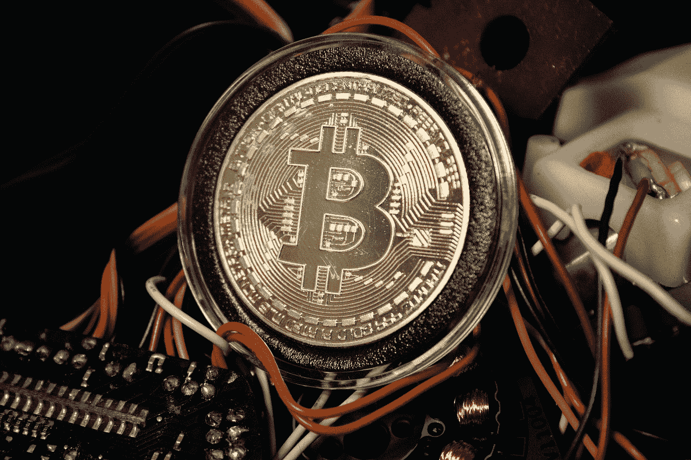

# 区块链初学者指南

> 原文：<https://medium.com/coinmonks/a-beginners-guide-to-blockchain-65eefe7a9f91?source=collection_archive---------56----------------------->

## 这项技术近年来获得了全球的关注，因为它能够做到几乎任何事情。

Photo by [Brian Wangenheim](https://unsplash.com/@brianwangenheim?utm_source=medium&utm_medium=referral) on [Unsplash](https://unsplash.com?utm_source=medium&utm_medium=referral)

区块链是互联网上最具创新性、不断变化的资源之一。这一资源已经成为像加密货币钱包和跟上区块链所有事情的指南。通常…