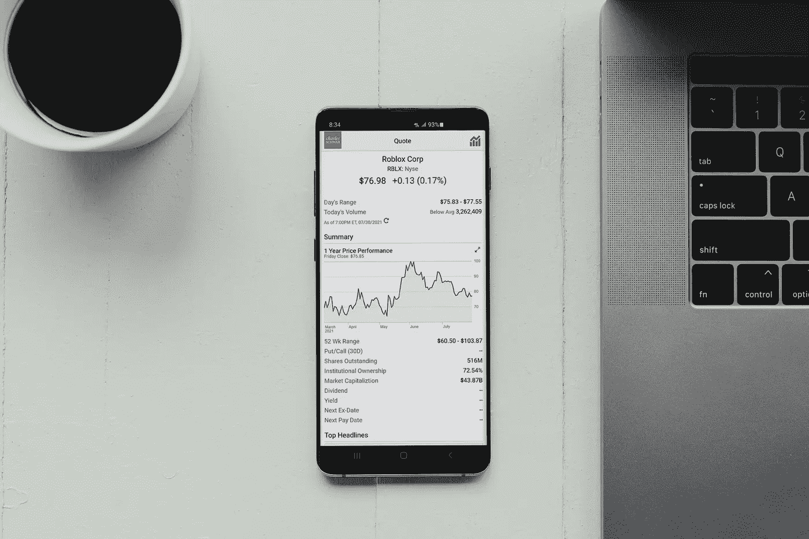

# 加密货币初学者指南

> 原文：<https://medium.com/coinmonks/a-beginners-guide-to-cryptocurrency-9f38f1424e3c?source=collection_archive---------40----------------------->

Photo by [Worldspectrum](https://www.pexels.com/@worldspectrum?utm_content=attributionCopyText&utm_medium=referral&utm_source=pexels) from [Pexels](https://www.pexels.com/photo/ripple-etehereum-and-bitcoin-and-micro-sdhc-card-844124/?utm_content=attributionCopyText&utm_medium=referral&utm_source=pexels)

在 2009 年发行之初，一些比特币被用来购买一份披萨。从这一点来看，数字货币在 2017 年 12 月短暂上升到 20，000 美元，以这种方式在 2018 年年中达到约 70%至约 6，000 美元，这无法用许多个人的基本逻辑来解释——数字货币的金融支持者、商人，或者只是错过了这个大好机会的普通好奇者。

## 一切是如何开始的

请记住，对当前货币框架的失望带来了计算机化货币的进步。这种数字货币的改进取决于中本聪的区块链创新、设计师的笔名或工程师的聚会。

## 想买&卖密码现在点击这里:

**

*Photo by [PiggyBank](https://unsplash.com/@piggybank?utm_source=unsplash&utm_medium=referral&utm_content=creditCopyText) on [Unsplash](https://unsplash.com/s/photos/coinbase?utm_source=unsplash&utm_medium=referral&utm_content=creditCopyText)*

*尽管有许多人预见到了加密货币的消亡，但比特币的展出让许多其他计算机化的货币形式活跃起来，尤其是最近。受到区块链热欢迎的众筹成就同样吸引了那些人来欺骗无知的公众，这已经成为控制者的考虑因素。*

## *超越比特币*

*比特币推动了许多其他计算机化货币形式的诞生；目前有 1000 多种高级硬币或代币。并不是每一种都非常相似，它们的质量会发生显著变化，流动性也是如此。*

## *硬币、代用硬币和代币*

*如果说硬币、代用币和代币之间有细微的区别，那就够了。尽管以太币、莱特币、swell、dogecoin 和 run 等替代硬币被视为“主要”类别的硬币，这意味着它们交换了更多的数字货币交易，但替代硬币或选择性硬币在很大程度上表现出不同于领先的比特币。*

*虽然代币提供资源或公用事业用途，但硬币作为现金或重要价值的存储来填充，一种模式是区块链库存网络管理局批准并跟踪葡萄酒项目，从酒厂到客户。*

*值得一提的是，低价值的代币或硬币提供了潜在的收益机会，但不要指望像比特币一样转瞬即逝。简单地说，较少实现的令牌可能不难购买，但可能很难出售。*

*在进入数字货币之前，首先要专注于激励和创新的思考，即白皮书中阐述的商业技术，以及每种底层硬币产品或 ICO。*

*对于那些熟悉股票和要约的人来说，首次出售股票或首次公开募股并不正常。无论如何，IPO 都是由拥有明确资源和商业历史的机构进行的。这是在一个可控的环境中完成的。话又说回来，ICO 仅仅依赖于一家企业在白皮书中提出的一个想法，即寻找可以火起来的资产，尽管它还没有行动起来，也没有资源。*

*不受监管，所以买家要小心*

*“一个人管不了什么”可能概括了金钱至上的情况。控制者和指导者还在试图寻找不断发展的加密形式的货币。密码领域的杰出指导方针是“劝诫购买者，让购买者小心”。*

*一些国家保持接受的态度，对数字形式的货币和区块链应用采取不干涉策略，同时警惕内部和外部的诡计。然而，不同国家的控制者更担心先进现金的缺点，而不是天才。大多数控制者都明白找到某种和谐的必要性，一些人正在审视现有的保护法律，试图对多种国际数字货币有一个概念。*

## *钱包格式*

*各种各样的钱包可以满足个人的喜好。*

*外人做的装备钱包一定要买。这些小工具就像 USB 小工具一样工作，被认为是受保护的，并且在需要时可能与互联网相关联。*

*例如，加密交易提供的在线钱包被视为热门钱包，会将客户置于危险之中。*

*基于编程的工作区或手机钱包在很大程度上是免费的，可以由硬币支持者或局外人提供。*

*纸质钱包可以打印出关于数字货币的适用信息，并在 QR 码设计中使用公钥和私钥。这应该保存在一个受保护的地方，直到在整个密码交换过程中需要时，并且应该呈现副本以防御灾难，例如，水损害或打印信息长期模糊。*

*密码交换和商业中心*

*加密交易正在为那些受虚拟货币标准启发的交易交换舞台。不同的选择包括在购买者和商人之间作为代表进行直接交换的网站，其中除了它之外没有“市场”成本，这取决于交易的集合之间的权衡。*

*从今以后，在不同的国家有许多的密码交易，但是有着不同的安全实践和框架的指导方针。他们从考虑神秘的入伍要求简单的电子邮件打开一个记录，并开始交换。然而，其他人则希望客户遵守“了解你的客户”这一全球标准，并反对非法避税(AML)措施。*

*秘密交易的决定依赖于客户的倾向，但未知的交易可能对允许的交换程度有限制，或者可能依赖于交易所在国意想不到的新准则。可忽略的权威方法和未知的登记使客户可以快速开始交换，而通过 KYC 和反洗钱周期将需要额外的时间。*

*所有密码交易商必须得到适当的处理和批准，这可能需要几分钟到几个小时，取决于执行的硬币或代币以及交易量。众所周知，适应性是数字货币的一个问题，设计师们正在想方设法寻找答案。*

## ***使用***购买、出售、转移和存储数字货币**

## **> >[现在点击这里](https://tinyurl.com/2m252nef)**

****

**Photo by [Tima Miroshnichenko](https://www.pexels.com/@tima-miroshnichenko?utm_content=attributionCopyText&utm_medium=referral&utm_source=pexels) from [Pexels](https://www.pexels.com/photo/man-in-white-dress-shirt-standing-in-front-of-black-flat-screen-tv-7567554/?utm_content=attributionCopyText&utm_medium=referral&utm_source=pexels)**

## **加密货币交易分为两类。**

**法定数字货币这种交易允许通过银行或信用卡和支票卡直接交易，或在某些国家使用自动取款机来购买法定加密货币。**

**可以说是数字货币。他们的加密交易只管理数字货币，这意味着客户目前应该拥有加密货币，例如比特币或以太坊，在给定的市场利率下，可以“交易”不同的硬币或代币**

**通过购买和提供加密形式的货币来收取费用。客户应该检查是否对框架和安全措施感到满意，就像决定他们可以接受的费用一样，因为不同的行业收取不同的费用。**

**尽量不要指望各种交易中类似数字货币的典型市场成本。投入精力探索对你来说很重要的硬币和代币的最佳价格可能是有利的。**

**网上货币交易会带来危险，客户应考虑双因素验证或 2-FA 等条款，随时了解最新的安全措施，并监控网络钓鱼伎俩。关于网络钓鱼的一个很好的指导方针是不要点击给定的连接，不管一条消息或电子邮件有多真实。**

****

**Photo by [Tima Miroshnichenko](https://www.pexels.com/@tima-miroshnichenko?utm_content=attributionCopyText&utm_medium=referral&utm_source=pexels) from [Pexels](https://www.pexels.com/photo/man-in-white-button-up-shirt-sitting-in-front-of-black-laptop-computer-7567444/?utm_content=attributionCopyText&utm_medium=referral&utm_source=pexels)**

## **[最佳密码交易平台](https://tinyurl.com/2m252nef)**

## **结论**

**随着 crypto 的发展，我们将实现大量的健全性，这将使它具有有效的适应性，并存储大量的重要价值，这将使它作为日常存在的一部分被组织、公共机构和每个人更多地利用。**

**加密货币仍然是一个很大的交易，在它的开始阶段，某些人仍然对它持怀疑态度，但它已经深深扎根，并已调整到我们的生活中，并将成为每个人都使用的现金，这只是一个很短的时间。随着人们对它的认可和广泛讨论，crypto 的命运一定会变得辉煌。**