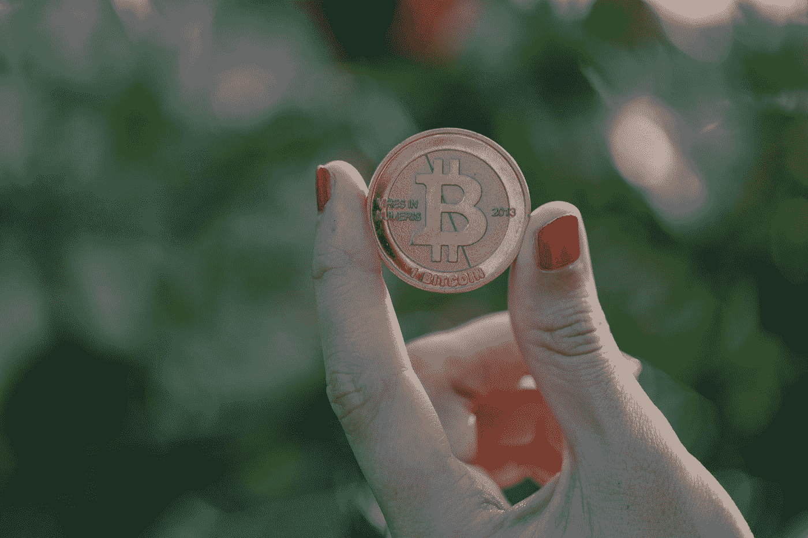
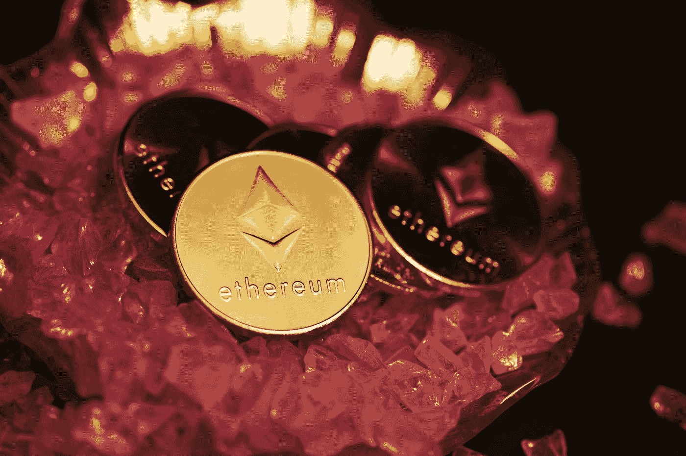
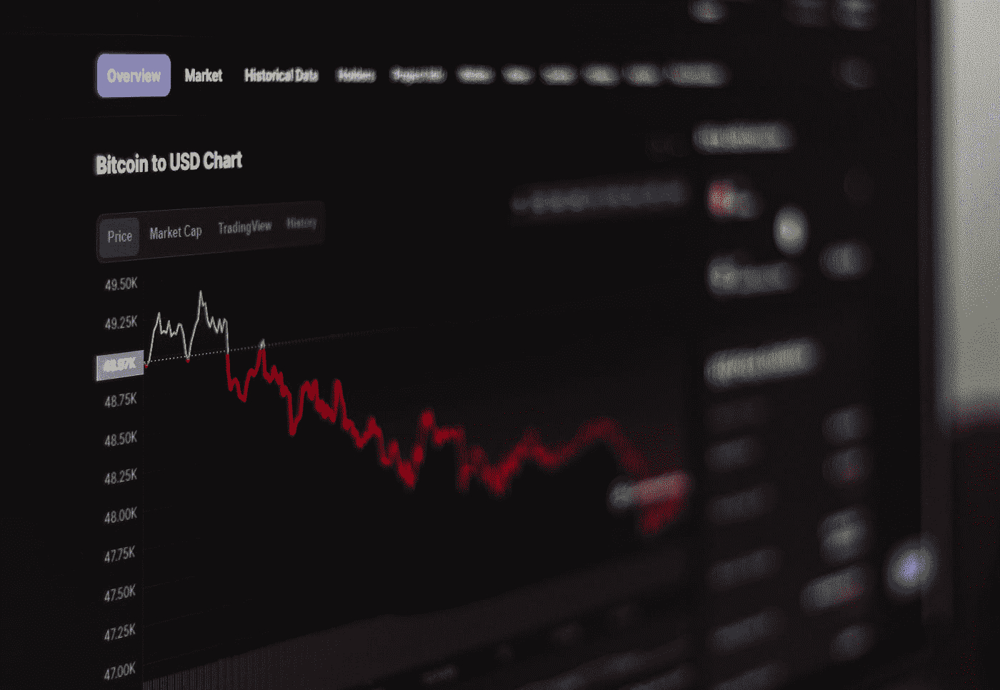

# 2022 年投资密码市场的初学者指南。

> 原文：<https://medium.com/coinmonks/a-beginners-guide-to-investing-in-the-crypto-market-in-2022-c6df4520d839?source=collection_archive---------30----------------------->

## 聪明投资，轻松赚大钱！

Photo by [Raphael Wild](https://unsplash.com/@veloradio?utm_source=medium&utm_medium=referral) on [Unsplash](https://unsplash.com?utm_source=medium&utm_medium=referral)

加密现在是个时髦词。从托儿所的孩子到 50 岁的老人，你都可以听到这个流行词。这是因为大量的广告。

但是大多数人不知道 Cryptos 的实际用例。他们盲目投资，赔钱。

所以，如果你也是一个，并想投资于加密，那么这个全面的初学者指南将帮助你做出更好的决定。

# 什么是加密货币？

加密货币是由区块链技术保护的数字资产类型。你应该知道，这些根本不是货币，尽管人们从它们诞生的时候就一直称它们为加密货币。

这些货币使用区块链和加密技术来保护每一笔交易。(Crypto 是隐藏的意思，grapy 是研究的意思)。

Photo by [Quantitatives](https://unsplash.com/@quantitatives?utm_source=medium&utm_medium=referral) on [Unsplash](https://unsplash.com?utm_source=medium&utm_medium=referral)

第一种加密货币是比特币。它是由一个化名的开发者中本聪在 2008 年末(全球金融危机之后)发明的，最大总供应量为 2100 万英镑。

我希望你明白它的基本意思。在这篇文章中，我不想浪费你的时间。我将在另一篇文章中帮助你理解 [**去中心化的重要性及其用例**](https://link.medium.com/wUKD89ptGqb) 。

所以，如果你想让我写一个关于它的指南，请在评论区告诉我。

要开始你的投资之旅，你应该了解一个硬币的基本面和技术分析。

## 什么是基本面分析？

基本意思是根(buniyad)。如果你拿起任何一个成功的项目，你会发现它在根本上是如此强大。

一个好的项目总是专注于解决现实生活中的问题，而不是专注于赚大钱。像匿名的比特币开发者中本聪一样，专注于解决重复支出问题。

我们知道，如果一栋建筑的基础坚固，它将会非常坚固，并且可以持续发展。

通过基本面分析，你将能够知道任何项目的核心价值。此外，你将能够确定其潜在的增长。

在基本面分析中，你应该关注项目开发团队、社区和以前的记录。白皮书是了解这些事情的任何项目的主要组成部分。

基本面分析的一些重要方面是...

**共识机制:**最流行的共识机制是工作证明(POW)和利益证明(POS)。

比特币区块链使用工作证明。人们认为它比股权证明更安全，尽管电力不环保。

## 什么是技术分析？

Photo by [Behnam Norouzi](https://unsplash.com/@behy_studio?utm_source=medium&utm_medium=referral) on [Unsplash](https://unsplash.com?utm_source=medium&utm_medium=referral)

技术分析不能帮助你识别任何项目的长期潜力。那么，为什么有必要学习呢？因为它会帮助你识别短期市场走势和买卖区。

如果你愿意学习技术分析，你应该看看这篇文章，我在这里分享了学习技术分析的 5 大来源。

在技术分析的帮助下，你可以做出明智而合乎逻辑的决定，而不是盲目投资。

交易视图是最受欢迎和易于使用的技术分析工具，在这里你可以免费点击一下找到所有的金融市场数据。在下载交易视图之前，你应该知道几个指标和它们的使用案例。

**烛台图:**是蜡烛和木棒的混合体。蜡烛图显示了每天的开盘价、收盘价和市场情绪。

**SMA & EMA:** SMA 代表简单均线，EMA 代表指数均线。

SMA 关注的是平均市场运动数据，而 EMA 关注的是当前数据。

## 当心 FOMO(害怕错过)和 FUD(害怕、不确定和怀疑)。

Photo by [Nathan Dumlao](https://unsplash.com/@nate_dumlao?utm_source=medium&utm_medium=referral) on [Unsplash](https://unsplash.com?utm_source=medium&utm_medium=referral)

通常，每个密码爱好者都会犯这样的错误，然后后悔。我也是最早犯这个错误的人之一。那么，这是什么？

根据一些研究，大多数人在没有适当的研究和知识的情况下投资金融市场。

他们投资市场是因为他们要么受到某人的影响，要么受到社交媒体的影响。

他们认为，当一枚特定的硬币在一段时间内越来越高时，他们就失去了一切。最后，他们在没有任何适当研究的情况下，发誓要投资那枚硬币或股票。

他们不知道在这样一个动荡的市场中投资一种特定的货币是否合适。

有时候，即使他们知道今天或明天应该被抑制，他们也无法控制自己的情绪。而这叫 FROM(害怕错过)。所以，你应该意识到这一点。否则你会耗尽你辛苦赚来的投资组合。

## 让我们了解一下 FUD(恐惧、不确定和怀疑)。

天使投资人总是着眼于这些机会来获得丰厚的回报。但是为什么呢？加密是一个不受监管的非常新的市场。这就是为什么大多数时候，我们看到一些合成的不确定性。

市场推动者试图创造 FUD，与弱者握手。鲸鱼在市场上制造怀疑，并通过主流媒体传播。不考虑所有这些问题，我看到了一些对一些有信誉的项目的重大非法攻击。

你可以想想最近对月球的攻击。这些事情在整个新兴市场制造了恐惧、不确定性和怀疑。但你应该知道，很多时候，FUD 可能是投资任何金融市场的正确时机。

*简单来说，在所有人都在卖的时候买，在所有人都在买的时候卖。当人们开始对着月亮狂吠比特币的时候。在采取任何行动之前，请 DYOR(做你自己的研究)。*

## 多样化你的投资组合！

“不要把所有的鸡蛋放在一个篮子里”这是一个著名的谚语，警告不要把你所有的钱投资在一个单一的东西上，因为它可能会失去一切。

你会听到比特币最大列表中的“比特币将改变世界”，dogians 中的“Dogecoin to the moon”，Shibaians 中的“柴犬到三月”，等等等等...

但是，如果你真的想实现财务自由并早日退休，你就不应该听所有这些东西**e。所以，总是尝试用主要的硬币和股票来分散你的投资组合。**

**别忘了留着你的应急基金。如果你是新手，不要在密码上投入超过 5 - 10%的投资组合。当你对区块链技术有了足够的了解，你就可以投入更多。**

## **霍德林是复利的力量。**

**Hodling (holding)是让你的钱增值的唯一途径。你不能通过交易获得财务自由，因为交易者为经纪人工作，为他们赚钱。每一次，经纪人对每一笔交易收费，而你为他们付钱。**

> **加入 Coinmonks [电报频道](https://t.me/coincodecap)和 [Youtube 频道](https://www.youtube.com/c/coinmonks/videos)了解加密交易和投资**

**不管这些，你不能保证你所有的交易都会成功。有时候会赚，有时候会亏。因此，最终它将保持平衡，而不是复利。如果你长期持有你的财富，它永远不会伤害你。**

## **这篇文章的精华。**

**💡FOMO 和 FUD 的战争。**

**💡总是 DYOR。**

**💡买入谣言，卖出消息(大家都在卖的时候买入，大家都在买的时候卖出)。**

**[**我将是你下一个 SEO 优化的内容写手。**](https://www.fiverr.com/s2/3d42a8c8e9)**

****