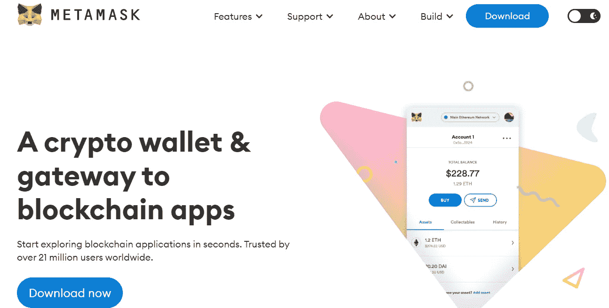
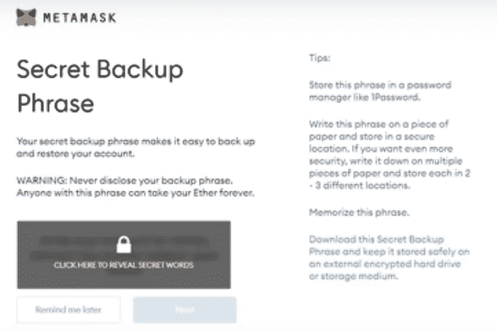

# 元掩模初学者指南

> 原文：<https://medium.com/coinmonks/a-beginners-guide-to-metamask-59df6b478760?source=collection_archive---------25----------------------->

## 如果你想在买卖数字资产时有更多的自主权，MetaMask 是一个不错的选择。以下是方法。

[Photo](https://unsplash.com/photos/MjdMKvEEuqo?utm_source=unsplash&utm_medium=referral&utm_content=creditShareLink) by Vadim Bogulov on Unsplash

我们如此习惯于让中央集权的机构担任看门人——无论是大学还是政府。例如，金融机构承诺管理我们的资源，给予我们对资产的某种安全和信任。他们吸收我们的存款，然后大规模放贷。

这与分散金融(DeFi)中的方法截然不同，在分散金融中，用户以点对点的方式与其他人进行交易。换句话说，没有一个集中的实体成为你的资源的保管人。相反，你是监护人——球在你的球场上。

## 集中式与分散式交换

自 2021 年以来，DeFi 市场激增，截至 2022 年 3 月，从略高于 200 亿美元增长到近 1600 亿美元，而加密货币市场总额从 4330 亿美元增长到 2.5 万亿美元。

怎么可能呢？自动做市商。

集中交易所的职能是保管客户的资金，充当供求的媒人，而分散交易所(dex)没有保管人。

相反，点对点借贷通常通过传统的 AMM 机制来实现，该机制依赖于以下等式:x*y = K 其中 x 和 y 表示正在交易的两种不同的加密货币，K 表示资产的恒定余额，该余额决定流动性池中的代币价格。例如，如果购买额外的以太坊，那么价格上涨，提供流动性的回报也增长。

抛开这些机制不谈，dex 有几个优点。在我的研究中，我发现他们比集中交易更能促进社区发展。在 web3 社区中，通常建立社区的方式之一是通过使用空投——或转移给用户令牌的礼物，通常作为早期参与和兴趣的奖励。

例如，DEX 的早期参与者可能会收到空投的加入令牌，这些令牌可能会随着时间的推移而增值。虽然集中式交易所有时会进行空投，[我的研究](https://cointelegraph.com/magazine/2022/02/18/crypto-token-airdrops-build-communities-or-problems)发现空投与市值增加和交易量增长有关，但仅限于 dex(非集中式交易所)。

不可否认的是，仍然有理由倾向于集中交易，而且那里的指数可能比他们的集中交易对手有更多的差异。例如，集中交易所往往会提供一定数量的保险，这样如果交易出错，就有追索权，而如果交易在指数中出错，他们可能就没有追索权。

最终，用户需要根据他们的舒适程度来决定，但是考虑到你正在阅读这篇文章，让我们假设你想去 DeFi！

## 什么是元掩码

“元掩码是一座桥梁，让你今天就能在浏览器中访问未来的分布式 web。它允许你在浏览器中运行以太坊 dApps，而不需要运行一个完整的以太坊节点，"[根据](https://medium.com/metamask/about)官方元掩码页面。

为了理解这意味着什么，让我们深入了解 dApp，或“去中心化应用”的定义 dApp 只是一个运行在区块链上的应用程序。例如，它可以是 OpenSea，或者甚至是一个游戏赚。另一个例子是[假人](https://www.golem.network/)，一个开源的，分散的超级计算机。与脸书等传统应用的最大区别在于，它们不是集中式的。更确切地说，社区拥有它们——或者至少，决定记录什么的共识制定过程是分散的。

这又让我们回到了超屏蔽。我们需要一个数字身份来与这些 dApps 和其他分布式账本技术进行交互。MetaMask 在标准浏览器上为人们提供了这样的身份，允许你连接到你选择的应用程序。从技术上讲，它允许 dApps 访问你的私人(数字)密钥。

## 如何创建元掩码

选择要安装的浏览器(Chrome、Firefox、Brave、Edge)。

去 MetaMask.io(确保你去的是真实站点！).

点击下载并添加到 Chrome(如果在 Chrome 浏览器上)。

假设您正在创建一个新钱包(而不是登录，在这种情况下，您将需要种子短语)，然后单击并创建一个密码。

接下来，你会看到“秘密备份短语”，这是指一个非常具体的单词序列，将用于访问你的帐户，包括如果你忘记密码或遇到其他问题。

确保你写下种子短语，不要与任何人分享——它是你的，而且只属于你。

现在你已经准备好了！但在你开始使用 MetaMask 进行交易之前，你必须将一些以太币转移到其中，以支付你所购买的任何东西的价格和汽油费。

## 最后的想法

请记住，MetaMask 只是一个将您带入 dApps 世界并将代理还给用户的门户，而不是一个集中的实体。但是伴随着额外的能力而来的是额外的责任，所以在这里用额外的教程视频来增加你的知识，并且摆弄钱包。

我听人们强调过的一个小技巧，也是我自己使用的，就是避免在你的账户里长时间存放大笔的钱。MetaMask 使转账变得非常方便，但它也容易受到攻击，特别是网络钓鱼攻击，恶意用户可能假装向您的帐户空投礼物或使用安全用户的别名。

随着多桥技术变得越来越普及——也就是说，dApps 允许用户从一个交易所到另一个交易所交换代币(据我所知， [FibSWAP](http://www.fibswap.io) 是一个非常有趣的技术)——数字钱包将成为买卖的必需品。

对于开发人员、科学家和坦白地说每个人来说，问题和关键的机会是我们是否能保持技术的分散化。

*本文作者为* [*克里斯特斯·a·马克里迪斯*](http://www.christosmakridis.com/) *，* [*生活剧*](http://www.livingopera.org/) *首席技术官兼研究负责人。他还是斯坦福大学数字经济实验室和哥伦比亚商学院 Chazen Institute 的研究成员，并拥有斯坦福大学经济学和管理科学&工程学双博士学位。在@living_opera 关注我们！*

> 加入 Coinmonks [电报频道](https://t.me/coincodecap)和 [Youtube 频道](https://www.youtube.com/c/coinmonks/videos)了解加密交易和投资

# 另外，阅读

*   [Botsfolio vs nap bots vs Mudrex](/coinmonks/botsfolio-vs-napbots-vs-mudrex-c81344970c02)|[gate . io 交流回顾](/coinmonks/gate-io-exchange-review-61bf87b7078f)
*   [CoinFLEX 评论](https://coincodecap.com/coinflex-review) | [AEX 交易所评论](https://coincodecap.com/aex-exchange-review) | [UPbit 评论](https://coincodecap.com/upbit-review)
*   [AscendEx 保证金交易](https://coincodecap.com/ascendex-margin-trading) | [Bitfinex 赌注](https://coincodecap.com/bitfinex-staking) | [bitFlyer 点评](https://coincodecap.com/bitflyer-review)
*   [Bitget 回顾](https://coincodecap.com/bitget-review)|[Gemini vs block fi](https://coincodecap.com/gemini-vs-blockfi)cmd |[OKEx 期货交易](https://coincodecap.com/okex-futures-trading)
*   [AscendEx Staking](https://coincodecap.com/ascendex-staking)|[Bot Ocean Review](https://coincodecap.com/bot-ocean-review)|[最佳比特币钱包](https://coincodecap.com/bitcoin-wallets-india)
*   [霍比评论](https://coincodecap.com/huobi-review) | [OKEx 保证金交易](https://coincodecap.com/okex-margin-trading) | [期货交易](https://coincodecap.com/futures-trading)