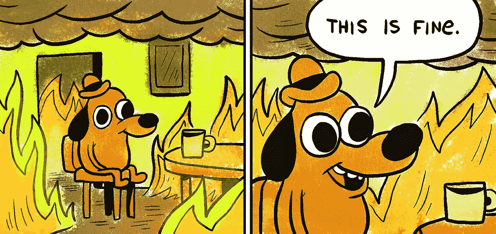

# 一个更好的方式来考虑在加密崩溃中“买入 Dip”

> 原文：<https://medium.com/coinmonks/a-better-way-to-think-about-buying-the-dip-in-a-crypto-crash-9327d0fac772?source=collection_archive---------0----------------------->

## 从六个月来看，加密是高风险、低回报的。但六年后，风险低，回报高。你只需要用正确的方式去对待它。

It actually is.

# 我们不能停在这里，这是蝙蝠国！