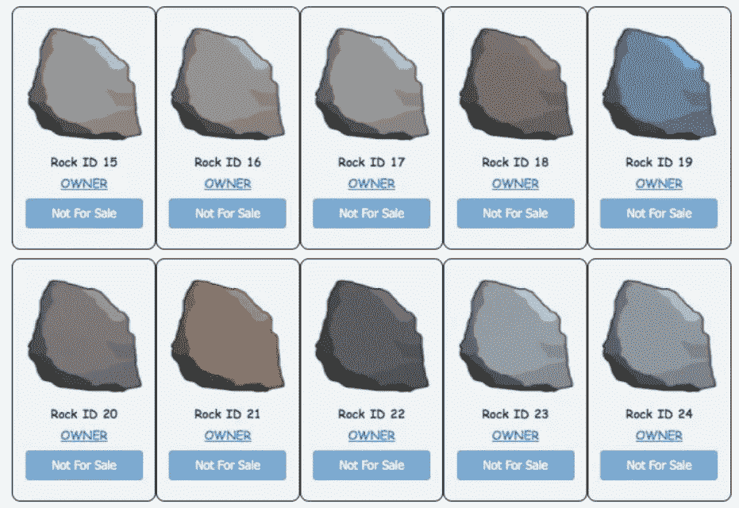

# 10 亿大错特错！为什么他以低于 1 美分的价格出售 NFT 以太石？

> 原文：<https://medium.com/coinmonks/a-big-mistake-at-1-billion-why-does-he-sell-an-nft-etherrock-for-less-than-1-cent-1dd90a0d36cd?source=collection_archive---------46----------------------->

一位不可替代代币(NFT)收藏家错误地以不到 1 美分(0.0012 美元)的价格出售了一块以太石，而它的价值为 100 万美元。不幸的主人把魏的单位错当成了 ETH。

# 一个代价高昂的错误