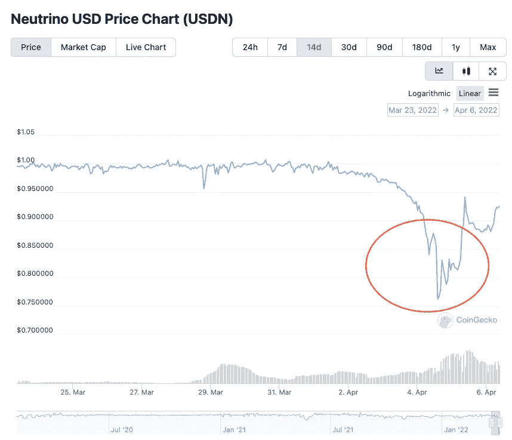
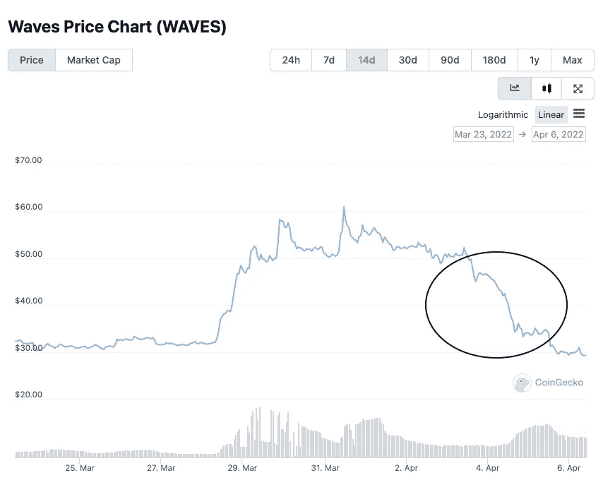
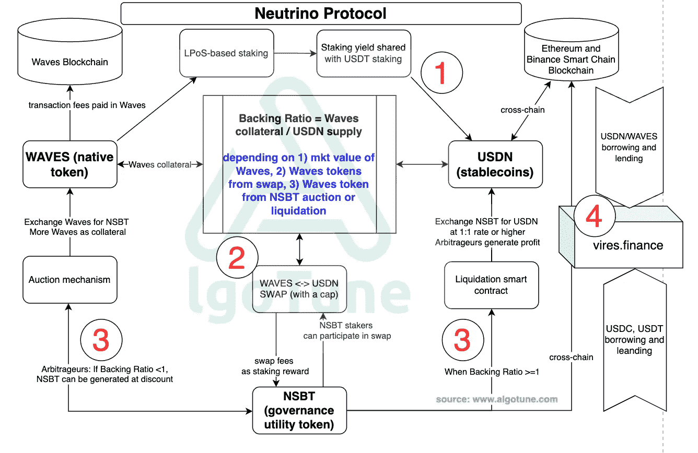
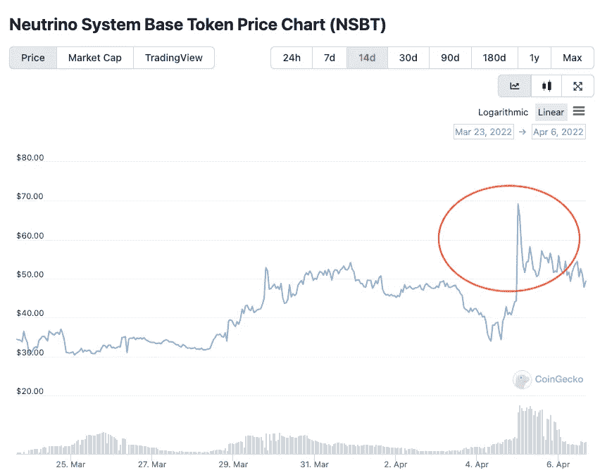

# 雷达上的一个光点还是天生脆弱？9 号 stablecoin USDN de-peg 事件解包-中微子协议/Waves 区块链深潜

> 原文：<https://medium.com/coinmonks/a-blip-on-the-radar-or-inherently-fragile-stablecoin-usdn-de-peg-events-unpacked-and-deep-dive-9de6a172b19e?source=collection_archive---------25----------------------->

在过去的几天里，算法稳定币 USDN 解钉占据了密码世界的头条。USDN 的市值接近 10 亿美元，在所有稳定的公司中排名第九。脱钩始于 2022 年 4 月 4 日，美元兑日元迅速下滑至 0.83 美元的低点，在撰写本文时稳定在 0.9 美元左右。脱钩可能源于一项关于授权融资的[提案](https://vires.finance/governance/vote/HuYgPQV5s5L8KoWnTAUZ43YjuBJ28nUsypnv9s6LdExF)，以强制清算 Waves/USDN 借款。本地令牌 Waves 在 24 小时内下跌了 15%，在过去 3 天内其总市值损失了近 50%。这篇文章试图揭示是什么导致了这种脱钩。它也是我们算法稳定深入的延续。所以让我们开始吧。

source: coingecko.com

# 是什么导致了脱钩？

如上所述，治理建议在维里斯金融可能会引发一波抛售。这也是由在[推特](https://twitter.com/0xHamz/status/1509581295621451779)指责 Waves 项目是庞氏骗局的一系列攻击引起的。指控推测，该协议使用 USDN 作为抵押借入 USDC stablecoin，将 USDC 与币安连接起来购买 Waves(由于流通供应不足，Waves 价格上涨)，将 Waves 交换到 USDN，并重复这一过程。原告试图提供证据来证明所有的活动都是可追踪的。所有这些活动(有趣的是，超过 30-40%的交易量来自韩国)据称导致 Waves 价格在过去 2 个月上涨了 6 倍。Waves Protocol 的创始人否认了这一指控，并声称这一系列攻击来自一名卖空者，他试图通过借贷和卖空 Waves 来获利。

我们不想评论或验证哪一方是正确的。相反，我们希望分解协议的细节，并提供 stablecoin USDN 如何工作的整体视图。我们仍然持有与我们在上一篇文章中提到的 UST 脱钩风险相同的观点。

> “算法稳定点本质上是脆弱的……因为它们依赖于三个因素，而历史证明这三个因素是无法控制的。首先，它们需要一个支持运营稳定性的需求水平。第二，它们依赖具有市场激励的独立行为者进行价格稳定套利。最后，他们需要始终可靠的价格信息。”——来自瑞安·克莱门茨博士

使用与 UST 相同的框架，特别是对于 USDN，上述 3 个因素是(1)Waves 和 USDN 的持续需求，(2)套利者有足够的动机提供 Waves 作为额外的抵押品和互换机制，以拥有足够的流动性来保护 USDN 挂钩，(3) oracle Waves 价格要准确。过去几天 Waves 和 USDN 发生的事情是由以下因素驱动的:(1)对 Waves 和 USDN 的需求不足(由于缺乏信心)以及对 Waves 的短期兴趣激增，这是一种典型的“银行挤兑”或“死亡螺旋”情景，(2)互换机制未能如预期那样发挥作用，因为一个人每天可以互换的最大互换金额为 USDN。

# stablecoin USDN 是如何工作的？

我们在下面创建了一个流程图，以提供中微子协议如何工作的整体视图。

www. algotune.com

1 首先，我们来谈谈打桩机制。为了吸引用户到协议，赌注收益率是必要的。对于中微子协议的情况，Waves 区块链使用租借的股份证明(LPoS)一致算法，并且激励是以 USDN 而不是 Waves 令牌的形式。换句话说，一旦用户发送了 Waves，代币将被锁定在智能合约中，作为回报，如果用户选择下注 USDN，他们将获得 USDN stablecoins +赌注收益。当美元在赌注中的比例下降时，赌注收益增加。

2 第二，挂钩机制。类似于 UST/卢纳的挂钩机制，1 美元的波动价值可以兑换成 1 美元的美元，因此如果美元偏离 1:1 的挂钩，套利者可以进来获利。但是，不是烧掉令牌，而是将两个令牌都保存在智能合约中。波浪本质上是支持 USDN stablecoins 的抵押品——这有点类似于戴。这种抵押品支持机制存在风险——如果抵押品的价值大幅下降，协议将变得抵押不足。为了解决这个问题，中微子协议引入了一种稳定机制。

3 rd，储量稳定机制。一种叫做 NSBT 的新令牌就是为了实现这个目标而创建的。它允许套利者折价买入 NSBT，以平价或溢价卖出。本质上，当协议抵押不足时:套利者购买 Waves off-chain - >将 Waves 交换到 NSBT(折价)- >更多 Waves 作为抵押品- >协议回到平衡模式(抵押品比 USDN stablecoins 多)。

当协议被过度抵押时:套利者以 1:1 或更高的比率卖出 NSBT 换取美元->更多美元进入协议->协议回到平衡模式->套利者实现利润。

4 最后，我们需要讨论一下基于 Waves 区块链的核心应用之一 vires.finance。目前，超过 80%的美元总供应量被存放在 vires 中。对于那些阅读了我之前关于锚协议的[帖子](/algotune/deep-dive-into-anchor-protocols-business-model-part-1-b0d02c522cf)的人来说，基于 Waves 区块链的 vires.finance 相当于构建在 Terra 之上的锚协议。与 Anchor 不同，vires 接受所有其他稳定的货币，如 USDC 和 USDT 加入协议，甚至比特币/以太网。简而言之，授权允许用户存放他们的首选资产(如 USDN)和借入其他资产(如 USDC/USDCT)。存款/借款利率取决于市场供求。这里的愿景是赋予跨链权限，并允许来自各种区块链协议的用户使用存款/借款平台。

# 协议的风险

这种挂钩设计有两个主要问题:(1)波动 USDN 互换有一个用户每天可以互换的最大数量。(2)如果波浪价格急剧下跌，抵押品稳定机制将失效。

(1) Waves USDN 掉期:用户需要持有 NSBT 代币才能参与掉期。市场上流通的 NSBT 代币只有 250 万枚。想象一下，一个拥有 4%代币(大约 100k NSBT 代币，大到可以被称为鲸鱼)的用户想要在 USDN 交易低于 1 时进场捍卫钉住汇率。该用户可以交换的最大金额仅为 320 万美元，而在取消挂钩的当天，最高日交易量为 1 亿美元。由于日交易量在 1000 万至 2000 万美元之间，互换限额在正常情况下可能行得通，但肯定不足以在波动最大的时期捍卫联系汇率。当 2022 年 4 月 4 日脱钩发生时，很明显，NSBT 价格被推高了(见下图)，因为人们希望持有更多 nsbt，以便参与套利。这些参数需要调整，以适应极端的情况——(1)链上流动性不能太低，否则它不能像设计的那样捍卫联系汇率制；(2)另一方面，链内流动性应该始终低于链外流动性，否则 oracle 攻击可能相当容易。在脱钩之后不久，通过了一项[投票](https://governance.neutrino.at/)来改变参数以解决这个问题。这是一个很好的尝试，但我仍然对使用第三个令牌来控制最大交换量持怀疑态度。存在这样一种情况，攻击者可以操纵 NSBT 价格到一个过高的水平，使得套利者不再有利润来参与盯住汇率。

source: coingecko.com

(2)侧枝稳定机制。该协议激励套利者在支持比率低于 1 时折价购买 NSBT 以补充 Waves 抵押品。它依赖于波动价格尽快稳定下来。如果 Waves 价格继续下跌，即使套利者进来增加额外的抵押品(价格下跌速度快于数量补充速度)，准备金仍将处于抵押状态。在这种情况下，USDN 将真正脱钩或破产。信心将会丧失——波浪价格将会变为零，美国国债也将如此。

截至本文撰写之时，美元兑人民币汇率已经略有回升，为 0.93。USDN 能在未来几天重新盯住美元吗？海浪价格能恢复吗？我们走着瞧！

如果你喜欢关注我们的工作，欢迎在我们的邮件列表上注册[这里](http://www.algotune.com/)或者在[推特](https://twitter.com/algo_tune)上关注我们。

> 加入 Coinmonks [电报频道](https://t.me/coincodecap)和 [Youtube 频道](https://www.youtube.com/c/coinmonks/videos)了解加密交易和投资

# 另外，阅读

*   [3 商业评论](/coinmonks/3commas-review-an-excellent-crypto-trading-bot-2020-1313a58bec92) | [Pionex 评论](https://coincodecap.com/pionex-review-exchange-with-crypto-trading-bot) | [Coinrule 评论](/coinmonks/coinrule-review-2021-a-beginner-friendly-crypto-trading-bot-daf0504848ba)
*   [莱杰 vs n rave](/coinmonks/ledger-vs-ngrave-zero-7e40f0c1d694)|[莱杰 nano s vs x](/coinmonks/ledger-nano-s-vs-x-battery-hardware-price-storage-59a6663fe3b0) | [币安评论](/coinmonks/binance-review-ee10d3bf3b6e)
*   [Bybit Exchange 评论](/coinmonks/bybit-exchange-review-dbd570019b71) | [Bityard 评论](https://coincodecap.com/bityard-reivew) | [Jet-Bot 评论](https://coincodecap.com/jet-bot-review)
*   [3 commas vs crypto hopper](/coinmonks/3commas-vs-pionex-vs-cryptohopper-best-crypto-bot-6a98d2baa203)|[赚取秘密利息](/coinmonks/earn-crypto-interest-b10b810fdda3)
*   最好的比特币[硬件钱包](/coinmonks/hardware-wallets-dfa1211730c6) | [BitBox02 回顾](/coinmonks/bitbox02-review-your-swiss-bitcoin-hardware-wallet-c36c88fff29)