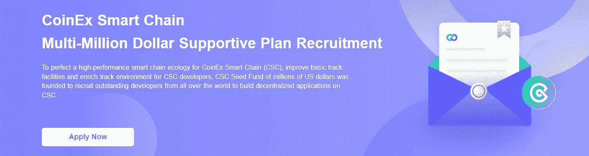
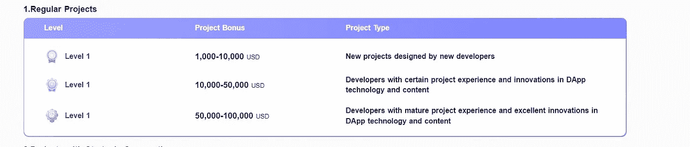
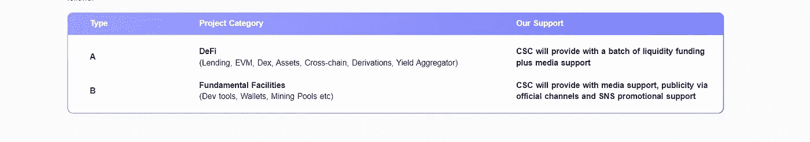

# CSC 数百万美元支持计划的区块链职业生涯

> 原文：<https://medium.com/coinmonks/a-blockchain-career-with-csc-multi-million-dollar-supportive-plan-5ddca4516fb1?source=collection_archive---------29----------------------->

随着区块链行业的就业机会迅速增加，CSC 致力于帮助开发者在区块链生态系统中成长并取得潜在的成功。 **CoinEx Smart Chain 启动百万美元扶持计划，为 CoinEx Smart Chain (CSC)完善高性能智能链生态，改善基础赛道设施，丰富 CSC 开发者的赛道环境**。成立了数百万美元的 CSC 种子基金，招募世界各地的优秀开发者，在 CSC 上构建去中心化的应用。

区块链事业正在崛起，就像区块链技术的普及一样。它开始慢慢走向各个领域，是时候让你拥抱这个小众了。从金融到医疗保健，甚至教育的每个行业都开始受益于这项奇妙的技术。培养区块链的职业生涯还不是一件容易的事情。为什么？因为技术的采用和集成仍处于初级阶段。

对拥有区块链技能的人的需求超过了总供给。通过这种方式，区块链的工作机会每天都在增加。许多主流公司以及初创公司都在探索这项技术。所以，你应该预料到它会持续很多年。

## *区块链职业道路*

对区块链技术专业人才的需求正在上升。到目前为止，大多数区块链的职业生涯都集中在能够开发金融应用程序的人身上，但生态系统已经发展到远远不止这些。

谈到区块链的职业生涯，有三个关键的机会领域。

***1。区块链开发者—*** 考虑到首先需要的技能数量，这可以说是区块链最顶尖的职业之一。

一个区块链的开发者可能会有一个稳定的职业发展机会。为什么？因为他可以在从金融到制造的各种行业工作，也可以在卫生部门工作。同样，行业领导者对区块链的所有技术机会都很感兴趣。这意味着，区块链的开发者将会有更多的工作机会。区块链开发应该继续提供稳健的职业生涯，使其更加有利可图。然而，你将处于一个高度技术性的位置。所以，如果你想在这里大放异彩，就需要极大的关注和技巧。

这些人比其他人拥有最大的职业机会。开发人员需要的一些技能包括 Microsoft SQL Server、Visual Studio。NET、MVC、AJAX、SQL、C、C++、C#、JavaScript、Node.js、JQuery、SOAP、REST、FTP、HTML、XML、XSLT、XCOD、神经网络、回归、敏捷 Scrum 和 MYSQL

***2。产品管理***

围绕产品管理的区块链职业很难得到，因为这个领域的大多数业务都是单一产品的创业公司。然而，这就是为什么你应该开始自己的区块链业务，成为一名产品经理。如果你有产品经理的背景，你应该找其他人分享同样的技能。在这里，与软件开发人员一起努力应该会有很大帮助。你将能够拿出一个可行的区块链产品。他们负责将公司的需求转化为可以与开发人员和项目的其他利益相关者讨论的技术术语。他们还负责区块链项目的适当规划和执行。

***3。区块链质量工程师***

这些人有责任看到开发过程中质量的所有方面；它还可能包括自动化框架测试、手动测试。区块链质量工程师工作或补充区块链工程师的工作。所以，这是质量工程师理想的区块链职业。开发将需要认证，以确保它正常工作。这些人有责任看到开发过程中质量的所有方面。该职业主要从事复杂区块链项目的 QA、规划、交付以及满足 QA 标准。

区块链社区还有很多其他的职业机会

*   ***区块链设计师*** —进入区块链技术的组织需要这些设计师来创建网站或门户网站，向他们的客户介绍他们的产品。寻求成为区块链设计师职业机会的个人需要具备以下技能——UI 设计(web 和移动)、手工草图、PS、Illustrator。这些专业人员必须具备良好的沟通技巧，以及与不同团队合作以理解需求的能力。然而，简单是这里的关键。大多数公司想要一个优雅而引人注目的网络形象。这些页面应该告诉顾客和客户公司在区块链的利基市场提供什么。
*   ***区块链工程师***——区块链工程师是目前市场上第二有名的职位。作为一名区块链工程师，使用技能是一种在这项技术上成就事业的可靠方式。区块链工程师在这里根据需要为公司创建和实施各种数字化解决方案。你应该研究你工作的公司的技术需求，并开发相关的应用程序。要在这个领域的区块链职业生涯中获得成功，你需要在 Java、Solidity、C#、APL、Python 等方面的高技能水平。在这里，其他区块链技术人员的知识可能是一个加分点。您将能够创新新的区块链应用程序，以适应组织的需要。
*   ***区块链信息安全分析师*** —要想开发成功，安全是基本要求之一。话虽如此，拥有信息安全技能和经验的人在区块链部门也能发挥作用。信息安全分析师可以在这里赚一大笔钱。证明一个保护性的区块链网络以及应用，这个工作的需求是巨大的。
*   ***区块链法律顾问***——对从开发到实施的过程有着广博理解的个人。你需要掌握该技术的所有基础知识和法律政策。这是你能够在启动一个新的应用程序之前建议一家区块链公司的唯一方法。律师们接到各种公司和即将成立的创业公司打来的电话，寻求关于区块链的建议。主要是关于如何构建和管理初始硬币发行，以满足特定的法规。如果你能熟悉区块链的所有要求，这对你来说是一个成长的职业机会。一个顾问知道结构和如何管理成功的过程。
*   ***区块链数据科学家—*** 区块链作为一种账本技术，是海量数据的代名词。因此，区块链数据科学家的工作是通过应用统计学来收集、解释、分析和管理数据。数据科学家现在正成为技术发展不可或缺的一部分。在这种情况下，数据科学家必须分析大量的交易数据。他们还需要帮助工程师和开发人员设计出最终的区块链产品。甚至进行升级和更新。
*   ***区块链营销专家—*** 已经拥有区块链应用的初创公司和公司开始将营销推广流程整合到他们的运营中。这样的区块链工作需要的是能够制定营销计划以触及目标受众的人。作为营销专家，区块链职业需要你为即将到来的区块链项目或产品研究潜在市场。你还需要在市场中发展和维持社交关系的技能。没有一个社会和适当的营销战略，任何公司都不能指望成功。
*   ***区块链实习生—*** 针对实习生的区块链工作正在慢慢出现，薪水也很高。实习生的职责差别很大。这些即将到来的专业人士被视为补充区块链工程师和开发人员的工作。区块链实习生，根据组织的不同，可以在 Linux 等开源平台上设计和开发区块链总账。提出潜在的想法和概念证明是另一回事。主要是你会向专业人士学习，然后可能加入团队。

区块链技术的应用如此多样，超乎想象。它在医疗保健、供应链、银行相关服务、制造业、房地产、数字化记录等领域的实用性显而易见。

# 薪水

**区块链的平均工资从每年大约 95，173 美元到 236，028 美元不等，取决于经验和角色**。在整个 2017 年，区块链行业出现了巨大的增长。根据 Burning Glass technologies 的数据，2017 年区块链工作岗位增加了 115%。单说 LinkedIn，招聘信息就从 1037 条(21016 年)增加到了 4541 条(2017 年)。

# CoinEx 智能链(CSC)数百万美元的支持计划

通过数百万美元的支持计划，CSC 鼓励更多的开发人员在 CSC 生态系统中迁移/构建项目，并享受改进的开发体验。经过近一年的基础设施建设，CSC 生态系统稳步进入下一阶段，其数百万美元的支持计划也找到了新的目标，重点是一系列创新的黑马项目。为此，公链为元宇宙生态推出了 500 万美元的专项资金支持，为 Fi+项目赋能。

# 支持方法

## 提供资金

*   根据表现，项目将获得 CSC 基金会的资助，根据不同情况分为 3 个级别:

**1。常规项目** —在 CoinEx 智能链上开发和部署的常规项目将获得 10，000-100，000 美元的支持资金，用于项目的成功。

**2。战略合作项目—** 以 CoinEx 智能链的名义获得至少 20 万美元的资金支持。

## 资金+宣传

*   CoinEx Smart Chain 将在已经获得我们资金支持的项目中选择优质项目，并进一步提供宣传资源支持。安排如下:

## 资金+宣传+生态

对成熟优质的项目，除资金和宣传支持外，还将提供全方位的生态支持:

*   提供资金
*   媒体
*   社区
*   官方网站上的品牌展示
*   交易所优先上市(发行项目):快速上市+低/零费用
*   流动性挖掘支持(AMM)
*   ViaBTC 资本的资金

技术一直在发展。坚实的底层基础设施是快速创新以应对市场新变化的先决条件。CSC 数百万美元的支持计划是 CSC 生态系统中新兴应用开发的强大催化剂，涵盖了 DeFi、NFT、元宇宙、Data DAO、SocialFi 和隐私应用等项目。它将不仅有利于已经在 CSC 上构建项目的团队，也有利于那些计划这样做的团队。

申请支持计划:[https://www.coinex.org/million_dollar_plan](https://www.coinex.org/million_dollar_plan)

> 加入 Coinmonks [电报频道](https://t.me/coincodecap)和 [Youtube 频道](https://www.youtube.com/c/coinmonks/videos)了解加密交易和投资

# 另外，阅读

*   [AscendEx 保证金交易](https://coincodecap.com/ascendex-margin-trading) | [Bitfinex 赌注](https://coincodecap.com/bitfinex-staking)
*   [最好的卡达诺钱包](https://coincodecap.com/best-cardano-wallets) | [Bingbon 副本交易](https://coincodecap.com/bingbon-copy-trading)
*   [印度最佳 P2P 加密交易所](https://coincodecap.com/p2p-crypto-exchanges-in-india) | [柴犬钱包](https://coincodecap.com/baby-shiba-inu-wallets)
*   [8 大加密附属计划](https://coincodecap.com/crypto-affiliate-programs) | [eToro vs 比特币基地](https://coincodecap.com/etoro-vs-coinbase)
*   [最佳以太坊钱包](https://coincodecap.com/best-ethereum-wallets) | [电报上的加密货币机器人](https://coincodecap.com/telegram-crypto-bots)
*   [交易杠杆代币的最佳交易所](https://coincodecap.com/leveraged-token-exchanges)