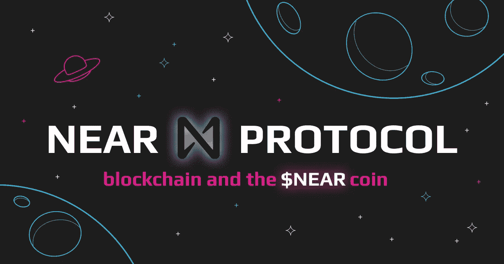
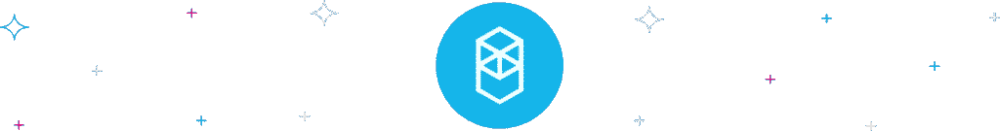
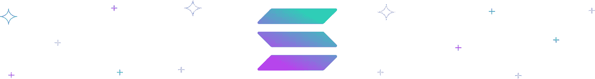

# 新体验的区块链:什么是 NEAR 协议和$NEAR

> 原文：<https://medium.com/coinmonks/a-blockchain-for-new-experiences-what-is-near-protocol-and-near-f78fa458e71a?source=collection_archive---------30----------------------->

自 2020 年底正式推出硬币以来，第一层区块链 NEAR Protocol 引起了投资者的兴趣。该项目是作为一个社区运营的云平台创建的，已经发展出各种技术解决方案来解决其他区块链存在的问题，如速度慢和兼容性差。关于这个新协议，你需要知道的就是:什么是近协议和近协议加密，它的生态系统和项目，以及如何支持近协议。

# 什么是近协议？

伊利亚·波洛苏欣和亚历山大·斯基丹诺夫于 2017 年在加利福尼亚州旧金山创立了 [NEAR Protocol](https://near.org/) 。NEAR 是基于新的第 1 层区块链的集合、基础和开发平台。它被描述为一种“简单、安全和可扩展的技术”，可以用来重新思考商业、创造力和社区，以创造一个更可持续和公平的未来。

# 项目的主要特点

近协议生态系统包括各种创新的技术元素，以及接入许可和收费相关的激励措施。由于其分片架构，这种利益相关证明(PoS)区块链有望变得简单、安全和可扩展。它还具有一个分散的开发平台，对开发者来说是用户友好的，该公司认为这种方法将导致广泛采用。此外，NEAR 还可以使用 NEAR 的彩虹桥与以太坊进行互操作。

# $接近硬币

NEAR 是一种公用令牌，允许持有者参与网络治理，并通过向网络添加 NEAR 令牌来获得奖励。委托的利害关系证明共识方法用于保护近令牌。NEAR 硬币的最大供应量为 10 亿美元，流通供应量为 6.04 亿美元。该项目目前的市值为 94 亿美元，每个协议价格目前为 16.58 美元。

# 近协议网络

NEAR 基金会构想并开发了 NEAR 区块链，以帮助 NEAR 社区实现其“一个人们拥有自己的金钱、数据和产生新想法的手段的世界”的目标其 mainnet 于 2020 年 4 月上线，同年 10 月可进行代币转账。NEAR 声称提供了一个创意、扩展解决方案和多链未来愿景的框架。它还声称速度快，但对环境无害，并且可持续，成本低，安全。

# 挑战

与大多数其他可扩展区块链(需要高端技术来集中处理短暂的吞吐量峰值)不同，NEAR Protocol crypto 的方法允许平台的容量以真正分散的方式几乎呈指数级增长，高达数十亿次交易。这是一个通用平台，开发人员可以用它来构建和部署分散式应用。它类似于亚马逊的 AWS 平台，你知道和喜欢的大多数应用程序都在那里运行它们的服务器，除了 NEAR 平台不是由单一企业管理和控制的；相反，它是由数千人，如果不是数百万人来管理和控制的。

# NFTs

NEAR Protocol 为 NFTs 创建了一个安全的避难所，允许您通过几个简单的步骤创建由您支持的数字资产。在你的智能手机上，你可以铸造、出售、甚至交易非功能性食物。NEAR 也预留了一些资源来帮助你建造这些物品。在近生态系统中，几个 DApps 使这变得可行。这为你提供了你作为一名艺术家所寻求的机会，去创造并使你的想法、创造力和能力呈现给世界，而不是等待第三方介入并阻止你去触及你的金牌。

# 路标

根据其网站，该项目的目标是建立一个生态系统，该系统“足够安全，可以管理像金钱或身份这样的高价值资产，并且足够高的性能，可以让它们对日常生活有用。”NEAR 协议对未来有重要的意图，但目前有打桩和产量耕作选项。

# 近协议 vs Fantom

在最近的低迷时期，两种排名前 100 的硬币，NEAR 和 FTM，飙升至排行榜首位。原因很容易理解:以太网很难因为其过高的成本而无法使用。未来的 ETH 技术进步很可能会缓慢而不方便，而且很明显 ADA 将无法取代 ETH 的位置。NEAR 和 FTM 在技术上都比 ETH 更先进，可以通过 EVMs 轻松装载 ETH DApps。在这个市场周期中，NEAR 和 FTM 似乎是两个最可靠的卫星。两家公司的市值都在 50 亿美元左右，因此无论你投资哪家公司，都有很大的增长空间。

# 接近协议 vs 索拉纳

区块链三难困境中最关键的部分是安全。它更像是一个整体的金字塔结构，安全是最底层最重要的一层。可伸缩性是一个终生的过程，而去中心化需要时间。值得注意的是，索拉纳还没有将 Slashing 整合到他们的网络中。此外，Solana 的可扩展性最终也会成为瓶颈。另一方面，NEAR 集成了区块链的所有三个组件。NEAR Protocol 也是一个碳中和环境友好的区块链网络。很长一段时间以来，NEAR 协议一直在塑造 Web3 的未来，现在这一切开始走到一起。

> 加入 Coinmonks [电报频道](https://t.me/coincodecap)和 [Youtube 频道](https://www.youtube.com/c/coinmonks/videos)了解加密交易和投资

# 协议附近的标桩位置？

所以你决定在附近下注。恭喜你！你做了一个相当大的决定。以下是如何在协议币附近下注:

1.  转到该网站创建一个近在线钱包。
2.  点击“创建帐户”按钮创建一个帐户，并选择您的姓名。
3.  为了保护你的账户，使用分类账户钱包，如果你不介意被黑客攻击，使用你的电子邮件地址和/或手机号码进行双重认证。
4.  必须将至少 3 个邻近代币存放到指定的地址。
5.  您的钱包现在可以使用了。你可能认得 Argent、Metamask 或内置钱包的币安或 Huobi 账户。这个加密钱包以同样的方式工作，除了您在使用集中交换时放弃您的私钥的所有权，这是不推荐的。
6.  出现“认领您的帐户 ID”屏幕时，单击“认领帐户”。
7.  从主页打开 Staking 10。要获得您的奖励，请选择一个验证机，您将向其下注您的硬币。

# 如何购买带密码的 NEAR 协议？

我们的用户友好界面可以让您以最优惠的价格将 ETH 换成附近的[。凭借 Swapzone 广泛的资产范围和各种交换提供商提供的服务，将 ETH 转换为 NEAR 协议轻而易举。只需几个简单的步骤，您就可以以市场上最优惠的价格购买附近的 ETH。以下是如何进行近协议交换:](https://swapzone.io/currencies/near)

1.  转到[交换区](https://swapzone.io/)。
2.  从下拉菜单中选择 ETH to NEAR 交换对。
3.  填写您要交换的 ETH 的总量。
4.  选择最有利的汇率。
5.  选择交换选项。
6.  要将 NEAR 协议硬币放入您的钱包，请输入您的钱包地址。
7.  向创建的地址存入 ETH。
8.  等待您的 ETH to NEAR 转换完成。
9.  你的近照会送到你的钱包里！

**进一步阅读:** [**区块链区块链:Polkadot 概述**](https://swapzone.io/blog/polkadot-dot)

**进一步阅读:** [**共鸣:区块链如何帮助音乐行业？**](https://swapzone.io/blog/how-to-buy-viberate)