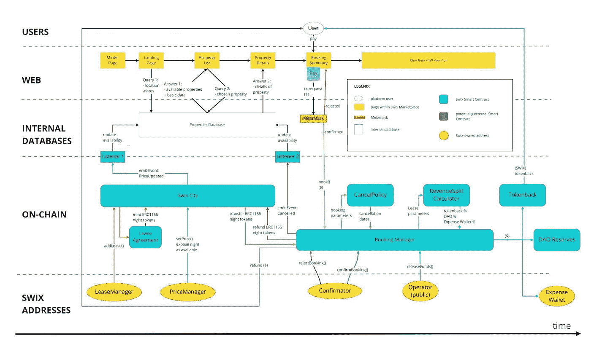
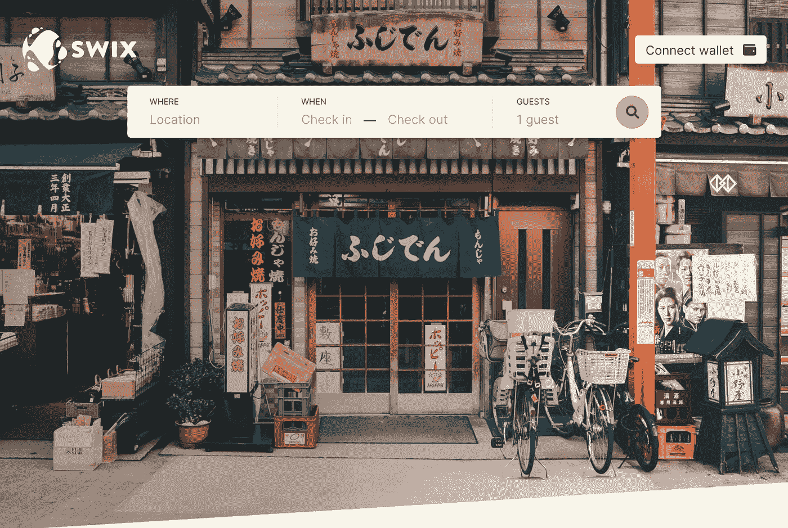

# 具有 Web3 优势的预订应用程序

> 原文：<https://medium.com/coinmonks/a-booking-app-with-the-benefits-of-web3-9a79167bca32?source=collection_archive---------9----------------------->

Swix dev 团队继续在基础设施方面努力工作，这将有助于整合真实世界的收入和链上机制。我们对迄今在发展该系统方面取得的成就感到非常自豪。我们将有史以来第一次能够将全球房地产租赁产生的真实收入纳入链中，全部由一个分散的自治组织 Swix DAO 管理。

来自早期社区成员的巨大热情和支持激励我们宣布提前发布 Swix 官方房产租赁平台的最低可行产品版本。我们已经决定向一群幸运的瑞士人开放 MVP 平台，以便在我们系统的初期进行测试和互动。

MVP 的开发重点是 Swix 最具创新性和独特性的特性和功能。

# Swix 预订平台 MVP:期待什么？

Swix 生态系统由多个组件组成，主要是预订平台和 Staking 以及绑定 dApp。为了实现最大限度的社区参与，我们选择了一个渐进的发布时间表。这个过程现在从部署我们的 MVP 预订平台(也称为市场)开始。

MVP 将专门展示市场 dApp 和与之相关的在线预订基础设施。这将使我们能够专注于系统的一个单一但有用的组件，并执行必要的压力测试，同时还可以作为社区关于我们系统功能的指导工具。

我们已经暂时将预订系统从赌注和绑定机制中分离出来，以将收入集中到 3 个独立的运营钱包中:令牌返还钱包、费用钱包和 DAO 储备钱包。

1.  *Tokenback Wallet* 将在 MVP 阶段模拟展示 Tokenback 奖励机制。从预订经理处收到资金后(见下图 1.1)，将会生成一定比例的 SWIX，并分发给购买住宿的用户。
2.  *支出钱包，用于支付每月租赁成本、客户关系和维护人员成本所需的资金，以及为新租赁业务再投资的收入部分。*
3.  **道储备钱夹*存放生成资金的一部分，这些资金被链入道国库。这些资金用于支持 SWIX，并以重计回报的形式分配给利益相关者。*

# *开放测试网*

*该展示将在孟买测试网上进行，限制 30 名社区成员进入。将随机选择参与会员，并在 testnet 上空投必要的令牌，以便通过他们的浏览器扩展钱包在我们的平台上预订住宿。*

*下面的图表给出了将接受测试的 MVP Swix 市场和预订平台的详细概述。*

**

*如上所述，所有的可用性，价格和预订数据将被存储和管理链，并通过我们的数据库传输到前端。我们以最简单的形式实现了 Tokenback 和 DAO Reserves，以确保测试重点针对我们的预订功能。*

*下面是 MVP 预订界面的预览:*

**

# *赢得伦敦之旅*

*一旦 Swixies 在 Mumbai testnet 上成功地与 Swix 预订平台 MVP 互动，并且所有的改进都已完成，我们将继续从最活跃和最有吸引力的 testnet 参与者中选出一名幸运的获胜者(TBD 标准)。*

*获胜者将获得在我们位于伦敦的美丽组合酒店入住两晚的机会，祝你们好运！*

*敬请关注，加入 Swix [discord](https://discord.gg/gXZAbBZbB6) 关注我们的公告。*

*干杯*

> *加入 Coinmonks [电报频道](https://t.me/coincodecap)和 [Youtube 频道](https://www.youtube.com/c/coinmonks/videos)了解加密交易和投资*

# *另外，阅读*

*   *[如何在 Uniswap 上交换加密？](https://coincodecap.com/swap-crypto-on-uniswap) | [A-Ads 评论](https://coincodecap.com/a-ads-review)*
*   *[WazirX vs coin dcx vs bit bns](/coinmonks/wazirx-vs-coindcx-vs-bitbns-149f4f19a2f1)|[block fi vs coin loan vs Nexo](/coinmonks/blockfi-vs-coinloan-vs-nexo-cb624635230d)*
*   *[本地比特币审核](/coinmonks/localbitcoins-review-6cc001c6ed56) | [加密货币储蓄账户](https://coincodecap.com/cryptocurrency-savings-accounts)*
*   *[什么是保证金交易](https://coincodecap.com/margin-trading) | [美元成本平均法](https://coincodecap.com/dca)*
*   *[支持卡审核](https://coincodecap.com/uphold-card-review) | [信任钱包 vs 元掩码](https://coincodecap.com/trust-wallet-vs-metamask)*