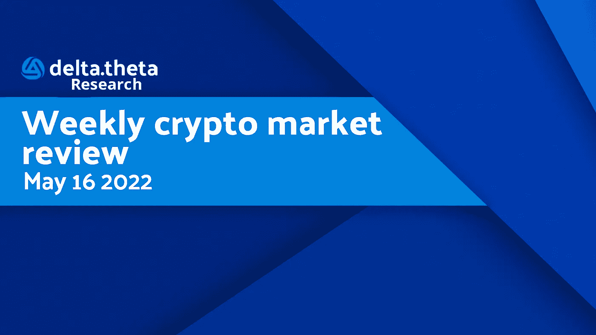
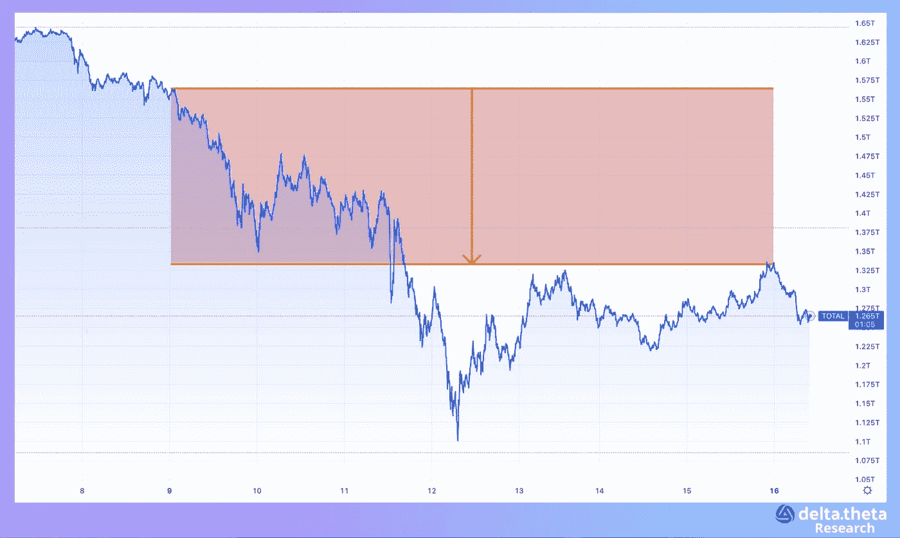
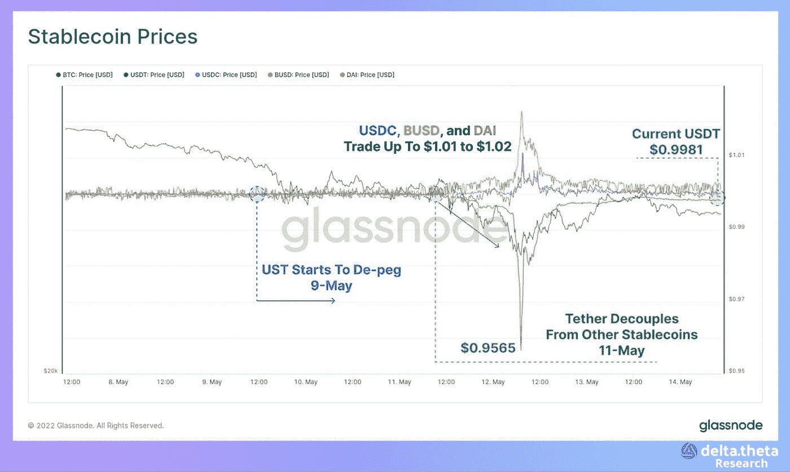
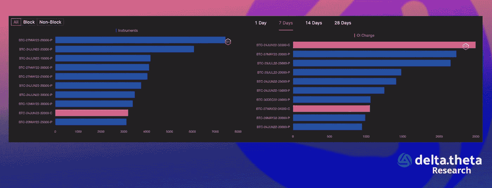
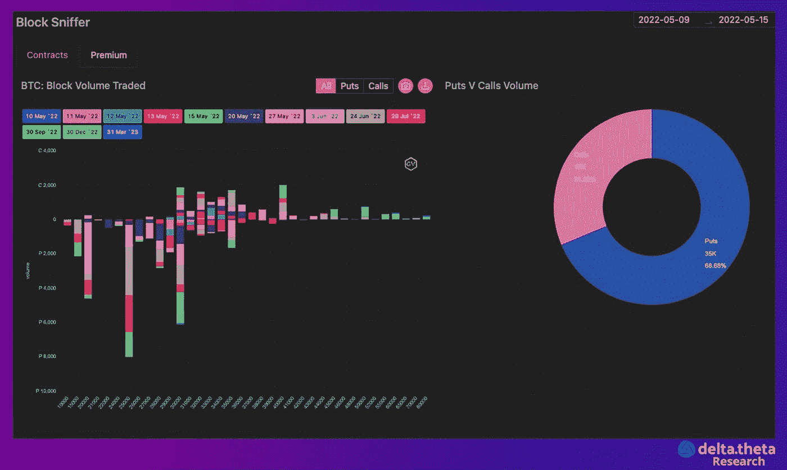

# 加密市场风暴过后的喘息

> 原文：<https://medium.com/coinmonks/a-break-after-the-storm-on-the-crypto-market-97caa616a3dd?source=collection_archive---------27----------------------->

上周，加密市场又遭受了一次敏感的“打击”。本周伊始，加密货币总市值指数为 1.475 万亿美元。从本周开始，该指数开始快速下降，2 天后我们可以看到该指数处于 2021 年 7 月中旬以来的最低值——1.125 万亿美元。随后，这一跌幅弥补了约 55%，至 1.305 万亿美元。该指数在本周剩余时间内保持横盘整理，本周收于 1.3 万亿美元。

“数字黄金”，又名比特币，本周以 33 100 的价格水平开始。本周已经落后于跳水，许多市场参与者希望出现反转。然而，UST/特拉局势的另一轮发展在市场上造成了额外的恐慌，而“第一种加密货币”(其中很大一部分在特拉项目的储备中)的汇率跌至 26 220。在本周余下的时间里，该指数停留在 28 760 点至 31 350 点之间，然后停在 29 900 点。随着 Terra 的管理层声称其储备中几乎所有的 BTC(总计约 30 亿美元)都已售出，我们可以假设从现在起比特币价格的这一压力因素已经消除(这不排除进一步下跌，因为其他因素仍然存在)。

在以太网的情况下，价格动态实际上是相同的:在 2400 开始，局部下跌到 2200，并在最初几天恢复到 2450。然后，我们可能会看到大幅下跌至 1790 点(上一次这样的数据是在一年前)，然后在本周剩余时间内，在 2150-1955 点的范围内反弹并横盘整理。这一周结束于 2025。

# 新闻

当然，上周的大新闻是曾经的蓝筹股 DeFi Terra/Luna 的情况。UST 币价格下跌至 0.11 美元，而本地卢娜币下跌至小数点后五位(市值低于 3 亿美元)。所有这些都是在月神令牌大规模发行的背景下发生的，月神令牌的总供应量上升到了 6.9 万亿个(用户已经称之为新的“迷因币”)。在那之后，许多交易所限制了露娜的交易，而资产则变成了纯粹的投机。Terra 区块链创始人 Do Kwon first [发布了一份初步提案](https://www.theblockcrypto.com/linked/146875/do-kwon-pitches-revival-plan-for-terra-blockchain-with-distributions-to-luna-and-ust-holders)，该提案谈到重启区块链，并主要向 Luna 和 UST 持有者分发 10 亿个新令牌，直到“黑客”事件发生。随后，他通过创建一个网络“分叉”(一个新的副本)并向当前持有者丢弃新的令牌来充实它。Kwon 建议称旧网络为 Terra Classic。Terra 社区的大多数人[强烈反对这个提议](https://www.theblockcrypto.com/post/147289/terra-community-seems-dead-set-against-do-kwons-fork-proposal)。同样未知的是 Terra 储备中 12 亿美元比特币的命运。

贸易公司 Robinhood [计划在 2022 年底发布一款专注于分散化金融(DeFi)的新型密码钱包](https://www.theblockcrypto.com/linked/147333/robinhood-launches-defi-wallet-to-rival-metamask)。罗宾汉首席执行官弗拉德·特纳夫(Vlad Tenev)在棕榈滩的无许可会议上宣布了“网络 3 密码钱包”。钱包的用户，完全独立于该公司的其他网络 3 平台，将能够贷款、堆叠、耕种和购买 NFT——就像元面具钱包一样。这些功能在以前的罗宾汉钱包中缺失。目前还不清楚新钱包会支持哪个区块链。

英国 fintech 公司 Revolut 的创始人尼古拉·斯托龙斯基(Nikolay Storonsky)即将推出自己的人工智能风险投资基金。这家名为 QuantumLight Capital 的新公司将管理 2 亿美元的资金，这些资金将由斯托龙斯基和其他投资者提供。根据该公司网站称，该项目团队包括独角兽技术公司的创始人、量子交易者、人工智能领域的科学家和工程师。该基金将使用一种称为 Aleph 的解决方案作为其“专有定量决策引擎”来识别投资机会。

为 DAOs 和 web3 公司提供资金管理工具的印度加密初创公司 Coinshift 在第一轮融资中筹集了 1500 万美元，并计划扩张到新区块链。泰格全球(Tiger Global)领衔了这一轮，该公司还包括红杉资本印度公司、阿拉米达风险投资公司、斯巴达集团、以太风险投资公司、多边形工作室等。天使投资者包括产品狩猎和周末基金的创始人瑞安·胡佛、OpenSea 运营副总裁湿婆·拉贾拉曼和 FalconX 的创始人普拉巴卡尔·雷迪。

# 市场情况

在 Terra(Luna)生态系统和当地 UST steblecoin 的巨大崩溃之后，是时候进行一次快速的中期回顾了。底线是，作为新的韩国加密美元对应货币抵押品的 8 万枚比特币被用于(在交易所出售)试图保持 1 比 1 联系汇率的努力失败，并在 3 天内耗尽了逾 24 亿美元的总储备。此外，现货市场如此大的头寸清算导致 BTC 实现了超过 150 点的惊人波动。袭击的时间，以及筹集资金的方法和金额，表明牵涉到一个类似 Citadel 或高盛的大型交易平台。

如此大规模的事件(超过 200 亿美元的生态系统的清算)不能不影响整个市场。最重要的稳定因素之一，USDT，在恐慌抛售中损失了大约 10%的价值，并且大交易者抛售美元。因此，尽管最低 BTC 金额高达 26 000 英镑，但由于违反了联系汇率制度，一些头寸被清算至 23 600 英镑，这导致了额外的损失。结果，大约 70 亿美元从 USDT 撤出，其中一些流入了另一个 USDC 堆栈。目前，密码市场已经企稳，但前景依然暗淡。

看跌期权交易继续主导期权市场。交易员仍不认为市场会出现重大逆转，只是预计 6 月份可能会出现短期调整。前一周的大幅下跌导致交易 15000–20000、25 000 份到期日在 5 月下旬和 6 月的看跌期权的兴趣增加。另一方面，6 月底有几笔执行日期为 32 000 的大额看涨期权交易。

大宗(两个或更多)期权交易集中在未来两个月的交易对冲头寸，使用 30000–25000 的看跌价差。在这种设计下，一个期权交易是通过出售期权的溢价来融资的。给定最活跃的水平，交易者的预期可以解释为对利率波动性下降和处于走廊的预期。

就价格走势而言，上周是最重要的一周。在如此强劲的波动之后，通常会有一个相对的停顿，这对波动性高的卖家或进入或发展市场头寸非常方便。新闻日历几乎没有留下大幅波动的空间，让人以为最大的跌幅已经发生。至少在五月…

> 加入 Coinmonks [电报频道](https://t.me/coincodecap)和 [Youtube 频道](https://www.youtube.com/c/coinmonks/videos)了解加密交易和投资

# 另外，阅读

*   [Bookmap 点评](https://coincodecap.com/bookmap-review-2021-best-trading-software) | [美国 5 大最佳加密交易所](https://coincodecap.com/crypto-exchange-usa)
*   最佳加密[硬件钱包](/coinmonks/hardware-wallets-dfa1211730c6) | [Bitbns 评论](/coinmonks/bitbns-review-38256a07e161)
*   [新加坡十大最佳加密交易所](https://coincodecap.com/crypto-exchange-in-singapore) | [购买 AXS](https://coincodecap.com/buy-axs-token)
*   [红狗赌场评论](https://coincodecap.com/red-dog-casino-review) | [Swyftx 评论](https://coincodecap.com/swyftx-review) | [CoinGate 评论](https://coincodecap.com/coingate-review)
*   [投资印度的最佳密码](https://coincodecap.com/best-crypto-to-invest-in-india-in-2021)|[WazirX P2P](https://coincodecap.com/wazirx-p2p)|[Hi Dollar Review](https://coincodecap.com/hi-dollar-review)
*   [加拿大最佳加密交易机器人](https://coincodecap.com/5-best-crypto-trading-bots-in-canada) | [KuCoin 评论](https://coincodecap.com/kucoin-review)