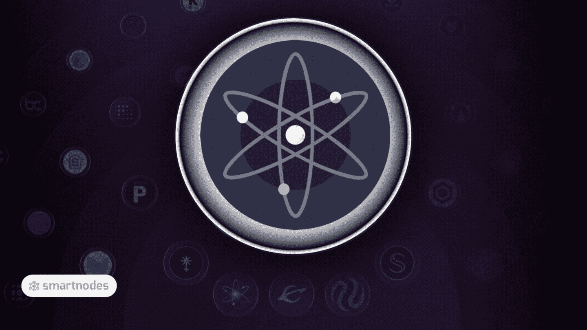
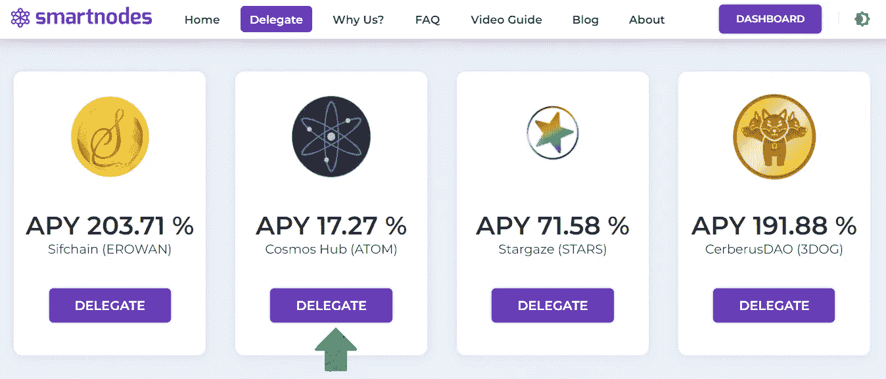
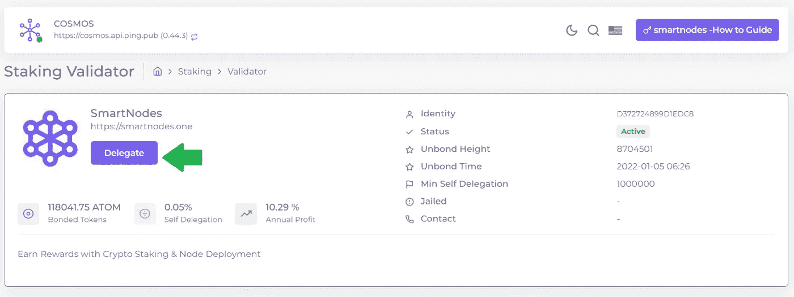
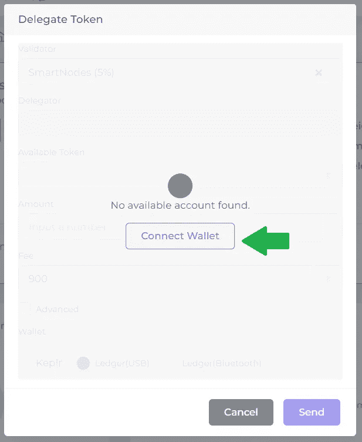
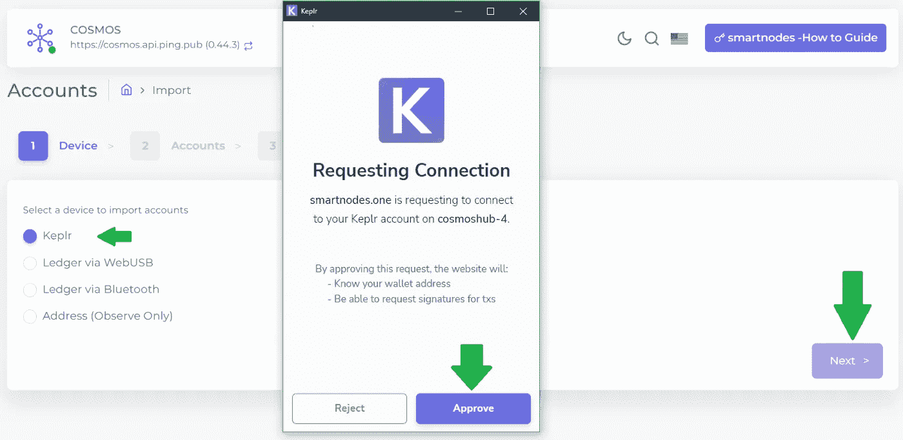
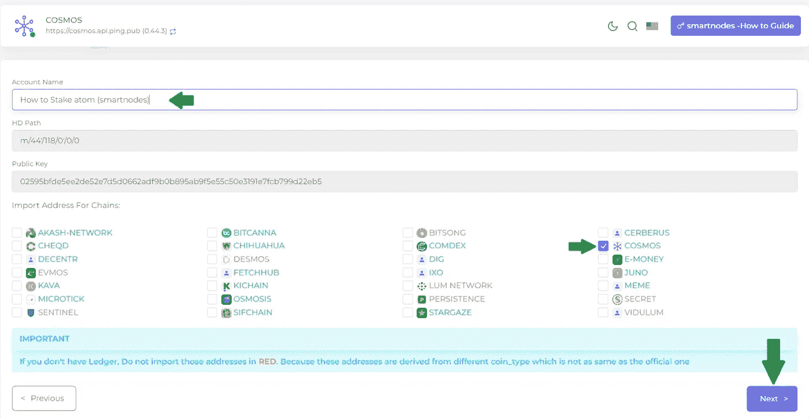
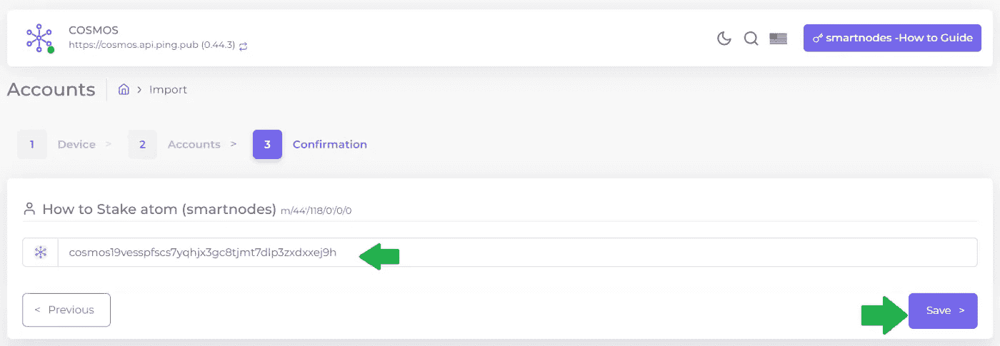
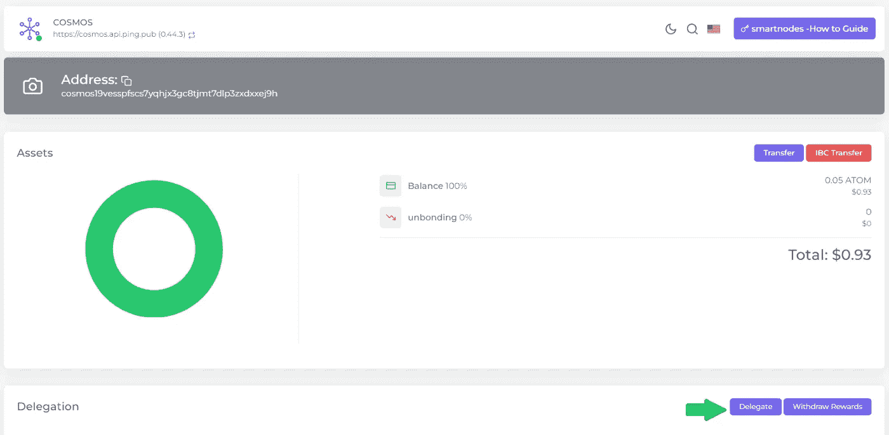
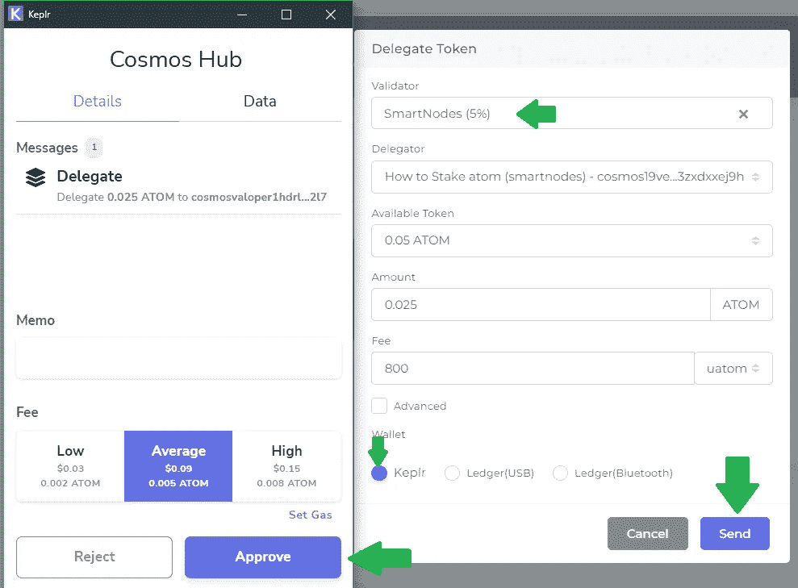
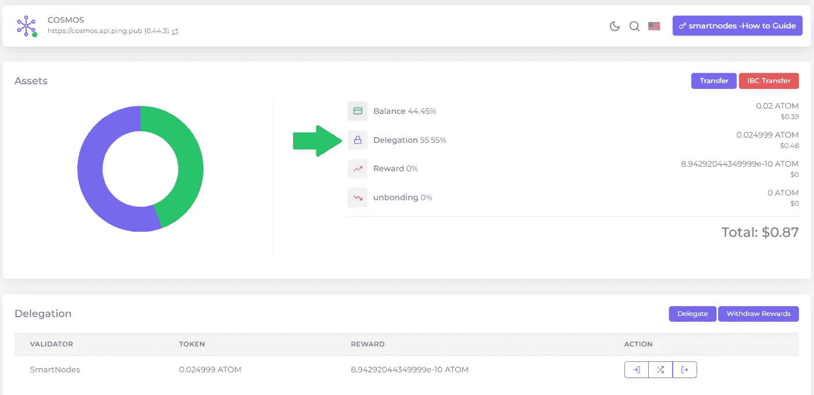

# 关于如何对宇宙(原子)下赌注的简要指南

> 原文：<https://medium.com/coinmonks/a-brief-guide-on-how-to-stake-cosmos-atom-5a5f51d58ea6?source=collection_archive---------14----------------------->

宇宙

Cosmos 是一个快速增长的互联区块链生态系统，由开发人员友好的应用程序组件创建，并由开创性的 IBC ( [区块链间通信](https://cosmos.network/))协议连接。

在管理着超过 1400 亿美元数字资产的宇宙网络中，有超过 265 个应用程序和服务，其中包括币安链、泰拉、Crypto.org 和宇宙中心。

**原子**

原子令牌是宇宙中枢的本地令牌。Cosmos Hub[收到交易费和股权奖励证明，作为交换，通过入股 ATOM 来确保该中心的服务。](https://blog.cosmos.network/)

随着链间分散交易所(Gravity DEX)和链间 Staking 等新服务的加入，staked ATOM 将能够保护生态系统中的其他区块链，这些激励措施有望大幅增加。

Cosmos [https://cosmos.network/ecosystem/apps](https://cosmos.network/ecosystem/apps)

哪里可以买到 ATOM token？

1.  币安 (CEX)
2.  比特币基地 (CEX)
3.  Junoswap (指标)
4.  库币 (CEX)
5.  [渗透作用](https://app.osmosis.zone/?from=UST&to=ATOM)德克斯
6.  北海巨妖 (CEX)
7.  瓦济里克斯 (CEX)
8.  FTX (CEX)
9.  [液体](https://app.liquid.com/exchange/ATOMUSDT) (CEX)
10.  [Crypto.com](https://crypto.com/exchange/trade/ATOM_USDT)(CEX)

**如何入股 ATOM Token？**

在交易所购买后，你需要将这些 ATOM 代币转移到一个自我保管的钱包中。

*   **自保管钱包(最受欢迎的一款)**

1.  [开普勒](https://wallet.keplr.app/#/dashboard)
2.  [宇宙站](https://wallet.cosmostation.io/cosmos)

将资产转移到新钱包后，打开 [smartnodes.one](https://smartnodes.one/staking/cosmos?apr=17.54&link=http%3A%2F%2Fsmartnodes.one%2Fdashboard%2Fcosmos%2Fstaking%2Fcosmosvaloper1hdrlqvyjfy5sdrseecjrutyws9khtxxaux62l7) 来下注您的 **ATOM 代币**。

**第一步** —进入代表区，找到**宇宙中枢(ATOM)，点击** **代表。**

[https://smartnodes.one/#delegate](https://smartnodes.one/#delegate)

**第二步-**-**再次点击**进行委托。

[https://smartnodes.one/dashboard/cosmos](https://smartnodes.one/dashboard/cosmos)

**步骤 3 -** 连接您的 Keplr 钱包。

[https://www.keplr.app/#starters](https://www.keplr.app/#starters)

**第四步-** **选择 Keplr**-点击下一步-点击批准。

**步骤 5-** 输入帐户名，确保在链的导入地址中选择了 **COSMOS** 。**点击下一步。**

[https://smartnodes.one/dashboard/wallet/accounts](https://smartnodes.one/dashboard/wallet/accounts)

**步骤 6-** 确认，检查您的地址是否正确添加，并点击保存。

[https://smartnodes.one/dashboard/cosmos](https://smartnodes.one/dashboard/cosmos)

**第 7 步-** 您已成功将 ATOM 令牌导入到 [Smartnodes.one](http://smartnodes.one/)

接下来，单击“委托”,继续进行立桩。

**第八步**——现在选择 [**验证器**](http://smartnodes.one/) ，输入想要下注的金额，填油费为 800，选择 Keplr 钱包，点击**发送。**

**第九步** - **批准**Keplr 弹出窗口中的交易。

[https://www.keplr.app/#starters](https://www.keplr.app/#starters)

**第 10 步-** 恭喜你，你已经成功地用 Smartnodes 下注了你的**ATOM token**(你还可以看到你的资产分配、奖励和余额)。

# 关于智能节点

1.  [Smartnodes](http://smartnodes.one/) 验证器是一个[利益证明](https://www.fool.com/investing/stock-market/market-sectors/financials/cryptocurrency-stocks/proof-of-stake/)服务，提供 100%斜线和双符号退款保护。
2.  我们在宇宙中非常活跃，尽我们所能给予支持。我们是社区驱动的。验证者积极地对提案进行投票，以帮助确保适当的治理。
3.  [Smartnodes](https://smartnodes.one/#faq) 使用的基础设施是最好的，有 10 层安全措施来保护您的资产。
4.  我们目前正在 33 个加密货币链上提供[利益证明](https://www.investopedia.com/terms/p/proof-stake-pos.asp)服务(POS ),并在不断增长，请查看我们的网站了解我们的验证器节点。 [Smartnodes.one](https://smartnodes.one/dashboard/)

socials |[*Reddit*](https://www.reddit.com/r/smart_nodes/)|[|*Twitter*|](https://twitter.com/nodes_smart)|[|*网站*](https://smartnodes.one/)|[|*电报*](https://t.me/smartnodesvalidators)*|[|*insta gram*](https://www.instagram.com/smartnodes_validator/)|[不和](https://discord.gg/TA3UVPwn6D)*

**

> *加入 Coinmonks [电报频道](https://t.me/coincodecap)和 [Youtube 频道](https://www.youtube.com/c/coinmonks/videos)了解加密交易和投资*

# *另外，阅读*

*   *[如何获得自己的。XYZ 领域？](https://coincodecap.com/xyz-domain)*
*   *[最佳加密交换平台](https://coincodecap.com/best-crypto-swap-platforms) | [最佳加密交易所](https://coincodecap.com/crypto-exchange)*
*   *[购买比特币印度](/coinmonks/buy-bitcoin-in-india-feb50ddfef94) | [Pionex 评论](/coinmonks/pionex-review-exchange-with-crypto-trading-bot-1e459d0191ea) | [加密交易机器人](/coinmonks/crypto-trading-bot-c2ffce8acb2a)*
*   *[n rave ZERO Review](/coinmonks/ngrave-zero-review-c465cf8307fc)|[phe MEX Review](/coinmonks/phemex-review-4cfba0b49e28)|[PrimeXBT Review](/coinmonks/primexbt-review-88e0815be858)*
*   *最佳[区块链分析](https://bitquery.io/blog/best-blockchain-analysis-tools-and-software)工具| [赚比特币](/coinmonks/earn-bitcoin-6e8bd3c592d9)*
*   *[Cloudbet 赌场评论](https://coincodecap.com/cloudbet-casino-review) | [点火赌场评论](https://coincodecap.com/ignition-casino-review)*
*   *[加密套利](/coinmonks/crypto-arbitrage-guide-how-to-make-money-as-a-beginner-62bfe5c868f6)指南| [如何做空比特币](/coinmonks/how-to-short-bitcoin-568a2d0b4ae5)*