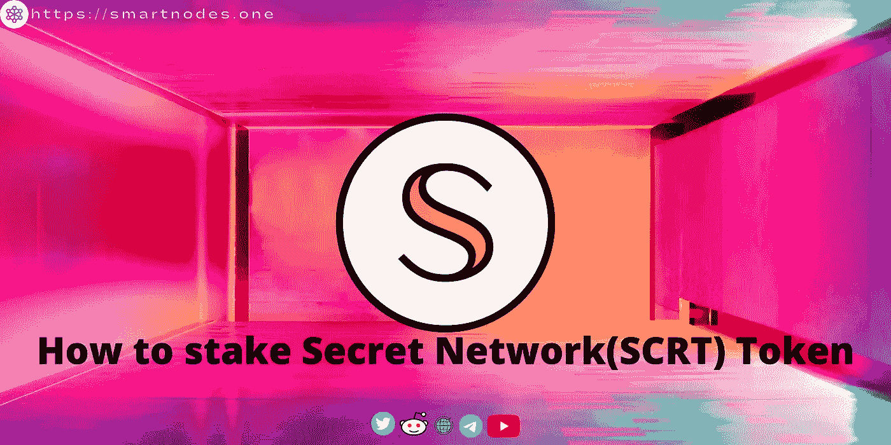
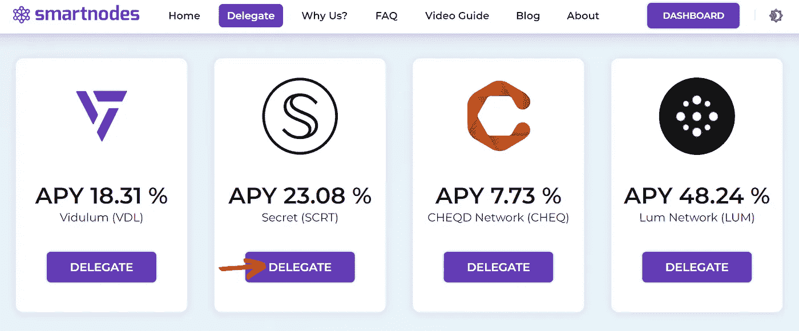
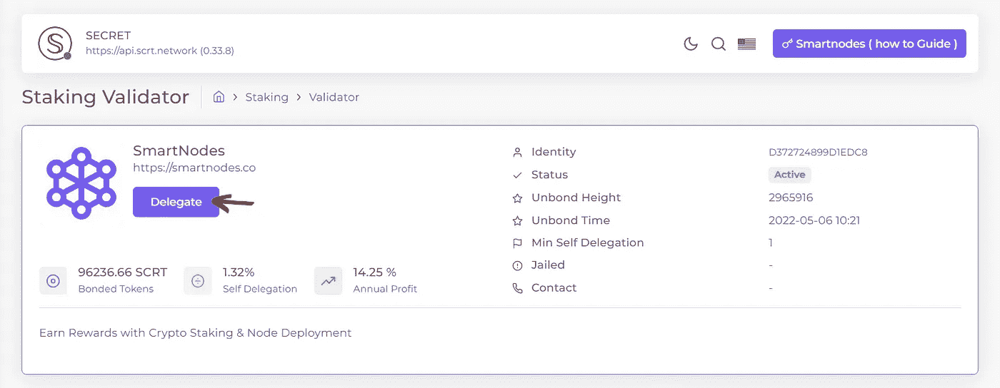
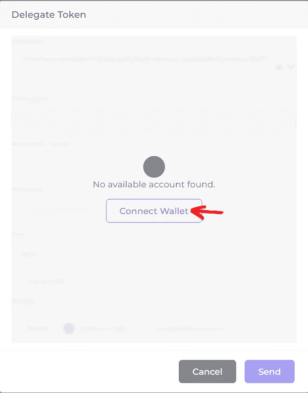
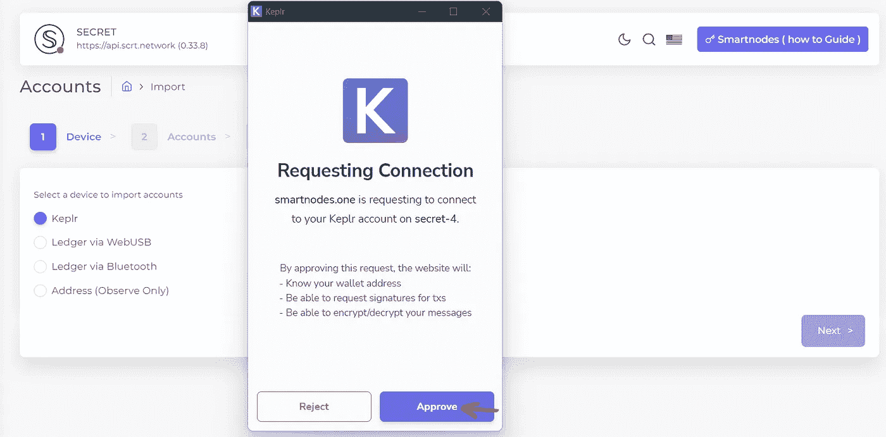
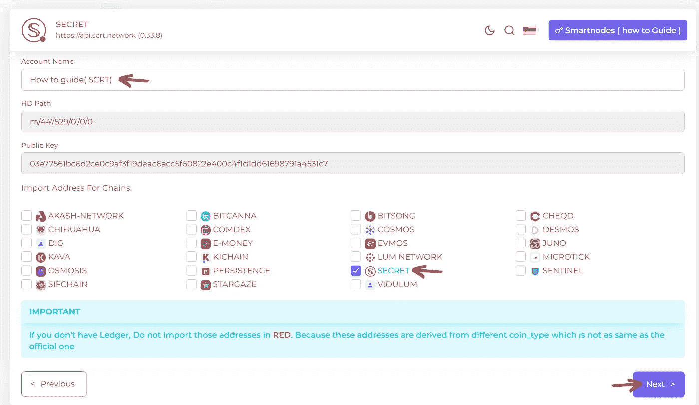
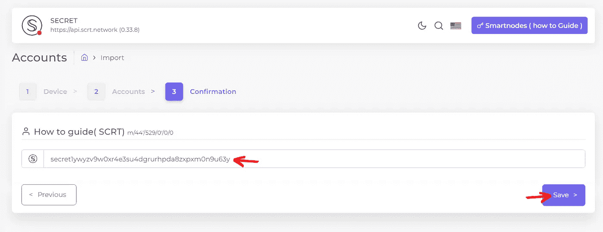
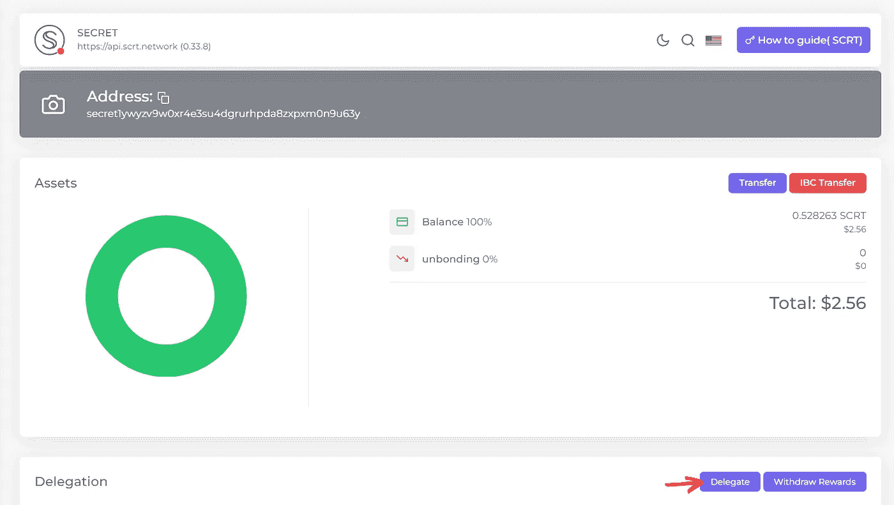
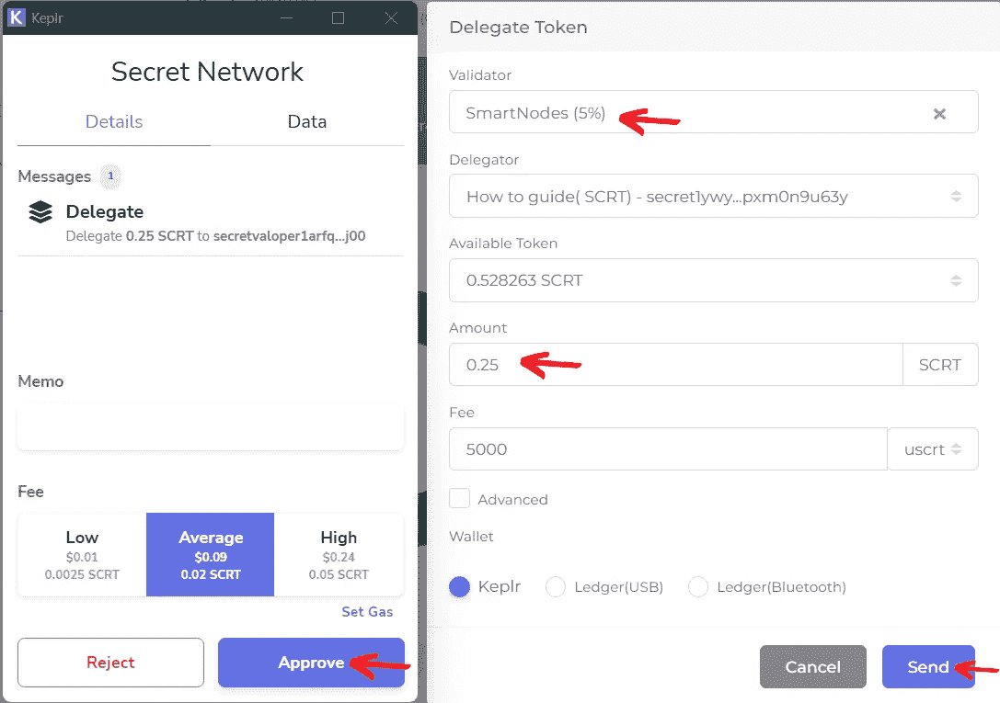
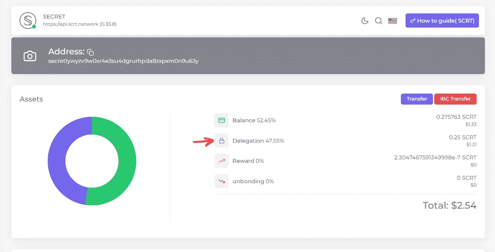

# SA 关于如何标记秘密网络(SCRT)令牌的简要指南

> 原文：<https://medium.com/coinmonks/a-brief-guide-on-how-to-stake-secret-network-scrt-token-f8c7e42833dc?source=collection_archive---------28----------------------->

Secret Network Staking Guide by Smartnodes Validator

secret Network**是第一个默认的具有数据隐私的区块链，允许您构建和使用既无权限又保护隐私的应用程序**。这一独特的功能保护了用户、保护了应用程序，并开启了 Web 3 的数百个新用例。

秘密网络的本地硬币 Secret (SCRT)由这个符号𝕊表示，用圆圈围住。秘密𝕊唤起了流动的网络和秘密的双重性:**隐私**和**透明**。

𝕊的两端是开放的，允许数据自由流入和流出。𝕊的内部是私有的，是一个封闭网络本身活动的飞地。

S 的整体形状让人想起阴阳，再次反映了保护隐私的公共网络的许多二重性——这是一种高度复杂的**技术**,旨在深度保护**人类**价值观。

自今年 2 月该网络成立以来，SCRT 一直被用于标桩和治理，多个提案成功通过。

Cosmos Project review: Secret Network ($SCRT) by popular Youtuber
Crypto Conscious

# 我们在哪里可以买到 SCRT 代币？

你可以在分散型(称为 DEX)和集中型(称为 CEX)交易所购买 SCRT 代币。

1.  [渗透](https://app.osmosis.zone/?from=UST&to=SCRT) (DEX)
2.  [朱诺互换](https://junoswap.com/)(指数)
3.  币安 (CEX)
4.  北海巨妖 (CEX)
5.  [SiennaSwap](https://app.sienna.network/swap)

# 如何在秘密(SCRT)令牌上下注？

在交易所购买后，你需要将这些秘密代币(SCRT)转移到一个自我保管的钱包中。

**自己保管钱包**

1.  K [eplr](https://wallet.keplr.app/#/)
2.  宇宙站
3.  宇宙站安卓

将资产转移到新钱包后，打开 [smartnodes.one](https://smartnodes.one/) 来下注 **SCRT 代币**。

第一步-去代表区，找到秘密网络(SCRT)。**点击代表**

**第二步-** **再次点击**进行委托。

**第 3 步-** 连接你的 Keplr 钱包

[Keplr is a browser extension wallet for the Inter blockchain ecosystem.](https://chrome.google.com/webstore/detail/keplr/dmkamcknogkgcdfhhbddcghachkejeap?hl=en)

**第 4 步-** 选择 Keplr 点击批准。

**步骤 5-** 输入帐户名，确保在链的导入地址中选择了**秘密网络**。**点击下一步。**

**第 6 步-** 确认检查您的地址是否正确添加，并点击保存。

**步骤 7-** 您已经成功地将您的 **SCRT** 导入到 [Smartnodes.one](http://smartnodes.one/)

接下来，单击“委托”,继续进行立桩。

**第八步**——现在选择 [**验证器**](http://smartnodes.one/) ，输入想要下注的金额，填油费为 5000，选择 Keplr 钱包，点击**发送。**

**第九步** - **批准**Keplr 弹出窗口中的交易。

**第 10 步-** 恭喜你，你已经成功将你的 **SCRT** 与 [Smartnodes](https://smartnodes.one/staking/secret?apr=23.56&link=https%3A%2F%2Fsmartnodes.one%2Fdashboard%2Fsecret%2Fstaking%2Fsecretvaloper1arfql9hv2m8nq3ssyjd0z8t4r4vh5senz5sj00) 押上(你还可以看到你的资产分配、奖励、余额)。

# 关于智能节点

1.  [Smartnodes](http://smartnodes.one/) 验证器提供 100%全额退款斜线和双符号保护。
2.  我们在宇宙中非常活跃，尽我们所能给予支持。我们是社区驱动的。 [Smartnodes](http://smartnodes.one/) validator 积极地对提案进行投票，以帮助确保适当的治理。
3.  [Smartnodes](http://smartnodes.one/) 使用的基础设施是最好的，有 10 层安全措施来保护您的资产。
4.  我们目前正在 28 个连锁店进行验证，并且还在增长，请查看我们的验证节点网站。( [Smartnodes.one](https://smartnodes.one/videoGuide)
5.  如有任何其他问题，请随时在我们的社交媒体上联系团队成员，或发邮件至 hello@smartnodes.one

socials |[*Reddit*](https://www.reddit.com/r/smart_nodes/)|[|*Twitter*](https://twitter.com/nodes_smart)|[|*网站*](http://smartnodes.one/)|[|*电报*|](https://t.me/smartnodesvalidators)[|*insta gram*](https://www.instagram.com/smartnodes_validator/)|

> 交易新手？试试[加密交易机器人](/coinmonks/crypto-trading-bot-c2ffce8acb2a)或者[复制交易](/coinmonks/top-10-crypto-copy-trading-platforms-for-beginners-d0c37c7d698c)