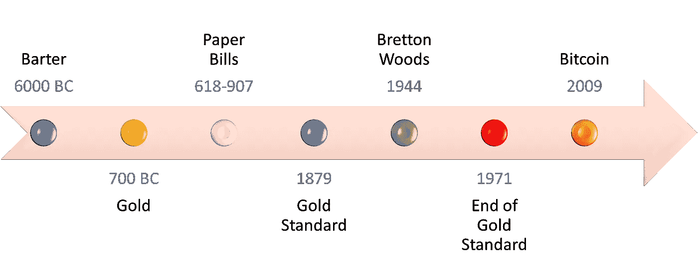
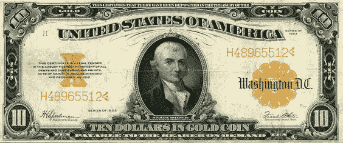
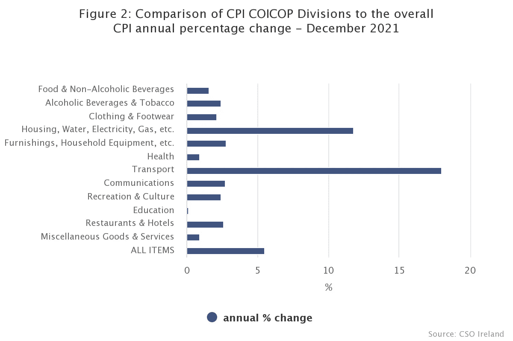

# 货币、中央银行和货币简史

> 原文：<https://medium.com/coinmonks/a-brief-history-of-money-central-banks-and-currencies-46b1b7805724?source=collection_archive---------6----------------------->

在一个有很多东西可以卖的世界里，我们坚持把梦想卖给彼此。你在这里什么也找不到。有一些混乱，活跃的东西在其他单调的主题。尽管如此，讨论将是货币、中央银行和货币的简史。将特别关注通货膨胀和通货紧缩的货币政策。

## ***金钱的历史***

与普遍的看法相反，它始于公元前 6000 年的物物交换制度。物物交换是一种资源与另一种资源的交换，就像农民用牛奶换新衣服一样。以物易物需要找到一个拥有你想要的东西的人，他们想要你提供的东西。通常需要多次尝试才能完成交易。有些人认为钱是由珠子、贝壳、硬币等货币发展而来的。货币实际上表现为通过建立一个标准的交换单位来解决物物交换系统中的缺陷。从今以后，货币、现金和金钱将互换使用，表示同一件事。

健全货币有 5 个属性:

1.  可分的
2.  持久耐用
3.  能证实的
4.  轻便的
5.  缺乏的

人们很快就会意识到牛奶没有这些特性。健全的钱是一个短语创造的声音时，黄金下降，以验证其真实性。突然变得很清楚为什么爱尔兰人用“声音”作为俚语来描述一个真正的人。一种货币只有在所有 5 个特征都得到坚持的情况下才能被认为是可靠的货币。今天的钱能算健全吗？在整个人类历史中，货币已经改变了几次，所以它很可能再次改变。虽然，在一生中看到新的货币被发明出来是令人震惊的。你可能知道我要说什么，但请保持这个想法。

纸质票据的使用可以追溯到中国唐代 618-907 年。商人可以将纸币兑换成金币，反之亦然。然而，这在今天是做不到的。现在的法定纸币是不同的，因为它们不能兑换任何东西。法定货币基本上意味着“法令规定的价值”。因此，法定货币之所以有价值，只是因为政府说它有价值。

> 还记得我说过的出售梦想吗？最大的谎言不是魔鬼让世界相信他不存在，而是政府让公众相信他们的纸币有价值。

Timeline of the History of Money. Inspired by Mohen Hassan and adapted by me in Microsoft Word.

## ***央行***

让我们明确一点，我不是无政府主义者，但我擅长直言不讳。在中国消失很久之后，欧洲人在 17 世纪采用了纸币。第一批在欧洲流通的纸币是由斯德哥尔摩银行于 1661 年制造的。这些纸币也可以兑换成金币。这种纸币是一种欠条(我欠你的)，是对债务的承认。因此，人和企业之间的交易被分类为债务人、所欠金额和债权人。债务人会给一张写有所欠金额的借据。债权人会去当地银行兑换黄金。

> 最终，银行意识到，他们给的人打印的借条并没有在同一时间返回黄金。这就是部分准备金银行的开端。

这种银行方法是一种政策，即银行只持有其资金分配的一小部分，并将其余部分贷出以产生利息。这是不可持续的，因为有时人们会同时进行银行挤兑。当地银行将无法兑现借据的赎回，因为他们不再有黄金。他们增加了货币供应量，使其不那么稀缺。中央银行的发展是为了防止银行挤兑的发生。你的父母和祖父母不信任银行的原因开始说得通了吧？

第一家中央银行是成立于 1694 年的英格兰银行。中央银行监管地方银行。只有中央银行可以印刷纸币，而旧银行一旦破产，就需要让纸币退出流通。很快就只剩下央行票据了。现在每个国家都有一个由政府管理的中央银行，负责该国的货币。

虽然爱尔兰在欧盟(EU)，但爱尔兰仍有自己的央行。有趣的是，这不是爱尔兰银行。这里有一点怀旧——在 Dame Street 的中产阶级化之前，在 Temple Bar 的文化中心有一个巨大的灰色建筑，上面有一个巨大的金球。Emos 和 Spicers 都曾在“银行”见面。老实说，每个人都在那里相遇，因为那是一个显著的地标。那家银行是我们的中央银行，直到它被推倒，取而代之的是中央广场。爱尔兰的中央银行搬到了码头区。爱尔兰欧元硬币也不是在那里铸造的。爱尔兰造币厂位于都柏林的桑迪福德。

***金本位***

This is an example of an I.O.U./Gold dollar bill showing a banknote as $10 ‘in gold coin’.

当国家印制太多央行白条时，白条就成了问题。他们再一次打破了健全货币所要求的稀缺性的基本规则。儿歌中的一个经典例子是，老太太吃了苍蝇，然后一只蜘蛛去抓苍蝇，接着一只鸟去抓蜘蛛，等等。最初的问题没有解决，反动的解决方案使事情变得更糟。同样，地方银行膨胀的欠条没有被中央银行解决，但金本位制来了。各国需要支撑自己的货币。因此，美国在 1879 年建立了金本位制。

当年，一盎司黄金可以换 20.67 美元。金本位制抑制了纸币的使用。剧烈的通货膨胀得以避免，但持续时间不长。1914 年第一次世界大战后，金本位制发生了变化，这导致了 1929 年的大萧条。这是因为美国政府印的钱比实际多。1930 年，英国和美国停止将纸币兑换成金币。没有足够的黄金来支持他们额外印制的钞票。他们需要印更多的钱(来刺激经济)。

政府发现，人们越有钱，就会花得越多。这在今天仍然适用，例如 2008 年的经济衰退和最近的 covid 疫情付款。20 世纪 30 年代的公民希望让他们的钱物有所值，而不是存起来，因为以后，这些钱不会有同样的价值。这种差异可以在现代版的美钞中观察到，美钞不再与黄金挂钩。

## ***《布雷顿森林协定》***

In this US dollar, there is no longer a reference to gold. This is a Fiat dollar bill.

一些国家想印多少就印多少，这引发了一些问题，因为一些国家故意让本国货币贬值，以增加出口价值。1944 年，美国总统罗斯福促成了布雷顿森林协定的达成。44 个国家在新罕布什尔州开会，同意所有货币都由美元支持，美元由黄金支持。国际货币基金组织(货币基金组织)同时成立。国际货币基金组织的作用是贷款给有需要的国家。在此期间，世界银行也成立了，专门帮助发展中国家。部分原因是第二次世界大战的影响，第二次世界大战一直持续到 1945 年才结束。

布雷顿森林协定确保全球货币的汇率是固定的。这也是抑制纸币使用的一种手段。然而，这一政策是短命的，并于 1971 年被美国总统尼克松终止。美元及其支持的所有全球货币都变成了浮动货币，也就是说，没有任何支撑。这也解释了如今汇率波动的原因。

## ***通货膨胀与通货紧缩—结论***

自布雷顿森林协定签署以来的 51 年里，由于通货膨胀，美元已经贬值了 85%。也就是说，1971 年省下的 1 美元，现在是 2022 年的 0.15 美分。当你增加储蓄的资本时，这是很明显的。当时的 100 美元现在值 15 美元。当时的 1000 美元现在值 150 美元。购买力的丧失是可怕的，尤其是如果你想给你的孩子留下遗产的话。

> 通货膨胀就像一个小偷每天进你家偷一样东西。当你注意到你就像🤬当货币被中央集权垄断时，就会发生这种情况。

难怪全球最大对冲基金的所有者雷伊·达里奥普及了“现金是垃圾”这句话。法定货币会导致通货膨胀，而且是集中的(由一个机构控制)。不值得长期持有。所有爱尔兰银行都普遍提供垃圾储蓄利率。存款利息只有区区 25 个基点(0.25%)。如果你加上消费者价格指数(CPI)显示爱尔兰经济在 2021 年膨胀了 2.4%的背景——储蓄并没有减少打击。在我看来，爱尔兰中央统计局(CSO)的总体 CPI 平均值不是一个足够好的通胀指标，因为它因人而异，因部门而异。例如，司机会比那些不开车的人更快地注意到最近汽油价格的上涨。这方面的证据可以在下图中看到。

Figure formulated by CSO data illustrating inflation in certain sectors from 2017–2021

在寻找更好的工作之前，我会为紧急情况储备足够的钱。有钱人都知道这一点。有一个比喻说“穷人花钱。中产阶级储蓄。富人投资”。你会发现，在我的文章中，问题不仅仅是被识别出来，它们还会有解决方案。当你唯一拥有的资产是钱的时候，通货膨胀就是一个敌人。如果你有房子或股票，经济膨胀是一件好事，因为它增加了这些稀缺资产的价值。这是基本的供求经济学。例如，如果海边只有 1000 套房子，而该地区的每个人都得到了加薪，那么海边的房子也会涨价。这是因为更多的钱(或需求)追逐同样的商品供应。

资产是随着时间的推移而增值的有价值的东西。我们已经证实，金钱会随着时间的推移而贬值。钱怎么是资产？有不同的资产类别，如股票、债券、商品、房地产、收藏品等。它们是通货紧缩的(稀缺的)。货币并不稀缺，因为政府过度印钞。现金是一种流动资产，很容易转换成其他东西(可替代的)。当懂金融的人说他们是“流动的”时，他们的意思是当他们的其他资产被套牢时，他们有现金可以使用。当你在谷歌上搜索一个名人的净资产时，你看到的是他们的资产在变现(出售)后的价值估计。

加密货币是去中心化(由公众控制)的通缩资产。在本文的剩余部分，我将专注于比特币(BTC ),因为我计划在下周的发布中更深入地研究加密。2008 年金融危机后，比特币由化名中本聪于 2009 年创造。基于本文开头描述的品质，BTC 是稳健货币的典型。它可以被分割成一亿个单位。比特币是持久的 T2，因为它运行在世界上最安全的数据库——比特币网络上。BTC 是**可验证的**因为它的密码性质，它不能被伪造或仿造。它也是便携的，无论银行或国界，你都可以在几分钟到几小时内全天候向全球发送比特币。最重要的是，比特币是稀缺的，因为只有 2100 万 BTC。

目前世界上百万富翁的数量是 5600 万，如果 BTC 被平均分配，他们都不能拥有一个完整的比特币。此外，如果平均分配，世界上总共 80 亿人不会拥有一个完整的比特币。你不需要拥有一整枚比特币，但你需要在力所能及的时候得到它。

***如果你能做到这一步，为你写作是我的荣幸。我希望你喜欢它，并在此过程中有所收获。我想简化复杂的事情，包括环境、经济和密码。请关注，喜欢，分享，因为它对我帮助很大。[订阅](https://samoawe.substack.com/)独家获取本文音频版。请每周收听，了解更多见解。

> 加入 Coinmonks [电报频道](https://t.me/coincodecap)和 [Youtube 频道](https://www.youtube.com/c/coinmonks/videos)了解加密交易和投资

## 也阅读

 [## 杠杆代币[多头代币]终极指南

### 杠杆化令牌是具有杠杆化风险敞口的 ERC20 令牌，不考虑保证金、要求、管理…

medium.com](/coinmonks/leveraged-token-3f5257808b22)  [## 最佳加密交易所| 2022 年十大加密货币交易所| CoinCodeCap

### 哪一个是最好的加密交换？在本文中，我们将根据多种加密货币列出 10 大加密货币交易所

coincodecap.com](https://coincodecap.com/crypto-exchange)  [## 2022 年 2 月值得关注的三大游戏代币| CoinCodeCap

### 排名前 3 位的游戏也占交易总量的 85%以上。Defi 王国、Axie Infinity 和 Pegaxy…

coincodecap.com](https://coincodecap.com/top-3-gaming-tokens-to-look-out-for-in-february-2022)  [## 2022 年最佳加密交换平台| CoinCodeCap

### 随着时间的推移，我们大多数人将转向 dex 以获得更好的安全性和隐私。因此。在这里，我们将讨论…

coincodecap.com](https://coincodecap.com/best-swap-platforms)  [## 10 大最佳在线赌场|赢得并赢取免费 BTC 2022 | CoinCodeCap

### 接收、支付和赚取加密货币| |有各种各样的最佳在线赌场可供选择，有可能…

coincodecap.com](https://coincodecap.com/best-online-casinos)  [## 2021 年最佳加密借贷平台| 6 大比特币借贷平台

### 获得比特币和其他加密货币的最佳贷款利率

medium.com](/coinmonks/top-5-crypto-lending-platforms-in-2020-that-you-need-to-know-a1b675cec3fa)  [## 2021 年 6 大最佳硬件钱包|顶级加密硬件钱包[更新]

### 最好的加密货币硬件钱包是绝对必要的。我们将在 NGRAVE、Ledger Nano X 和…

medium.com](/coinmonks/the-best-cryptocurrency-hardware-wallets-of-2020-e28b1c124069)  [## 加密交易机器人——19 款最佳免费加密交易机器人

### 2022 年币安、比特币基地、库币和其他密码交易所的最佳密码交易机器人。四进制，位间隙…

medium.com](/coinmonks/crypto-trading-bot-c2ffce8acb2a)