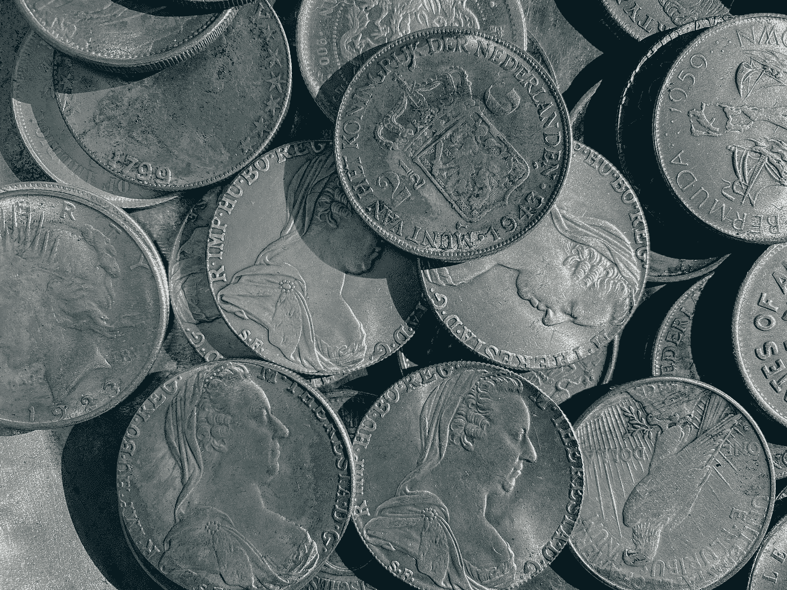
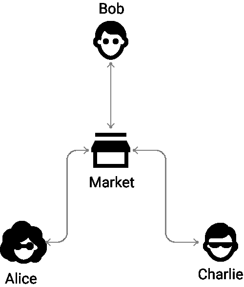
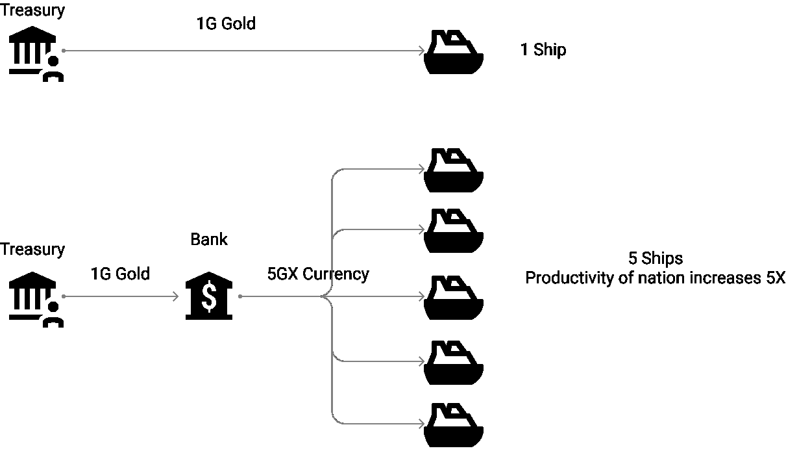
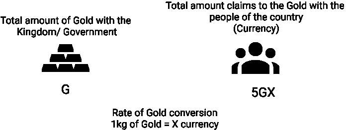

# 货币简史

> 原文：<https://medium.com/coinmonks/a-brief-history-of-money-dd1bf52c767?source=collection_archive---------73----------------------->

作为人类，我觉得我们一生都在追求富足和繁荣——你猜对了，体验生活中的繁荣和富足的最常见和最受探索的方法之一就是变得富有。从小到大，我一直认为富有就是拥有很多钱——在某种程度上，我现在仍然这样认为。然而，我越是试图理解金钱，就越是困惑。在你开始怀疑之前，不——这不是一篇告诉你如何在一年内成为百万富翁的文章(我读过一些告诉你如何在一个月内成为百万富翁的文章！).在读了两年多关于货币演变的书籍和深思熟虑之后，我想我终于准备好写关于货币的文章了。

钱不是纸币，也不是银行账上的数字。货币是人类用来提高生产力的价值储存手段。我觉得借助于一个小故事——货币进化的故事，我能够更好地解释这句话。

注意:这篇文章的想法不是解释货币进化的时间顺序，因为密切跟踪货币的进化是一项艰巨的任务——不同的文明遵循任何似乎对他们有用的东西。但在这篇文章中，为了便于理解，我试图从逻辑上编织导致现代法定货币产生的事件。

**易货制度和本票(约公元前 6000 年至约公元 1000 年):**

故事要追溯到石器时代(耶！).艾伦是帕拉迪斯岛的国王——一个居住着成千上万擅长各种技能的人类的巨大岛屿。虽然很少有农民真正擅长种植胡椒，但有一群鞋匠能做出令人惊叹的皮鞋。爱丽丝是一个皮匠，他的家人想吃胡椒——鲍勃种植了岛上最好的胡椒。爱丽丝去找鲍勃，给了他一双她最漂亮的皮靴，并要求用胡椒作为回报。然而，鲍勃对皮靴一点也不感兴趣——鲍勃想喂他的家人一些肉。现在，爱丽丝去找有很多肉的查理，希望她能得到一些肉来交换她的皮靴，却发现查理想要的既不是靴子也不是胡椒，而是一匹马来圈起他的家禽。现在我不必解释为什么物物交换系统会失败——我们在学校都学过了。但是艾伦解决这些问题的方法不是钱——艾伦在创造“钱”之前必须学习很多东西。埃伦所做的是创造了一张“期票”(或者类似的东西——我们不知道它到底叫什么，毕竟这发生在很久以前:p)。在这个系统中，当 Alice 想从 Bob 那里得到 brinjals 时，她会去找 Bob 并给他一张期票——承诺她会在 Bob 想要的任何时候给 Bob 一双皮靴(因为他今天显然不想要它们)来换取 brinjals。如果鲍勃想要肉，查理想要胡椒，鲍勃现在可以用爱丽丝给他的期票换一些肉。现代金融信用体系可能就是这样开始的——第一种形式的货币更多的是对回报价值的“承诺”,而不是价值的“储存”。

**普通价值储存手段——黄金(~公元前 700 年):**

埃伦很快意识到期票并没有完全解决问题。爱丽丝答应鲍勃用一双皮靴来换取 1 公斤的胡椒，鲍勃想用 2 公斤的肉来换取他的家人，但是查理愿意用 2 公斤的肉来换取 2 双皮靴。Bob 告诉 Alice，他愿意给她 2 公斤 brinjals，以换取两只皮靴的承诺，但 Alice 对 1 公斤很满意，不想再要了——你看这里的问题。艾伦国王可能不是世界上最聪明的人，但他学东西很快。帕拉迪斯岛上很少有地方可以开采黄金，帕拉迪斯人认为这是一种非常珍贵的金属——开采黄金需要大量的努力和劳动力。不是每个人都能开采黄金。由于埃伦是天堂之王，他有足够的劳动力和权力来开采黄金。埃伦宣布，帕拉迪斯岛上的每一笔交易都可以通过交换黄金来完成——只有国王才能创造黄金，因为如果每个人都开始创造黄金，这将成为一个巨大的问题(他选择黄金是为了应对这个问题)。他创建了一个叫“市场”的地方，人们可以来这里卖东西换黄金，有了这些黄金，人们可以在同一个市场上买任何他们想要的东西。你将如何决定鲍勃的 2 公斤胡椒的价格？很简单——鲍勃可以把它卖给愿意出最高价的人。市场上供应满足需求，黄金可以作为帕拉迪斯岛每个公民的普通价值储存手段。

**股票市场(阿姆斯特丹证券交易所——1600 年):**

随着共同价值储存的建立，人们能够很容易地得到他们想要的东西。和平与繁荣随之而来的是在天堂岛上。货物在人们之间有效地分配，市民们磨练他们的技能，用创造性的方式在市场上出售他们的技能以获得更多的黄金。由于人们有大量的资源，过着舒适的生活，帕拉迪斯岛的人口突然激增。岛上现有的资源已不足以养活岛上的全部人口。但是帕拉迪斯岛现在有了熟练的建筑工人——埃伦在和建筑工人商量后，想出了一个好主意。他们将建造一座能漂浮在水上的房子——他们称之为船。在这艘船上，帕拉迪斯岛上最优秀的士兵会漂浮在海上，去附近的国家，征服他们的资源，然后带他们回家。但是有一个问题——埃伦的国库里没有足够的黄金来建造一艘足以征服其他国家的大船。因此，艾伦请求帕拉迪斯的人们为建造这艘船出一份力。公民每为造船贡献一枚黄金，他/她就会得到一份“股票”。一旦这些士兵去了外国的土地并把资源带回家，你将会得到一份资源，这份资源将与你持有的股票数量成比例。如果士兵不回来，你什么也得不到。

**银行和信贷系统的出现(第一家银行——17 世纪):**

士兵入侵外国土地并带回大量资源，帕拉迪斯甚至殖民外国土地以获得源源不断的资源供应。投资股票的公民现在非常非常富有，因为他们从船上士兵的成功中获得了所有的资源。现在，随着资源的丰富和繁荣，帕拉迪斯已经成为一个岛上的公民可以追求他们的梦想，以创造性的方式使用他们的技能，为岛屿创造价值。随着科学的进步，天堂的人们发明了印刷机、蒸汽机甚至汽车。问题是天堂没有足够平坦的道路供人们使用他们的新汽车穿越。随着人口的增长，额仁需要更多的船只来运送人们穿越海洋以收集足够的资源。到目前为止，Eren 可以在任何需要的时候开采黄金，或者要求 Paradis 的人购买股票，但是现在资助所有这些项目所需的黄金数量远远高于短期内可以开采的黄金数量，Paradis 的人要么没有足够的钱投资所有这些项目，要么他们不认为投资汽车和船只将使他们变得富有。

要是埃伦现在能借些金子，等船只回来，路上的过路费付清后再还就好了！本票毕竟不是一个坏主意！输入银行。现在的问题是，帕拉迪斯在短期内没有足够的黄金来资助他们的项目。因此，埃伦向帕拉迪斯的人们宣布，从那天起，他将印刷纸币(当然是使用他们发明的印刷机)，人们将使用这种纸代替黄金进行所有的交易。但是人们不必担心，人们总是可以用 X 数量的纸来换取 1 公斤的黄金。如果人们总是可以把纸币兑换成黄金，那么额仁将如何借钱来资助他所有的造船和修路工程呢？坐好，这是事情变得有趣的地方。

埃伦创建了一个“银行”,人们可以去那里“借”钱来盖房子，或者创业，或者存钱以备将来之用。目前，任何人都可以用 X 数量的纸币兑换 1kg 的黄金，但是银行可以借给人们 5X 数量的纸币，即使他们的金库里只有 1kg 的黄金。银行为什么可以这样做？因为帕拉迪斯的人民勤劳智慧。不太可能所有借出去的钱都被拖欠。因此，如果在银行的帮助下，帕拉迪斯岛的总黄金价值为 G，人们可以贷款高达 5G，并连本带利偿还。因此，银行不仅储存和贷出资金——它们还创造货币，当人们有更多的资金用于他们的项目时，整个国家的生产率就会提高——帕拉迪斯岛上可以开采的黄金数量将不再限制人类的生产率。现在，埃伦会去银行借钱，为他的船只和道路融资，并承诺一旦船只带着资源回来，道路开始从旅行者支付的通行费中赚钱，就连本带利偿还银行。他可以做到这一点，即使岛上的黄金数量不足以资助所有这些项目，因为银行。

注:尽管纸币作为一种货币形式出现在银行出现之前，但随着银行的出现(以可由银行贷出的货币形式)，货币提高人类生产率的能力才得以实现。

**法定货币(19 世纪货币与金本位脱钩):**

有一段时间一切都很好。人们从银行借钱来资助他们的项目和/或公司，赚取利润并变得富有。看着积累的财富，越来越多的人开始借钱，银行很乐意借钱给他们，让他们自己做生意。还记得额仁是怎么承诺用 X 量纸币换 1kg 黄金的吗？嗯，如果帕拉迪斯岛上有 5000 克黄金，银行会借给人们 5000 克的货币。当人们借钱，把钱用于生产性用途，并在创造价值后连本带利偿还时，一切都很好。但是随着时间的推移，借钱的人不再把钱用于生产。看着从岛上的银行获得资金的非生产性项目，岛上的人们感到害怕，开始怀疑如果他们给额仁 X 货币，他们是否真的会获得 1kg 黄金。既然岛上有 5GX 的货币，那如果有人带着价值超过 1.5GX 或者 2GX 的货币来，要求额仁给他们黄金怎么办？因为在这个被开采(或存在)的岛上只有 1000 克黄金，这将变得不可能！随着消息的传播，越来越多的人开始恐慌，越来越多的人找到额仁，想在额仁用完几公斤黄金之前把他们的纸币兑换成黄金。由于岛上有价值 5GX 的货币，额仁知道不可能将所有的货币都兑换成黄金。必须做点什么。

然后，艾伦决定切断货币和黄金之间的联系——或者正如帕拉迪斯的人们所说，艾伦让货币脱离了“金本位制”。现在没有人可以拿着 X 货币去找埃伦索要 1 公斤黄金。然而，人们仍然可以在市场上使用这种货币，银行仍然可以借出这种货币，只有作为国王(政府)的额仁可以印刷这种纸币，除了额仁之外，任何印刷这种货币的人都将被监禁，任何拒绝承认货币价值的人也将被关进监狱。埃伦创造的这种脱离“金本位”的货币或多或少就是当今世界的货币。这种货币被称为“法定货币”。

法定货币的含义是什么？世界上的政府能一直印钞票来提高他们国家的生产力吗？这些问题我将在另一篇文章中回答。但我希望这篇文章能让你对什么是钱以及它是如何运作的有所了解。

下次见！

本文原载于[https://blockchainiseasy.in/](https://blockchainiseasy.in/brief-history-of-money/):
https://blockchainiseasy.in/brief-history-of-money/

> 加入 Coinmonks [电报频道](https://t.me/coincodecap)和 [Youtube 频道](https://www.youtube.com/c/coinmonks/videos)了解加密交易和投资

# 另外，阅读

*   [如何匿名购买比特币](https://coincodecap.com/buy-bitcoin-anonymously) | [比特币现金钱包](https://coincodecap.com/bitcoin-cash-wallets)
*   [币安 vs FTX](https://coincodecap.com/binance-vs-ftx) | [最佳(SOL)索拉纳钱包](https://coincodecap.com/solana-wallets)
*   [比诺莫评论](https://coincodecap.com/binomo-review) | [斯多葛派 vs 3Commas vs TradeSanta](https://coincodecap.com/stoic-vs-3commas-vs-tradesanta)
*   [Capital.com 评论](https://coincodecap.com/capital-com-review) | [香港的加密借贷平台](https://coincodecap.com/crypto-lending-hong-kong)
*   如何在 Uniswap 上交换加密？ | [A-Ads 评论](https://coincodecap.com/a-ads-review)