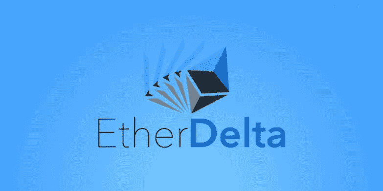
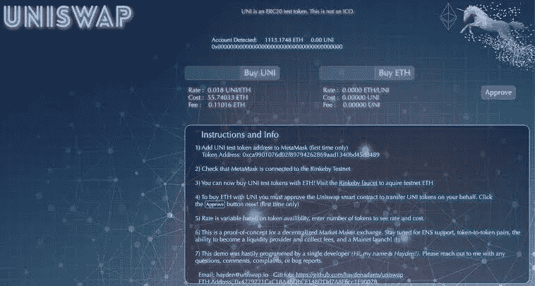
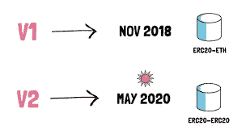
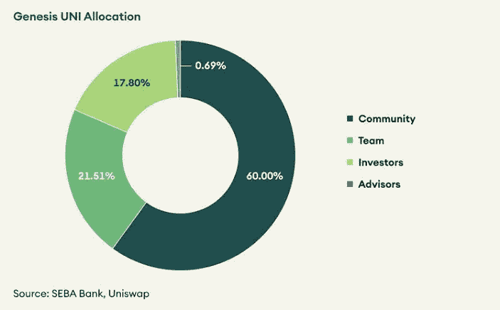
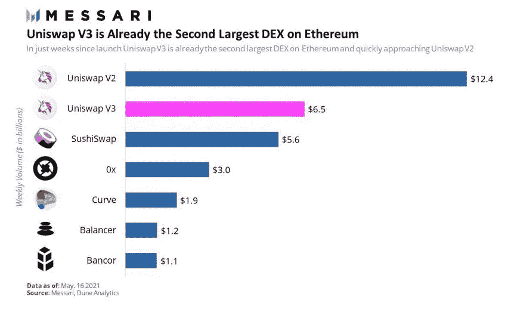

# 联合国妇女和平研究所简史

> 原文：<https://medium.com/coinmonks/a-brief-history-of-uniswap-e05193333abd?source=collection_archive---------7----------------------->

创造新 DeFi 历史的旅程。

Uniswap 是一个**去中心化的交换协议**，建立在**流动性池和自动化概念验证**的概念之上。简而言之，Uniswap 是一系列存在于以太坊上的合约，不被单一实体控制或拥有。

多年来，集中交易网站(CEX)一直统治着不可分割的加密资产市场。Uniswap 进入市场是为了解决市场上普遍存在的这种**电源和控制问题**。

# 项目的起源

在构建 Uniswap 协议的第一个版本时， **EtherDelta** 是唯一具有一定吸引力的分散式交换机。EtherDelta 虽然当时相当流行，但是**是基于订单簿模型**的。这不太适合以太坊这样的第 1 层区块链协议。

**EtherDelta** — order book model based DEX on Ethereum

由于其发明者海登·亚当斯，Uniswap 自 2018 年下半年以来一直出现在加密领域。他从 Vitalik Buterin 关于 AMM 的 reddit 帖子中受到启发，开始创建 Unipug，后来更名为 Uniswap。

**Hayden Adams-** Founder of Uniswap

# Uniswap V1

## AMMs 简介

2017 年 10 月至 11 月，亚当斯决定设计一个概念验证 AMMs，包括智能合约和网站。

2018 年 1 月底，Uniswap 代码中的重大错误得到解决。当时，几个人可以提供所需的流动性，并创建一个新的交易对。

亚当开始研究五个要点:

1.  **完成智能合同**并准备就绪，
2.  为交易者创建一个**反应灵敏且用户友好的界面**。
3.  审核**智能合同的安全性。**
4.  完成**白皮书。**
5.  创建**开发者文档。**

在通过所有必要的技术审核后，做出了一项决定:向公众发布第一版 Uniswap。这个声明将在敌无双 4 号发布。

Interface of **Uniswap V1**

# Uniswap V2

## 优化、分散化和安全性

**2020 年 5 月**，Uniswap 推出了该协议的第二个版本，名为 Uniswap V2。

主要特点是增加了 **ERC20/ERC20 流动性池**。在 V2 之前，每个流动性池都必须包含作为货币之一的 ETH。在 uni WAP V2 中引入 ERC20 令牌/ERC20 令牌池，**任何 ERC20 令牌都可以直接与任何其他 ERC20 令牌共享。**

因此，这对于流动性提供者来说可能是有用的，他们可以保持更加多样化的 ERC20 token 计价的头寸，而不必强制暴露于 ETH。

例如，为了从 USDC 交易到戴，用户必须将他们的 USDC 交易到 ETH，并且将 ETH 交易到戴，这通常导致更高的气费和更多的滑动。

Uniswap V2 concept.

# UNI 令牌启动

**9 月 16 日，Uniswap 宣布推出他们的新令牌——UNI，**,分配给所有以前使用过该平台的人。

最重要的是，该协议的流动性提供者还获得了额外的 UNI 令牌。

总共**10 亿 UNI token**以如下方式分配。

UNI token tokenomics, Source: SEBA Bank, Uniswap

# Uniswap V3

## 效率、安全性和许可

Uniswap 继续走向成熟，于 2021 年 5 月发布其预期的 **v3，**

Uniswap v3 引入了大量新功能，这些功能将解决当前的问题，并提供更加**灵活和高效的 AMM** 。这些功能包括-

1.  **集中流动性**
2.  **活跃流动性**
3.  **范围订单**
4.  **不可替代流动性**
5.  **弹性费用**
6.  **高级神谕**
7.  **执照**

Growth of Uniswap V3

# 结论

自成立以来，Uniswap 一直是领先的 DEX 和世界上最受欢迎的 DeFi 平台之一。每一次新的迭代都带来了创新。他们会继续建造吗？未来会证明一切。

> 加入 Coinmonks [电报频道](https://t.me/coincodecap)和 [Youtube 频道](https://www.youtube.com/c/coinmonks/videos)了解加密交易和投资

# 另外，阅读

*   [WazirX vs CoinDCX vs bit bns](/coinmonks/wazirx-vs-coindcx-vs-bitbns-149f4f19a2f1)|[block fi vs coin loan vs Nexo](/coinmonks/blockfi-vs-coinloan-vs-nexo-cb624635230d)
*   [本地比特币审核](/coinmonks/localbitcoins-review-6cc001c6ed56) | [加密货币储蓄账户](https://coincodecap.com/cryptocurrency-savings-accounts)
*   什么是融资融券交易
*   [维护卡审核](https://coincodecap.com/uphold-card-review) | [信任钱包 vs MetaMask](https://coincodecap.com/trust-wallet-vs-metamask)
*   [Exness 回顾](https://coincodecap.com/exness-review)|[moon xbt Vs bit get Vs Bingbon](https://coincodecap.com/bingbon-vs-bitget-vs-moonxbt)
*   [如何开始用加密贷款赚取被动收入](https://coincodecap.com/passive-income-crypto-lending)