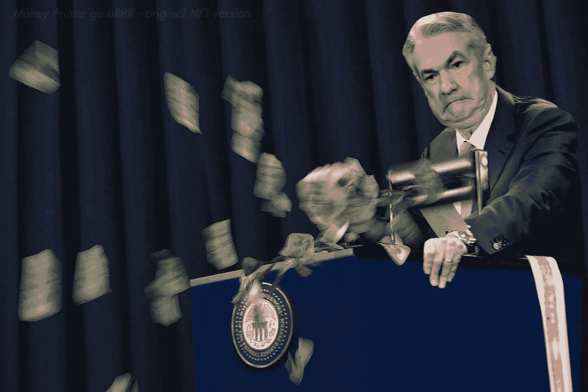

# 披着熊皮的公牛:当前市场展望

> 原文：<https://medium.com/coinmonks/a-bull-in-bears-clothing-a-current-outlook-on-the-market-a24adcd66faf?source=collection_archive---------10----------------------->

做一只又大又坏的熊一点都不好玩。在这一点上，这甚至不是逆势而为。当你的优步司机骗你说 Dogecoin 或 GameStop 时，你就知道可能是趋势反转的时候了。地精镇的末日也是如此。市场情绪是如此令人难以置信的悲观，以至于一轮轻松的反弹可能即将到来。也就是说，很难动摇过去几年实施的货币政策的潜在影响。

**拯救我们所有人的迷因线**

我不会坐在这里，假装自己是某个可以预测未来的技术分析专家。不管你是基于技术分析、月亮周期、市场情绪、抛硬币还是反向交易来交易，有一件事是真的:我们看的图表只是人类心理用线条和烛台绘制出来的。说到底，我不在乎技术分析是否有内在的有效性，或者这只是一个自我实现的预言。我只是想给自己定位，让自己有很高的上升空间，而下降风险最小。我想利用一种简化的方法，一种已经在高时间范围内以高命中率进行回测的方法。我称之为拯救我们所有人的迷因线:200 周均线。

从历史上看，200 周均线是一代人的买入机会。在过去的 ***40 年*** 中，标准普尔 500 指数只突破了 3 次(都是在衰退中):2001 年互联网泡沫破裂、2008 年金融危机，以及 2020 年的 Covid(仅 4 周后就收于上方)。在同一时期，它已经反弹了 10 次，继续创造更高的高点。

比特币在其整个存在过程中也只触及过 4 次这条线，如果你原谅为期两周的 Covid 投降异常值，它从未收盘跌破这条线。这是我为反弹或死亡场景划定的界限。对我来说，有效突破 200 周移动平均线是区分熊市和衰退的最简单的方法。事实上，自 20 世纪 70 年代以来，这一点已经得到了验证，只有衰退才会突破 200 周。

**仅向上**

如果剔除 2 个月的 Covid 暴跌，我们只连续上涨了 13 年。不幸的是，它似乎乐趣和游戏已经来到了一个急刹车。自今年 1 月以来，标准普尔股市已经下跌了 20%，同期 DJIA 股市也下跌了 15%。雪上加霜的是，风险资产已经被送到了屠夫那里进行处理。纳斯达克指数较高点下跌了 31%，而比特币自去年 11 月以来的跌幅更是高达 70%。血什么时候停止？我猜这取决于美联储在管理通胀方面的能力(kek，不需要调整 CPI 的计算方法)。每个人都在想的问题是:“我们即将进入熊市吗？”。让我们开门见山，我们已经在一。

**互联网泡沫/衰退**

20 世纪 90 年代的互联网泡沫可能会成为股市历史上最大的泡沫之一。纳斯达克指数在 10 年时间里，从 1990 年的低点上涨了 1，454%，最终达到了顶峰。之后，该指数继续下跌 78%，最终触底。在这次暴跌中，标普 500 指数以惊人的 54%的速度突破了 200 周移动平均值。

Nasdaq (1990–2003)

在同一时间范围内，标准普尔 500 指数从 1990 年的低点升值了 430%，然后从 2000 年的高点下跌了 50%。标普 500 指数也跌破了每周 200 点的 MA 值 36%。

S&P 500 (1990–2003)

**万事俱备的泡沫**

可以说，当前的泡沫是史上第二大泡沫，具体情况要看你关注的是哪一个指数或资产类别。自从 2008-2009 年金融危机触底以来，我们就像坐在火箭船上，上升时受到的干扰很小。从那时起，标准普尔已经攀升了 635%，这是其历史上最大的增长期。当然，2016 年、2018 年和 2020 年这一数字分别下降了 16%、21%和 35%。但在这三种情况下，我们都强劲反弹了什么？你猜对了，200 周刊。这次不同吗？嗯，我想说确实如此。原因何在？美联储的无能。

为了刺激经济增长，增加美国银行因 Covid 带来的流动性，美联储通过过度印刷和资产负债表增加为经济注入了大量流动性。事实上，今天存在的所有美元中有 80%是在过去两年内印制的。在此期间，M1 货币供应量从 2020 年 2 月的 4 万亿激增至 2022 年 3 月的 20.7 万亿。

[https://fred.stlouisfed.org/series/M1SL](https://fred.stlouisfed.org/series/M1SL)

这种量化宽松政策不仅导致股票价格迅速上涨，几乎还导致所有可投资工具或资产类别的价格迅速上涨。自然，如果你向一个经济体注入 4 倍于供应量的任何东西，会发生什么？降低对那种商品或服务的需求。随着流通中的美元数量的强劲增长，美元现在的购买力下降了。为了弥补这一点，商品或服务的价格必须提高。因此，通货膨胀迅速。

JPOW printin’ trillions

在过去的 12 个月里，美联储的立场发生了巨大的变化。我们已经从“短暂的”通货膨胀变成了全面的恐慌模式。2022 年 4 月的最新 CPI 数据显示，通胀率为 8.3%。这比 3 月份的 8.5%略有下降，然而，这是自 20 世纪 80 年代初以来从未出现过的水平。杰罗姆·鲍威尔(Jerome Powell)一直非常明确地表示，美联储的头号目标是通过加息和缩减美联储的资产负债表来抑制通胀，而不管这会给市场带来什么后果。我们现在已经从历史上最激进的印刷过渡到潜在的最激进的紧缩，这一切都发生在 3 年的时间框架内。这些拉锯式货币政策的影响仍有待充分实现，在美联储完全出乎意料地改变步伐或宏观经济形势出现重大改善之前，全面衰退可能会发生。

那么，现在怎么办？

我们都知道过去的表现并不能保证未来的结果。尤其是考虑到评估一个经济体健康状况的复杂性和错综复杂性，更不用说它如何与特定市场的价格行为联系起来了。简单来说，预测未来是不可能的。不用说，我们只能利用现有的信息，对将要发生的事情做出有根据的猜测。所以，我们就这么做吧。

*(声明:我不是宏观经济学专家，也不是财务顾问。我简直就是一个从 2013 年就开始交易 crypto 的德根。观点是我自己的，这不是财务建议。)*

**S & P 500**

目前，标准普尔 500 距离其 200 周移动平均线约 10%，位于 3500 点左右。如果我们真的经历了经济衰退，很有可能我们的迷因理论实际上并不能拯救我们所有人。如果我们回顾一下前两次衰退，我们知道指数交易价格比 200 点低 35-45%。假设我们将过去两次衰退的平均跌幅定在 200 周以下(40%)，这将意味着价格目标为 2100。如果我们看不到衰退，我的直觉告诉我，我们将从 200MA 反弹。

*最佳情况场景*=**3400–3600**

*最坏情况*=**2000–2200**

**比特币**

对于比特币来说，就更恐怖了。比特币的周均价为 200 美元，约为 22，000 美元，比当前价格下跌了约 27%。比特币在其生命周期中已经从该移动平均线反弹了四次，并且从未在较长时间内(3 周以上)收于该移动平均线以下。此外，该指数还从未跌破此前的历史高点。但话说回来，比特币从未经历过衰退，而且可悲的是，它并不是它所宣传的通胀对冲工具。事实上，随着时间的推移，比特币与 S&P/纳斯达克的相关性越来越强，并成为这些指数的杠杆头寸。比特币和纳斯达克之间的相关性从未如此紧密，目前的比率为 0.81。如果宏观逆风继续推动传统市场走低，我不排除比特币跌破此前 2 万美元历史高点的可能性。除非比特币能够令人信服地以积极的方式与传统脱钩，否则它不会独善其身。

*最佳情况* = **$22，000-$24，000**

*最坏的情况* = **$10，000-$14，000**

**定时 BTC 循环**

在这一点上，比特币 4 年的市场周期是众所周知的。每隔 4 年，比特币的整体回报就会减半，这导致了其臭名昭著的繁荣和萧条周期。不管我们愿不愿意相信，这些减半对比特币的价格有着强烈的影响。下图中的黄色垂直线表示下一次比特币减半(2024 年 3 月)和之前的三次。

正如你可以从之前的减半中看到的那样，比特币的价格行为与减半后的时间段相关，出现了一个有趣的模式。从最近的 BTC 减半(2020 年 5 月)中，我们可以看到比特币花了 78 周时间才在 2021 年 11 月达到这个周期的顶部约 69，000 美元。跳到之前的一半(2016 年 7 月)，比特币用了 74 周的时间才在 2017 年 12 月达到上一个周期的顶部 2 万美元。现在，当我们看看 2012 年 11 月减半的情况时，这种模式被打破了。然而，有人可能会说，这可以归因于 BTC 是一个未知的和不成熟的资产。比特币的经济模式对其价格波动的影响可能仍处于发现和理解的初级阶段。尽管这一周期以“双重泡沫”为特征，但通过对时机的挑剔，仍可以得出类似的模式。当从 2011 年 10 月的底部(而不是 2012 年 11 月的一半)看时，比特币用了 76 周达到第一个泡沫顶部。无论我们是否包括 2012 年的减半，似乎有理由得出结论，比特币喜欢在每次减半后大约 75 周巩固其周期顶部。

这不仅仅是寻找周期顶部，也是识别周期底部。从前两个周期来看，BTC 在周期顶部之后 59 和 54 周触底。如果我们使用这些历史数据，它可以给我们合理的估计*比特币何时会找到这个周期的底部和下一个周期的顶部。基于此，该模型预测底部将在 2022 年 11 月底左右，新的周期顶部将在 2025 年 8 月出现。*

**给我一些藿定**

随着遗留市场继续降低风险，越来越明显的是，艰难的时期仍在我们面前。谁也说不准我们下一步要去哪里。但鉴于宏观形势的发展，测试 200 周移动平均线几乎是必然的，衰退的可能性似乎每天都在增加。

话虽如此，熊市和衰退可能会令人恐慌。他们会觉得天长地久，最糟糕的是，会在经济上造成破坏。尽管如此，他们确实提供了一个非凡的机会。我并不欢迎 40-50%以上的全面崩盘，但如果市场给了我们这样的机会——这将是一次 ***的代际买入*** 。

最让我兴奋的机会是随着比特币和以太坊发展起来的那个。如果我们真的看到了衰退，我的直觉告诉我，我们看到的是低于 20000 美元的 BTC 和低于 10000 美元的瑞士。但是先生，我要了一些鸦片…

好消息是。尽管比特币现在还是一个青少年，但它可能仍处于采用曲线的“早期多数”阶段。虽然我不认为它是未来可行的货币，但它仍有无限的潜力。不管它的疯狂波动，我认为它是长期储存财富的最佳工具。我知道比特币和黄金之间的比较被过度使用了，但它是如此的准确。比特币确实是黄金 2.0，但有了巨大的改进。黄金的市值估计为 11.7 万亿美元。比特币？少得可怜的 5780 亿，你算算。“如果你不相信我或者不明白，我没有时间来试图说服你，对不起。”— Satoshi

最后，如果你像我一样，也相信以太坊是法国的*未来，*那么它可能比比特币更有潜力。我明白了，监管部门对所有的黑客攻击、stablecoin 崩溃、NFT 地毯拉拽、诈骗等都怒气冲天。但随着时间的推移，这个行业将会痊愈。一切都会好的。如果以太坊能够解决其规模问题，并占领传统金融架构的一小部分，那么它就被严重低估了。

时间是 2025 年。比特币交易在 10 万-15 万美元之间，以太坊在 1 万-2 万美元之间。你很快就成功了。

> 加入 Coinmonks [电报频道](https://t.me/coincodecap)和 [Youtube 频道](https://www.youtube.com/c/coinmonks/videos)了解加密交易和投资

# 另外，阅读

*   [SmithBot 评论](https://coincodecap.com/smithbot-review) | [4 款最佳免费开源交易机器人](https://coincodecap.com/free-open-source-trading-bots)
*   [比特币基地僵尸程序](/coinmonks/coinbase-bots-ac6359e897f3) | [AscendEX 审查](/coinmonks/ascendex-review-53e829cf75fa) | [OKEx 交易僵尸程序](/coinmonks/okex-trading-bots-234920f61e60)
*   [如何在印度购买比特币？](/coinmonks/buy-bitcoin-in-india-feb50ddfef94) | [瓦济克斯审查](/coinmonks/wazirx-review-5c811b074f5b)
*   [隐翅虫替代品](/coinmonks/cryptohopper-alternatives-d67287b16d27) | [HitBTC 审查](/coinmonks/hitbtc-review-c5143c5d53c2)
*   [CBET 评论](https://coincodecap.com/cbet-casino-review) | [库科恩 vs 比特币基地](https://coincodecap.com/kucoin-vs-coinbase)
*   [折叠 App 审核](https://coincodecap.com/fold-app-review) | [Kucoin 交易机器人](/coinmonks/kucoin-trading-bot-automate-your-trades-8cf0ca2138e0) | [Probit 审核](https://coincodecap.com/probit-review)
*   [如何匿名购买比特币](https://coincodecap.com/buy-bitcoin-anonymously) | [比特币现金钱包](https://coincodecap.com/bitcoin-cash-wallets)