# 链条的强度取决于其最弱的一环——链环基本分析

> 原文：<https://medium.com/coinmonks/a-chain-is-as-strong-as-its-weakest-link-chainlink-fundamental-analysis-f8336e427d73?source=collection_archive---------6----------------------->

这份基本面分析是 Crypto Consulting Institute 的付费时事通讯的一部分，提供市场洞察、可行的交易信号和基本面分析。更多信息请访问:【https://www.cryptoconsultinginstitute.com/newsletter 

如果你发现自己在太平洋的一个荒岛上，必须在收音机和智能手机之间做出选择，你的直觉可能是智能手机，认为你会有更多的选择。

然而，你可能会后悔这个决定，因为附近没有蜂窝塔或互联网来广播消息，而且媒体与可能可用的通信基础设施不兼容。而收音机，你可以收到附近航行在该地区的船只或飞机的回应。

你的智能手机可能适合玩俄罗斯方块来消磨时间，但可能会抑制生存行为，并使你无法使用那些关键功能，如广播求救，否则这些功能将是救生的。这个场景的目标是生存，而不是娱乐。

如果我们把它转换成一个娱乐场景，假设你在一场足球比赛中下注，让一名球员在一场比赛中进两个球。你下注的簿记员可能断言该玩家只进了 1 个球。如果你没有从其他来源核实数据，你可能会错误地接受这个结果。

尽管天气预测在最好的情况下也经常是不准确和零星的，但花点时间想想，如果你依靠地面上的一个人来预测 1000 公里以外发生的天气事件，未来的预测会有多不准确。

不从世界各地的天气节点收集可能识别更大的天气模式的信息，或者不回顾最近的天气模式，将会限制这些预测的可靠性。对于数据的完整性，当然会有一些严重的担忧。

这三个场景有什么共同点？缺乏一个抽象的媒介来聚合数据，信息集中化，并且无法在封闭的系统之间交换信息。

区块链没什么不同。他们的核心价值主张通常围绕着分类账的不变性，从而带来无与伦比的数据安全性。但是，根据设计，它们是封闭的系统，没有黑客渗透网络的外部攻击媒介。相反，他们必须找到一种方法来折衷大多数网络节点，以操纵共识或同时攻击数百个节点。对于不良行为者来说，尝试的成本和风险通常非常高。

这种增强的安全性的局限性在于，区块链通常只能在其生态系统内聚合信息。就像一个遥远的荒岛，它不知道外面的世界发生了什么。正如我们许多人所预期的那样，区块链要实现大规模采用并打破传统系统，数据需要在区块链系统和现实世界之间无缝流动。

对于那些长期订阅 CCI 时事通讯的人来说，这可能听起来很熟悉。第 0 层协议作为信息的抽象元层运行，无缝地获取在链上转换的遗留信息，以将数据中继到加密过程，这对于 Web 3 至关重要。

Chainlink 就是这样一个第 0 层协议，它被定位为一个永久的公用事业，通过启用区块链和真实世界信息源之间的交换媒介来支持区块链技术的承诺。

在本期 FA 中，我们将深入探讨 Chainlink 的工作原理，以及它对区块链的重要性，并展望 oracle networks 为区块链带来的新兴使用案例。

# 你的 TLDR；总结。

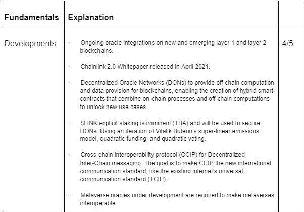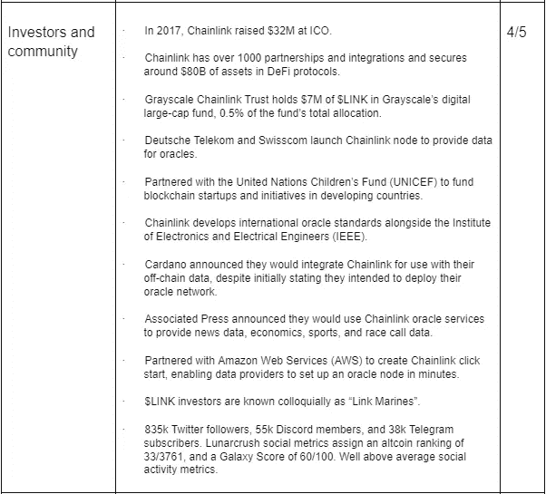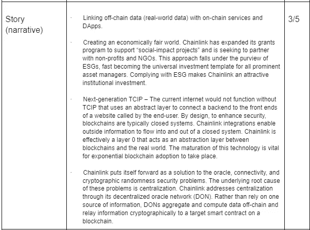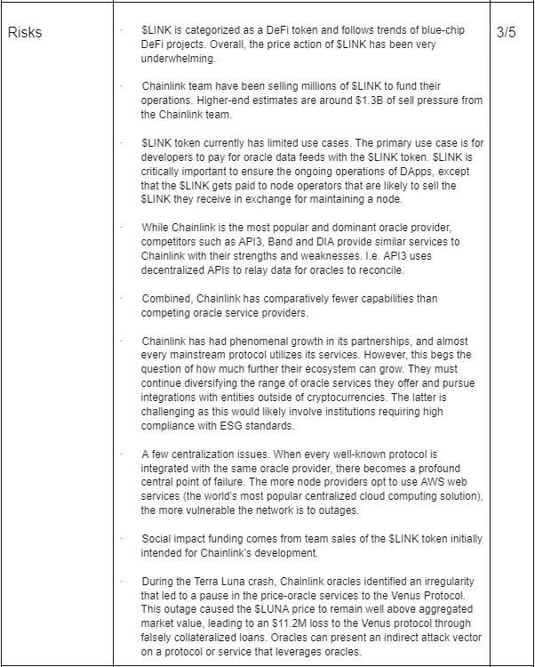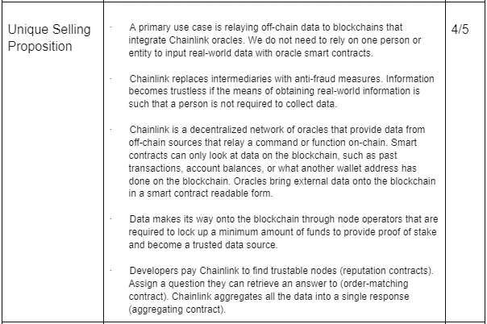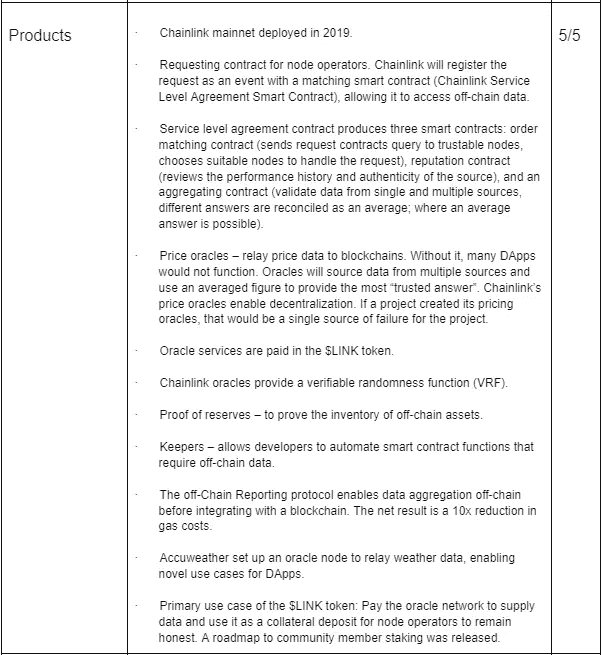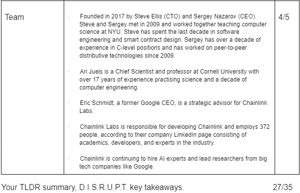

# 与过去的联系

在之前的[波尔卡多特](/coinmonks/connecting-the-dots-polkadot-fundamental-analysis-3de57af8164c)、[宇宙](/coinmonks/out-of-this-world-cosmos-atom-fundamental-analysis-b7aeb65583f)和[阿莱夫的 FAs 中。IM](/coinmonks/the-next-amazon-but-on-the-blockchain-aleph-im-fundamental-analysis-ad183ab94bdf) ，我们探讨了 TCIP 的意义，也就是传输控制协议和互联网协议(TCP/IP)。TCIP 设定了互联网上信息交换的通用标准，或“web 2”，我们今天都知道，任何人都可以通过移动设备访问。

在早先赌一个球员进两个球，而簿记员只承认进了一个球的情况下，我们可以评估这个错误是故意的(受贪婪驱使)还是有机的(管理或数据输入错误)。

无论哪种方式，这种数据差异的根本原因是集中化。依靠簿记员发布的不完整数据集来激活奖励分配算法，以进行适当的支出，这带来了有关数据完整性的问题。

同样，当我们看向地平线时，我们可能会看到乌云正在逼近，很可能就要下雨了。但是由于我们忽略了从其他地方获取信息，我们对宏观上的天气模式一无所知。地平线上形成的云可能会给人一种孤立的降雨事件的印象，但如果我们从其他来源寻求天气数据，我们可以了解到这是一场气旋的尾部——远远不是一场良性的天气事件。

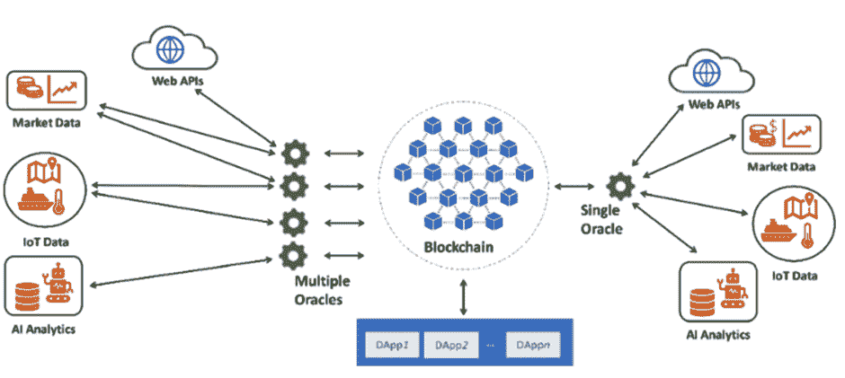

在最高层次上，Chainlink 是一个神谕网络。区块链 oracle 是一种第三方服务，它从现实世界中的多个来源获取数据，为区块链提供聚合数据。

Chainlink 目前的用途是提供价格反馈、可验证的随机性、储量证明和管理员网络。

数据聚合是一种强有力的分析工具。在我们的秘密旅程中，我们都发现自己在 Coingecko 或 Coinmarketcap 上。每个市场，无论是币安、FTX 还是泛欧互换流动性池，在任何时间点都会有不同的价格点，这是基于一个市场而不是另一个市场中发生的活动的不对称性。

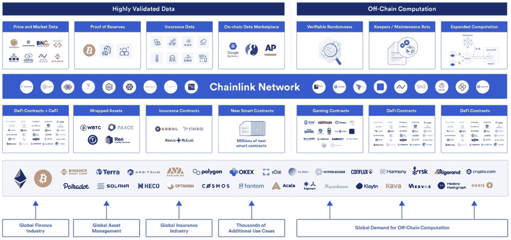

例如，如果 50，000 美元的 BTC 在币安作为市价单卖出，价格将是所有其他市场的几个标准差，直到套利发生。因此，币安可能会以 2 万美元的价格出售$BTC，但所有其他市场的售价都在 2 万 2 千美元左右。如果 Coingecko 只从币安获取数据，对于试图在 Bittrex 上以同样的价格获得$BTC 的用户来说，这将是一种误导。

解决办法？

从所有可用市场获取数据，并向最终用户提供一个指数化或平均价格，以缩小这种价格差异。

在这种情况下，像 Coingecko 这样的价格聚合器从各种来源的应用程序编程接口(API)中提取价格信息。但是正如我们所提到的，区块链是封闭的系统，从设计上来说，它不允许数据从遗留系统流入其中。当本地资产通过桥接等方式迁移到其他区块链上时，生态系统之外的价格行为对于向用户提供准确和聚合的实时数据变得至关重要。

对于许多 DeFi 协议来说，如果 Chainlink 明天停止运行，他们的服务将完全瘫痪。例如，合成衍生品依赖于从现实世界资产中提取抵押品价值，以将该价值反映到代币价格上，而贷款协议依赖于价格反馈来确保抵押品资产的准确市场价值。

准确的价格预测对于借贷协议至关重要，因为用户抵押品与其初始存款价值的偏差会影响他们的头寸。如果协议错误地认为以太坊已经从 2000 美元突然下降到 1000 美元，这将通过改变用户的贷款抵押比率使用户面临清算的风险。如果 DApp 使用 oracle，它只从一个流动性池中提取数据，那么就没有故障保险来防止协议处理错误信息或防止流动性池中的价格操纵。

可验证的随机性对于确保激励结构中博弈理论的完整性至关重要。虚拟现实对于从游戏到盈利和赌博市场至关重要，以确保机会随机出现，而不是被操纵以偏袒一个参与者。Chainlink VRF 使开发人员能够集成可回溯测试的随机性函数，以确保随机数生成过程的完整性。

Chainlink 的另一个核心功能是保留神谕的证明。资产被锁定在源区块链上，消息被跨链发送到目标区块链，目标可以通过 Chainlink 验证桥中有锁定的资产，以允许在目标区块链上铸造。例如，您可能希望将$ETH 发送到币安智能链。桥接 Dapp 将锁定以太坊公共链上的$ETH，然后它将向币安智能链上的桥接 Dapp 发送消息，启动该链上的铸造过程。当然，桥接开发人员可以构建自己的定制 oracle contracts 来执行这项任务，但是这是一个主要的失败点，可能需要数百个开发人员小时来部署。

链环 oracles 作为链环网络上的节点存在。他们为其节点的一致性、准确性和正常运行时间建立了声誉，以将信息中继到智能合约，智能合约通过 DApp 智能合约将数据转换到区块链。为了利用这种服务，开发者或 Dapp 必须向网络支付$LINK 服务费，以便从指定的查询数组中提取响应。

一个常见的查询是以太坊主网上$ETH-$USDC 流动性池中$ETH 的价格。为了让 Dapp 利用这个查询，他们的请求通过一个订单匹配契约。换句话说，开发人员用他们的智能合同提出了一个问题。oracle network 通过一个聚合器契约处理多个源响应，该契约为智能契约提供一个聚合响应。

如果从 oracles 中提取的聚合数据符合指定的标准，那么 Chainlink Keeper 网络将发挥作用，使智能合约能够执行链上命令。例如，许多人在分散的交易所观察到很少有机会下限价单。开发人员确实可以构建一个限价单用户界面。尽管如此，他们可能需要开发一种 oracle 合约，以获取特定流动性池的价格。一旦达到特定条件，Keeper Network 便可执行智能合约命令，无需人工干预。

Chainlink 2.0 扩展了其混合智能合约模型，该模型从现实世界的输入中提取 API 数据，并提供中继到目标智能合约的链外计算。数据计算和转换发生在链外，数据在抽象元层上传输，区块链可以通过查询抽象元层来获取触发链内事件的信息。

在抽象层次上，来自数据源的数据是由硬件或软件 oracles 捕获的，这些 oracles 通过 API 进行传递。oracle 将数据发送到元层上的智能合约，在那里从其他来源聚合数据。从那里，聚合数据跨越元层，并且在集成了 Chainlink oracle smart contracts 的任何地方都可用。开发人员将数据从本地链上的 oracle 智能合约中提取到他们的智能合约中。智能合同是否执行功能取决于从 chain link integrated Oracle contract 查询的数据是否符合智能合同参数。

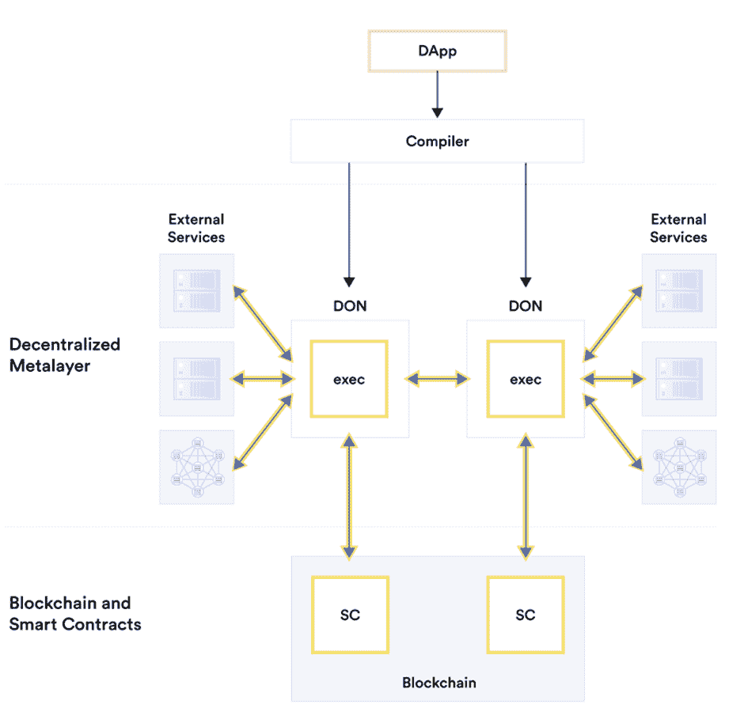

当我们开始将非市场数据连接到区块链时，事情就开始变得复杂了(如果不是已经复杂的话)。直到最近，Dapp 智能合约还会从 oracle API 调用数字数据。

换句话说，oracles 证明了它们可以处理离散和连续的数据类型。但是对于更抽象的名义数据类型和顺序数据类型呢，因为它们不具有不同的数量值。

如果我们观察在任何给定学科中利用同行评议过程的学术界，它需要多位学者的解释来接受或挑战一位研究人员的发现。反馈通常是定性的，不能总是用数量来表达。

在预测天气时，一些定量数据集可以帮助确定(温度、空气温度、湿度等)。).尽管如此，这只是整个预测的一部分。数据需要汇总才能进行定性观察(晴天对雨天)。

此外，信息交流不仅仅是单行道。来自区块链的数据可以跨越金属层，向物联网(IoT)设备提供信息，这是 Chainlink 正在进行的大部分开发的重点。

例如，在未来，智能冰箱可以列出冰箱中的物品清单，并将其上传到智能合同中，智能合同会向在线购物商店发送订单，以订购补充用品。

智能空调可以从在线来源获取天气数据，并在智能合同的参数范围内，根据外部天气事件的预期改变温度。在这方面，目标是实现能源和成本效益。空调可能只在电网电力过剩时运行(更便宜)。

对于从另一个方向传输的信息，硬件甲骨文扫描进入你冰箱的商品，库存数据被路由到智能合同，以决定是否在线下单。类似地，硬件 oracle 会将空调的实时数据传递给智能合同，该合同会在电价最低时激活空调，以最大限度地提高成本效益。

Chainlink 2.0 旨在进一步开发所谓的分散 Oracle 网络(DONs)，以聚合来自链外多个数据源的信息，从而对一系列现实世界事件做出通用的抽象决策，从而满足复杂的链上查询。如 Chainlink 2.0 白皮书所述，预期结果如下:

> “(1)储量证明，跨链服务的一种形式；(2)与企业/遗留系统接口，即创建基于中间件的抽象层，该抽象层便于用最少的区块链专用代码或专业知识开发区块链应用；(3)分散身份，使用户能够获得和管理自己的身份证件和证书的工具；(4)优先渠道，这是一种确保及时将关键基础设施交易(如 oracle 报告)纳入区块链的服务；以及(5)保密 DeFi，即隐藏参与方敏感数据的金融智能合约。”

对于我们的簿记员，如果我们通过利用 don 的 Dapp 下注，oracle 节点必须首先就目标结果达成一致，然后才能提供最准确的响应。为了确保节点保持诚实，激励结构惩罚不诚实的行为者，奖励那些保持诚实的行为者。虽然一个簿记员可能建议一名球员在他们进了 2 个球时只进了 1 个球，但甲骨文网络将排除他的回答，因为大多数人同意*实际*的结果。

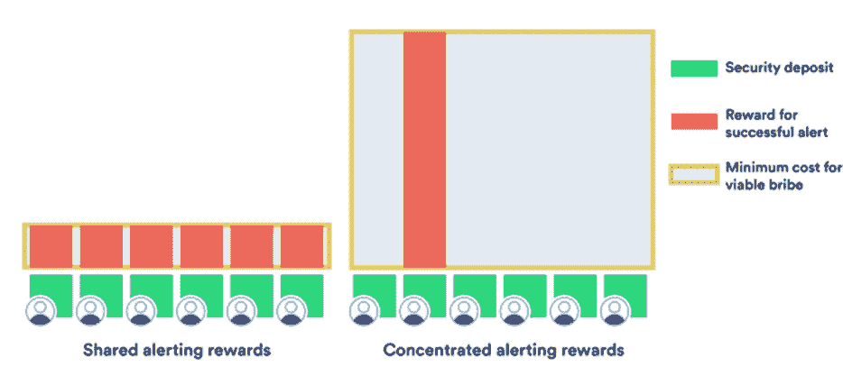

Chainlink 试图通过要求节点操作者首先在验证器节点上打上$LINK 作为担保来实现数据输入的一致性。在 DON 上的二次赌注增加了阈值，通过该阈值，更大的$LINK 的股份可能破坏网络。如上所述，如果 10 个 oracle 节点中有 9 个撒谎，则 10 个节点中有 1 个可能保持诚实。要推翻诚实的结果，对手需要比撒谎的 9 个 oracle 节点的总和大 10 倍的赌注。保持 1 个节点诚实的是，他们将收到 9 个不诚实的参与者的赌注，因为他们喊出了敌对行为。在这个经济体系中，在胁迫下保持诚实比试图贿赂或腐蚀网络更有回报。

但是，并不要求节点操作员手动将每条数据输入 oracle。通常，他们负责维护节点的操作，该节点将执行从可信 API 获取的数据的离线计算。虽然我们的簿记员可能从错误的来源获得数据，但其他报告渠道(来自现场报告、人工智能反馈、新闻网站、直播媒体渠道、统计学家和其他可靠来源的数据)之间的差异会突出这一点。提取错误的数据并不是一种违法行为。尽管如此，它确实影响了继续从不可靠来源获取数据的 oracle 节点的声誉。甲骨文网络中的一个不诚实的参与者试图在信息到达区块链之前改变甲骨文提取的信息。

建立正确的激励结构非常重要，因为错误的信息被传递给一个整合的实体可能会给区块链生态系统中的 DApps 带来可怕的经济后果。

# $链接令牌组学(截至 2012 年 6 月 25 日)

价格:7.28 美元

市值:3.39459775 亿美元

流通供应量:467009549

最大供应量:10 亿

创历史新高:52.70 美元

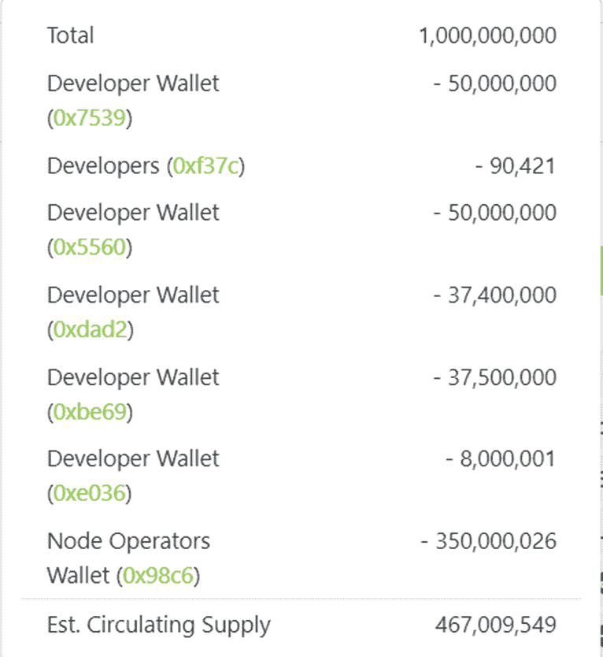

所有$LINK 令牌都是预先挖掘的，奖励通过智能合同发放给维护 oracle 网络的节点运营商。

总供应量的 46.7%在流通中。观察到总供应量的 35%属于没有未兑现既得权凭证的投资者。从节点操作符和团队分配可以推断只有 11.7%的代币在流通。53.7%的供应锁定在奖励排放合同和团队分配中。确实有来自团队的持续销售压力。

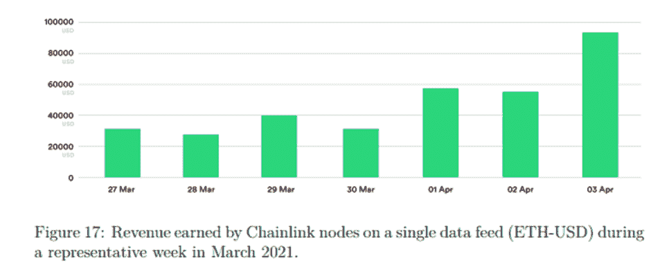

最常用的数据馈送之一 ETH-USD 每天在参与的 oracle 节点之间共享价值数万美元的链接。

# 链接到[任何]哪里？—讨论

那些花时间穿越加密货币空间的人认识到了其疯狂的增长和发展速度。一天感觉像一周，一周感觉像一个月，一个月感觉像一年。

毫不夸张地说，如果没有 Chainlink，我们就不会看到区块链各种生态系统的快速技术发展。

在许多不同的领域，开发人员通过分散的 oracle 网络和软件开发套件(SDKs 加速部署)部署产品和试验新想法变得越来越容易和快捷。参考[宇宙](/coinmonks/out-of-this-world-cosmos-atom-fundamental-analysis-b7aeb65583f)和[沙盒](/coinmonks/more-alternate-realities-than-grains-of-sand-sandbox-fundamental-analysis-762bcb9a3863) FAs)。

Chainlink 的价值不仅在于提供了一种在 web 2 数据之间创建链接的媒介，这种链接可以与 web 3 的加密兼容，而且它是通过与 Keeper 网络集成来响应这些数据流的智能合约的自动化。

从作为 [Peak Finance](/coinmonks/climbing-cathedral-mountains-to-see-the-silver-clouds-below-peak-finance-fundamental-analysis-5a2e4c95476e) 创始人的经验来看，我们部署在 [Metis Andromeda](https://justmy2satoshis.medium.com/metis-the-future-of-decentralized-human-organizations-199a32d97ab9) 上，并急切地等待 Chainlink 集成。这种集成将消除使用服务器脚本(也称为 bot)来自动化智能合同流程的集中化风险。服务器的正常运行时间维持着这些过程。如果服务器经历了中断，协议不能在没有人工干预的情况下过渡到新的时期。此外，税率表是由脚本管理的，这导致了效率低下，并围绕使用集中式 oracle 将价格馈送数据传递到协议中而导致了进一步的集中化漏洞。事实上，Metis Andromeda 和区块链网络正在等待许多发展机会，这些网络尚未集成 Chainlink 等分散式 oracle 网络。

Chainlink 的 Keeper 网络使这些功能能够在链上自动执行，而无需等待链外脚本计算来触发智能合约事件。令人兴奋的是 Keeper 网络为 NFTs 自动化功能的潜力。正如我们在之前的分析中反复提到的，NFT“只是定价过高的 JPEGs”这一观点反映了对区块链技术更广泛能力的根本缺乏了解。NFT 是数字资产，与给定网络上的任何其他合同标准一样，受相同的规则和参数管理。将 oracle 数据 API 集成到 NFT 中使其成为“智能 NFT ”,因为它可以自动执行命令来响应指定的合同参数，而无需人工干预。分散式 oracle 网络给智能 NFT 应用带来的可能性似乎是无限的。StepN 就是一个这样的例子，硬件 oracle(您的手机)通过移动应用程序捕获移动。Oracle 技术在 StepN NFT 内验证并存储这些数据。NFT 捕获的大量数据提高了奖励阈值，使 NFT 在二级市场上对那些希望利用 NFT 的人有价值，与入门级的 StepN NFT 相比，授予他们更高的令牌分配份额。

这听起来可能是良性的，但开发时的 Chainlink Keeper 和 DON 集成是几天或几周的工作仍然无法消除集中化风险与几个小时的集成工作到分散的 oracle 网络之间的差异。

尽管 Chainlink 是区块链各地 DApps 持续运营的关键公共设施(担保总价值:37，338，097，875 美元)，但 Chainlink 并非没有风险。这些风险似乎比 Chainlink 本身对利用它们的 DApps 构成了更大的威胁。

在 Terra Luna 崩溃期间，由于 Chainlink oracle 服务中的断路器，金星协议(借贷)的 Chainlink 价格反馈更新不可用。很大程度上，这是 Venus 团队设定的事件标准，但没有及时采取行动。不管归咎于谁，这一事件导致了一种局面，即金星上的$LUNA 价格保持不变，而所有其他市场都在下跌。美元的成本在 0.107 美元时暂停，交易价格为 0.01 美元。在金星暂停服务后，剥削者以 10 倍的膨胀抵押率存入 2.3 亿美元，以获得 1350 万美元的贷款。

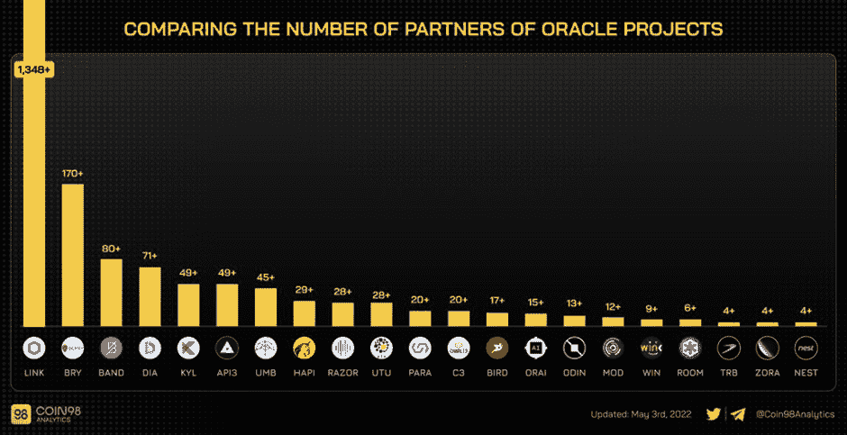

Chainlink 现在支持超过 1000 个 DApps，这些 DApps 依赖于 oracles 提供的价格信息。在很大程度上，Chainlink oracle 网络表现出了弹性和持续的正常运行时间。但是，就像那些看似良性的攻击一样，它们经常会成为黑天鹅事件的催化剂(见[Terra Luna FA](https://justmy2satoshis.medium.com/goodbye-moonman-hello-luna-an-in-depth-fundamental-analysis-on-terra-883eb3c1111b)；铁金融脱钩→UST 钉住美元的风险)。

正如从 Venus 协议的损失中观察到的，尽管在 oracle 合同的参数范围内运作在很大程度上是 Venus 团队的缺点，但对$LINK 持有者来说没有区别。如果 Aave 或另一个 DeFi 协议出现价格馈送断路开关，锁定重要的附带价值而不被承认，这将不仅对该特定协议的用户，而且对更广泛的 DeFi 生态系统的信心产生毁灭性的后果。

超线性$LINK staking 是 TBA，但将有助于进一步保护 oracle 网络。对于不愿意通过运行节点来保护 oracle 网络的$LINK 投资者来说，赌注期权提供了机会。回想一下，破坏 oracle 网络所需的二次影响是节点数量和所涉抵押品总量的乘积。这是一种委托人赌注的形式，允许普通投资者寻求赌注回报增加了腐败网络的难度。

虽然目前没有任何其他 oracle 服务的 Chainlink 集成数量比所有其他 oracle 服务集成的总和还要多，但从投资角度来看，其他地方可能有更大的上升机会。

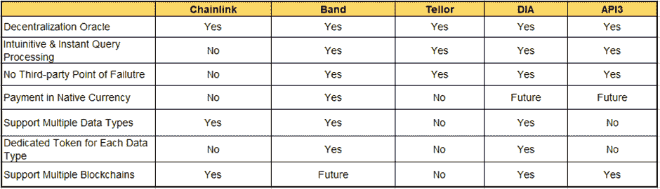

Chainlink 的问题是数据检索的分散化，这似乎是一个持续发展的焦点。不可避免地会有一些情况，在这些情况下，神谕不得不依赖于来自人类输入的数据。在依赖人工智能数据收集的硬件甲骨文变得更加广泛之前，很可能会存在持续的集中化风险，特别是当数据无法从多个来源检索时。虽然 Chainlink 是为数不多的易受第三方故障点影响的 oracle 网络之一，但值得记住的是，他们有更广泛的可用 oracle 服务。

我们现在必须考虑基本面如何推动美元的未来价格走势。说白了，$LINK 在上一个牛市周期的表现平平。它似乎遵循了其他 DeFi 协议的性能，没有捕捉到明显的优势。$LINK 的表现不佳在很大程度上归因于创始人和 Chainlink Labs 出售了大量股份，估计高达 13 亿美元的$LINK 被出售。

对于一个具有明确长期潜力的项目，并且是少数几个可以很有信心在 5 年内完成的项目之一，自然，他们需要一个战争基金来资助正在进行的开发。就在我们说话的时候，他们继续积极招募新的人才来提升他们的兴趣。

然而，对于使用这些资金提供具有“社会影响”的赠款，人们有一些合理的担忧。环境、社会和治理(ESG)投资框架超出了本 FA 的范围(毫无疑问，我们将在未来探讨这一术语)。但在“社会影响”资助的背景下，Chainlink Labs 似乎在向全球机构磕头，这些机构强加了一个支持更广泛的集中议程的投资框架。从机构的角度来看，这一举措可能会使投资 Chainlink 成为一项更具吸引力的提议；然而，寻求满足这些标准意味着他们偏离了非政治化或分散化的原则。就像波尔卡多特在最近的达沃斯 WEF 论坛上展示他们的存在一样，对大型项目来说，向公开寻求控制资产类别的全球机构屈服并不是一个好兆头，这种资产类别应该在很大程度上保持无许可和抵制审查。我们投资的目标应该是在主要参与者抓住机会提高我们所持股份的价值之前建仓。然而，我们应该始终考虑这对密码原理的长期可行性会带来什么样的代价。

无论如何，LINK 以 222 亿美元的价格突破了其市值，达到了 52.70 美元。目前的市值为 32 亿美元，从中长期来看，$LINK 可能会超过其历史最高水平，以目前的市值计算，达到相对无摩擦的 6.5 倍。

如果 Chainlink 不屈服于腐蚀网络的集中化风险，并且团队可以控制自己在下一个机会兑现他们的团队令牌，那么断言 Chainlink 是一种被低估的资产并不是不合理的。就链节持有者的直接效用而言，在 staking 上线之前,$LINK 没有多大用处。许多依赖 Chainlink 服务的 DApps 都有一个明确的使用案例。

出于这个原因，随着时间的推移，Dapp 对 Chainlink 服务的依赖持续存在，它是少数几个可以自信地赋予“熊市证明”地位的资产之一。我们对[绩优圈](/coinmonks/there-is-merit-to-a-dao-revenue-sharing-model-merit-circle-fundamental-analysis-ab37d08f76c7)做出了类似的断言，纯粹是基于他们拥有多样化的收入流和大量非本土资金来保护代币价格的想法。尽管如此，在团队和创始人的代币用完之前，无论是$LINK 还是$MC 都有可能在中短期内脱离加密市场。此外，它们都取决于各自趋势的增长。假设 DeFi 协议对 oracle 服务的需求持续存在，并且 Metaverses 对奖学金机会的需求持续存在。在这种情况下，一旦团队代币耗尽，收入来源有保障，真正“经得起熊市考验”的资产可能会显露出来。

虽然许多人对创始人拥有 35%的代币供应表示担忧，但不可否认的是，像 Chainlink 这样重要的项目必须能够为其业务的持续扩张提供资金。他们的成功将不可避免地等同于他们所支持的民主党的成功。相反，他们的故障会严重影响他们依赖 oracle 服务的 DApps 的持续运营。

在对冲方面，对于认识到甲骨文重要性的投资者来说，来自竞争对手甲骨文服务的增长机会可能更大，如$BAND、$TLR、$API3、$MOD 等。鉴于这种假设有点像赌博(你在什么时候放弃的？)，人们应该认识到风险，并相应地分配资本。

一件非常清楚的事情是，如果没有 Chainlink，我们今天所知的加密货币生态系统就不会发展到如此地步。展望未来，它将在支持新兴用例方面发挥关键作用。

# 参考

AMBCrypto，“Chainlink 导致金星协议损失 1120 万美元——解码后果”，2022 年 5 月 14 日，[https://AMB crypto . com/chain link-causes-11-2m-loss-to-Venus-Protocol-Decoding-the-affairs/](https://ambcrypto.com/chainlink-causes-11-2m-loss-to-venus-protocol-decoding-the-aftermath/)

Chainlink，“Chainlink 2.0:分布式 Oracle 网络发展的下一步”，2021 年 4 月 15 日，[https://research.chain.link/whitepaper-v2.pdf](https://research.chain.link/whitepaper-v2.pdf)

Chainlink 博客，“Chainlink 网络中的断路器和客户多样性”，2021 年 1 月 6 日，[https://Blog . chain . link/Circuit-Breakers-and-Client-Diversity-in-the-chain link-Network/](https://blog.chain.link/circuit-breakers-and-client-diversity-within-the-chainlink-network/)注:感谢 twitter 的更正: [@nullpackets](https://twitter.com/nullpackets)

Chainlink 博客，“Chainlink Staking:探索长期目标、路线图和初步实施”，2022 年 6 月 7 日，[https://blog.chain.link/chainlink-staking-roadmap/](https://blog.chain.link/chainlink-staking-roadmap/)

币 98，‘区块链甲骨文’解释:什么是区块链甲骨文？(2022)2022 年 5 月 3 日[https://coin98.net/what-is-blockchain-oracle](https://coin98.net/what-is-blockchain-oracle)

以太坊世界新闻，“Chainlink 团队在币安-宙斯首都倾倒了 34M+ LINK”，2021 年 3 月 23 日，[https://en . ethereumworld News . com/chain LINK-Team-Has-dumps-34M-LINK-on-币安-宙斯首都/](https://en.ethereumworldnews.com/chainlink-team-has-dumped-34m-link-on-binance-zeus-capital/)

Youtube、Coinbureau、Chainlink: LINK 还有潜力吗？深潜！!'，2021 年 12 月 31 日，[https://www.youtube.com/watch?v=EDBbsrTbrjU&t](https://www.youtube.com/watch?v=EDBbsrTbrjU&t)

Youtube，Crypto Jebb，' Chainlink 对 Crypto 至关重要！“链环解释过了！”，2022 年 6 月 2 日，[https://www.youtube.com/watch?v=7iho4cHYwa8](https://www.youtube.com/watch?v=7iho4cHYwa8)

Youtube，白板加密，“什么是 Chainlink？链接用动画解释(价格预测)’，2022 年 1 月 15 日，[https://www.youtube.com/watch?v=GnXsJe2wZ_w](https://www.youtube.com/watch?v=GnXsJe2wZ_w)

Youtube，“Chainlink 2.0 白皮书|研究小组”，2021 年 4 月 30 日，[https://www.youtube.com/watch?v=7Ow8uN1TmxA](https://www.youtube.com/watch?v=7Ow8uN1TmxA)

> 加入 Coinmonks [电报频道](https://t.me/coincodecap)和 [Youtube 频道](https://www.youtube.com/c/coinmonks/videos)获取每日[加密新闻](http://coincodecap.com/)

# 另外，阅读

*   [如何购买 Monero](https://coincodecap.com/buy-monero) | [IDEX 评论](https://coincodecap.com/idex-review) | [BitKan 交易机器人](https://coincodecap.com/bitkan-trading-bot)
*   [CoinDCX 评论](/coinmonks/coindcx-review-8444db3621a2) | [加密保证金交易交易所](https://coincodecap.com/crypto-margin-trading-exchanges)
*   [红狗赌场评论](https://coincodecap.com/red-dog-casino-review) | [Swyftx 评论](https://coincodecap.com/swyftx-review) | [CoinGate 评论](https://coincodecap.com/coingate-review)
*   [Bookmap 评论](https://coincodecap.com/bookmap-review-2021-best-trading-software) | [美国 5 大最佳加密交易所](https://coincodecap.com/crypto-exchange-usa)
*   [如何在 FTX 交易所交易期货](https://coincodecap.com/ftx-futures-trading) | [OKEx vs 币安](https://coincodecap.com/okex-vs-binance)
*   [CoinLoan 审核](https://coincodecap.com/coinloan-review) | [YouHodler 审核](/coinmonks/youhodler-4-easy-ways-to-make-money-98969b9689f2) | [BlockFi 审核](https://coincodecap.com/blockfi-review)
*   [XT.COM 评论](https://coincodecap.com/profittradingapp-for-binance)币安评论 |