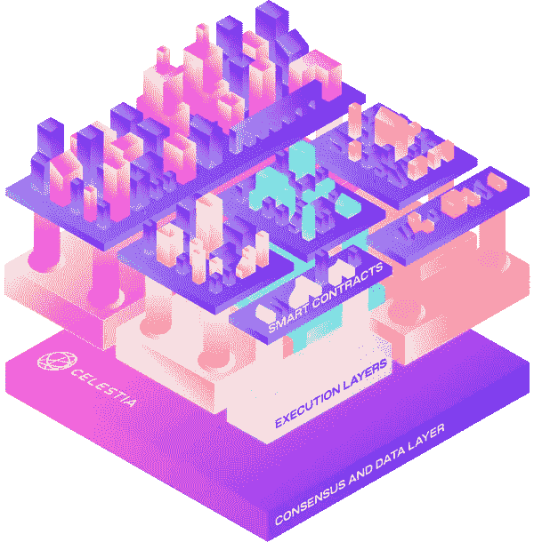

# 进一步了解数据可用性

> 原文：<https://medium.com/coinmonks/a-closer-look-at-data-availability-689d0c8fab5c?source=collection_archive---------4----------------------->

**概述**:继我的上一篇文章——[扩展第 1 层:ZK-汇总和分片](/@alliegro.m/scaling-horizontally-zk-rollups-and-sharding-7f8e37242348)——我想进一步阐明数据可用性的重要性以及在以汇总为中心的区块链中确保数据可用性的细微差别。

**了解数据可用性**

理解数据可用性的关键是从区块链中的数据块验证和安全性的基础知识开始。验证器在生成块时必须遵循一组规则。块必须仅包括有效的事务(即，导致有效状态改变的事务)，并且包括允许网络验证该规则已被遵循的两条数据:

*   **块头** —包括块的所有元数据，例如，先前的块散列、事务的 merkle 根、新的状态根、nonce、gas 限制、使用的 gas 等。
*   **块主体** —包括块中的所有事务，占块大小的大部分

一旦产生了块，网络中的所有节点共享该块，并且完整的节点(包括非块产生验证器)负责验证块中的事务(以及各种元数据验证)，但是它们是如何做到这一点的呢？请注意，块头包括新的状态根，它是在块中执行事务后系统更新状态的根哈希。因为完整节点存储以前的状态并下载发布块中的事务，所以它们可以执行三个关键任务:1)对照它们存储的状态检查事务的有效性，2)重新计算新的状态根并验证它与块头中包含的状态根匹配，以及 3)计算新的状态(或节点需要的状态的一部分)。

数据可用性对于数据块验证的必要性是我们在传统单片区块链中不会遇到数据可用性问题(请注意，对于轻型节点并非如此)的原因。如果验证程序发布了一个块并保留了一些交易数据，则完整节点将重新计算一个与块标题中包含的状态根不同的新状态根(使用可用的交易),从而导致拒绝该块并且不更新分类帐。因此，所有事务数据*必须对网络*可用，以使全部节点接受该块。

**旁注** —不存储状态且通常只下载块头的轻型节点*，*可以让块生产者确信所有数据都已发布。数据可用性采样(DAS)也可以是 L1 上的轻客户端验证数据可用性的一种机制，下面将在汇总上下文中进行解释。

**以汇总为中心的区块链中的数据可用性**

在模块化区块链中，由于验证和数据可用性的分离，确保数据可用性的不同机制是必要的。Rollups 使事务的验证和新状态的计算脱离了链，但仍然需要在链上发布一些事务数据，以避免数据可用性问题。具体来说，ZK 汇总向主链发送三条主要数据:

*   **新状态的密码提交**(根哈希)
*   **密码证明**(例如 ZK-斯纳克)，其证明新状态是将有效事务应用于先前状态的结果
*   **批量中每笔交易的少量数据**以调用数据的形式

密码证明的零知识性质无可争议地证明了事务和状态改变是有效的，但是没有揭示关于事务本身的信息。完整节点不再需要事务数据来主动验证事务并重新计算新的状态根。但是，如果没有向主链发布足够的事务数据，L1 上的节点将无法确定汇总的当前状态，这通常只是在某些情况下(但仍然是至关重要的)需要。例如，如果数据未发布，汇总操作符突然停止操作，汇总用户可能无法撤回到主链，因为节点无法计算其当前余额。因此，仍然需要发布足够的事务数据来恢复汇总的最新状态，以便在需要时可以下载它。虽然由于证据系统的不可腐蚀性，汇总不能窃取用户的资金，但是仍然需要数据可用性来确保用户在这些情况下能够访问他们的帐户。

但是满节点如何确保 rollup 发布所有的事务数据呢？由于完整节点不再计算状态变化(至少对于汇总而言)，因此它们无法知道汇总在没有下载数据和重新计算状态变化的情况下甚至拒绝了单个事务。这种解决方案需要完整的节点来跟上汇总的事务计算速率，这就破坏了将执行移出链的意义。在模块化区块链架构中，我们需要一种高效的方法来解决数据可用性问题。

**利用 DAS 和擦除编码解决问题**

确保数据可用性的最有效(也是吞吐量最大化)的方法是通过擦除编码和数据可用性采样。擦除编码将冗余引入过账交易数据，确保仅使用 50%的数据即可恢复整个数据集。如果汇总想要保留哪怕 1%的数据，操作员必须保留 50%以上的数据。由于这个原因，节点现在只需要对部分数据进行采样，就可以从概率上保证所有数据对网络都是可用的。事实上，对七个数据块进行采样足以有 99%的机会检测到不可用的汇总块并拒绝它。

该解决方案允许区块链通过汇总进行扩展，而不会牺牲安全性和分散性。该解决方案的一个同样重要但微妙的结果是，它还逆转了去中心化和可伸缩性之间的传统关系。为了达到概率保证数据可用的某个阈值，节点需要对事务数据进行一定次数的采样。当我们在网络中引入更多节点时，每个节点需要对一个数据块进行更少次数的采样(或者对一个更大的数据块进行相同次数的采样)，从而允许区块链在保持相同安全级别的同时，通过分散化进行扩展。

**DA-Only 层**

Celestia Modular Stack

随着分片的推出，以太坊正在转向主要为汇总提供数据可用性和共识层。虽然关于碎片角色的决定仍然悬而未决，但一些碎片可能会保持执行能力，而其余的将作为数据仓库。DA-only 区块链，如 [Celestia](https://celestia.org/) ，完全在基础层移除执行，只提供共识和数据可用性——即订购交易并保证其可用性。因为这些区块链从一开始就被构建为仅支持 DA 的层，所以它们比任何保持一定执行能力的区块链都有一些重要的优势:

*   节点要求可以更低，因为不需要执行能力；此外，使用 DAS 的轻型节点(例如，不存储状态的节点)可以提供与完整节点几乎相同的安全性
*   由于 DAS 的特性，更多的节点提高了可扩展性
*   无执行环境意味着区块链不对提交到链中的数据施加执行逻辑

最后一点是关键。没有执行逻辑需求意味着，可以想象，您可以为 EVM 和非 EVM 执行环境构建应用程序，在汇总上执行，并且所有应用程序都受到基本一致性和数据访问层的保护。类似地，您还可以拖放为各种其他区块链执行环境构建的各种现有汇总。在多链世界中，仅 DA 层提供了一个完全开放的设计空间。

引文

1.  [https://notes.ethereum.org/@vbuterin/data_sharding_roadmap](https://notes.ethereum.org/@vbuterin/data_sharding_roadmap)
2.  https://vitalik.ca/general/2021/01/05/rollup.html
3.  [https://coinyuppie . com/a-detailed-explain-of-roll up-technology-applications-and-data/](https://coinyuppie.com/a-detailed-explanation-of-rollup-technology-applications-and-data/)
4.  [https://blog . polygon . technology/ZK-and-the-future-of-ether eum-scaling/](https://blog.polygon.technology/zk-and-the-future-of-ethereum-scaling/)
5.  [https://blog . polygon . technology/the-data-avail ability-problem-6b 74 b 619 FCC/](https://blog.polygon.technology/the-data-availability-problem-6b74b619ffcc/)
6.  [https://vitalik.ca/general/2021/04/07/sharding.html](https://vitalik.ca/general/2021/04/07/sharding.html)