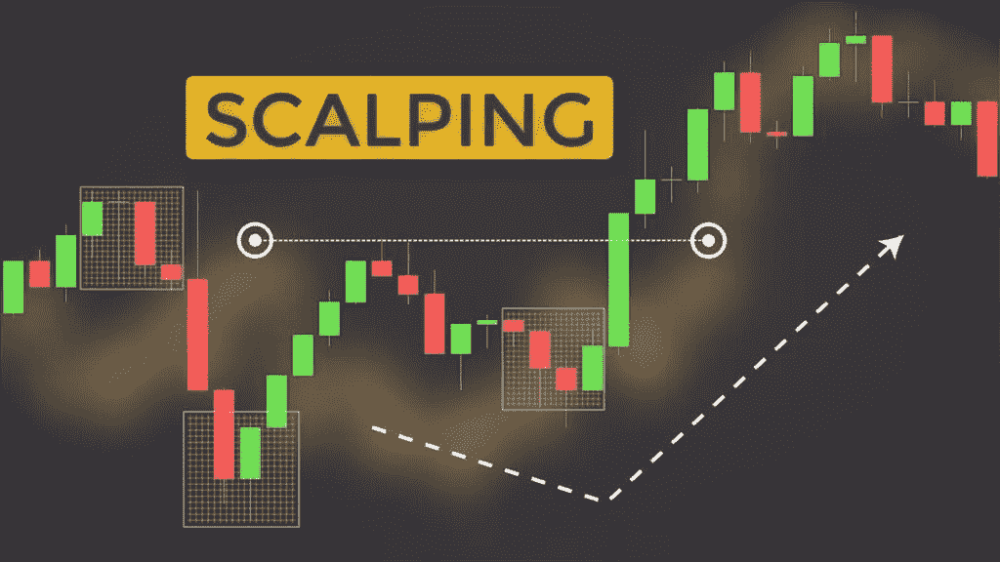

# 加密货币交易策略综合指南

> 原文：<https://medium.com/coinmonks/a-comprehensive-guide-to-cryptocurrency-trading-strategies-bc2552b19ad4?source=collection_archive---------58----------------------->

# 加密货币交易策略

最初发表于[https://koop360.com/blog/cryptocurrency-trading-strategies/](https://koop360.com/blog/cryptocurrency-trading-strategies/)

> *如果你想通过交易加密货币赚钱，你需要用丰富的知识和精心制作的加密交易计划来武装自己。*

加密货币的交易可以通过多种方式进行。交易者有各种各样的可能性，从现货交易和外汇套利到黄牛交易、日内交易，以及每个加密货币所有者最喜欢的关键字 HODLing。即使是菜鸟交易者也可能在选择了一个信誉良好的交易所后立即开始交易。战略加密货币交易的原则将在这篇文章中介绍，以便与您分享这些知识。

# 什么是加密货币交易策略？

加密货币交易策略是一种购买和出售加密货币的方法，可以降低风险，同时增加盈利的可能性。定义良好的交易策略可以降低交易风险，并规定交易对不断变化的市场条件的反应。

有一个交易计划可以让你在交易选择中不带感情色彩，让你更有策略地协调交易。

一个完整的交易策略可能包括以下要素:

*   你交易的资产
*   以下是所采用的工具、指示和信号资源。
*   交易时间表
*   限制损失的止损单包含在进场和出场计划中。
*   投资组合的表现可以用多种方法来衡量。

**加密货币交易策略**

**日交易**

[日内交易](https://en.wikipedia.org/wiki/Day_trading#:~:text=Day%20trading%20is%20a%20form,the%20next%20day's%20price%20at)定义为在一天内的不同时间，通常是在同一天内，以获利为目标，进入和退出一个头寸。尽管加密交易所不会关闭，但日交易是一种短期交易策略，交易者试图从当天的价格波动中获利。

加密货币的波动性创造了许多可能的可能性，但依靠日间交易获得稳定的收入需要强大的市场理解、丰富的交易专业知识和一点运气。每个人都可以成为日内交易者，但是这需要时间，努力，有时可能会不愉快。因此，老练的交易者应该考虑日内交易。

**倒票**

[刷单](https://en.wikipedia.org/wiki/Scalping_(trading))是一种专注于极短期交易的交易策略，目的是从大批量的比特币价格小幅波动中获利。黄牛党可以在几秒钟或几分钟内创建和终止赌注，利用有利可图的市场低效率来赚取微薄的利润。因此，刷单类似于高频交易(HFT)。要像黄牛党一样利用实时波动性，你必须对加密货币有深刻的理解，并具备出色的分析能力。

**摇摆交易**

[摇摆交易](https://en.wikipedia.org/wiki/Swing_trading)是一种长期交易技术，交易者试图从加密货币市场中的中短期价格模式或“摇摆”中获利。大多数的波段交易都需要在几天到几周内赚钱。与日交易相反，摇摆交易通常超过 24 小时，甚至可以持续几天或几周。

摇摆交易者寻找一种加密货币硬币或代币的波动波，这种硬币或代币预计会移动，然后在一段时间内进入一个位置。如果交易成功，交易者就赚钱了。

摆动交易是新手的理想选择，因为它允许他们在更长的时间内制定可靠的交易计划。江恩摆动法，使用烛台和振荡器的反转定位，相对力量指数动量指标，以及看涨和看跌吞没形态都是摆动图表方法的例子。

**购买并持有(HODL)**

买入并持有(Buy and hold)，有时被误拼为首字母缩写“ [HODL](https://www.investopedia.com/terms/h/hodl.asp) ”，是一种交易策略，要求持有投资，希望获得长期收益。霍德勒可能会通过购买和持有比特币以及押注指数增长来忽略加密货币市场的大部分波动性。

买入并持有策略还有其他好处，比如消除短期市场噪音、最小化交易成本、减轻投资者持续监控市场的心理负担。

**高频交易**

[高频交易](https://en.wikipedia.org/wiki/High-frequency_trading) (HFT)是一种算法交易，交易在几分之一秒内以高速进行。机构投资者大多采用这种策略。

顾名思义，HFT 正在全速前进。这种方法使用各种算法分析众多交易所中相同资产价格之间最微小的价格波动和不一致。HFT 平台和系统可能经常每秒钟打开和关闭许多头寸，旨在实现短期目标，否则将无法发现。

[**自动化交易机器人**](https://en.wikipedia.org/wiki/Automated_trading_system)

加密交易机器人是一种软件，它使用指定的输入来监控、分析和执行加密货币交易所之间的交易。通常，这些机器人采用交易算法程序，根据预定的计划自动购买和出售加密货币。创造市场、趋势跟踪和均值回归程序是最流行的算法。

在交易计算中必须考虑每一笔交易费用，最好的算法选择最好的交易所以获得成本优势。使用加密机器人进行交易可能是一个有用的工具，可以消除同时在多个加密交易所交易几种策略带来的复杂性和模糊性。

**结论**

传统金融市场中的交易在不同的资产类别中具有可比性，因为它需要短期和长期的纪律和明确的策略。理解加密货币交易的多种技术没有什么不同，理解它们为投资者提供了在竞争市场中利用的框架。每个交易者都有适合自己个性和交易预算的交易风格和计划。最有效的加密货币交易者在观察结果的同时混合策略，随着他们获得专业知识，调整方法。随着公司开始提出这些概念，例如 KOOP360，这是业界第一个可定制的、开源的、分散的机器人开发平台，使 [NFTs](https://koop360.com/blog/what-is-nft/) 和[元宇宙](https://koop360.com/blog/what-is-metaverse/)生态系统能够使用 AI/ML 技术快速构建或开发。KOOP360 使用简单的即插即用编程方法，您可以创建、开发或设计 NFT 数字艺术，并在 KOOP360 市场上出售。元宇宙是通过将虚拟/增强现实与基于人类触觉的环境相结合，利用自生成的编程来构建的。

> 加入 Coinmonks [电报频道](https://t.me/coincodecap)和 [Youtube 频道](https://www.youtube.com/c/coinmonks/videos)了解加密交易和投资

# 另外，阅读

*   [3 商业评论](/coinmonks/3commas-review-an-excellent-crypto-trading-bot-2020-1313a58bec92) | [Pionex 评论](https://coincodecap.com/pionex-review-exchange-with-crypto-trading-bot) | [Coinrule 评论](/coinmonks/coinrule-review-2021-a-beginner-friendly-crypto-trading-bot-daf0504848ba)
*   [莱杰 vs n rave](/coinmonks/ledger-vs-ngrave-zero-7e40f0c1d694)|[莱杰 nano s vs x](/coinmonks/ledger-nano-s-vs-x-battery-hardware-price-storage-59a6663fe3b0) | [币安评论](/coinmonks/binance-review-ee10d3bf3b6e)
*   [加密交易机器人](/coinmonks/crypto-trading-bot-c2ffce8acb2a) | [Bingbon 评论](https://coincodecap.com/bingbon-review)
*   [Bybit Exchange 评论](/coinmonks/bybit-exchange-review-dbd570019b71) | [Bityard 评论](https://coincodecap.com/bityard-reivew) | [Jet-Bot 评论](https://coincodecap.com/jet-bot-review)
*   [3 commas vs crypto hopper](/coinmonks/3commas-vs-pionex-vs-cryptohopper-best-crypto-bot-6a98d2baa203)|[赚取秘密利息](/coinmonks/earn-crypto-interest-b10b810fdda3)