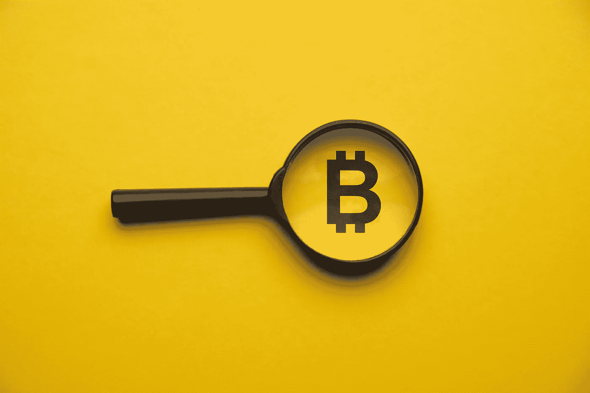
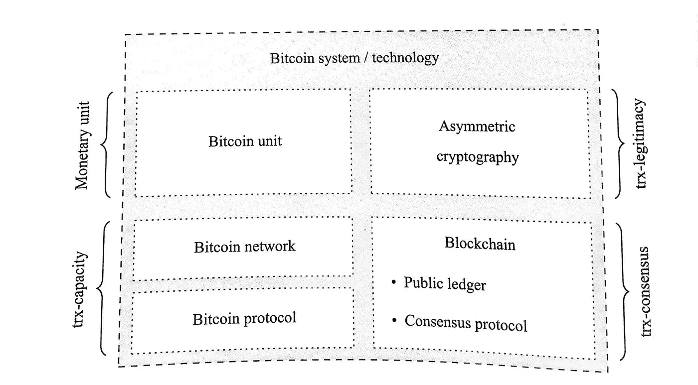
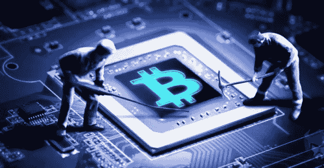
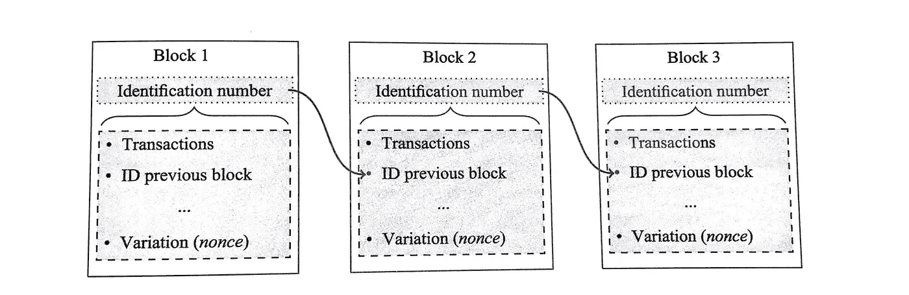
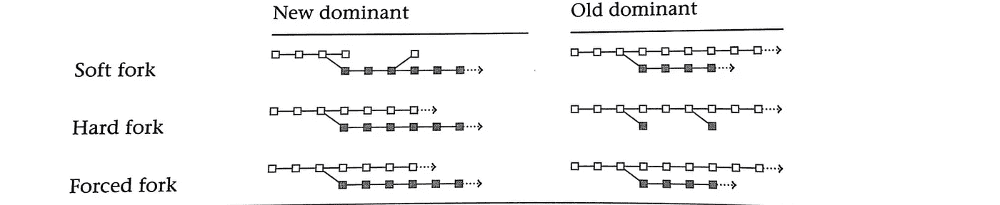

# 比特币的全面概述

> 原文：<https://medium.com/coinmonks/a-comprehensive-overview-of-bitcoin-b6750e0fe98a?source=collection_archive---------39----------------------->

image by CoinDesk

# **比特币的分类**

《比特币》于 2008 年 10 月 31 日出版，作者或作者团队以笔名中本聪出版。该出版物以学术文章的形式出现在密码学邮件列表中。然而，今天仍然不清楚谁的身份被假名所隐藏。

比特币是一个综合的概念，它将几个技术组件联系在一起，以便在竞争中发行价值单位，并同时具有虚拟表示和分散的交易处理。通过这种方式，比特币系统创造了与任何其他货币(如商品货币、现金或商业银行存款)截然不同的货币。

实物代表现金；通常是硬币或钞票，意思是它的价值与物体密不可分。实物也代表商品货币，如黄金，同样，单位的当前持有者默认被分配价值单位的所有权。商业银行存款是虚拟货币。它只是作为会计系统中的一个记录而存在。央行电子货币也是虚拟货币。在大多数国家，公众只能通过金融中介获取央行的电子货币。

# **比特币组件**

为了实现控制的独特组合，比特币使用了几个组件。

overview of bitcoin technology (trx+=transaction)

**比特币单位**:比特币单位是系统的虚拟货币单位，不以物理形式存在。比特币单位仅仅是分配给特定个人的分类账条目。

**比特币网络**:比特币网络完全去中心化。它妥协的参与者和他们的联系，并作为交换信息和建立共识的主要沟通渠道。

**比特币协议**:比特币协议规定了交流信息和建立共识的方式方法。

**非对称加密**:非对称加密(也称为公钥加密)用于验证目的。它使所有比特币网络用户能够决定性地验证任何交易信息的合法性。

**比特币区块链**:比特币区块链是一个公共账本。每个人都可以检查分类帐，下载一份副本，并更改它。然而，网络只会考虑只包含可验证的合法交易的分类账版本，并将其视为最新版本的比特币区块链。共识协议保证了后一个标准。为此，比特币区块链采用了一种被称为工作证明的程序

# 比特币独特的销售主张

账本的使用并不是比特币技术带来的新奇事物。例如，商业银行存款只不过是对实物货币单位(现金)债权的基于分类账的虚拟化。在这里，分类账完全由一个中央机构管理，该机构保证交易能力、交易合法性和交易共识。

*交易能力*与确保所有者发起支付的能力相关。客户可以与他们的客户顾问交谈，或者通过传统银行系统中的银行在线银行平台提交他们的支付指令。

*发起交易时检查交易合法性*。在传统的银行系统中，中央机构识别交易的发起者，并确保该个人是所引用余额的合法所有者。

比特币的关键创新在于它拒绝与中央权威机构合作。在没有中央权威的情况下，保证交易能力、建立交易合法性和达成交易共识更具挑战性。

# **比特币技术**

**交易能力**
比特币网络是系统的基础。它允许交换信息，并基于点对点技术。术语“对等”是指所有网络参与者都是对等的，没有例外，并且任何两个参与者之间都可以进行通信。没有中央结构，任何参与者都没有任何专属特权。

**交易合法性**
如果网络参与者收到交易消息，他必须确保交易是由相应比特币单位的合法所有者发起的。为此，比特币采用了成熟的加密方法。同样的加密原理也用于电子商务、网上银行和许多其他应用。

**事务一致**
由于网络的去中心化特性，不可避免地会出现网络参与者的各种事务队列不同步甚至可能包含矛盾事务的情况。

# **比特币挖矿**

为了理解比特币系统的共识机制，我们首先必须讨论比特币矿工的角色。比特币矿工收集待处理的比特币交易，验证其合法性，并将它们组装成所谓的区块。块是包括至少一个事务的数据结构。构建模块和执行必要计算的过程被称为比特币挖掘。矿工的目标是通过这项活动赚取新创建的比特币单位。

*比特币挖矿是无许可的*但是需要计算资源。每个工作参与者都可以自由决定他们希望在计算资源上花费多少钱。要成为一名比特币矿工，网络用户需要比特币区块链的最新版本，以及一个自动化这一过程的软件包。

example of a blockchain

**区块链**
的不变性标识号是唯一的，取决于块头的内容。对块标题内容的任何修改将不可避免地导致标识号的改变。这将在链结构中引入不一致性，因此必须重新创建所有后续块。

矿工之间的共识是，每个矿工接收到仅包括有效交易并且具有低于当前阈值的识别号的块时，将该块添加到他们自己的比特币区块链副本中。从博弈论的角度来看，哈希均衡是一种策略配置，所有矿工都将有效块添加到自己的比特币区块链副本中。如果一个挖掘者认为所有其他挖掘者都在相应地行动，那么该挖掘者的最佳反应是将有效的候选块添加到他们自己的副本中。

**采矿奖励**
采矿奖励很贵，硬件要布线维护，还有电费。这些费用由矿工个人承担。另一方面，维持比特币区块链有利于所有网络参与者。采矿在这方面提供了一种公益:没有人可以被排除在使用网络之外，所有网络参与者都从采矿活动中获利。然而，如果没有补偿，没有一个采矿者会有动力去贡献和承担维护网络的费用。

比特币系统通过允许矿工向每个区块添加所谓的 *coinbase 交易*来解决这个激励问题。该交易产生新的比特币单位，成功将区块添加到区块链的矿工可以认领这些单位。因为每个人都遵循链的最长版本，所以只有当块是区块链的最长版本的一部分时，coinbase 事务才会被网络接受。

# 什么是硬分叉、软分叉和强制分叉

**软分叉**
软分叉是指新软件收紧接受规则的分叉，使得新规则是新规则的子集。因此，新软件下的有效块在旧软件下也会被接受为有效块，但大多数情况下，反之亦然。

硬分叉(Hard fork)
硬分叉(Hard fork)指的是新软件拓宽验收标准的分叉，旧规则代表新规则的子集。这导致使用最新软件创建的块可能被旧软件拒绝。相反，新软件将始终认为旧软件生成的块是有效的。

**Forced fork**
Forced fork 使用完全不同的规则集，旧的软件永远不会按照新的规则接受区块，反之亦然。因此，它总是会导致两个不同版本的区块链。

White = blocks generated with old software. Gray = block generated with new software. forks occur respectively at the fourth block

这是根据分配的计算资源，使用软、硬和强制分叉的分类帐版本的开发。

# 软叉和硬叉的区别

通过讨论块大小限制的变化，可以很容易地解释软分叉和硬分叉之间的区别。

*降低块大小限制*是一种软分叉，因为旧软件版本认为新软件版本生成的块被旧软件认为是有效的。

*增加块大小限制*是一个硬分叉，因为旧软件版本认为更新后新软件版本产生的一些块是无效的。因此，由最新软件版本生成的块链被旧软件视为无效。

# 结论

很多人都在寻找投资比特币的机会。甚至大公司也在与现有的加密客户端合作。越来越多的在线和本地商店正逐渐接受比特币支付。随着越来越多的人买卖比特币获利，加密市场正在发展壮大。使用比特币储存价值的人数与日俱增。

比特币是自互联网以来最大的投资机会，我们几乎像使用语言一样在社会中交流价值。11 年来，比特币平均每年增长两倍，增长率为 233%。纸币相对于大多数硬资产，尤其是比特币，已经跌至历史低点。

是的，比特币有利有弊。尽管如此，花点时间去理解比特币，它是如何工作的，以及如何交易或投资它。

"*比特币创造了一个创新成熟的环境，因为它不仅仅是一种货币；是技术，是网络，是货币。”*

希望你有一个精彩的阅读

> 加入 Coinmonks [电报频道](https://t.me/coincodecap)和 [Youtube 频道](https://www.youtube.com/c/coinmonks/videos)了解加密交易和投资

# 另外，阅读

*   [Bookmap 点评](https://coincodecap.com/bookmap-review-2021-best-trading-software) | [美国 5 大最佳加密交易所](https://coincodecap.com/crypto-exchange-usa)
*   最佳加密[硬件钱包](/coinmonks/hardware-wallets-dfa1211730c6) | [Bitbns 评论](/coinmonks/bitbns-review-38256a07e161)
*   [新加坡十大最佳加密交易所](https://coincodecap.com/crypto-exchange-in-singapore) | [购买 AXS](https://coincodecap.com/buy-axs-token)
*   [红狗赌场评论](https://coincodecap.com/red-dog-casino-review) | [Swyftx 评论](https://coincodecap.com/swyftx-review) | [CoinGate 评论](https://coincodecap.com/coingate-review)
*   [投资印度的最佳密码](https://coincodecap.com/best-crypto-to-invest-in-india-in-2021)|[WazirX P2P](https://coincodecap.com/wazirx-p2p)|[Hi Dollar Review](https://coincodecap.com/hi-dollar-review)