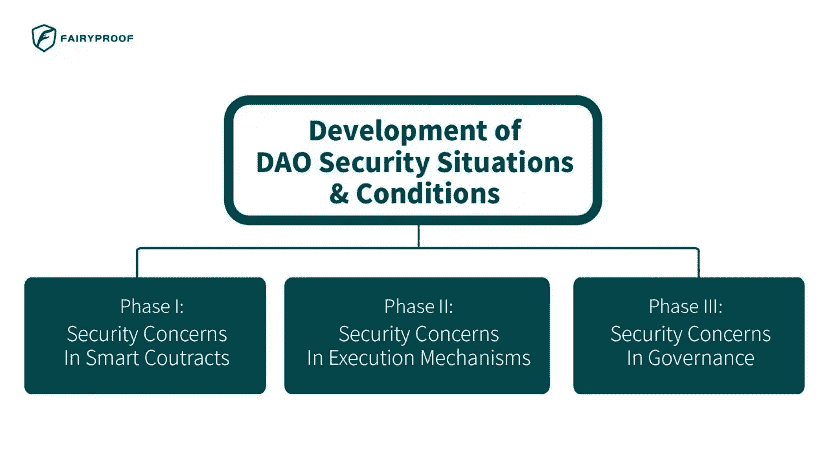

# 道安全性的仙证综合研究

> 原文：<https://medium.com/coinmonks/a-comprehensive-research-on-daos-security-by-fairyproof-bf228ff8f594?source=collection_archive---------8----------------------->

DAOs(去中心化自治组织)[1]是一种基于区块链技术的新型组织形式。DAOs 可以被认为是全球人民朝着共同目标努力的一种新方式。是什么让 Dao 与现有的公司、组织、机构等有巨大的不同？aDAOs 的部分或全部治理是基于区块链智能合约中编码的规则进行的。

第一个最受认可的 DAO 项目是 2016 年推出的“The DAO”[2]。然而，不幸的是，由于一个致命的漏洞，DAO 最终失败了，这个漏洞不仅破坏了项目，还导致了以太坊痛苦的硬分叉[3]。

似乎第一天的安全问题就围绕着 DAOs 的开发。

自过去几年以来，Dao 已经发展并取得了巨大的进步-今天的 Dao 在几乎每个方面都比 2016 年成熟得多-然而，安全问题仍然是一个持续的问题，因为 Dao 仍然面临着许多安全挑战。

为了解决这些问题，自 2016 年 DAO 推出以来，Fairyproof 的研究团队对过去几年 DAO 的安全形势和条件的发展进行了回顾性研究。

基于常见的漏洞类型 DAOs，我们认为 DAOs 的安全状况和条件的发展经历三个阶段:

在第一阶段，最大的安全问题在于智能合约。在第二阶段，最大的安全问题在于执行机制。在第三阶段，也就是现在，最大的安全问题在于在治理中应用令牌的治理规则或机制的设计。

我们分析了每个阶段的安全问题，并希望与加密行业分享我们的探索性观察。

**第一阶段:智能合同中的安全问题**

在这一阶段，最大的事件是刀的崩溃。这次崩溃的根本原因是 DAO 的智能合约中的一系列漏洞被黑客利用，导致项目三分之一的资金被耗尽。

这个巨大的损失停止了 DAO 项目，并迫使以太坊团队最终硬分叉以太坊。

这件事之后，人们不再谈论 DAOs，人们对 DAOs 最初的热情也消退了。

这一事件揭示了一个令人痛苦的事实:当基于智能合约的 dApps 仍处于早期阶段时，由于缺乏安全方面的经验和实验，基于智能合约的 Dao 远未成熟到能够如预期那样处理甚至简单的案件。

因此，在这个阶段，智能合约中的安全问题是最大的挑战。

**第二阶段:执行机制中的安全问题**

虽然 DAO 的失败严重影响了 DAO 的发展，但仍然有团队在这个领域努力工作，极大地推动了 DAO 的极限。马克尔道[4]背后的团队就是其中之一。

MakerDAO 于 2017 年正式在以太坊上线。自从它在以太坊上部署以来，它背后的团队就开始探索通过使用 DAO 来管理它的操作和驱动它的发展。通过多年的精心开发和管理，MakeDAO 一直运行良好，安全可靠，其智能合约没有遭受严重攻击，也没有遇到任何严重的安全问题。

它被认为是以太坊上最强大、最安全、最完善的项目之一。

马克尔道的幸福和积累的声誉逐渐并强烈地树立了人们对道的信心。与此同时，这些年来，更多的团队开始注意到智能合同审计的重要性，更多的项目在部署之前得到了审计。这就大大降低了一个项目如果通过了专业审核，被黑的可能性。

然而，2020 年 3 月发生的一次破坏性事件使 MakerDAO 陷入混乱，引发了几乎在 DAOs 消失的安全担忧。

2020 年 3 月 12 日，整个加密领域受到了市场崩盘的残酷打击。乙醚是马可道最重要的抵押品之一，价格大幅下跌。仅在那一天，其价格就暴跌了 50%以上。乙醚价格的巨大变化引发了马克尔岛乙醚的大规模清算。

这种清算很快造成了严重的连锁交通堵塞。然而，由于马可道从未经历过这种大规模清算，其清算机制的设计没有足够的弹性来处理这种情况。这导致清算机制未能如预期那样发挥作用。

马可道在此次事件中遭受了巨大的财务损失。

在这次事件中，就 MakerDAO 的智能合约而言，实现中没有漏洞。正是其机制中的漏洞导致了损失。

这件事之后，人们开始注意到 DAOs 的机制设计。然而，由于加密领域的大多数 dApps 没有像 MakerDAO 那样在他们的治理中应用 DAOs，DAOs 中的安全问题没有持续很长时间，DAOs 的安全仍然没有得到足够广泛的关注。

**第三阶段:治理中的安全问题**

2020 年 6 月，一个著名的 DeFi 应用化合物发布了它的治理令牌 COMP [5]。在 Compound 的设计中，COMP 令牌不仅用作治理令牌，还用于奖励为协议提供流动性的人。这一创新设计迅速风靡了 DeFi。几乎所有在 Compound 之前或之后发布的 DeFi 应用程序或协议都遵循了这种设计，并发布了自己的治理令牌。

尽管 Compound 不是第一个发布治理令牌的项目，但是它是在 DeFi 中几乎所有项目中触发治理令牌发布的项目。

从那以后，治理令牌被广泛用于 DeFi 应用程序中，通过投票来进行治理。任何持有项目治理令牌的人都可以参与投票支持一个提议或者提交一个提议。

在发布治理令牌的项目中，一些项目团队列出了令牌持有者投票的重要决策，一些团队为令牌持有者设计了非常低的提交任何提案的门槛。这潜在地给了恶意行为者入侵项目的机会，并且不可避免地引入了风险。例如，恶意行为者可以贿赂项目的其他令牌持有者提交提案或投票支持利用项目的提案。

从理论上讲，如果大多数治理令牌不是由善意的参与者持有，那么任何发布治理令牌的项目都可能遭受这样的攻击。

此外，通过 AAVE [7]创建的名为“闪贷”[6]的创新机制，恶意参与者甚至可以在不需要持有治理令牌的情况下发起这样的攻击。他可以利用快速贷款借入大量的治理令牌，只需支付少量费用，就可以强制提案获得通过或提交执行。

自 2020 年以来，各种 DeFi 应用遭受了这些攻击[8][9][10]，并且这种攻击的损失近年来一直呈上升趋势。

如今，它已经成为对使用 DAO 来管理其决策过程的 dApp 的主要攻击。这些攻击通常被称为“治理攻击”。

像我们在第二阶段中讨论的安全问题一样，大多数遭受治理攻击的项目不是由于它们的智能契约中的漏洞，而是由于它们的治理规则或机制的设计中的漏洞。

然而，与对智能合同的攻击相比，治理攻击仍然没有得到足够的重视。

我们认为随着越来越多的 dApps 倾向于使用 DAOs，治理攻击将会更加流行。因此

Fairyproof 一直在关注治理攻击的发展。我们不仅在研究这一主题，而且还开发了实用程序来应对这一领域的挑战。

治理攻击是一种专门针对区块链应用程序的新型攻击。它们比对智能合约的攻击更复杂。这对 dApp 团队和安全公司来说都是一个巨大的挑战。我们将在这一领域继续努力，并发表更多文章分享我们的研究成果。

**参考文献:**

[1]分散自治组织(DAOs)，【https://ethereum.org/en/dao/】T2

[2]道(组织)，[https://en . Wikipedia . org/wiki/The _ DAO _(组织)](https://en.wikipedia.org/wiki/The_DAO_(organization))

[3]以太坊经典，【https://en.wikipedia.org/wiki/Ethereum_Classic】T2

[4]https://makerdao.com/[马克尔道](https://makerdao.com/)

[5]复合治理，

2020 年 2 月 27 日 https://medium . com/compound-finance/compound-governance-5531 f 524 cf 68

[6]闪贷，[https://docs.aave.com/faq/flash-loans](https://docs.aave.com/faq/flash-loans)

[https://app.aave.com/](https://app.aave.com/)AAVE【7】

[8]建财道遭受治理接管攻击，

[https://crypto briefing . com/build-finance-Dao-beasts-governance-take-attack/](https://cryptobriefing.com/build-finance-dao-suffers-governance-takeover-attack/,)，2022 年 2 月 15 日

[9] Beanstalk 创始人在损失 1.82 亿美元之前打消了对治理攻击的担忧，[https://www . the verge . com/2022/4/22/23037325/Beanstalk-discarded-governance-attacks-lost-1.82 亿](https://www.theverge.com/2022/4/22/23037325/beanstalk-dismissed-governance-attacks-lost-182-million)，2022 年 4 月 22 日

[10] Fairyproof 对攻击堡垒协议的分析，

[https://medium . com/coin monks/fairy proofs-analysis-of-the-attack-on-fortress-protocol-6 FB 2d f 687845](/coinmonks/fairyproofs-analysis-of-the-attack-on-fortress-protocol-6fb2df687845)，2022 年 5 月 9 日

> 加入 Coinmonks [电报频道](https://t.me/coincodecap)和 [Youtube 频道](https://www.youtube.com/c/coinmonks/videos)了解加密交易和投资

# 另外，阅读

*   [如何在 FTX 交易所交易期货](https://coincodecap.com/ftx-futures-trading) | [OKEx vs 币安](https://coincodecap.com/okex-vs-binance)
*   [CoinLoan 评论](https://coincodecap.com/coinloan-review) | [YouHodler 评论](/coinmonks/youhodler-4-easy-ways-to-make-money-98969b9689f2) | [BlockFi 评论](https://coincodecap.com/blockfi-review)
*   XT.COM 评论 | [币安评论](https://coincodecap.com/xt-com-review)
*   [SmithBot 评论](https://coincodecap.com/smithbot-review) | [4 款最佳免费开源交易机器人](https://coincodecap.com/free-open-source-trading-bots)
*   [比特币基地僵尸程序](/coinmonks/coinbase-bots-ac6359e897f3) | [AscendEX 审查](/coinmonks/ascendex-review-53e829cf75fa) | [OKEx 交易僵尸程序](/coinmonks/okex-trading-bots-234920f61e60)
*   [如何在印度购买比特币？](/coinmonks/buy-bitcoin-in-india-feb50ddfef94) | [瓦济克斯审查](/coinmonks/wazirx-review-5c811b074f5b)