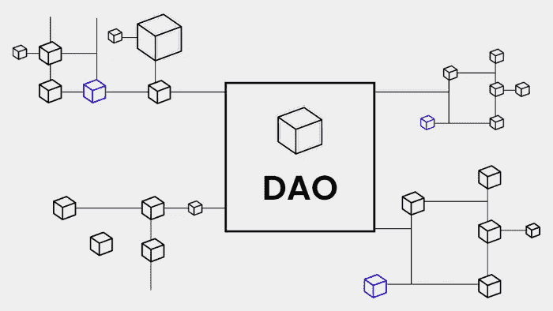
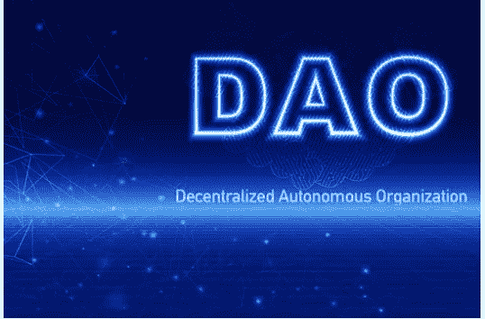

# DAOs 简明指南

> 原文：<https://medium.com/coinmonks/a-concise-guide-to-daos-4348f7142b2e?source=collection_archive---------31----------------------->

[区块链技术](https://www.leewayhertz.com/blockchain-technology-explained/)正在改变世界，取代了大部分行业的中心化概念，包括商业、教育，甚至娱乐行业。

你能想象一群来自世界各地的人合作，同意建立一个组织，通过区块链自主做出他们自己的决定和规则吗？DAOs 使这成为可能。

为了理解道的[概念，我们可以称之为拥有银行账户的在线社区。小组中的每个人都向该基金捐款，该基金用于管理特定的道。让我们更深入地了解道的概念，并理解它到底是如何工作的，以及它解决了什么问题。](https://www.leewayhertz.com/decentralized-autonomous-organization/)

## 道是什么？

DAO 是分散自治组织的缩写，旨在实现透明并完全由成员管理。由[区块链](https://www.leewayhertz.com/what-is-blockchain/)技术驱动，DAOs 打算建立一个不受任何中央权威影响的分散基础设施。

监管 Dao 所需的规则和政策被嵌入到代码中，并通过智能合约来执行，从而消除了对任何中央权威机构的需求。有了这种一致性，分散的自治组织终结了官僚主义或等级制度。

道的机制正在获得巨大的牵引力。它鼓励互联网用户和创业爱好者利用下一代技术 DAO，在公平和安全的环境中与志同道合的人建立自己的自治社会组织。

## 为什么需要 Dao？

创业对人们来说通常是具有挑战性的，它涉及到资金、成员的信任以及他们在定义路线图中的平等贡献；这些都需要信任。

有了 DAOs，人们不需要寻找投资者或商业成员，他们甚至可以邀请他们在互联网上互动过的人。那是因为 DAO 使用代码来运行组织。这些代码是编码在智能合同中的规则，它是 100%透明的，每个人都可以验证。

## Dao 现在是如何使用的？

Dao 有许多用途，包括慈善、筹款、借贷、交易 NFT 和投资。例如，一个以慈善为基础的道可以接受世界各地人们的捐赠，并允许组织成员决定如何合理使用慈善资金。

作为下一级利用，DAO 正在为一个元宇宙组织提供动力，该组织支持在 DAO 元宇宙内集成各种小型 DAO，并在一个完整的虚拟世界中管理这些小型 DAO。

## Dao 是如何工作的？

[基于区块链的 Dao](https://www.leewayhertz.com/dao-enabled-nft-platform/)由智能合约和高安全性提供支持。要使 DAOs 成为一个功能齐全的自动化组织，需要具备以下三个主要要素:

***规则集:*** 规则定义并写在智能合约中，用于规范去中心化的自治组织。因此，相关成员应讨论并定义所需的规则。

***投票机制:*** 投票权对于建立智能合约中定义的规则的运行非常重要。对这些规则的任何修改都应该得到全体成员的同意。

***资助:*** 道是用代币资助的，代币可以是建造道的区块链的本土代币，也可以是各区块链普遍接受的代币。

## 道解决什么问题？

Dao 解决了传统组织中存在的许多问题，下面提到了一些核心问题:

**激励**

激励的分配对小组织来说不是一个挑战，但是大组织很难认识到员工的适当增值并激励他们。例如，一个公司的首席执行官不会评估在销售部门工作的人的表现。这样，一些员工没有受到激励，因为他们对组织的贡献不算数。

因为 Dao 是自动化的和分散的，所以这些赋予了用户主权。每个成员都可以看到彼此的贡献，并根据集体意见决定激励措施。

**投票或治理机制**

与传统组织中的投票方式(由授权人员手动进行投票和计票)相反，Dao 自动执行投票和决策过程，无需任何中介。结果也是根据多数票自动宣布的。所有这些活动都通过智能合同进行监管。

**灵活性**

对于一个要扩张的组织来说，灵活性很重要。传统公司需要几个月的时间来对一项提议采取行动，而实施可能需要更长时间。有了 DAOs，可以使用智能合约快速制定和执行计划。因为每个成员都是道的主人，所以没有等级制度的空间。因此，Dao 很可能比现实世界中的组织扩张得更快。

# 道斯的未来！

品牌和企业应该跟上最新的趋势和技术，以发现更有效的方法来吸引客户并在竞争中保持优势。虽然 Dao 还不太流行，但它们似乎是许多成功公司的未来。有了这个，我们可以期待[刀是 worḳ的未来](https://www.leewayhertz.com/decentralized-autonomous-organization/)

> 加入 Coinmonks [电报频道](https://t.me/coincodecap)和 [Youtube 频道](https://www.youtube.com/c/coinmonks/videos)了解加密交易和投资

# 另外，阅读

*   [Bookmap 评论](https://coincodecap.com/bookmap-review-2021-best-trading-software) | [美国 5 大最佳加密交易所](https://coincodecap.com/crypto-exchange-usa)
*   最佳加密[硬件钱包](/coinmonks/hardware-wallets-dfa1211730c6) | [Bitbns 评论](/coinmonks/bitbns-review-38256a07e161)
*   [新加坡十大最佳加密交易所](https://coincodecap.com/crypto-exchange-in-singapore) | [购买 AXS](https://coincodecap.com/buy-axs-token)
*   [红狗赌场评论](https://coincodecap.com/red-dog-casino-review) | [Swyftx 评论](https://coincodecap.com/swyftx-review) | [CoinGate 评论](https://coincodecap.com/coingate-review)
*   [投资印度的最佳密码](https://coincodecap.com/best-crypto-to-invest-in-india-in-2021)|[WazirX P2P](https://coincodecap.com/wazirx-p2p)|[Hi Dollar Review](https://coincodecap.com/hi-dollar-review)