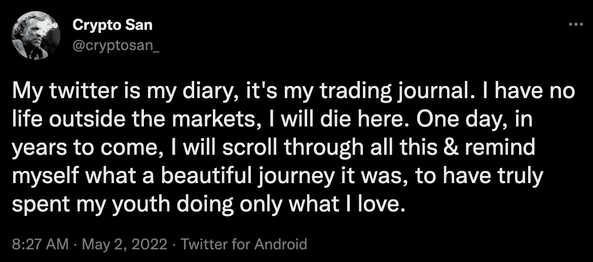
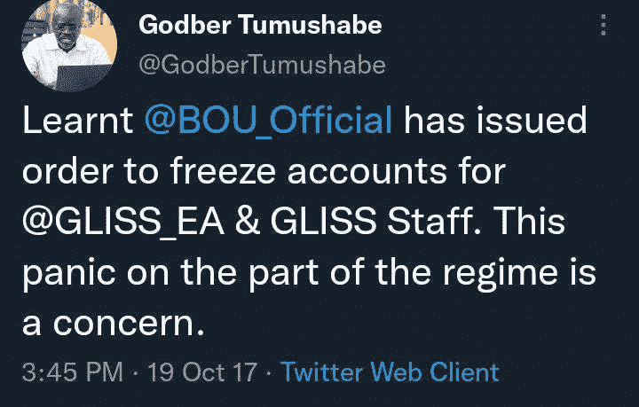

# 与“圣”亚历克斯、乌干达、非洲和世界的对话

> 原文：<https://medium.com/coinmonks/a-conversation-with-san-alex-uganda-africa-the-world-72558688c330?source=collection_archive---------3----------------------->

以下是对一位当时使用假名的 twitter 用户的对话和采访，不久之后他成了我的朋友。在浏览了他充满知识、激情和勇气的页面后，出于好奇，我决定给他发消息，以了解该账户背后的更多信息。

最后与我交谈的是来自乌干达姆巴拉拉的阿坎德瓦纳霍·亚历克斯，绰号“桑”。他分享了他的故事、智慧和远见，远远超过了我从一条随机的 Twitter 消息中预见到的，更不用说是我这个年龄的人了。接下来的对话提醒了我为什么关注区块链的成功及其影响，也让我明白了这位倡导更强大的全球未来的最聪明的人之一。

> 毕竟，死亡会把我们都冲走。只做你喜欢的事。被你的直觉、你内心的声音、你的激情所引导，那是上帝通过你告诉你去做你该做的事。阿坎德瓦纳霍·亚历克斯

对话可以分为三个标题部分:

*   背景故事和经历
*   乌干达国
*   非洲与世界，大视野

# **背景故事&经历**

我叫 Akandwanaho Alex，今年 20 岁，来自乌干达。我出生在姆巴拉拉，一个位于该国西南部的城镇。我有三个姐妹，其中两个比我大&她们都结婚了，还有一个上小学的妹妹。我的父亲是一名商人，我的母亲以前是一名幼儿园教师，在意识到一个人在生活中无法从教学中获得太多东西后，她后来也投身于商业。在美国，教书并不像在世界其他地方那样被视为一项高尚的工作，在这些地方，教书的回报当然也更少。

我去了加略山初级学校，这是一所邻近的小学，我在那里接受幼儿园和小学教育。13 岁时，在全国小学期末考试中获得第一名后，我加入了 Ntare 学校接受 O 级教育(O 级是中学的前四年),然后最终进入圣玛丽寄宿中学接受 A 级教育(中学/高中的最后两年)。Ntare 和圣玛丽都是这个国家最好的学校。我的父母，即使在经济条件不太好的情况下，也努力为我提供最好的教育，因为我的天赋在我生命的早期就已经很明显地表现出来了。

我喜欢骑自行车。我有一辆自行车，骑着它穿过我的城镇，我感到很快乐。我也喜欢阅读，这是我最大的消遣。我是一个非常好奇的人，我的内向给了我阅读的时间。我很少出门，大部分时间我都独自思考生活和阅读。我相信这解释了为什么我喜欢交易，对于像我这样内向的人来说，这是最好的工作。我也听很多音乐，音乐是人们做他们喜欢的事情时发生的事情的最具启示性的表现。就像体育一样，音乐只适合有才华的人，没有热情的人几乎没有立足之地。我的人生信条是只做你喜欢或热爱的事情。金钱永远不应该是你为什么做某事的主要因素，它应该是首先对你所做的事情的热爱，然后才是金钱。就像查尔斯·布可夫斯基的名言所说，“找到你喜欢的，让它杀死你”。毕竟，死亡会把我们都冲走。只做你喜欢的事。被你的直觉、你内心的声音、你的激情所引导，那是上帝通过你告诉你去做你该做的事。

**发现比特币 **

2016 年底，在一次例行的学校假期访问我在首都坎帕拉上大学的姐姐们时，我姐姐和我谈到了数字货币，她和她的男朋友都从一个朋友那里听说过，这个朋友也从一个朋友那里听说过。随着大学最后几年的临近，他们绝望地寻找赚钱的方法，因为他们想到大学毕业后的生活将会多么艰难，因为这个国家几乎没有任何工作。他们花了更多的时间来研究比特币如何给他们一个机会。他们和更多的朋友一起开始在坎帕拉教授和帮助人们购买比特币作为投资，并收取佣金作为回报。在 2017 年加密牛市的背景下，他们获得了丰厚的报酬，因为他们的参与得到了回报。快进到 2020 年，当新冠肺炎强制封锁这个国家时，由于我花了数千个小时浏览互联网和交易论坛，我开始全职从事加密交易。我迈出了大胆的一步，在学校重新开学的同一年，我决定退学。在我做出决定之前，我正在学习经济学、数学和企业家精神。我离开了旧的传统学校系统，由于缺乏互联网接入或现代移动设备而变得更加糟糕，因为几乎所有的乌干达学校都存在这种情况，由于家里有互联网，我进入了一个全新的更大的可能性的世界。

# **乌干达**

***乌干达目前的经济状况如何？***

乌干达的经济主要是非正规的。黄金和咖啡构成了我们大部分的出口商品，甚至像衣服这样最基本的东西也是进口的。养牛、种植香蕉以及食品、服装和其他基本生活必需品的非正规商业活动是人们为生存而从事的一些活动。目前还没有成熟的工业技术。商业银行在这里收取高达 20%的贷款利息。你可以开始想象，对于普通人来说，经济环境是多么的艰难或者掠夺性，即使假设他们能够支付利息，他们仍然没有银行账户。

***你对乌干达先令有什么看法或关系？***

在很大程度上依赖于其他国家的经济结构产生了几个问题，最明显的是多年来的货币贬值。就在 2008 年，1 美元可兑换 1，600 乌干达先令，今天，1 美元可兑换约 3，500 乌干达先令。短短十几年贬值超过 100%。

***比特币如何赋能乌？***

普通人对金融一无所知，对货币和银行业务一无所知，他们最接近银行账户的东西就是移动货币。手机货币基本上是与你的 sim 卡线路相连的钱，就像银行账户一样。但是它仍然集中在电信公司手中，这些公司和银行一样，与政府关系密切。稍后，我会解释为什么集权是危险的。现在，移动货币已经深入到人群中，比银行更深入，因为它更方便，你只需要一部手机和一张 sim 卡。统计数据显示，超过 2000 万乌干达人使用手机支付，乌干达有 4500 万人口。即使移动货币作为银行的替代选择取得了成功，移动货币也容易出现许多缺点，如成本高，乌干达政府在 2018 年对取款征收 1%的移动货币税。

用穷人自己的钱对一项简单的交易征税来加重他们的负担，这在道德上是错误的。移动货币的其他缺点是在获取 sim 卡的过程中必须进行 KYC。乌干达人需要一个国民身份证才能购买 sim 卡，这不会在其他地方引起警报，但我们有最不正常的数据收集系统，如果 lucky 可以花大约五年时间处理一张简单的塑料卡，上面有你的详细信息，你可以考虑获得一个国民身份证。不可思议的低效率是今天的秩序，我个人没有一个国民身份证，这将使我无法获得一个 sim 卡，并有一个移动货币账户。我不能有一个银行账户，因为银行也需要一个身份证，我应该怎么去银行？光是强制 KYC 的想法，就让我对这个数据和隐私随时可能被侵犯的国家缺乏隐私感到不安。它向政府提供了如此多的信息，这些信息本身就可能被用来对付你。

这里的腐败和滥用权力令人作呕，政治阶层继续在贫困的海洋中享受奢华。根据 2021 年 IGG 报告(IGG 是一个反腐败的政府机构)，乌干达因腐败损失了 44%的国家预算。44%用于服务交付的资金被盗。他们开着昂贵的汽车，拿着丰厚的薪水，所有这些都是由贫穷的下层公民服务的。我们的领导人去欧洲或美国接受治疗，而把医院留在这里烂掉，这是一种耻辱。公职部门的贿赂是这里的一种生活方式，似乎从来没有什么东西起作用。就治理而言，这是你能想到的最糟糕的绝对反乌托邦世界。我已经对这一切麻木了，对我来说，对这里持续的滥用权力的愤怒已经没有意义了。2019 年，乌干达银行员工被钉在货币印刷传奇中。难以想象的是，掌管我们经济的人合谋印刷更多的货币，只是为了满足他们自私的需求。这里有一篇新闻文章，可以让你更好地理解这个震惊全国的货币传奇。

点击了解本次活动的更多信息[。](https://www.newvision.co.ug/news/1502330/bank-uganda-currency-saga-deepens)

所有这些腐败、权力滥用和政治低效只能通过剥夺这些小偷(政治阶层)增强其贪婪的能力来纠正。我过去并不是一个自由主义者，但今天我对一切政治事物的厌恶已经达到了极限。我相信这种被中央集权制度所强化和助长的腐败是所有人类问题的根源。为了人类的利益，剥夺政客和政府的经济权力才是正确的，他们永远不应该在经济上对我们有发言权或决定权。人类是贪婪的，允许贪婪的物种控制任何东西是非常危险的，因此，所有的经济系统都必须像机器人一样向前发展，没有贪婪，分散化，以平等的能力为每个人服务，而不是让一小部分人受益。比特币是去中心化的。

穷人滋生腐败，一个贫穷的国家因为高度的金融亡命之徒而腐败程度高，反过来，腐败滋生独裁主义和独裁倾向，因为那些有权力的人不能放弃权力，因为他们害怕失去偷窃的机会。我相信今天的非洲有大多数任职时间最长的领导人，一个完美的例子是乌干达总统，他掌权 36 年，在这一点上完全成熟为独裁主义。考虑到这个数字有多大，乌干达人的平均年龄大约是 16 岁。我们拥有世界上第二年轻的人口，仅次于尼日尔。年轻人口对现任者来说只意味着一件事，那就是威胁。各地的年轻人都渴望有更年轻的人来管理他们的国家，因此反对意见通过社交媒体和其他活动方式得到了推动。政府害怕被推翻，觉得受到非政府组织和其他党派的威胁，认为他们从国际组织获得资助。下面是一个非政府组织的领导人，一个反对派领导人声称他的组织的银行账户被中央银行关闭。为什么？因为政府感觉受到了威胁。

比特币解决了这个问题，这是在压制反对意见的不民主社会中推进激进主义的唯一方式。在一个没有我之前提到的中央集权货币体系的世界里，我们可以实现对人类生存至关重要的绝对自由，确切地说是像政治反对派这样的民主自由。

乌干达是非洲汇款流入量最高的国家之一，这是因为大量乌干达人主要在中东辛苦工作，以支持家乡的家人。在这样一个贫穷的国家，高额的汇款是一个信号，表明人们因为家乡难以忍受的经济状况而逃离了他们的家园；缺乏就业机会和不支持创新的丑陋商业场景。撒哈拉以南非洲是汇款最昂贵的地方，这使得这些乌干达人更难将工资汇回家。稳定币在汇款和支付中有一定作用，因为它们能够抵消许多人无法忍受的比特币波动。在这种情况下，我喜欢指定分散的 stablecoins，因为我的想法是在每个方面消除集中化，我很高兴分散的 stablecoins 开始存在。因此，非常快速的跨境资金转移、汇款，以及消除中间环节，对于支付和资金转移来说将是革命性的。

对于那些希望将资金存放在其他地方的人来说，加密在投资领域也可能是革命性的，在一个通胀水平疯狂的国家存钱不是一个好主意。首先，我们的资本市场已经接近死亡。可笑的是，我们乌干达的股票市场平均每天不到 100 美元的交易量。对于渴望更多的人来说，他们可以考虑投资全球股票，但进入这些市场非常困难，这使得 crypto 成为唯一流动性最好、最容易进入的投资市场。我相信像收益生成协议或违约贷款协议这样的工具可以在相对基础上胜过我们的金融市场，并且再次胜过储蓄账户。

在这里，加密有更多的用处；特别是由于我们缺乏适当的立法来保护艺术创新，在乌干达和大多数非洲国家几乎没有任何有效的版权法。区块链作为一种保证音乐和艺术所有权的技术可能是进步的，但也定义了替代传统银行和 Dao 的贷款协议，以促进对企业家的融资。

所有这一切都是有希望的，crypto 作为人类生活改变机器的潜力是毋庸置疑的，但今天有很多因素阻碍了它的采用，特别是在非洲；最大的障碍是反对加密的政府。上周，我们的中央银行发布了一项指令，停止通过移动货币(最简单的 onramp and offramp 过程)从事简化密码买卖业务的本地应用程序。除了政府的立场和封锁，当前形式的加密对普通人来说很复杂。从技术上来说，很难让人们在目前的状态下采用加密，因为加密应用程序的用户界面/UX 不友好且复杂，通常需要对技术有很好的理解。此外，互联网的覆盖范围仅限于生活在黑暗中的城市居民和农村居民，他们缺乏互联网和智能手机。

# **非洲&世界，宏伟远景**

***比特币对整个非洲意味着什么？***

长期以来，非洲一直落后于所有地方，尤其是在经济方面。非洲是一个自然资源如此丰富的大陆，拥有丰富的矿产资源、肥沃的土地、宜人的气候和众多的人口，目前拥有世界上最年轻的人口。但即便如此，它仍然很穷。为什么会这样呢？

我最近在读一本名为《一个经济杀手的自白》的书，作者是约翰·珀金斯，这是一个关于像美国这样的西方发达国家如何与世界银行、美国国际开发署等国际组织携手合作，利用掠夺性贷款等经济工具不断削弱发展中国家的故事。这是对大公司肮脏的底层工作以及旧的传统金融体系中根深蒂固的污垢的最大揭露。

具有颠覆当今世界秩序潜力的比特币，在我看来可以成为非洲国家摆脱金融农奴制的唯一途径。让世界银行、它的姐妹机构和西方在金融上完全无法通过勒索和贷款来轻视和践踏我们的穷国。通过立法拒绝因袭主义和屈膝，对世界秩序进行萨尔瓦多式的抵抗，欢迎比特币是非洲摆脱经济奴役应该做的。为什么我们要有一个没有任何支持的全球储备货币，而让黄金富国(所谓的贫穷非洲国家)的货币被浪费掉？贷款通过威胁和联合国操纵的投票系统，在经济上和政治上使贫穷国家不被注意。理解这一切是复杂的，需要一天的时间来揭开我所说的所有污垢。帝国主义今天仍然像过去一样屹立不倒。

乌干达对比特币和其他加密货币、DeFi 协议或区块链项目有什么看法？

采用率仍然很低，而且目前只在城市人口中。创新比你想象的要低得多，加密领域或整个区块链行业还没有太多创新，部分原因是政府政策不支持，以及缺乏启动这些项目的资金。我们在创新方面取得的最大进展是一些依赖移动货币将法定货币兑换为加密货币(反之亦然)的 onramp and offramp 加密应用程序，但这再次被央行禁止此类业务的不支持指令所掩盖，这使得普通人更难购买或出售加密货币。对于采用率低的情况，也可以归咎于 2016 年至 2018 年期间早些时候窃取人们金钱的加密骗局。许多容易受骗的人，因为金融亡命之徒成为 ico 的受害者，ico 向他们承诺不切实际的收益，这已经玷污了 crypto 的形象，特别是在那些受害者的眼中。

***非洲对比特币和其他加密货币、DeFi 协议或区块链项目的看法如何？***

采纳率在增长，在乌干达和整个非洲都在快速增长，我预测非洲的增长速度会比世界上任何其他地方都要快，原因包括这里的经济困难。如今，尼日利亚是非洲采用加密技术最广泛的国家，也是世界上采用加密技术最多的国家之一。这可以归因于其经济的崎岖不平，在一个经济困难的国家里，超过 2 亿的庞大人口意味着缺乏就业机会。他们比任何其他非洲国家都更了解加密、NFTs 和整个生态系统。他们每天面临的挑战包括令人痛苦的腐败和治理不善，就像我上面解释的乌干达的情况一样。

***你认为比特币在世界金融舞台上有哪些机会？你的愿景是什么？***

比特币将扰乱全球舞台上的事物，颠覆整个世界秩序，让美国等国家变得不那么重要。如果各国放弃美元本位，美国可能是最大的受害者，这是一种连锁反应，从美国的主要敌人开始。例如，俄罗斯将于今年 3 月开始接受比特币用于石油和天然气交易的消息令人震惊，也是这种转变如何开始逐渐发生的一个迹象，因为我认为这种转变将在几十年后完全成型。而美国作为世界看门人的地位，大多数国家尤其是中东、俄罗斯和中国并不这么爱它。他们讨厌有人一直对他们进行检查，你期望他们能做些什么来为金融制裁等情况做准备，显然是一个无缝的分散系统，远离当前的 SWIFT 将是理想的，这就是比特币在政治和全球舞台上变得更大的原因。

年轻人(你自己)在建设一个更加自由的未来中扮演什么角色？

全世界的年轻人有机会改变我们今天对事物的看法。年轻人成长在一个不像多年前那样分裂的世界里。**与老年人不同，年轻人不知道分裂的语言、战争的语言、系统崩溃的语言，这些语言是老年人在我们之前的世界里设计出来的。因此，这一点，加上对技术的更好理解和接受，年轻人可以将下一个世界带入一个完全财务分散的未来，一个乌托邦式的世界，在这个世界中，密码在等待我们的十倍互联网时代中更有机会被完全使用和采用。今天阻碍大规模采用加密技术的是那些上了年纪的政客和立法者，他们在明天的世界里将不复存在。**

San & myself meeting for the first time

个人资料:

[推特](https://twitter.com/AltoGrayson)个人资料

[LinkedIn](https://www.linkedin.com/in/grayson-alto-243bb21ba/) 简介

[中等](http://graysonalto.medium.com/)配置文件

[圣亚历克斯的推特](https://twitter.com/cryptosan_)

> 加入 Coinmonks [电报频道](https://t.me/coincodecap)和 [Youtube 频道](https://www.youtube.com/c/coinmonks/videos)了解加密交易和投资

# 另外，阅读

*   [3 商业评论](/coinmonks/3commas-review-an-excellent-crypto-trading-bot-2020-1313a58bec92) | [Pionex 评论](https://coincodecap.com/pionex-review-exchange-with-crypto-trading-bot) | [Coinrule 评论](/coinmonks/coinrule-review-2021-a-beginner-friendly-crypto-trading-bot-daf0504848ba)
*   [莱杰 vs n rave](/coinmonks/ledger-vs-ngrave-zero-7e40f0c1d694)|[莱杰 nano s vs x](/coinmonks/ledger-nano-s-vs-x-battery-hardware-price-storage-59a6663fe3b0) | [币安评论](/coinmonks/binance-review-ee10d3bf3b6e)
*   [Bybit Exchange 审查](/coinmonks/bybit-exchange-review-dbd570019b71) | [Bityard 审查](https://coincodecap.com/bityard-reivew) | [Jet-Bot 审查](https://coincodecap.com/jet-bot-review)
*   [3 commas vs crypto hopper](/coinmonks/3commas-vs-pionex-vs-cryptohopper-best-crypto-bot-6a98d2baa203)|[赚取加密利息](/coinmonks/earn-crypto-interest-b10b810fdda3)
*   最好的比特币[硬件钱包](/coinmonks/hardware-wallets-dfa1211730c6) | [BitBox02 回顾](/coinmonks/bitbox02-review-your-swiss-bitcoin-hardware-wallet-c36c88fff29)
*   [BlockFi vs 摄氏度](/coinmonks/blockfi-vs-celsius-vs-hodlnaut-8a1cc8c26630) | [Hodlnaut 审核](/coinmonks/hodlnaut-review-best-way-to-hodl-is-to-earn-interest-on-your-bitcoin-6658a8c19edf) | [KuCoin 审核](https://coincodecap.com/kucoin-review)
*   [Bitsgap 审查](/coinmonks/bitsgap-review-a-crypto-trading-bot-that-makes-easy-money-a5d88a336df2) | [Quadency 审查](/coinmonks/quadency-review-a-crypto-trading-automation-platform-3068eaa374e1) | [Bitbns 审查](/coinmonks/bitbns-review-38256a07e161)