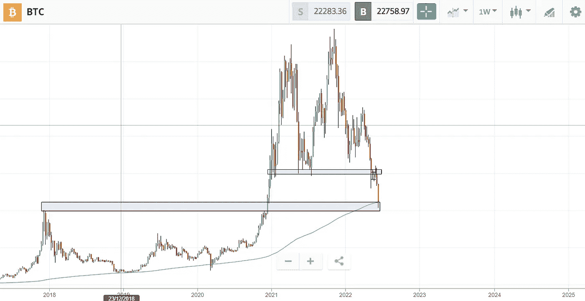
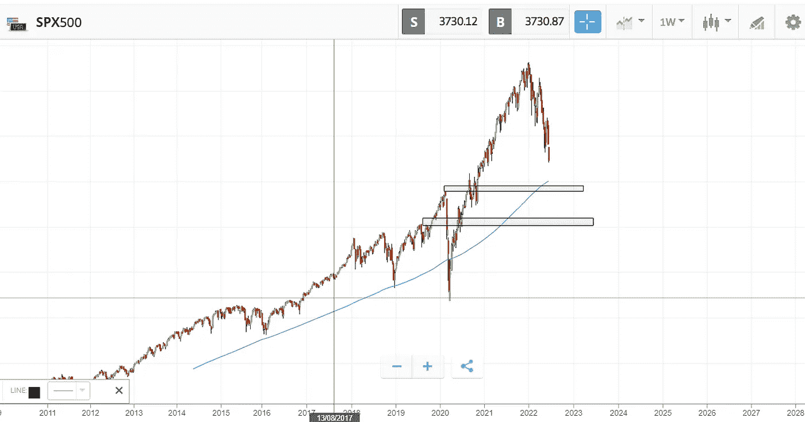
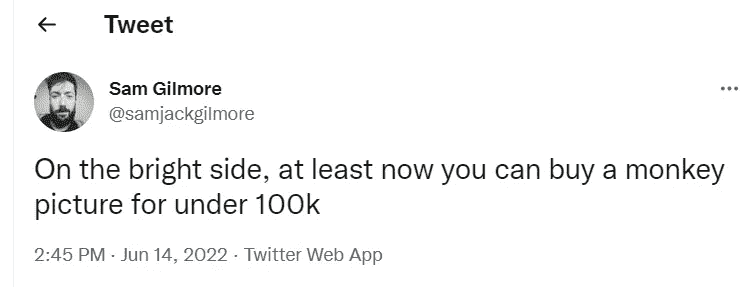

# 密码空间的疯狂一周！！比特币和标准普尔 500

> 原文：<https://medium.com/coinmonks/a-crazy-week-in-the-crypto-space-bitcoin-and-s-p-500-74a5e3166622?source=collection_archive---------44----------------------->

嗯，加密领域经历了一些疯狂的日子，波动性很大，自从比特币突破 30000 美元的心理支持水平以来，我们正在迅速重新测试 2017 年的高点 20000 美元。

在该水平之上，200 天周移动平均线开始发挥作用，因此比特币保持 20000 美元至 21000 美元的重要支撑位至关重要。一旦我们突破 30000 美元水平，更多的是等待，直到我们重新测试 2017 年的高点。我甚至在年初画了这张图，这是比特币最有可能的结果……如果当天的价格波动会跌破支撑，我不会太担心。

Bitcoin Chart-Major Support Levels in rectangle area-$30000 and $20000

我不想看到的是周收盘低于上述支撑位，那会让我很担心，而 14000-15000 美元可能是下一个主要支撑位。我已经想象到，如果我们达到这些水平，世界末日的消息将充斥主流媒体，以及没有经历过这些疯狂提款和波动的新投资者的恐惧。

尽管预料到了比特币的这一举动，但 altcoins 的价格行动确实让我感到惊讶..80%-90%的修正，如果你投资进去了，是不容易看或者过的。

由于不可持续的项目必须被淘汰，因此有必要看到这种调整，我坚信这种时候已经到来。我说的是充斥着加密市场的无数骗局，无用的 NFT 项目，只依赖营销策略的团队，没有任何有价值的东西或团队来执行它..或者许多承诺不可持续产量的“分散”协议..突然告诉你你不能动用自己的钱..试图摆出比银行更好的姿态，而事实上没有受到监管也是一样的东西，于是问题来了..谁是最糟糕的，这些不受监管的协议在牛市中产生不可持续的收益，在熊市中崩溃…还是大型传统银行？？

好的..回到传统市场。面对所有的风险和不确定性..考虑到通胀似乎失控，6 月 10 日公布的 5 月份最新数据为 8.6 %，比 2022 年 4 月的前一个月高出 0.3 个百分点，这确实让许多投资者感到意外，美联储可能会在政策上变得更加激进。我在这里看到的问题是，在稳定通胀之前，他们不能逆转政策，因此，标准普尔 500 或纳斯达克等指数有更大的下跌风险。

在我看来，标准普尔 500 可以重新回到 covid 之前的水平(当市场开始注入流动性时)，甚至更低..这也很痛苦。

S&P500 target levels- $3400 and $3000 rectangle area

现在，在所有坏消息的同时也有一些好消息。正如我的一个朋友在推特上说的，至少你可以在 100k 以下买一个猴子 JPEG。

每一次危机都伴随着机遇，在未来 5-10 年，加密和传统市场都将有巨大的机遇。随着宏观经济形势的变化，我们需要拓宽我们的投资视野。我们习惯于 V 型快速复苏反弹，但随着美联储协调舞蹈，这将需要更长的时间。我准备总是有一些现金在边线上，随时准备部署(DCA-美元平均成本，你不会在底部计时，因为你没有在顶部计时)。我还认为耐心收获回报将是成功的关键，轻松赚钱的时代已经结束了。

在下一篇文章中，我将带着秘密新闻、情绪和我们面临的危险回来。祝大家晚上愉快！！

免责声明:我必须警告你，有些观点可能是我个人的偏见，但是，我会尽我所能为你提供关于特定主题的客观观点。我不是理财顾问，所有文章只会有严格的教育目的。

> 加入 Coinmonks [电报频道](https://t.me/coincodecap)和 [Youtube 频道](https://www.youtube.com/c/coinmonks/videos)了解加密交易和投资

# 另外，阅读

*   [美国最佳加密交易机器人](https://coincodecap.com/crypto-trading-bots-in-the-us) | [经常性回顾](https://coincodecap.com/changelly-review)
*   [在印度利用加密套利赚取被动收入](https://coincodecap.com/crypto-arbitrage-in-india)
*   [Godex.io 审核](/coinmonks/godex-io-review-7366086519fb) | [邀请审核](/coinmonks/invity-review-70f3030c0502) | [BitForex 审核](https://coincodecap.com/bitforex-review)
*   [5 款最佳免费加密货币制图工具](https://coincodecap.com/crypto-charting-tools)
*   [最佳比特币保证金交易](/coinmonks/bitcoin-margin-trading-exchange-bcbfcbf7b8e3) | [萝莉点评](/coinmonks/lolli-review-e6ddc7895ad8) | [比特币保证金交易](https://coincodecap.com/bityard-margin-trading)
*   创造并出售你的第一个 NFT | [密码交易机器人](https://coincodecap.com/best-crypto-trading-bots)