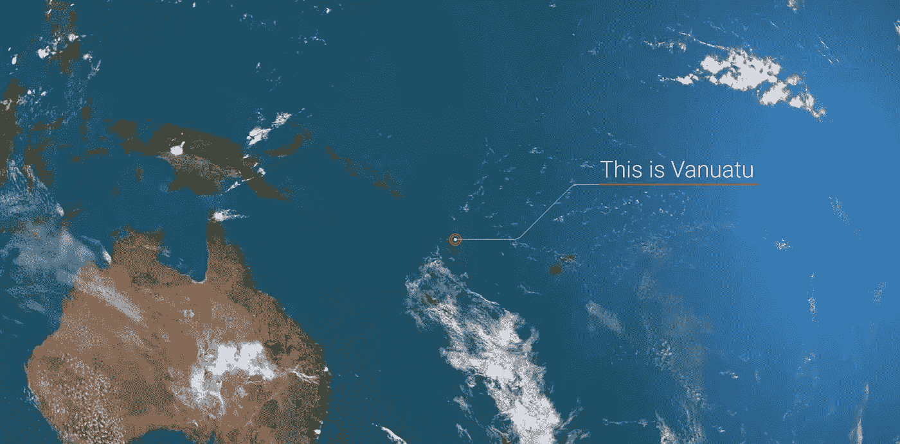
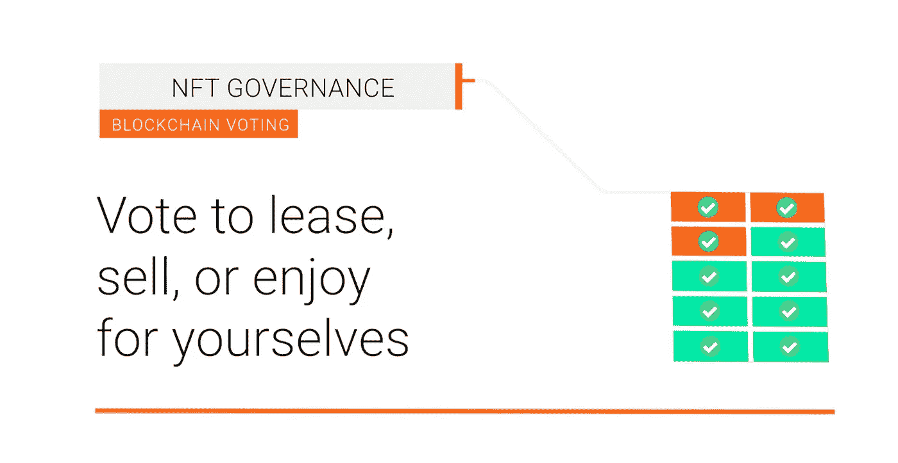
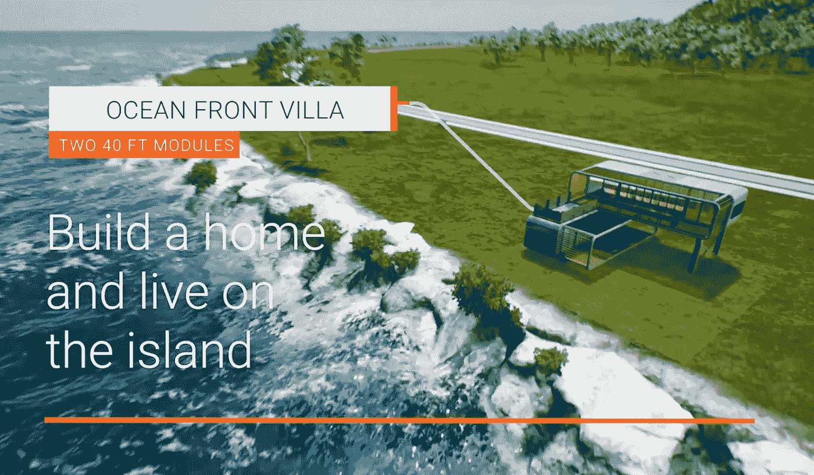

# 太平洋的秘密堡垒

> 原文：<https://medium.com/coinmonks/a-crypto-citadel-for-the-pacific-6c3220db0cd8?source=collection_archive---------13----------------------->

# 瓦努阿图正在成为世界上第一个隐秘的本土岛屿经济体。

随着瓦努阿图总理和财政部的最终批准，Satoshi 岛进入了第一阶段的岛屿地块销售。

整个岛屿都在 NFTs 中被标记。不仅地块将被表示为不可替换的令牌(NFTs)令牌，而且房屋(模块)和岛屿公民身份也将作为 NFTS 发行。

一个全新的经济即将诞生！让我们来探索一下。

Source: Satoshi-island.com

Satoshi 岛，当地称为“Lataro”，是一个 3000 万平方英尺的热带岛屿，位于桑托自由贸易区。瓦努阿图政府正努力通过其雄心勃勃的战略吸引新的人才和产业，成为世界上最友好的加密管辖区之一！

瓦努阿图是唯一允许你用比特币购买岛国公民身份的国家之一**！**

那么，你为什么想要购买一个热带岛国的公民身份呢？

**当然是为了税收减免！**

瓦努阿图以诱人的 0%资本收益和 0%所得税吸引着加密投资者和建筑商！

如果你生活在澳大利亚/亚洲地区，这种规模的避税天堂是不存在的，即使在澳大拉西亚以外，对秘密投资者来说，税收优惠的司法管辖区也少之又少。

许多房地产预测者预计，随着这个小小的岛国吸引新一波技术企业家和投资者来到这个南太平洋新兴的繁荣中心，它的土地将在未来 5 年内创下新高。

虽然作为一个吸引加密企业家和企业建立卫星办公室的避税天堂，该岛还有另一个巨大的优势。

成为世界级的秘密会议、大会、团队活动和旅游中心。

# 该岛将举办两周一次的秘密活动，这些活动将与我们在迈阿密等世界舞台上看到的大型活动相媲美。

作为一个加密的本土经济体和世界上对加密最友好的管辖区之一，Satoshi 岛完全有能力利用下一波加密热潮！

**那么非功能性测试呢？**

这个象征性的岛屿将由 2100 块土地组成。这 2100 块土地将被分割成 21000 块。
所以每一整块岛屿土地都由 10 个 NFT“股份”代表。
拥有该地块的所有 10 个 NFT，并控制整个地块。

但是资产的令牌化并不止于此。正如我提到的，整个岛屿正在被标记化，这包括用于岛上建筑的模块。

整个岛屿正在被 1 对 1 扫描成元宇宙，因此房地产开发商将能够探索岛屿，从 Opensea 等市场购买地块，订购和放置建筑物，然后租赁开发的资产或出售，所有这些都无需离开自己舒适的家。

但这还不是全部！这种象征性岛屿经济的下一个部分是公民身份 NFTs。

就在我们说话的时候，这些正在被免费空投给公众！

**像 21，000 名陆籍无国籍人士一样，岛上只有 21，000 名公民无国籍人士。**

**拥有一个聪岛公民身份**可以让你**在隐岛经济中享有特殊利益**和权利，包括开发你的土地的权利。

**注意:这不要被误认为是瓦努阿图本身的公民身份**，认为 Satoshi 岛的公民身份更像是一个独家俱乐部会员。

拥有会员/公民身份将带来额外的好处，如住宿或岛屿服务的潜在折扣，参加公民活动，在岛上建设的权利，以及潜在的更多！

# 好吧，这是一个雄心勃勃的项目！毫无疑问！但是这绝对是我钱包里最酷的项目之一！

**那么，作为本地加密投资者，我们的游戏计划是什么？
我们如何利用这一点？**

很高兴你问了！

## 经过几个月的深思熟虑，加上该团队在发起其他成功的 NFT 蓝筹股辛迪加交易方面的经验，我们已经决定，利用 satoshi island land 的最佳方式是发起另一个完全基于 satoshi Island land 的合作社。

通过联合起来，集中资本进行象征性的辛迪加交易，我们可以将地块成本细分为更小的部分，并降低进入门槛。

在相当高的资本支出水平下，很少有投资者愿意冒险购买和开发整个地块。如果不买下整块地，你可能会陷入“坏邻居”的困境，他们不想和你一起投票或投资开发。

## 如果你打算开发，这就是拥有整块土地的优势所在。

通过建立和利用一个与开发岛屿城堡一致的大智慧投资者社区，这可以降低所有投资者的风险，并降低那些寻求从 Satoshi 岛土地中获利，但没有流动性、时间或知识来自行开发土地的投资者的准入门槛。

# 这就是为什么我们发起了 Satoshi 岛合作社(SICFund)。

当岛屿土地 NFT 造币厂启动时，土地的分配很可能是随机的，这意味着一些地块(即。更靠近水或具有更好视野的那些)可能更有价值。

通过集中资本购买尽可能多的岛屿地块，我们可以通过**【批量购买】**增加每个人的利润，并增加我们在首次销售中创造更好地块的几率。

当你向**(2 周后开业)**合作社捐款时，你的捐款将会铸造 1155 枚代币。这些代币将代表您在总资产池中的份额。

**这一点值得注意，因为现在你在基金中的股份价值是通过一个单一地块的土地资产池来表示的。**

这有利于降低风险，并确保我们在其他可能只投资 1 块土地或一只 NFT 股票的投资者面前占据优势。

由于您在基金中的股份作为 NFT 代币发行，您将持有托管权，并能够在二级市场(如 Opensea)上交易您的基金股份。

为了帮助确保我们基金的股票以管理下的 Satoshi 岛土地资产的溢价交易，社区将能够每 6 个月投票清算 10%的土地资产，以在“资产清算事件”中支付所有股东。

## (更多信息请访问我们的 LitePaper -Sicfund.io)

**共同签名人的 sic foundation**已经成立，用于管理 MultiSig 钱包，该钱包将存储基金的 Satoshi 岛土地资产。
这是使用行业标准 Gnosis Safes 建立的。
**(SICFund — ETH 多信号地址 0x a 15 b 531 d6e 335 b 9 fa 3 bfbe 859 e 6650766 B1 dcb 60)**

**您可以随时联系联署人领导团队，我们都是完全公开的公共实体，在过去的 5 年里一直在澳大利亚加密领域全职工作。**

## 您可以在我们的网站上阅读更多内容，或者加入聊天，并随时提出任何问题！

## 网址: [https://www.sicfund.io](https://www.sicfund.io)

## Telgram 社区聊天:[https://t.me/+VD01owXLujM4YmQ1](https://t.me/+VD01owXLujM4YmQ1)

## 不和谐社区聊天:[https://discord.gg/3Nc7Rc2tYE](https://discord.gg/3Nc7Rc2tYE)

> 加入 Coinmonks [电报频道](https://t.me/coincodecap)和 [Youtube 频道](https://www.youtube.com/c/coinmonks/videos)了解加密交易和投资

# 另外，阅读

*   [3 商业评论](/coinmonks/3commas-review-an-excellent-crypto-trading-bot-2020-1313a58bec92) | [Pionex 评论](https://coincodecap.com/pionex-review-exchange-with-crypto-trading-bot) | [Coinrule 评论](/coinmonks/coinrule-review-2021-a-beginner-friendly-crypto-trading-bot-daf0504848ba)
*   [莱杰 vs n rave](/coinmonks/ledger-vs-ngrave-zero-7e40f0c1d694)|[莱杰 nano s vs x](/coinmonks/ledger-nano-s-vs-x-battery-hardware-price-storage-59a6663fe3b0) | [币安评论](/coinmonks/binance-review-ee10d3bf3b6e)
*   [Bybit Exchange 审查](/coinmonks/bybit-exchange-review-dbd570019b71) | [Bityard 审查](https://coincodecap.com/bityard-reivew) | [Jet-Bot 审查](https://coincodecap.com/jet-bot-review)
*   [3 commas vs crypto hopper](/coinmonks/3commas-vs-pionex-vs-cryptohopper-best-crypto-bot-6a98d2baa203)|[赚取加密利息](/coinmonks/earn-crypto-interest-b10b810fdda3)
*   最好的比特币[硬件钱包](/coinmonks/hardware-wallets-dfa1211730c6) | [BitBox02 回顾](/coinmonks/bitbox02-review-your-swiss-bitcoin-hardware-wallet-c36c88fff29)