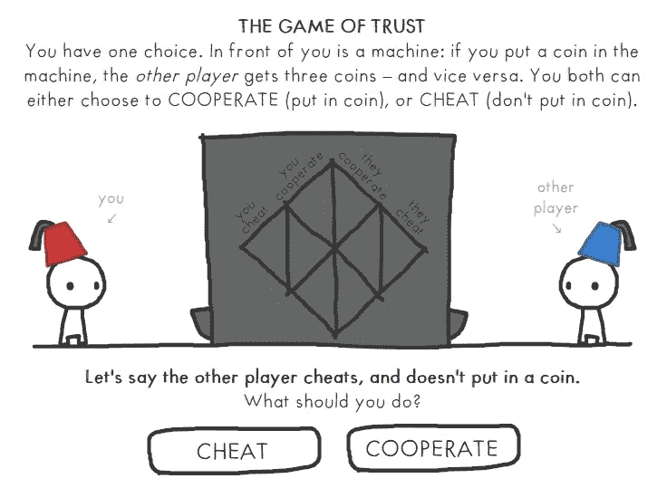

# 2022 年成为智能合约开发人员的一天—第 5 周

> 原文：<https://medium.com/coinmonks/a-day-by-day-to-become-a-smart-contracts-developer-in-2022-week-5-97723b090917?source=collection_archive---------17----------------------->

Do you want to play? [https://ncase.me/trust/](https://ncase.me/trust/)

## 第五周:支持是真实的

本周我运气不错。几周前，我加入了道社区。在 DAO 的电报聊天上，凤凰会坚固训练营的领导人 Gnana 发布了一条消息，说有 10 个名额供想加入的女孩免费参加。Bootcamp 是一个在 web3 上鼓励女性从事编码职业的项目。唯一的限制是，该计划在两周前开始，他们在第三周开始，那些感兴趣的人必须浏览内容并赶上进度。我申请了，被接受了，然后被轻轻地录用了。

这对我来说很特别，我觉得我可以“触摸”到 Web3 生态系统所宣扬的对女性的支持。

第 0 周的内容包括一个名为[信任游戏](https://ncase.me/trust/)的游戏链接。这是一个富有哲理、引人入胜的故事，它动摇了我对“信任”的想法和对自己行为的看法。

## 4 月 25 日> 3 小时

*   继续阅读[卡蜜拉·鲁索的《无限机器](https://www.theinfinitemachinemovie.com/story)
*   继续 Udemy 课程:[以太坊区块链开发者 Bootcamp With Solidity (2022)](https://www.udemy.com/course/blockchain-developer/)
*   [**CS50 哈佛发布的免费课程**](https://learning.edx.org/course/course-v1:HarvardX+CS50+X/home) **Swap/Stack 和 heap/Pointer helpers/Scanf**

## **4 月 26 日> 2.5 小时**

*   **由凤凰公会[加入为期 6 周的坚固训练营](https://port.oceanprotocol.com/t/the-phoenix-guild/1279)**
*   **继续 Udemy 课程:[以太坊区块链开发者 Bootcamp With Solidity (2022)](https://www.udemy.com/course/blockchain-developer/)**
*   **[**CS50 免费课程**](https://learning.edx.org/course/course-v1:HarvardX+CS50+X/home) 哈佛发布
    Scanf/分段故障/文件输入输出/数据结构/数组/C 中的数组**

## **4 月 27 日> 3 小时**

*   **由[凤凰会](https://port.oceanprotocol.com/t/the-phoenix-guild/1279)覆盖第 0 周坚固训练营的内容**

## **4 月 28 日> 5 小时**

*   **完成第 0 周的材料，开始凤凰会[举办的第 1 周坚固训练营](https://port.oceanprotocol.com/t/the-phoenix-guild/1279)的内容**

## **4 月 29 日> 3 小时**

*   **继续凤凰会举办的第一周坚固训练营的内容**

## **5 月 1 日> 3 小时**

*   **继续第一周由[凤凰会](https://port.oceanprotocol.com/t/the-phoenix-guild/1279)举办的稳固训练营的内容**

> **加入 Coinmonks [电报频道](https://t.me/coincodecap)和 [Youtube 频道](https://www.youtube.com/c/coinmonks/videos)了解加密交易和投资**

# **另外，阅读**

*   **[Bookmap 评论](https://coincodecap.com/bookmap-review-2021-best-trading-software) | [美国 5 大最佳加密交易所](https://coincodecap.com/crypto-exchange-usa)**
*   **最佳加密[硬件钱包](/coinmonks/hardware-wallets-dfa1211730c6) | [Bitbns 评论](/coinmonks/bitbns-review-38256a07e161)**
*   **[新加坡十大最佳加密交易所](https://coincodecap.com/crypto-exchange-in-singapore) | [购买 AXS](https://coincodecap.com/buy-axs-token)**
*   **[红狗赌场评论](https://coincodecap.com/red-dog-casino-review) | [Swyftx 评论](https://coincodecap.com/swyftx-review) | [CoinGate 评论](https://coincodecap.com/coingate-review)**
*   **[投资印度的最佳密码](https://coincodecap.com/best-crypto-to-invest-in-india-in-2021)|[WazirX P2P](https://coincodecap.com/wazirx-p2p)|[Hi Dollar Review](https://coincodecap.com/hi-dollar-review)**
*   **[加拿大最佳加密交易机器人](https://coincodecap.com/5-best-crypto-trading-bots-in-canada) | [库币评论](https://coincodecap.com/kucoin-review)**