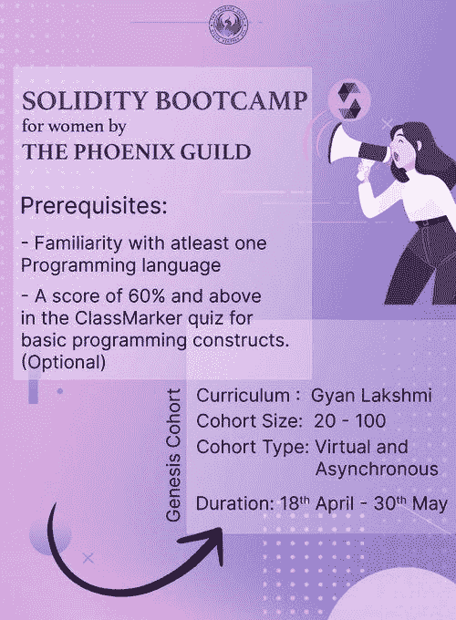

# 2022 年成为智能合约开发人员的一天—第 6 周

> 原文：<https://medium.com/coinmonks/a-day-by-day-to-become-a-smart-contracts-developer-in-2022-week-6-c5800ecc451?source=collection_archive---------14----------------------->

The Phoenix Guild Solidity Bootcamp

第六周:我辞职了

考虑到我有一份全职工作，和团队一起画画一点也不容易。我告诉我的朋友和家人，并向他们解释我将离开几个月。尽管如此，我还是在压力下学习。我不是在抱怨，我只是想让人们知道，训练营需要一个成功完成它的承诺。

与此同时，我碰巧同意我的老板停止为该公司工作，因为有必要从远程到办公室的存在。因此从我计划之外的城市搬走。我的最后一个工作日是 5 月 31 日。

我很惊讶自己对很快找到一份 Web3 工作的自信。上帝与我同在。当然，我还是有点紧张。

## 5 月 2 日> 3 小时

*   凤凰会完成第一周坚固训练营的内容

## 5 月 3 日> 3 小时

*   参加了由 [Web3 Equity](https://www.web3equity.io/) 组织的在线课程:如何阅读以太网扫描合同
*   由[凤凰会](https://port.oceanprotocol.com/t/the-phoenix-guild/1279)举办的第二周稳固训练营的开球内容

## 5 月 4 日> 3 小时

*   凤凰会举办的第二周坚固训练营

## 5 月 5 日> 3 小时

*   继续凤凰会[举办的第二周坚固训练营](https://port.oceanprotocol.com/t/the-phoenix-guild/1279)

## 5 月 6 日> 3 小时

*   凤凰会[继续第二周的坚固训练营](https://port.oceanprotocol.com/t/the-phoenix-guild/1279)

## 5 月 7 日> 3 小时

*   凤凰会[完成第二周的坚固训练营](https://port.oceanprotocol.com/t/the-phoenix-guild/1279)
*   安装 [Brave browser](https://brave.com/) 并阅读它的工作原理、优缺点。

> 加入 Coinmonks [电报频道](https://t.me/coincodecap)和 [Youtube 频道](https://www.youtube.com/c/coinmonks/videos)了解加密交易和投资

# 另外，阅读

*   [5 款最佳免费加密货币制图工具](https://coincodecap.com/crypto-charting-tools)
*   [最佳比特币保证金交易](/coinmonks/bitcoin-margin-trading-exchange-bcbfcbf7b8e3) | [萝莉点评](/coinmonks/lolli-review-e6ddc7895ad8) | [比特币保证金交易](https://coincodecap.com/bityard-margin-trading)
*   创造并出售你的第一个 NFT | [密码交易机器人](https://coincodecap.com/best-crypto-trading-bots)
*   [如何在 CoinDCX 上购买柴犬(SHIB)币？](https://coincodecap.com/buy-shiba-coindcx)
*   [CBET 评论](https://coincodecap.com/cbet-casino-review) | [库科恩 vs 比特币基地](https://coincodecap.com/kucoin-vs-coinbase) | [拜比特 vs 比特币基地](https://coincodecap.com/bybit-vs-coinbase)
*   [折叠 App 回顾](https://coincodecap.com/fold-app-review) | [LocalBitcoins 回顾](/coinmonks/localbitcoins-review-6cc001c6ed56) | [Bybit vs 币安](https://coincodecap.com/bybit-binance-moonxbt)