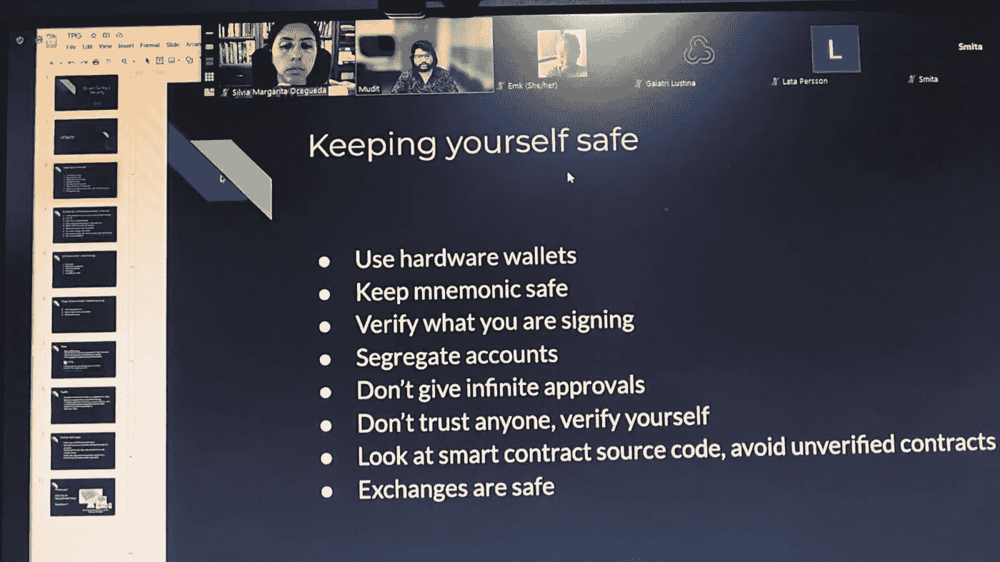

# 在 2022 年成为智能合同开发人员的一天—第 7 周

> 原文：<https://medium.com/coinmonks/a-day-by-day-to-become-a-smart-contracts-developer-in-2022-week-7-d895476a6792?source=collection_archive---------13----------------------->

Masterclass on smart contract auditing by Mudit Gupta

第七周:有一天我会成为一名智能合同审计师

本周，我参加了由凤凰会组织的精明合同审计大师班。该会议是关于安全概念和检查 NFT 合同中的漏洞和安全问题的后续行动。我意识到我想成为一名审计员。我认为这意味着很多经验和知识，让我们看看我是否能做到这一点。

继续训练营，我学习了如何编写函数、修饰符、错误处理和事件日志。我们被阻止分享这些讲座，因为他们的目的是为了帮助更多的妇女。然后，我不会包括这个和未来 2 周的内容链接。

我的朋友 [Pedro Cobos](https://www.youtube.com/watch?v=cyqQGaIcFfs) 与我分享了一个区块链活动的邀请，该活动名为[tech starts _ Startup Weekend](https://www.techstars.com/communities/startup-weekend)，我在活动前注册并加入了一个在线琐事区块链。这非常有趣，我赢得了一个名为“人才天地”的大型科技活动的入场券，我没有在人才天地展示的计划，但现在我有了很大的想法。

到目前为止，我已经提交了 6 份加入项目的表格，却连一个答案都没有。如果他们发一个通知说他们是否收到了我的表格，或者因为某种原因被拒绝，那就太好了。这样，我就可以在下一个应用程序中使用它了。不管怎样，我会继续申请，我知道每一次拒绝都会让我更接近成功。

## 5 月 9 日> 3 小时

*   通过[凤凰会](https://port.oceanprotocol.com/t/the-phoenix-guild/1279)第三周的内容跳进了坚固性训练营。

## 5 月 10 日> 3 小时

*   继续由凤凰会[第 3 周内容](https://port.oceanprotocol.com/t/the-phoenix-guild/1279)的 Solidity 训练营。

## 5 月 11 日> 3 小时

*   通过凤凰会[第 3 周](https://port.oceanprotocol.com/t/the-phoenix-guild/1279)的内容继续与 Solidity 训练营合作。

## 5 月 12 日> 3 小时

*   参加了一个琐事区块链，并继续参加了由[凤凰公会](https://port.oceanprotocol.com/t/the-phoenix-guild/1279)举办的 Solidity Bootcamp 的第 3 周。

## 5 月 13 日> 3 小时

*   通过凤凰会[第 3 周](https://port.oceanprotocol.com/t/the-phoenix-guild/1279)的内容继续与 Solidity 训练营合作。

## 5 月 15 日> 3 小时

*   通过凤凰会第 3 周的内容继续与 Solidity 训练营合作。

> 加入 Coinmonks [电报集团](https://t.me/joinchat/Trz8jaxd6xEsBI4p)，了解加密交易和投资