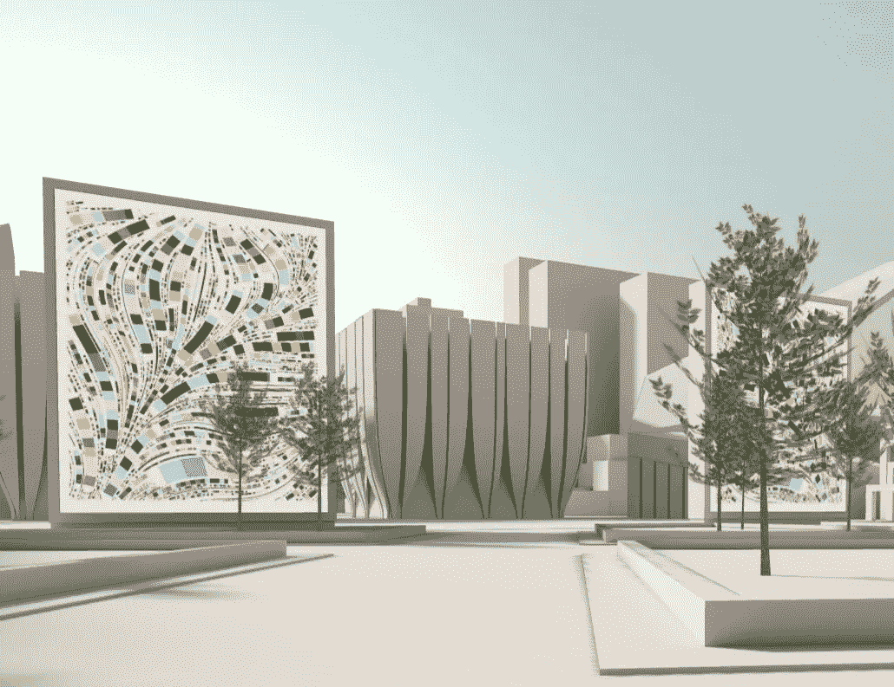
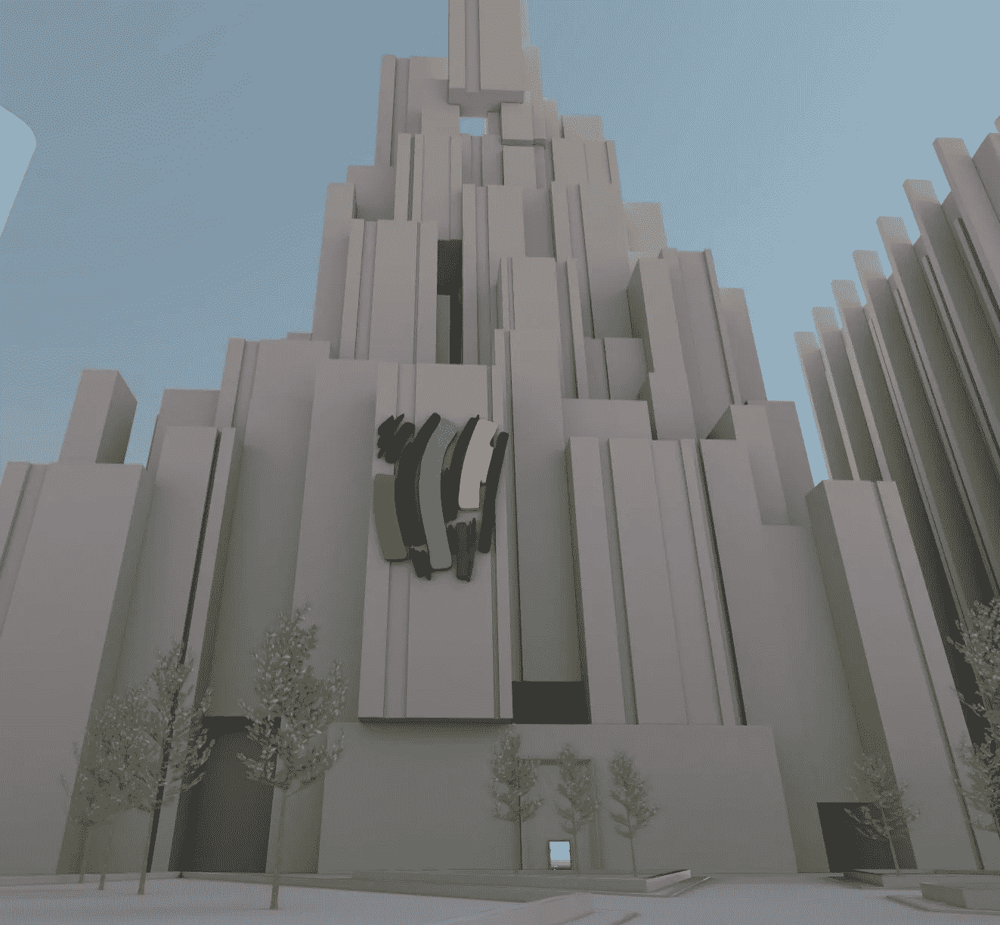
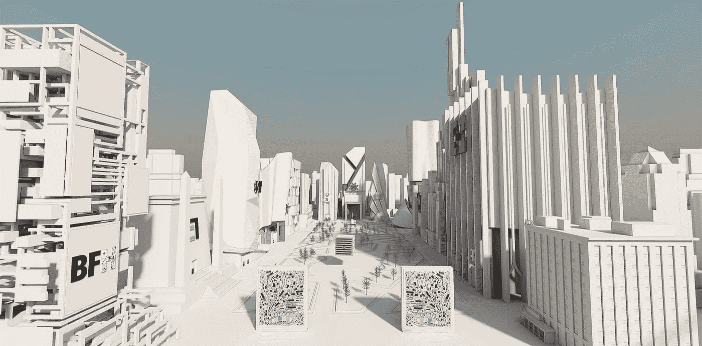

# 去中心化的元宇宙、多链 NFT 和主流加密支付

> 原文：<https://medium.com/coinmonks/a-decentralized-metaverse-an-multi-chain-nft-and-mainstream-cryptopayments-a9639701d274?source=collection_archive---------22----------------------->

# *看看 OM——由朋克 6529* 创作的分散式元宇宙

*The Gates of Tulip in OM*

*四月中旬，化名 Web3 的影响者* [*朋克 6529*](https://twitter.com/punk6529) *宣布了他备受期待的项目。*

他正在发起一个开放的分权的元宇宙。

*朋克 6529 拥有许多稀有且价值不菲的 NFT，在撰写本文时拥有超过 346，000 名 Twitter 粉丝。他对这个领域并不陌生，自 2013 年以来一直参与 BTC 的工作。*

*web 3 元诗句的想法已经流行起来，2022 年已经成为通过 NFTs 大规模抢占元宇宙土地的一年。就在最近，宇迦实验室在为他方出售土地期间，* [*总交易费用约为 1.76 亿美元*](https://www.coindesk.com/business/2022/05/01/bayc-team-raises-285m-with-otherside-nfts-clogs-ethereum/) *扰乱了整个以太网。*

*但是 OM 不一样。它不是以卖地的方式推出的。没有钱可以投资，只有一个帮助建设和贡献的机会。*

朋克 6529 希望创造一个开放的元宇宙，与当前互联网巨头如 Meta 和微软创造的封闭的 metaverses 相抗衡。他们从一开始就让社区参与进来，以真正开放的方式来构建它，而不是构建整个系统然后再推出。

OM 的第一个城市叫做创世城，里面有 6529 博物馆区。中央博物馆展出了超过 2000 件的非艺术珍品，是收藏非艺术珍品最多的博物馆。他们最感兴趣的是艺术和教育，这两个领域似乎是早期推出的核心。

*这一早期展示被称为 alpha 发布，beta 发布的目标是在 2022 年夏末。*

*在项目的* [*网站上*](https://6529.io/om/) *6529 为 OM 展示了以下愿景:*

*   *数千个自治区*
*   由几十个自治市组成
*   *具有不同的使命、文化和优先级*
*   *链接在一个巨大的虚拟景观内*
*   *连接到物理世界*
*   *全球分布式、分散式基础设施*

就我个人而言，我从未对元宇宙真正感兴趣。我重视 IRL 交互，直到现在，我还不太想买一台虚拟现实设备。但在看到 6529 所设想的之后，我看到的不仅仅是一种幻想的数字生活。我看到了人类互动的新形式，以及用数字生活提升我们物质生活的方式。

*现在，我们的许多人类互动都是数字化的——想想过去几年里所有已经转化为缩放通话或社交媒体互动的物理互动。我们已经有了这些半元诗句，所以一个更沉浸式的版本是有意义的。*

*在接下来的几个月里，我会密切关注这个项目，并期待看到它的进展。*

欲了解更多详情，请直接查看 Twitter 帖子。

# *Web3 获得第一个多链 NFT——GH 0 stly GH 0 STS*

*几周前，我们看到了第一个多链 NFT 发布—*[*GH 0 stly GH 0 STS*](https://opensea.io/collection/gh0stlygh0sts)*。多链，这意味着这是一个 NFT 兼容多个区块链。Gh0stly Gh0sts 是基于加拿大 LayerZero 实验室创建的 LayerZero 协议发布的。*

*这是一件大事，因为它解决了 Web3 中一个关键的公开问题——我们能否在不同的区块链网络之间进行交叉合作？*

第一个建议是我们可以。

*本质上，一个收藏者应该有能力从雪崩这样的网络购买一个 NFT 并发送到以太坊网络，同时保持 NFT 原作的数据。至少，Gh0stly Gh0sts 代表了 Web3 中的一个重要实验，它可能指向区块链不可知论的未来。这将为用户体验创造奇迹。*

现在，任何参与 Web3 的人都必须考虑他们在和哪个区块链合作。他们必须为区块链建立钱包，从交易所购买加密货币，并将其发送到钱包。他们需要保持这些钱包的密钥、密码和短语的安全协议达到诺克斯堡的水平。

当你进入不同区块链的对话时，你会听到像 L1(第一层)和 L2(第二层)这样的术语。L1 指的是主区块链网络，而 L2，正如您所料，指的是运行在主网络之上的一层。L2·区块链实际上是打开了通往 L1 的桥梁，并将数据同步到 L1。L1 的例子有以太坊、索拉纳、泰佐斯和宇宙。

L2 的例子有 Polygon、Uniswap 和 Chainlink，因为它们是比它们服务的 L1 以太坊更快、更便宜的扩展解决方案。这减轻了以太坊主网络的负担，这种负担可能会导致网络速度下降和天然气价格上涨。

*回到这里的重点——layer zero 实验室从区块链开始，它们与以太坊虚拟机(EVM)兼容，如以太坊、雪崩、多边形和币安等等。LayerZero 打算成为区块链之间无缝互操作的全链协议，并计划扩展到其他 L1，如 Cosmos 和 Solana。*

*到目前为止，Gh0stly Gh0sts 的主要交易活动是与 Eth 而不是像 Polygon 和币安这样不太昂贵的网络进行的。这一行为引发了另一个问题——随着时间的推移，omnichain 协议会增加以太坊在 Web3 上的统治地位吗？*

*现在还为时过早，我希望在未来的一年里，我们会看到许多 omnichain NFT 的发布。值得注意的是，LayerZero 并不是唯一的 omnichain 协议，许多其他协议，如 Quant Network、Analog One、Nomad 和 Alexar 都是致力于创建 omnichain Web3 世界的不同网络之一。*

# *加密支付成为主流*

[*Strike*](https://strike.me/en/) *一款移动支付应用，推出了使用比特币汇款的新支付轨道。他们依赖比特币闪电网络，这种网络可以在几乎不收取任何交易费用的情况下实现快速交易。该公司宣布与 Shopify、Blackhawk 和 NCR 合作。黑鹰和 NCR 是美国最大的支付处理商，为大约 85%的零售商户提供服务(想想星巴克、麦当劳、沃尔玛、沃尔格林)。*

*Strike 的支付轨道的绝妙之处在于它允许过多的货币面值，并允许发送者和接收者选择自己的偏好。因此，你可以实现从欧元到美元的无缝即时转换，而成本只是标准信用卡交易的一小部分。*

*今年年初，著名投资人* [*查马斯·帕里哈皮蒂亚声称，Visa 和万事达卡*](https://finance.yahoo.com/news/billionaire-chamath-palihapitiya-says-visa-093616853.html) *将是 2022 年加密货币创新的最大败笔。这里有一个 Chamath 提到的不可避免的破坏的例子。*

需要记住的一点是，Strike 的软件是开源的，所以这些大型支付公司没有理由不能参与进来。他们可能已经上路了。

*Strike 并不是唯一一家扰乱支付系统的公司——*[*Stripe*](https://stripe.com/)*现在允许以 USDC 稳定币(一种将其价值与美元挂钩的加密货币)的形式进行加密支付。Stripe 的技术在多边形网络上运行，而不是比特币。*

*预计在未来几年内，将会有更多此类解决方案上市。几年后，我们甚至可能会质疑需要花很多天才能清算的 ACH 付款或银行电汇。*

*Strike 的第一个主要客户是 Twitter，查看下面推文中的支付流程。*

*原载于* [*本航次*](https://web3voyage.substack.com/p/no-19-punk-6529-launches-a-decentralized?s=w) *通迅于 2022 年 5 月 5 日。*

随着我对 Web3 的深入研究，讨论将会涉及加密货币，我希望确保包含此免责声明。这不是财务建议，仅供参考。

作为免责声明，我没有金融方面的背景或专业知识。法学，或者经济学。本文探讨了新技术，如 NFTs 和加密货币，以及艺术家和创作者的潜在用途。这仅供参考。它不提供也不打算用作法律、投资、财务或其他建议。

> 加入 Coinmonks [电报频道](https://t.me/coincodecap)和 [Youtube 频道](https://www.youtube.com/c/coinmonks/videos)了解加密交易和投资

# 另外，阅读

*   [Botsfolio vs nap bots vs Mudrex](/coinmonks/botsfolio-vs-napbots-vs-mudrex-c81344970c02)|[gate . io 交流回顾](/coinmonks/gate-io-exchange-review-61bf87b7078f)
*   [CoinFLEX 评论](https://coincodecap.com/coinflex-review) | [AEX 交易所评论](https://coincodecap.com/aex-exchange-review) | [UPbit 评论](https://coincodecap.com/upbit-review)
*   [AscendEx 保证金交易](https://coincodecap.com/ascendex-margin-trading) | [Bitfinex 赌注](https://coincodecap.com/bitfinex-staking) | [bitFlyer 点评](https://coincodecap.com/bitflyer-review)
*   [Bitget 回顾](https://coincodecap.com/bitget-review) | [双子座 vs BlockFi](https://coincodecap.com/gemini-vs-blockfi) cmd| [OKEx 期货交易](https://coincodecap.com/okex-futures-trading)
*   [AscendEx Staking](https://coincodecap.com/ascendex-staking)|[Bot Ocean Review](https://coincodecap.com/bot-ocean-review)|[最佳比特币钱包](https://coincodecap.com/bitcoin-wallets-india)
*   [霍比审核](https://coincodecap.com/huobi-review) | [OKEx 保证金交易](https://coincodecap.com/okex-margin-trading) | [期货交易](https://coincodecap.com/futures-trading)