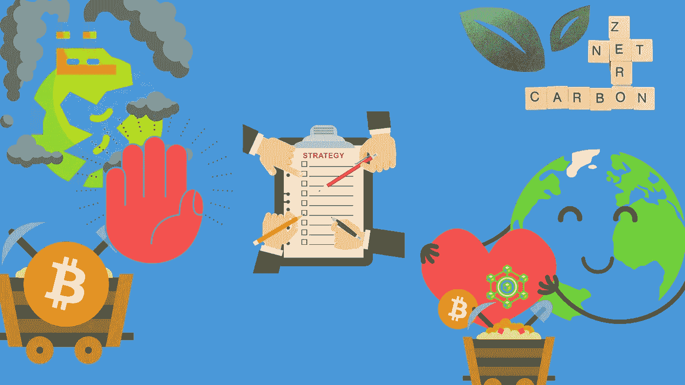
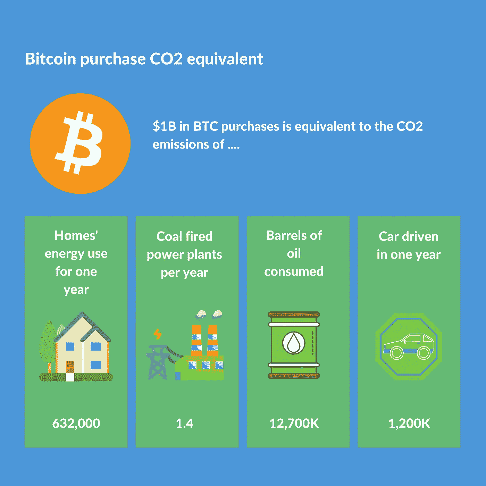
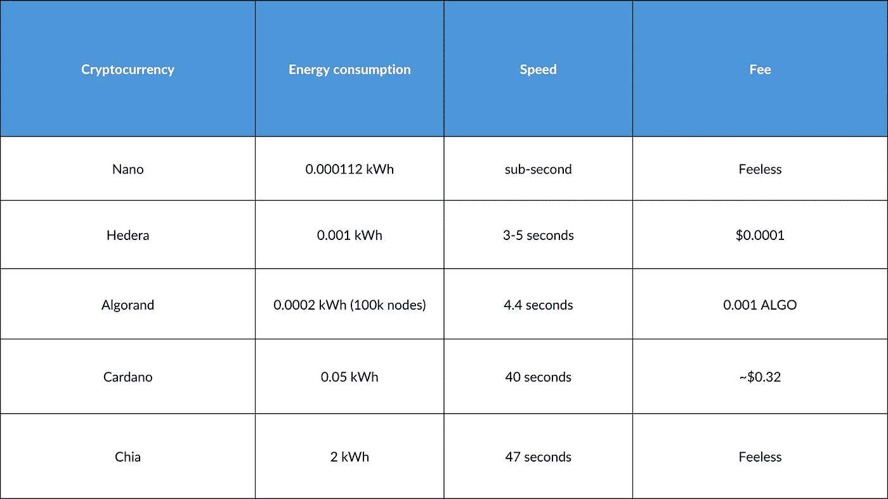
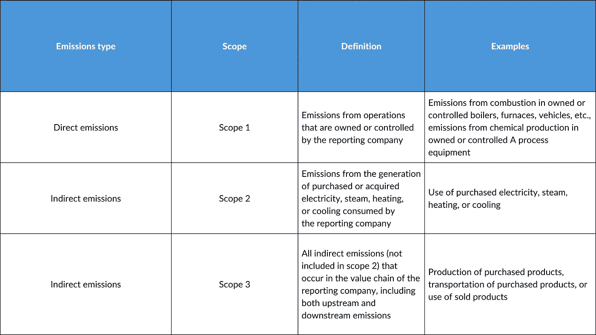
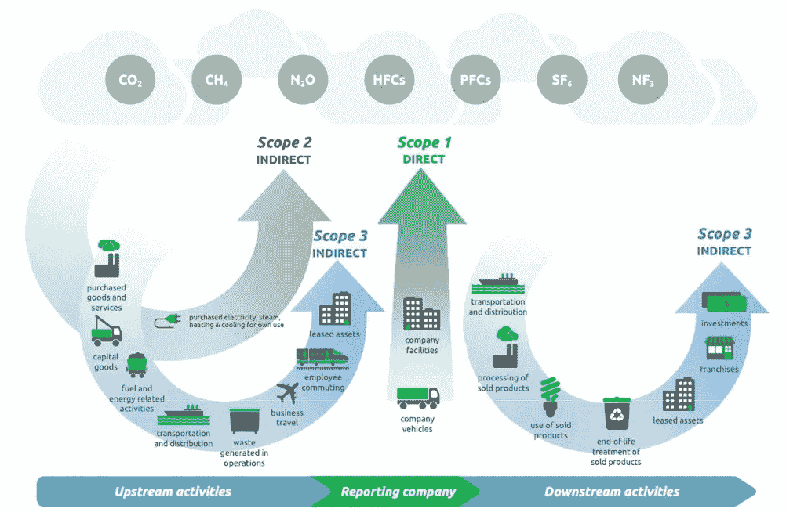

# 关于加密和区块链公司如何开始使用 GHG 协议报告碳足迹，以通过投资者和利益相关方的 ESG 审查的深度快速指南

> 原文：<https://medium.com/coinmonks/a-deep-and-quick-guide-on-how-crypto-and-blockchain-companies-can-start-reporting-carbon-footprint-7f8b5dde0444?source=collection_archive---------34----------------------->

在区块链中，**去中心化**指的是**将控制权**和决策权从一个集中的实体(个人、组织或团体)转移到一个分布式网络。

区块链授权加密货币，与传统货币不同，他们没有一个中央机构发行或监管它们。去中心化概念，以及其他区块链本地特征，为加密货币的未来铺平了道路。

然而，不同区块链的能量消耗已经成为所有密码社区的日益重要的话题。原因相对简单——巨大的碳足迹。大多数采用加密技术的人都是年轻人，他们有着拯救地球的坚定意愿。因此，要赢得他们，区块链必须变成绿色。

**能源消耗问题**

大多数流行的加密货币，如比特币和以太坊，都是基于工作证明算法的非常耗能的网络。

单个比特币交易[的碳足迹](https://digiconomist.net/bitcoin-energy-consumption)为 **2150.10 千瓦时的消耗能量和 1199.24 千克二氧化碳碳足迹**。

第二大流行的加密货币以太坊也存在同样的问题。根据[https://digiconomist.net/](https://digiconomist.net/)单笔以太坊交易的碳足迹为 **228.31 千瓦时的能源消耗和 127.34 千克二氧化碳的碳足迹。**

根据 https://digiconomist.net/和 https://www.investopedia.com/.的数据，比特币和以太坊单笔交易消耗的能量相当于一个普通美国家庭 74 天和 7.33 天的能量消耗

Source: BoFA Global Research

全球区块链社区对这个问题非常认真。它促进了新的生态友好协议和加密货币的发展。

让我们来看看其中的一些。

[**可持续加密货币的例子**](https://www.finextra.com/blogposting/21679/top-eco-friendly-cryptocurrencies-how-sustainable-are-they-and-what-are-their-benefits#:~:text=A%20sustainable%20cryptocurrency%20is%20one,to%20organizing%20various%20eco%2Dinitiatives)

Energy consumption per transaction. Source: [https://www.finextra.com/](https://www.finextra.com/)

如上图所示，这些密码的能耗极低，不存在费用，速度快如闪电。换句话说，这些加密货币具有应用于商业目的和现实世界应用的真正潜力，并且也是环境友好的。

**Hermesnet 个人对加密货币生态友好方面的看法**

从本质上来说，加密货币最大的问题在于它围绕比特币展开。虽然比特币在未来不太可能发生剧烈的变化，但行业永远不会完全将注意力从它身上转移开。虽然很安全，但那只是因为它没有改变。事实上，它仍然是一样的，并将永远是一样的，这就是人们所喜欢的。因此，加密货币教育对于让公众看到比特币的更环保替代品至关重要。可持续的加密货币是基于对更环保的加密货币的日益增长的认识。比特币是最广为人知的加密货币，因此许多人开始投资市场上的特定加密货币。

随着对加密的了解越来越多，人们会发现所有可用的选项。他们将能够选择一个密码而不是另一个，这是环保的，不需要工作证明，因此对他们来说更方便。您可以从大量选项中进行选择，但是您需要接受教育才能看到或使用它们。

通过减少温室气体排放，公司可以提高利润，降低风险，获得竞争优势。随着气候变化的影响变得越来越频繁和突出，各国政府预计将制定新的政策，并提供更多的基于市场的激励措施，以减少温室气体排放。

除了减少排放，加密行业还可以展示整个行业的去碳化，创造对清洁技术的新需求，并增加获得客户和致力于可持续发展的资本的机会。然而，密码行业中的任何参与者都需要一种全面的方法来测量、跟踪和报告他们的电力使用和温室气体排放，以实现这些目标。此外，密码行业需要关于实现 100%脱碳的最佳途径和机制的指导。

**核算碳排放并了解 GHG 协议**

组织(例如，国家和公司)使用碳会计来清点和审计他们直接和间接排放的温室气体(GHGs)的数量。除了为理解和管理气候影响提供基础之外，这些信息还可以帮助指导商业战略、决策和投资决定。

《温室气体议定书》是报告 GHG 排放量的唯一全球标准。它根据产品或服务生命周期的不同阶段将排放分为三类。

作为世界资源研究所(WRI)和促进可持续发展世界商业理事会的联合倡议，温室气体议定书是碳核算的主要方法。为了说明和报告 GHG 排放量,《GHG 议定书》定义了三个排放“范围”(见下图)。

Source: Greenhouse Gas Protocol Technical Guidance

**描述价值链中《GHG 议定书》的范围和排放**

Source: Greenhouse Gas Protocol Technical Guidance for Calculating Scope 3 Emissions

加密货币矿工是指使用计算资源来验证交易的行为者，他们有责任减少直接活动产生的排放(范围 1)、其组织购买的电力的生产和消费产生的排放(范围 2)，以及组织供应链的间接排放源产生的一些排放(范围 3)。这些排放大多来自购买采矿钻机消耗的电力。加密货币持有和交易的大部分间接排放(范围 3)是由采矿作业下游的行为者造成的，包括交易所、应用程序提供商、公司和个人持有人。

【Hermesnet 如何帮助加密公司成为面向未来的 ESG

Hermesnet 的绿色可信报告工具(“ **GTR** ”)是一个 SaaS 平台解决方案，可以轻松地与企业现有的数据收集和报告工具集成。GTR 将提供标准化的工具来自动化数据收集，并向投资者、客户、监管机构、公众和其他利益相关者报告 ESG 绩效，并利用区块链上加密和不可变的面向事实的数据库来确保报告的可靠性和可信度。

加密公司可以利用 GTR 来引导他们的经济增长走上低碳之路。企业在做出决定时需要开始为这种转变进行规划，这将影响他们未来几年的投资决策。为了制定有效的企业气候变化战略，有必要了解公司的 GHG 影响。企业 GHG 库存可以提供这种理解。

通过 Hermesnet 的 GTR 数据管理工具，企业可以评估其与排放相关的风险和机遇，并集中精力应对最重大的 GHG 影响。直到最近，企业才开始关注范围 1 和范围 2 的排放。企业越来越意识到，他们需要通过计算其价值链和产品组合中的排放量，评估其范围 3 的排放量，来充分管理其 GHG 风险和机遇。Hermesnet 数据管理工具为公司提供了轻松即插即用现有系统的功能，以便计算和跟踪其 GHG 影响。

> 加入 Coinmonks [电报频道](https://t.me/coincodecap)和 [Youtube 频道](https://www.youtube.com/c/coinmonks/videos)了解加密交易和投资

# 另外，阅读

*   [CoinDCX 点评](/coinmonks/coindcx-review-8444db3621a2) | [加密保证金交易交易所](https://coincodecap.com/crypto-margin-trading-exchanges)
*   [红狗赌场评论](https://coincodecap.com/red-dog-casino-review) | [Swyftx 评论](https://coincodecap.com/swyftx-review) | [CoinGate 评论](https://coincodecap.com/coingate-review)
*   [Bookmap 评论](https://coincodecap.com/bookmap-review-2021-best-trading-software) | [美国 5 大最佳加密交易所](https://coincodecap.com/crypto-exchange-usa)
*   [如何在 FTX 交易所交易期货](https://coincodecap.com/ftx-futures-trading) | [OKEx vs 币安](https://coincodecap.com/okex-vs-binance)
*   [CoinLoan 审查](https://coincodecap.com/coinloan-review) | [YouHodler 审查](/coinmonks/youhodler-4-easy-ways-to-make-money-98969b9689f2) | [BlockFi 审查](https://coincodecap.com/blockfi-review)
*   《XT.COM 评论》的|
*   [SmithBot 评论](https://coincodecap.com/smithbot-review) | [4 款最佳免费开源交易机器人](https://coincodecap.com/free-open-source-trading-bots)