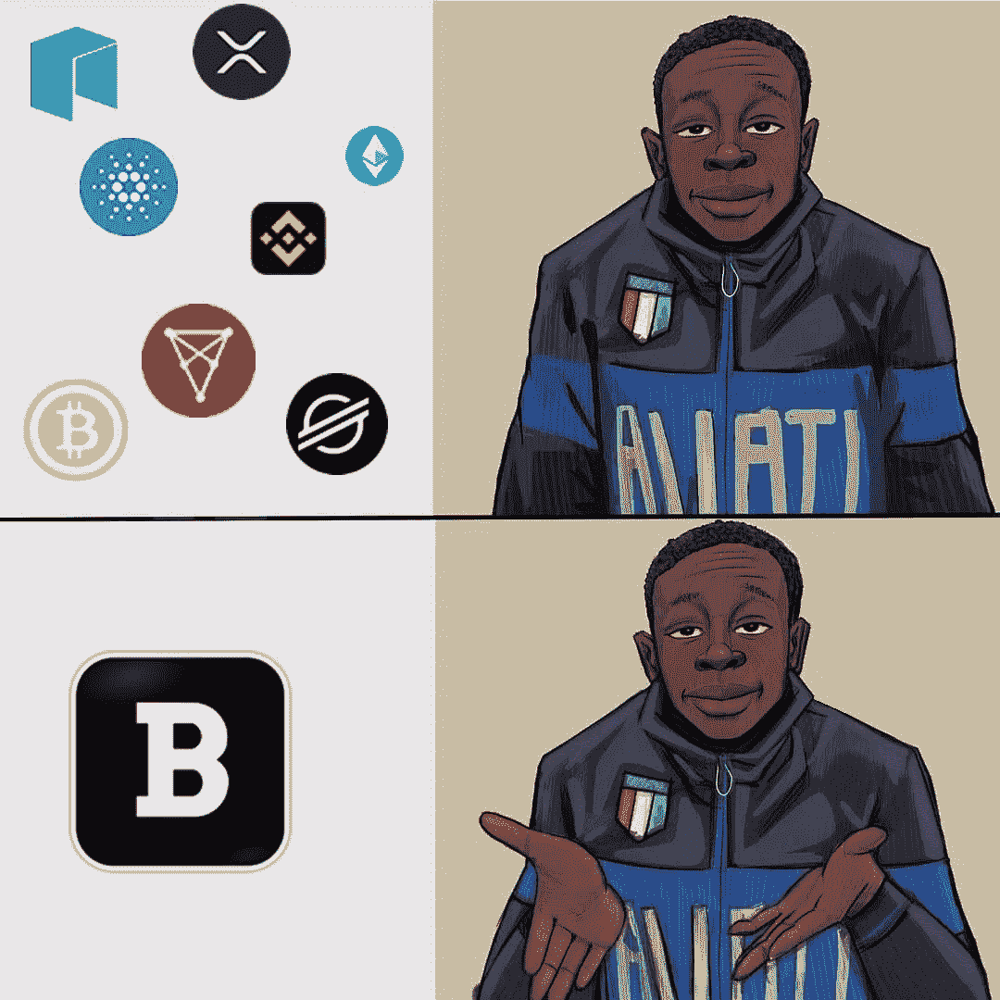

# 深入探究双经济:双经济如何为 Web3 构建关键基础设施

> 原文：<https://medium.com/coinmonks/a-deep-dive-into-biconomy-how-biconomy-is-building-key-infrastructures-for-web3-31268dd8357d?source=collection_archive---------7----------------------->

…为引领 Web 3.0 的开发人员提供动力

# **简介**

W eb3 是为每个人设计的互联网，不归任何人所有。一句话，去中心化。web3 上的应用程序将以一种分散的方式相互交互，将需要可靠地传递数据，无缝地传输数据，并以高可用性永久存储数据。在加密领域，Biconomy 将自己定位于解决用户和开发者面临的一个问题，这与目前 Web3 的许多问题无关。

# **web 3 的诸多问题和双经济的地方**

**高得离谱的天然气价格和每笔交易的天然气付款**

如果你跟随 Web3 的趋势，你会意识到用户面临的最大问题之一是他们在与分散金融(DEFIs)和分布式应用(DAPPs)交互时产生的高额交易费。在密码术语中，它们被称为天然气价格。由于以太坊区块链的拥堵，这些天然气价格偏高。以太坊区块链由于其高效的用例及其可伸缩性而获得了很大的吸引力。鉴于链条上有大量项目正在启动，天然气费用偏高，这使得无法负担天然气价格的较低收入人群很难参与进来。据哈里·罗伯逊称，“人们经常支付超过 100 美元，仅仅是为了在 Defi 平台上存入价值 50 美元的加密货币——这让许多人非常愤怒。”

**区块链的复杂性和漫长的入职流程**

对于非技术人员来说，web3 的用户体验(UX)极其复杂。想象一下，每次都必须在元掩码钱包中添加新的网络链。想想您的 Metamask 钱包中复杂而耗时的 RPC 网络设置。在一些连锁店中，了解你的客户(KYC)流程需要花费很长时间，这是怎么回事？令人沮丧。Biconomy 的目的是通过使用多链中继协议和元事务概念来消除随之而来的挫折感和压力。这意味着，通过 Biconomy 的基础设施，任何人都可以访问分散式应用程序(dApps ),而不管他们的密码知识、专业技能和实践经验如何。

# **谁是双姓？**

Biconomy 是一家 web3 技术公司，唯一的目标是让 web3 无摩擦。其雄心的核心是需要解决阻碍用户轻松登录的问题。它的目标是为分散的网络建立一个无缝的交易基础设施。Biconomy 希望消除开发人员和用户的加密交易的复杂性，为双方创造一个无缝的交易之旅。多年来，它开发了一系列产品，已经被 90 多个 Dapps 和 Defis 使用。

借助 Biconomy，开发人员可以实现简单、定制的交易之旅，使用户与他们的 DApp 轻松、快速地交互，而不是从头开始创建他们的交易。所有需要做的就是利用 Biconomy 的即插即用软件开发工具包(SDK)和 API。可以把 Biconomy 看作是 Dapp 开发者和用户的 AWS。只是在这种情况下，它没有在云中为您提供空间；相反，它可以帮助您节省从头构建内部中继基础设施的成本。内部继电器基础设施的作用是帮助开发人员监控和管理天然气价格，跟踪随机数和未决交易，确保继电器的可扩展性，以及其他消耗开发团队资源并减缓其开发速度的复杂因素。Biconomy 说，交给我们吧，我们已经建立了一个世界一流的内部继电器系统，带有不同的软件包。你只需要插上电源就可以玩了。构成 Biconomy 的军火库的这些包/SDK 是什么？

# **双经济体拥有的基础设施**

目前，Biconomy 拥有 3 款世界一流的产品，已经过部署和测试，目前已有 90 多家 Dapps 在使用。它们如下所列:

1.  Mexa-促进无汽油交易
2.  远期——允许用 ERC20 代币支付
3.  连字符—允许快速跨链交易

# **Mexa**

Mexa 是以太坊区块链高额燃气费的解决方案。这是 Biconomy 的第一个 SDK，允许开发人员实现无气体交易。通过 Mexa，开发者可以享受 Biconomy 的无汽油和灵活的汽油支付功能，这有助于用户轻松加入。使用要求是开发人员在他们的智能契约中添加几行代码，授权 Biconomy 读取用户的任何写事务。当用户签署授权时，Biconomy relayers 将管理天然气并提交连锁交易。给予的授权允许 Biconomy 为用户管理整个交易。这意味着用户不需要估计天然气，与复杂的区块链 UX 互动或拥有连锁的本地令牌，在某些情况下，用户不需要支付天然气费。他所需要做的就是签字并给予 Biconomy 的代理人处理交易的许可。2021 年 8 月，致力于简化投资的 Nord Finance a Defi】集成了无汽油功能，为其用户创造了无摩擦的体验。

对于对编辑他们的智能协定持怀疑态度的开发人员，有一个选项允许他们继承一个接收方协定，该协定可以接受来自受信任的转发器的经过验证的调用。可信转发器遵守 [EIP 2771](https://docs.biconomy.io/products/enable-gasless-transactions/eip-2771) 并在调用附加了原始用户地址数据的智能合同之前验证签名。在用户授权后，Biconomy 充当中间人，在将用户添加到块之前处理用户的请求。

对于希望为其用户实现无汽油交易的开发者，他们需要在 Biconomy 上的 [**DAPP** **汽油箱**](https://docs.biconomy.io/guides/gas-tank-deposits#:~:text=Gas%20Tank%20enables%20dApp%20owners,into%20their%20dApp's%20gas%20tank.&text=DApp%20owners%20have%20the%20option,is%20visible%20on%20the%20dashboard.) 中存放本地令牌。这确保了双经济继电器有足够的气体来支付代表用户的交易费用。

# **前进**

转发功能使用户能够用 ERC20 稳定令牌支付汽油费。有时用户缺少 Eth，并且钱包中有足够的 ETH 令牌，但没有 ETH 他们无法进行交易，因此他们需要为汽油费购买一些 ETH。Biconomy 通过允许用户在不拥有 ETH 的情况下用他们的令牌支付来简化整个过程。在这种情况下，用户将不会用以太坊支付燃气费，而是用钱包中随时可用的其他代币支付。这为用户创造了简单的体验。在 2021 年最终推出 Alpha main net 之前，它由选定的用户在[测试网](/@defi.forward/forward-testnet-launch-f23c2fa0c4a7)中进行了测试，并成功与闲置金融[整合。](/biconomy/idle-finance-integrates-biconomy-to-offer-seamless-deposits-ba8132a8d16a#:~:text=By%20integrating%20Biconomy%2C%20Idle%20now,such%20as%20DAI%20or%20USDC.&text=ETH%20holders%20can%20also%20save,their%20transaction%20fee%20in%20stablecoins.)

目前，Biconomy 仅支持戴、、的此功能。随着时间的推移，其他稳定的硬币将在 Biconomy 平台上启用，以确保各种 dAPPS 和 DEFIs 用户的即时[跨链转移](/thundercore/what-is-cross-chain-and-why-it-is-important-4e1abffeeff7)。

# **连字符**

Biconomy 的连字符功能使您能够在平均时间[30-40 秒](/biconomy/introducing-hyphen-ethereum-to-polygon-in-seconds-d993c869ab79)内进行无缝跨链转移。这意味着您可以将以太坊区块链上的代币转移到多边形或雪崩区块链上的代币，而无需花费太多或不花费汽油费。它为你提供了一种更便宜的过桥方式。这是以太坊网络上可用的本地桥的解决方案，它缓慢地处理跨链交易。Biconomy 的连字符 V1 目前支持以太坊、多边形和雪崩，以及 3 种资产，它在 2021 年记录了价值 8300 万美元的跨链转移。2021 年 8 月 12 日，它推出了连字符 Mainnet 计划，并承诺向早期用户空投其 BICO 令牌。您可以在这里访问连字符 main-net

Biconomy 的目标是成为最便宜和最快的跨链转移，它希望通过不断更新和改进来承担这一角色。说到更新，它将在 2022 年将 Solana，Fantom，Neon，Arbitrum，乐观和 Boba 等易拉宝以及 ZK rollup networks 加入其跨链转移名单。

# **元交易和跨链转移如何融入主流 Web3 的采用？**

“元事务是包含另一个事务(实际事务)的常规以太坊事务。实际交易由用户签名，然后发送给运营商或类似的机构，不需要 gas 和区块链交互。运营商接受这一签署的交易，并将其提交给区块链，由他自己支付费用。”- [Solidity 开发者](https://soliditydeveloper.com/meta-transactions)，

进一步说，元交易允许网络用户签署信息并与区块链互动，而无需支付交易费用。这些费用是通过一个链外中继器和中继集线器支付的，中继集线器代表用户与代理合同进行交互。在这种情况下，双经济是继电器。

元事务对于 Web3 的采用是不可或缺的，因为有两个重要原因:

1.  以太网的高油价阻止了新手采用新的 Web3 技术。
2.  如果没有元事务，事务就会停滞不前，随之而来的就是一场气体大战。气体最高的用户赢得这场战争。

你可以在这里阅读更多关于这个[的内容。](/biconomy/the-state-of-meta-transactions-2020-506840e37e75)

# **双姓可信吗？**

对于一家由比特币基地、币安、Coinlist、EdenBlock、trueVentures、Huobi Ventures、rarestone、LedgerPrime、BainCapital Ventures 和密码领域一系列受人尊敬和信任的公司支持的公司来说，信任双经济的问题甚至不应该讨论。让我们谈谈目前使用其基础设施的 90 多家 dApps 和 Defis，它们不仅仅局限于游戏和 NFT 利基市场。声明一下，Zed run 是一个允许用户拥有、玩和赚取的数字游戏赛马平台，它是第一个使用 Biconomy 的无气功能-Mexa 和 Biconomy 的跨链转移功能- Hyphen 的。2022 年，更多的 dApps 和 Defis 将会使用 Biconomy 的世界级产品。

# **推出 BICO:其使用案例及其对中继基础设施的重要性。**

Biconomy [推出了](https://mondovisione.com/media-and-resources/news/biconomy-raises-115-million-for-its-cross-chain-apis-in-order-to-make-the-de/)其 BICO 令牌，旨在保护 Biconomy 网络，实现社区治理，并激励所有利益相关方。这是将二元经济转变为全功能分散体系的巨大一步，该体系为每个人服务，不属于任何人。正如 Biconomy 首席执行官/联合创始人 Ahmed Al-Balaghi 在[媒体文章](/biconomy/announcing-our-9-million-raise-4d914fc1625c)中所见，最终目标是建立一个多链中继协议，该协议是去中心化的，符合目的的，并且消除了对信任 Biconomy 中继的需要。将有多个利益相关方为网络提供动力，如节点运营商、股东、流动性提供者等。分散继电器协议将成为现有和未来产品的基础。这意味着，拥有一个 BICO 代币，你就拥有了这个网络的股份。您可以为 DAO 社区做出贡献，并在时机成熟时投票。到 2022 年，BICO 持有者将有机会在[的代币上下注](/biconomy/2021-biconomyrewind-5f1997f794b3)。

## 这就是 BICO 代币所能做的一切吗？

不要！没有 BICO 令牌，您将无法成为双经济刀的一部分。DAO 代表分散的自治组织，即治理。成为会员的条件是你必须持有 BICO 代币。没有它，您就无法对社区已经审议过的问题进行投票，也无法寻求共识。*“此类决策可包括更改网络代码、增加额外服务，或有关其国库资金支出的决策。任何$BICO 持有者都可以提交一份提案，供更广泛的双经济社区“*——BICO Litepaper 考虑。

此外，BICO 令牌将用于 Biconomy 开发的不同产品，以支付网络费/煤气费，而不是使用以太坊。BICO 令牌的其他使用案例将于 2022 年在 Q1[推出。](https://biconomy.notion.site/Biconomy-Roadmap-2022-a39be87c41f142f2a8f2247c85586a1b)

在 Coinmarketcap 上，这种代币目前的价格是 3.54 美元/BICO。已在各大交易所上线，包括[【比特币基地】](https://www.coinbase.com/)[火币](https://www.huobi.com/)[FTX](https://ftx.com/en)[Crypto.com](http://crypto.com/)。

**总结一切**

去中心化的世界之旅并不遥远。像 Biconomy 这样的公司已经接受了建立基础设施的挑战，这些基础设施将作为开发者的有用工具，将 web3 梦想变为现实。在我看来，这是一个三和博弈(如果有那样的话)。双经济通过建设经得起时间考验的基础设施而获胜。开发者通过利用双经济体的基础设施而获胜。最后，用户在投资、入股和与 web3 dApps 和 Defis 互动时，将获得无缝、愉快和无摩擦的交易之旅。

要了解 Biconomy 的最新进展，请加入他们的社区:

**网址:**[https://bi konomy . io](https://biconomy.io/)

**推特:**https://twitter.com/biconomy

**电报:**https://t.me/biconomy

**不和:**https://discord.gg/X2EGFB

> 加入 Coinmonks [电报频道](https://t.me/coincodecap)和 [Youtube 频道](https://www.youtube.com/c/coinmonks/videos)了解加密交易和投资

# 另外，阅读

*   [分散交易所](https://coincodecap.com/what-are-decentralized-exchanges) | [比特 FIP](https://coincodecap.com/bitbns-fip) | [宾邦评论](https://coincodecap.com/bingbon-review)
*   [用信用卡购买密码的 10 个最佳地点](https://coincodecap.com/buy-crypto-with-credit-card)
*   [加拿大最佳加密交易机器人](https://coincodecap.com/5-best-crypto-trading-bots-in-canada) | [Bybit vs 币安](https://coincodecap.com/bybit-binance-moonxbt)
*   [阿联酋 5 大最佳加密交易所](https://coincodecap.com/best-crypto-exchanges-in-uae) | [SimpleSwap 点评](https://coincodecap.com/simpleswap-review)
*   购买 Dogecoin 的 7 种最佳方式